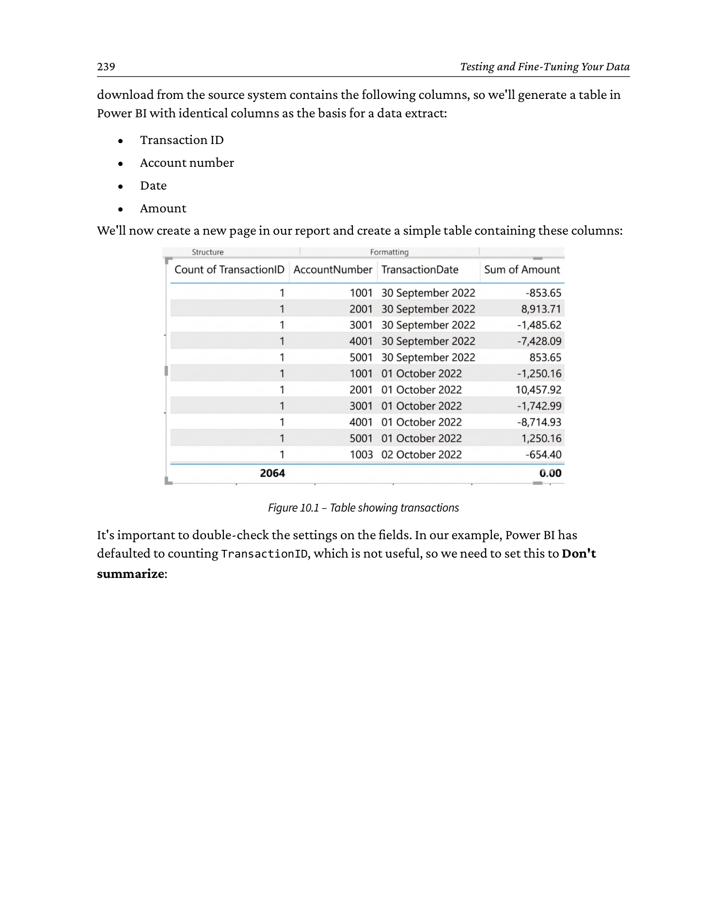
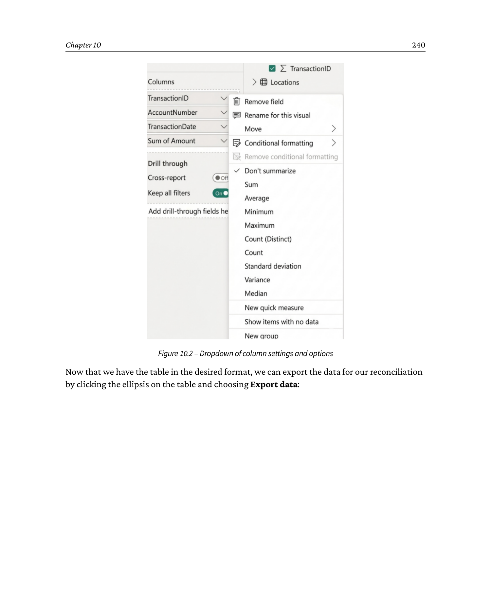
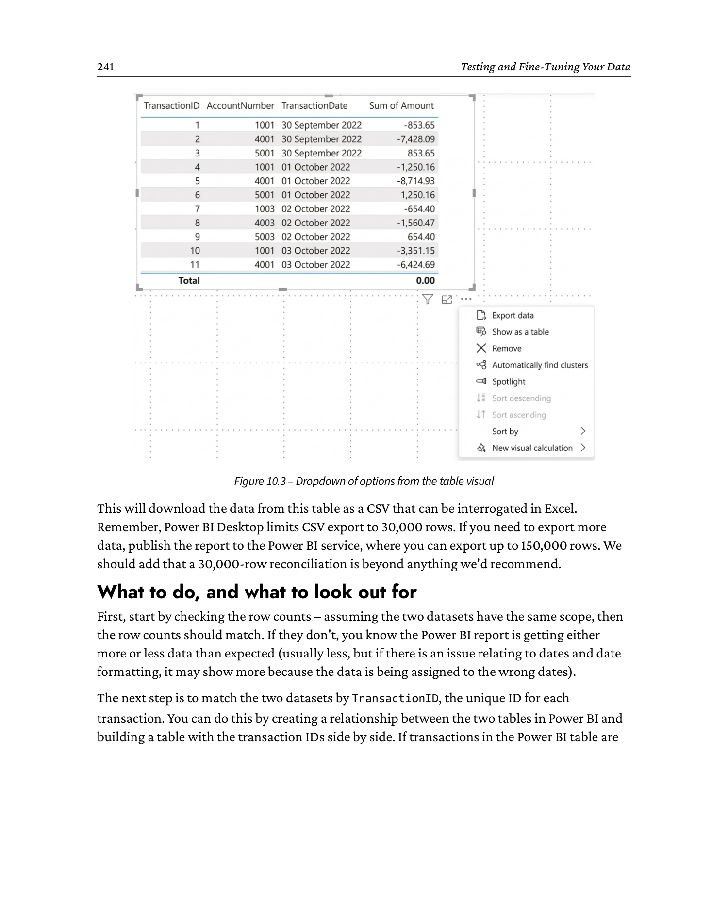

# 10 Testing and Fine-Tuning Your Data

Source: *Financial Modeling and Reporting with Microsoft Power BI* (Packt Publishing, 2026)
DOI: 10.0000/PACKT_FMRWPB_2026  |  GitHub: https://github.com/PacktPublishing/Financial-Modeling-with-Power-BI_Packt/tree/main/Chapter10
Page range: 262 - 275

## Introduction

The previous chapter explained how to build your suite of financial reports. One of the foundations of that chapter was the importance of making sure your data is correct. This chapter describes a core skill of a good data analyst: testing and fine-tuning your data, which can be difficult and time-consuming. Why is that?

Data from financial systems is complex, and it's often the case that the data you see onscreen has been manipulated, filtered, and calculated to provide the result based on data within the database.

Data tables from finance applications are complicated. For example, they'll include voided and cancelled transactions, so straight sums of data will also include everything. Ensuring your data is correct is an essential task that'll become an ever-present skill throughout your time developing Power BI reports. Reports that were correct one day can be incorrect the next, and understanding this and how to fix it will serve you well.

In this chapter, we'll look at some common methods to check data accuracy, how to reconcile that data back to the source at a transaction level, and techniques to deal with differences in that reconciliation. Finally, we'll take a look at why cleansing data within Power Query and Power BI is a bad idea, what to do instead, and when there might be no choice but to do so.

By the end of this chapter, you will do the following:

- Understand how to get accurate data in your Power BI reports
- Grasp how the trial balance from Chapter 3, *Creating a Trial Balance and Income Statement*, can help you check data
- Learn how to create a transaction-level reconciliation
- Appreciate the dangers of cleansing data within Power Query and Power BI

## 10.1 Technical requirements

To view the example that goes with this chapter, you will need an internet-connected device and access to Microsoft Excel. In this book's GitHub repository, there is an example of a test script that you can use to help you methodically test your reports: [Chapter 10 of Financial-Modeling-with-Power-BI_Packt](https://github.com/PacktPublishing/Financial-Modeling-with-Power-BI_Packt/tree/main/Chapter10).

## 10.2 What is incorrect data?

What does correct or incorrect mean anyway, and why is data "incorrect"?

Let's begin with the idea that your application isn't generating "incorrect" data. It's generating data you don't need for reporting, so you need to filter it out.

You need a starting point to find out what you need to filter out. We generally judge reporting to be correct or incorrect based on a comparison to transactions and reports generated directly from the source system, and we will ask users for copies of those reports. With this, we have a good idea of where we're heading.

This asks why there's a difference between the data you've extracted directly from the database of your financial application and the reports run directly from the same financial application. The reason, generally, is that postings exist in the database that you don't see in the reports from the financial application. A common example is a cancelled or void transaction.

Transactions are often cancelled or voided due to user error or a supplier/customer change. When this happens, you won't see the transaction in the application or within reporting, as it's considered reversed or even deleted. But, apart from rare circumstances, those transactions are still recorded on the database with a status of cancelled or similar; they're just filtered out when reports are run.

When you extract data from the database, you'll see those transactions and likely many more. Build a simple SUM measure on the Amount field, and those transactions will be included, and your SUM will be incorrect.

Date/time fields are another common reason for incorrect data when compared to your finance application. Transactions often have many dates; a sales order can have dates for initial order entry, delivery, customer request, and financial posting. Pick the wrong date, and transactions will fall into different periods from the finance application and will be considered incorrect.

We've seen time zone issues place transactions into different periods because of a single hour. It happens more frequently than you may think.

The first part of this chapter is to understand that the data extracted from the source is likely to be incorrect when compared to a system report. In fact, we expect it to be incorrect and have to work on it to match the system report. If you start with that expectation, you'll be ready for anything. To begin, we'll move on to some common techniques to test and fine-tune your data.

## 10.3 Using the trial balance to test your data

In Chapter 3, *Creating a Trial Balance and Income Statement*, we created a basic trial balance, which is a great starting point to check your data model. The first and simplest approach to testing the data integrity of our reports is to compare the trial balance we created with the trial balance from the source system. But even before we get that far, there are a number of checks we can quickly carry out on our Power BI trial balance:

1. Is the total zero?
2. On the rows of the trial balance, does `Opening Balance - Total Credit + Total Debit = Closing Balance`?
3. Do the columns total correctly?

If the answer to any of these is no, then there is a problem either with the semantic model or with one of the calculations.

### 10.3.1 Common checks for the trial balance

The first check is the structure of the semantic model. Start with the GL Transactions table and trace the related tables. Make sure every relationship has the cardinality you expect. In general, the relationship from Chart of Account to GL Transactions and Calendar to Transactions should both be one-to-many. There will be one GL account on the Chart of Account table for many accounts on the GL Transactions table. If you have a many-to-many relationship, you've got duplicated data in the Chart of Account table, or you've linked the wrong fields. If you've linked the correct fields but have a many-to-many relationship, you probably have duplicated values in your Chart of Account table and need to ensure you only have unique values using Power Query. If you've connected the wrong fields, use the Manage Relationships function in the model view to link the correct fields.

Another common issue you may have to check is how positive and negative numbers are imported, and whether the sign is correct. For example, if your revenue is imported as a positive, you'll need to correct that in Power Query.

The next step is to work through the calculations to make sure they're correct. Spelling errors in the filter of a `CALCULATE` statement will stop the measure from calculating the desired result.

Here's an example from Chapter 4, *Common DAX Measures*. The first DAX statement is correct, the second is incorrect:

```dax
Total Revenue = CALCULATE(
    [Total amount],
    FILTER(
        'Chart of Account',
        'Chart of Account'[AccountCategory]="SALES" ||
        'Chart of Account'[AccountCategory]="OTHERINC"
    )
) * -1

Total Revenue = CALCULATE(
    [Total amount],
    FILTER(
        'Chart of Account',
        'Chart of Account'[AccountCategory]="SALE" ||
        'Chart of Account'[AccountCategory]="OTHER1NC"
    )
) * -1
```

Although the changes are minor spelling errors, the second statement will return zero as "SALES" and "OTHERINC" are incorrect. DAX and M are precise, and the most innocuous error will return an error or zero.

Finding these errors can be time-consuming since the calculations are likely to be detailed. Most commonly, the problems in calculations will relate to a sign or a filter.

To help locate calculation errors, create a table in the canvas view and add the measures. If any rows equal zero, you've probably found your error.

If you are confident that the semantic model is correct and there are no calculation errors, that leaves two broad possibilities:

1. There is an error in the data transformation from Power Query
2. There is an error in the source system

The most likely problem is an issue with the data load. This is especially true if the data doesn't come directly from the source (e.g., your semantic model is working from a system report that has been output to Excel) or if you're performing transformations during the Power Query data load. In the latter case, start by making a copy of the semantic model and, in Power Query, remove the transformations one by one and check the effect on the data. Remember, Power Query transformations are applied from top to bottom, and it's often the case that the order is incorrect. If the trial balance now balances, you've proved the issue is in the transformation, and you can fix it.

If the transformations are good, the next step is to ensure that the source data is correct - if your data is sourced via an Excel export, check if the spreadsheet has the correct, latest data, that the format is correct, and that you're not hitting the row limit for the sheet. Using an out-of-date spreadsheet is also a very common error.

If those things are fine, check whether there's an issue with the trial balance in the source system. This would be an exceptionally rare occurrence, and an error in the trial balance in Power BI is almost always something that arises either in the data model or in the transformation steps. If the source system's trial balance still doesn't match yours, there's an error you've missed, so you'll need to restart the troubleshooting process.

The trial balance adds up, so we're done, right?

Generally, no. All we've done so far is verify the internal consistency of the semantic model. While that's important and a necessary minimum step, it's only the first step to prove that our data model is correct. As we've previously mentioned, the data in our model must match the data in our source systems.

The next step is to check the subtotals from the trial balance. If the source and Power BI don't match, there is a problem. If they do, look at whether the two reports match at an account level.

Depending on the size of your chart of accounts, you may choose to reconcile every account, checking the opening balance, debit, credit, and closing balance for each one. More likely, you will have a large chart of accounts, and you may not reconcile to that level. In this case, the approach to take is to reconcile a sample of accounts, rather than all of them. The rationale is that if a sample of accounts is correct, and the model is internally consistent, there's little space for errors.

When choosing accounts to check, you should aim for at least 10% coverage of the overall set of accounts. The accounts should also be representative of your main business processes, spread across the balance sheet and P&L, and indicate whether the expected transaction is a credit or debit.

Applying this, you might choose some accounts to test, such as the following:

- AR Control account
- Tax Payable Control account
- An Inventory account
- A Revenue account
- A COGS account
- Another cost account

This will cover different transaction types, different business processes, and different parts of the chart of accounts. Obviously, if you have more than 60 accounts or you have more business processes, such as manufacturing, you'll need to expand that list.

If everything matches at this stage, we can be reasonably assured the data is correct. If not, the next step is to look at a transaction-level reconciliation.

## 10.4 Creating a transaction-level reconciliation

Typically, transaction-level reconciliation is required when a higher-level reconciliation has failed. The implication is that something is wrong with the data flow, and only a detailed examination of the individual transactions will allow for diagnosing the problem. The most common tool for this reconciliation is Excel.

### 10.4.1 Before you start

Consider whether you need to download all transactions. Can you, for example, identify a single account where the issue is occurring? Alternatively, is the issue in a single month? If that's the case, then you only need to export the subset that's exhibiting a problem. Whatever the case, unless your dataset is very small, it's sensible to start by downloading a subset of the data and reconciling first, as this is often enough to identify a systematic issue, and it's faster to deal with small datasets than large ones.

### 10.4.2 What to do

To carry out a line-level reconciliation, you need datasets from your accounting system and from your Power BI model that have the same columns. It's also important to avoid additional manipulation of the data when downloading it from Power BI, since this creates an opportunity for new errors to enter the system and obfuscate the issue you're trying to diagnose. How you export the data from your source system to reconcile to the Power BI data will depend on the exact accounting system you are using, but almost all modern accounting systems offer some means of exporting data into Excel. Once you have this, you need a dataset from your Power BI model to match it. For the purposes of demonstration, we'll assume the download from the source system contains the following columns, so we'll generate a table in Power BI with identical columns as the basis for a data extract:

- Transaction ID
- Account number
- Date
- Amount

We'll now create a new page in our report and create a simple table containing these columns:



```
   Power BI report canvas - new page, simple table visual

   +------------------------------------------------------+
   |  Page 2  (Report view)                              |
   +------------------------------------------------------+
   | Visualizations                [Data]                 |
   | +------------+ +-------+ +-------+ +-------+ +------+ |
   | |  X axis    | | Y     | | Sum   | | Count | | Don't| |
   | |            | | axis  | |       | | (TxID)| | summa| |
   | +------------+ +-------+ +-------+ +-------+ +------+ |
   |   [Fields]                                       |   |
   |    - TransactionID  (Count)                       |   |
   |    - AccountNumber (Don't summarize)              |   |
   |    - Date         (Don't summarize)               |   |
   |    - Amount       (Sum)                          |   |
   +------------------------------------------------------+
   | Count of TransactionID | Account number | Date     | Amount |
   | 1                       | 1001           | 1/06/2023|  20.00 |
   | 1                       | 2001           | 1/06/2023| -20.00 |
   | 1                       | 1002           | 1/06/2023|  50.00 |
   | 1                       | 2001           | 1/06/2023| -50.00 |
   | 1                       | 4001           | 5/06/2023| 250.00 |
   | 1                       | 5001           | 5/06/2023|-250.00 |
   | ...                                                  |
   +------------------------------------------------------+

   Power BI has defaulted the TransactionID aggregation to Count
   (the (Count) suffix in the field well is a tell).  We will change
   that to Don't summarize in the next step.
```

It's important to double-check the settings on the fields. In our example, Power BI has defaulted to counting TransactionID, which is not useful, so we need to set this to *Don't summarize*:



```
   Column settings dropdown - Power BI field well

   +---------------------+
   | (Sum)            >  |  <- open menu, hover the column name
   |   Don't summarize   |     (TransactionID currently aggregated as Count)
   |   Sum               |
   |   Average           |
   |   Minimum           |
   |   Maximum           |
   |   Count (Distinct)  |
   |---------------------|
   |   Conditional format|   <- lighter section at the bottom
   |   Rename for this   |
   |     report          |
   +---------------------+

   Top of the menu (aggregation choices) and bottom section
   (Conditional format / Rename) are visible.  We click
   "Don't summarize" so the TransactionID column shows the
   raw ID values, not a count of them.
```

Now that we have the table in the desired format, we can export the data for our reconciliation by clicking the ellipsis on the table and choosing *Export data*:



```
   Table visual - ellipsis (...) button expanded

   +--------------------------------------------------------+
   | Count of TxID | Account | Date      | Amount |  (...)  |
   +--------------------------------------------------------+
   | 1              | 1001    | 1/06/2023 |  20.00 |         |
   | 1              | 2001    | 1/06/2023 | -20.00 |         |
   | 1              | 1002    | 1/06/2023 |  50.00 |         |
   | 1              | 2001    | 1/06/2023 | -50.00 |         |
   | ...                                                    |
   +--------------------------------------------------------+

   Click the ellipsis at the top-right of the table visual.  The
   menu that drops down contains, among other things:

      +-----------------------------+
      |  + Sort axis                |
      |  + Sort by                  |
      |  -                          |
      |  Export data         <-- we choose this
      |  -                          |
      |  Clear selections           |
      |  Spotlight                  |
      |  + Edit interactions         |
      +-----------------------------+

   Choosing Export data gives us a CSV that can be interrogated
   in Excel alongside the matching export from the source system.
```

This will download the data from this table as a CSV that can be interrogated in Excel. Remember, Power BI Desktop limits CSV export to 30,000 rows. If you need to export more data, publish the report to the Power BI service, where you can export up to 150,000 rows. We should add that a 30,000-row reconciliation is beyond anything we'd recommend.

### 10.4.3 What to do, and what to look out for

First, start by checking the row counts - assuming the two datasets have the same scope, then the row counts should match. If they don't, you know the Power BI report is getting either more or less data than expected (usually less, but if there is an issue relating to dates and date formatting, it may show more because the data is being assigned to the wrong dates).

The next step is to match the two datasets by TransactionID, the unique ID for each transaction. You can do this by creating a relationship between the two tables in Power BI and building a table with the transaction IDs side by side. If transactions in the Power BI table are either missing or you have extra, identify the culprits and start to look at why this might be occurring. The most likely root causes are as follows:

- Errors in the Power Query steps while importing the data
- Errors in the configuration of the export mechanism from the source

The most common Power Query error is to filter out rows that you don't intend to filter out.

If both datasets contain the same transactions, the next thing to look at is matching the details. Check the account numbers, dates, and amounts. The most common issues here are the following:

- Mis-matching amounts due to rounding
- Issues with date formats

This list is, of course, not exhaustive, but date issues are very common, especially when working across systems configured for the common date formats in different countries (e.g., MM/DD/YYYY in the US, and DD/MM/YYYY, common across Europe). Most of these issues can typically be addressed by making changes in the Power Query steps that import the data in the first place. Issues are common in a single country with multiple time zones, such as the United States. We've seen instances where transactions in Power BI were placed in a different financial year due to an incorrect time zone conversion.

Assuming you've created the table using the "raw" column from the table, meaning no measures or calculated columns, this points to one of two possible issues. Either there's an issue in the measures that have gone into the trial balance, or there is a problem with the source system. Again, the latter option is highly unlikely, but not impossible.

While the sort of error that would cause reconciliation issues from the source system is exceptionally rare, it's likely that any reconciliation will highlight data quality issues. So, if we find those, what do we do about them?

This takes us to the next section, where we discuss data cleansing in Power Query and Power BI.

## 10.5 Cleansing data in Power Query and Power BI

By cleansing data in Power Query and Power BI, we mean changes to fix data quality issues, either while importing data into the reporting system or creating calculations that remove certain data quality issues. In many ways, this should be the shortest section in the book: *don't do it*, as it generally causes more problems than it solves. Our advice is to fix data issues in the source system, not Power Query or Power BI. That said, there is value in a discussion of why it's a bad practice, and when it can be done acceptably.

Let's first consider why it's a bad practice. First and foremost, cleansing data in Power Query / Power BI means creating data that's different from the source system, which is a fundamental data integrity issue, raising the question of how you test it. Moreover, there needs to be consideration given to how to document the changes so future users aren't confused by the difference between the source system and Power BI.

The next problem in fixing the data in Power Query / Power BI is removing the incentive to fix the data at the source. We can also say with confidence that once you've fixed source data in Power Query / Power BI, you'll be asked to do it again and again.

Looking further into the future, what happens if there's a need to change the reporting system? That'll require a major clean-up of the historical data, or the new implementation needs to replicate the cleansing that has been done.

So, now you know why this is a bad idea. What do you do when there's no choice? First of all, this should be seen as a Band-Aid, a temporary measure that needs to be communicated to stakeholders. Another term we might use is *technical debt*. Like any other debt, when we incur it, we need a repayment plan. In this case, by fixing the source data and removing the cleansing from the reports.

## 10.6 Non-functional testing

So far, our tests have been concentrated on whether or not the data is correct, or "functional" testing, as it is also known. Almost as important, although often neglected, is non-functional testing.

Non-functional testing refers to the aspects of a report outside the calculations and measures used within the report and looks to examine aspects such as load times, security, and adherence to design standards.

We've already touched on some of these ideas - two in particular, in the form of responsiveness and accessibility. Let's start with responsiveness.

One of the problems of non-functional tests is that they're often subjective. Let's start with how long is too long for a visual to refresh.

As a general rule of thumb, if you're hitting 3 seconds for all the visuals on a page to update after a control is clicked or a slicer is updated, that's too long. For some edge cases and complex scenarios, more time may be allowed, but in general, anything slower than 3 seconds becomes a frustration to the user. This will lead to a perception by the user that the report is slow and, in turn, lead to them seeking other avenues to get the data they need. You'll possibly see low usage of the reporting suite as a result.

The next item is accessibility. Some elements of this are more objective than others and sometimes need to be tailored to your specific user base.

In general, you should consider how a report works for people with reduced vision or impaired color vision. Make sure font sizes are large enough, try not to go below 12 point, and only below 10 point if the information conveyed is not critical. Also, think about contrast; there are online tools that can check the contrast ratios between different colors. Similarly, there are tools that you can use to ensure color palettes are readable for those with impaired color vision.

Accessibility is different between users, so focus on specific users and work with them to ensure the report is legible.

Visual clutter is also an accessibility issue. We discussed this in Chapter 9, *Creating a Suite of Financial Reports*, when talking about good design, and this should be covered in the testing phase of the project, not simply be assumed to be done.

Another non-functional test you should consider is the refresh time of the dataset. This may be less obvious than the tests we have discussed so far, but it can be just as important. If a report takes too long to refresh, then the data may not be up to date when the end user needs it.

This depends a lot on the needs of the organization, and in finance reporting, an overnight refresh is generally enough, where you have many hours for that to run. That said, the longer the refresh takes to run, the higher the chance of a timeout, so make sure the refresh is fast and efficient. Again, as a rule of thumb, for an overnight refresh, a 1-hour refresh would be considered slow.

The final main non-function test to consider is security - is the report accessible only to those users who are authorized to see it? To do this, there are a number of approaches, either by working with trusted users to see if they can access a restricted report or restricted data if you're using row-level security.

Having completed both functional and non-functional testing, we can be reasonably assured that the report is ready for release to end users.

A detailed treatment of how to handle poor report performance is beyond the scope of this book, but we would recommend you check out this book: [Microsoft Power BI Performance Best Practices](https://www.packtpub.com/en-gb/product/microsoft-power-bi-performance-best-practices-9781801071390).

## 10.7 Summary

In this chapter, we covered some common methods for testing and fine-tuning your data. This is an important topic and a set of skills we'd encourage anyone working with data to become proficient in. If something doesn't calculate correctly, you'll need to find out why. This is work that demands patience and time, and a task you'll improve at over time, as you become better at spotting the issues and develop your own methods for fixing them.

Don't forget the importance of non-functional testing by making sure your test plans include both functional and non-functional tests. A perfectly calculated report that takes minutes to load will likely not be used.

In the next chapter, we move on to a very different topic, although another important one in the world of financial reporting. That is, paginated reports.
