# 11 Printable Financial Statements with Power BI Paginated

Source: *Financial Modeling and Reporting with Microsoft Power BI* (Packt Publishing, 2026)
DOI: 10.0000/PACKT_FMRWPB_2026  |  GitHub: https://github.com/PacktPublishing/Financial-Modeling-with-Power-BI_Packt/tree/main/Chapter11
Page range: 276 - 293

## Introduction

In the previous chapter, we looked at testing and fine-tuning your data and reports. In this chapter, we return to the creation of reports and focus on how to print your reports. Although this is seen less often these days, printing financial reports remains important.

Most of the visuals you'll design in Power BI are not designed to be static prints. Power BI is an interactive business intelligence tool where fresh data is never far away, and visuals can be expanded, collapsed, and scrolled. But in the financial world, printed, static documents that portray a financial report based on a specific period are occasionally required. So, how do we get something not designed for printing static reports to print static reports?

The answer is Power BI Report Builder, a companion application to Power BI that, as you may have guessed by now, is the tool we use to build paginated, pixel-perfect reports.

Just to dissect what that means, *paginated* means separating report data into pages that can be printed, instead of a long vertical scroll, and *pixel-perfect* means the printed report will be accurate and consistent based on a specific size of paper. A paginated report can be one or many pages, but it will fit on the printed page correctly, and it'll break at the correct point when there is a need for many pages. We're used to the term "responsive" when referring to applications and web pages, meaning a design will work equally on a PC screen, a tablet, and a phone. Pixel-perfect is the opposite of this. It produces a design and format that is always faithful to the intention of the designer on the printed page. By page, we mean a paper page.

It's important to note that Power BI Report Builder is not Power BI. It's a separate tool and behaves differently from Power BI. Please don't assume that your Power BI skills will serve you well for working with Power BI Report Builder. Unfortunately, they won't, and our best advice is to treat them as different applications in terms of use and navigation.

In this chapter, we will look at how to build paginated reports. We will then look at how we can go about using Power BI Report Builder and how it uses data from the Power BI data model that we created in Chapter 3, *Creating a Trial Balance and Income Statement*. Finally, we will go through a worked example of creating an income statement as a paginated report and consider why this may be a better option than the reports created in Chapter 3, *Creating a Trial Balance and Income Statement*.

By the end of this chapter, you will be able to do the following:

- Appreciate why printable reports are useful
- Understand the tools available for creating printable reports
- Be confident in creating a printable income statement

## 11.1 Technical requirements

To follow the examples in this chapter and beyond, you'll need a Windows PC with an internet connection and Power BI Report Builder, which can be downloaded using the following link: [Microsoft Power BI Report Builder](https://www.microsoft.com/en-us/download/details.aspx?id=105942).

As with all of our examples, you'll need Power BI Desktop, which can be downloaded using the following link: [Microsoft Power BI Desktop](https://www.microsoft.com/en-us/download/details.aspx?id=58494).

You'll also need a Power BI PBIX file. For the examples in this chapter, we use *Chapter 3 - Final.pbix*, which can be found in the Chapter 3 folder of this book's GitHub repository: [Financial-Modeling-with-Power-BI_Packt - Chapter 3](https://github.com/PacktPublishing/Financial-Modeling-with-Power-BI_Packt/tree/main/Chapter3).

The GitHub repository for this chapter contains an example of a PDF export of the final report.

## 11.2 Understanding when paginated reports are useful

Paginated reports are useful when there's a need to display data in a fixed format. This is generally intended for printing but can equally be used to create electronic documents such as reporting packs. While paginated reports can be used onscreen, they are not generally intended for this purpose. There are ways of creating some interaction in paginated reports, but if your use case is a screen-readable, interactive report, the right tool for the job will be a regular Power BI visual.

Paginated reports work best where there are tables of figures with a limit on the number of columns displayed to help control the overall look and feel of the reports, and to ensure the columns fit within the boundaries of the page. Remember, paper doesn't have a scroll option, so columns that are too wide for the page will cause extra pages to be printed. The following is a list of questions to consider when deciding whether to use a paginated report:

- Is there a requirement for a report that has fixed dimensions?
- Is there a limited need for charts?
- Do you need to print the report?

If you answer yes to 2 or 3 of these, then paginated reports are worth considering.

## 11.3 Using Power BI Report Builder

Power BI Report Builder is available as a free download from Microsoft. You'll notice that in comparison to Power BI, Report Builder may feel a little old-fashioned. Essentially, it's a tool that was originally built for developers rather than those more familiar with the modern look of Office applications. So, for an Office user, the learning curve will be steeper.

On creating a blank report, you will be greeted with this screen:

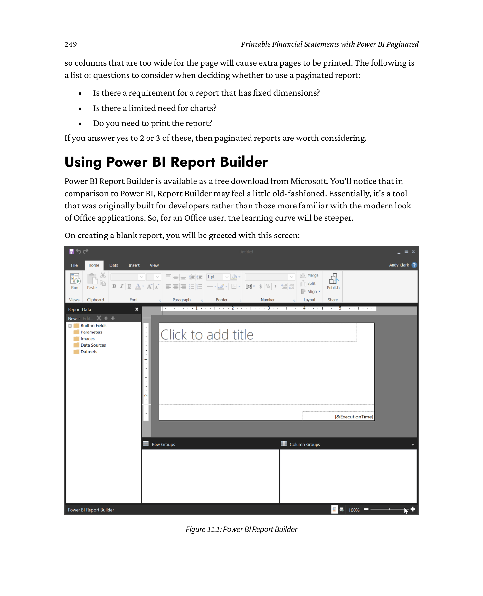

```
   Power BI Report Builder - new blank report

   +--------------------------------------------------------------+
   | File  Home  Insert  View  ...                                |  <-- ribbon
   +--------------------------------------------------------------+
   | Report | Insert |  | Run |  Save | Publish |  ...            |
   +--------------------------------------------------------------+
   | (left) |  design area (blank)                  | (right)    |
   |  data  |                                       | properties |
   |  pane  |                                       |   pane     |
   |        |  Report1  (paper page)                |            |
   |        |  +--------+                           |            |
   |        |  |        |                           |            |
   |        |  |        |                           |            |
   |        |  +--------+                           |            |
   |        |   1 / 1                                |            |
   +--------------------------------------------------------------+
   | (bottom) row/column group bar  (empty)                      |
   +--------------------------------------------------------------+
   |  Report is in design view.  Press Run to preview.           |
   +--------------------------------------------------------------+
```

On the left, we see the area where we configure the report data:

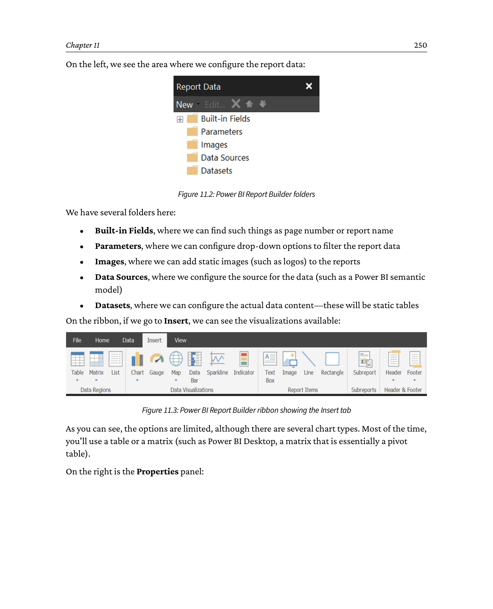

```
   Power BI Report Builder - left pane (Report Data folders)

   +--------------------------+
   | Report Data              |
   |--------------------------|
   |  v  Built-in Fields      |
   |       ExecutionTime      |
   |       PageNumber         |
   |       ReportName         |
   |       ...                |
   |  v  Parameters           |
   |       Company            |
   |       Fiscal Year        |
   |       Fiscal Period      |
   |  v  Images               |
   |       (logo)             |
   |  v  Data Sources         |
   |       Semantic Model     |
   |  v  Datasets             |
   |       TrialBalance       |
   +--------------------------+
```

We have several folders here:

- **Built-in Fields**, where we can find such things as page number or report name
- **Parameters**, where we can configure drop-down options to filter the report data
- **Images**, where we can add static images (such as logos) to the reports
- **Data Sources**, where we configure the source for the data (such as a Power BI semantic model)
- **Datasets**, where we can configure the actual data content - these will be static tables

On the ribbon, if we go to Insert, we can see the visualizations available:


```
   Power BI Report Builder ribbon - Insert tab selected

   +-------------------------------------------------------------------+
   | File | Home | Insert | View | ...                                  |
   +-------------------------------------------------------------------+
   |  [Text Box]  [Image]  [Rectangle]  |  [Table]  [Matrix]  |  [Chart]|
   |              [Line]    [Subreport] |           [Gauge]   |  [Gauge] |
   |                                                                   |
   |        a handful of items, mostly static visuals                 |
   +-------------------------------------------------------------------+

   Note:  no slicers, no bar/column/line/pie chart on the Insert tab -
   the report is meant to be static.  Table and Matrix are the workhorses.
```

As you can see, the options are limited, although there are several chart types. Most of the time, you'll use a table or a matrix (such as Power BI Desktop, a matrix that is essentially a pivot table).

On the right is the Properties panel:

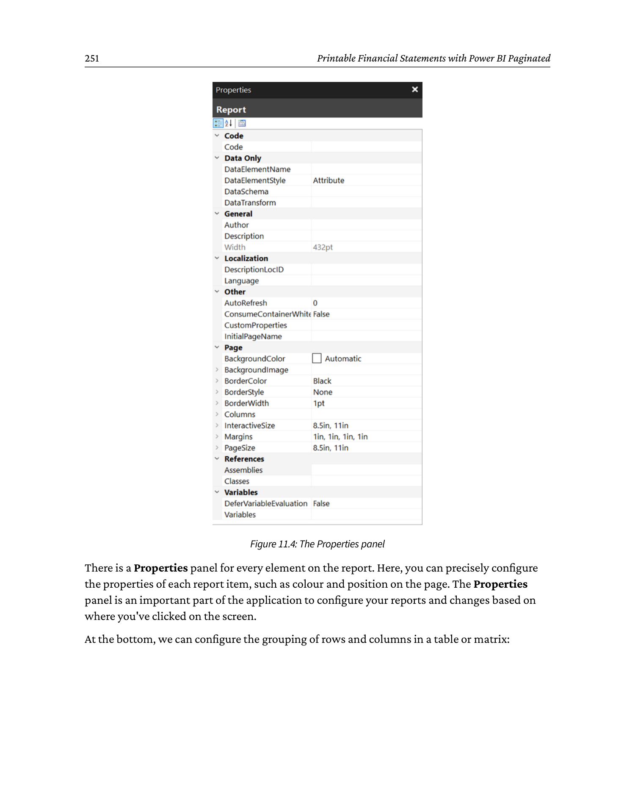

```
   Power BI Report Builder - Properties panel (right)

   +-------------------------+
   | Properties              |
   |-------------------------|
   |  TextBox1               |
   |-------------------------|
   |  [Misc]                 |
   |     Name: TextBox1      |
   |     ToolTip:            |
   |  [General]              |
   |     Color: Black        |
   |     Size: 10pt          |
   |  [Position]             |
   |     Location: 0, 0      |
   |     Size:    4, 0.5 in  |
   |  [Font]                 |
   |     Family: Arial       |
   |     Weight: Normal      |
   +-------------------------+

   The panel adapts to whatever is selected on the design surface.
```

There is a Properties panel for every element on the report. Here, you can precisely configure the properties of each report item, such as colour and position on the page. The Properties panel is an important part of the application to configure your reports and changes based on where you've clicked on the screen.

At the bottom, we can configure the grouping of rows and columns in a table or matrix:

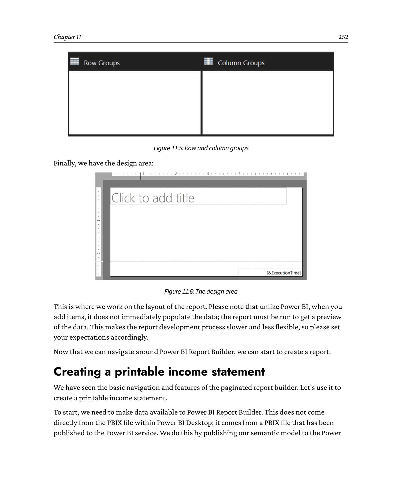

```
   Power BI Report Builder - Row Groups / Column Groups (bottom)

   +-----------------------------------------------------------+
   | Row Groups:  [Company] -> [AccountCategory]               |
   | Column Groups:  [Year] -> [Period]                        |
   +-----------------------------------------------------------+

   The bars are drag-targets: drag a field from the left pane into
   Row Groups or Column Groups to add a grouping level to a
   table or matrix.
```

Finally, we have the design area:


```
   Power BI Report Builder - design area (paper page)

   +---------------- Page ----------------+
   |                                      |
   |  <report body, drawn in twips>       |
   |                                      |
   |       +--------------+               |
   |       |              |               |
   |       |   text box   |               |
   |       |              |               |
   |       +--------------+               |
   |                                      |
   |       <white space is real estate>   |
   |                                      |
   +--------------------------------------+
                       1 / 1

   The dotted border is the page edge.  Anything outside is clipped
   when the report is rendered.  Unlike Power BI, the design area
   is a fixed-size paper canvas, not a responsive web page.
```

This is where we work on the layout of the report. Please note that unlike Power BI, when you add items, it does not immediately populate the data; the report must be run to get a preview of the data. This makes the report development process slower and less flexible, so please set your expectations accordingly.

Now that we can navigate around Power BI Report Builder, we can start to create a report.

## 11.4 Creating a printable income statement

We have seen the basic navigation and features of the paginated report builder. Let's use it to create a printable income statement.

To start, we need to make data available to Power BI Report Builder. This does not come directly from the PBIX file within Power BI Desktop; it comes from a PBIX file that has been published to the Power BI service. We do this by publishing our semantic model to the Power BI service from Power BI Desktop. We'll cover the publishing process briefly here. We also cover publishing reports in Chapter 13, *Evolving and Maintaining Your Reports*.

For our data source, we'll use the model that we completed in Chapter 3, *Creating a Trial Balance and Income Statement*.

To be able to publish a Power BI PBIX file, you'll need a free or paid Microsoft Fabric account. If you don't have one, please follow the instructions at the following link to obtain an account: [Getting started with Power BI](https://www.microsoft.com/en-us/power-platform/products/power-bi/getting-started-with-power-bi).

Once you have your free or paid Microsoft Fabric account, you'll need to log in and create a workspace, the instructions for which are explained in the following Microsoft online guide: [Create the new workspaces in Power BI](https://learn.microsoft.com/en-us/power-bi/collaborate-share/service-create-the-new-workspaces).

Once you've got your Microsoft Fabric account and created your workspace, make sure you're logged in to Power BI Desktop using your Microsoft Fabric account, open the *Chapter 3 - Final.pbix* file, and click Publish. When you do that, a dialog box will open where you can confirm the workspace that you'll use to publish the model. The dialog box will look similar to Figure 11.7:

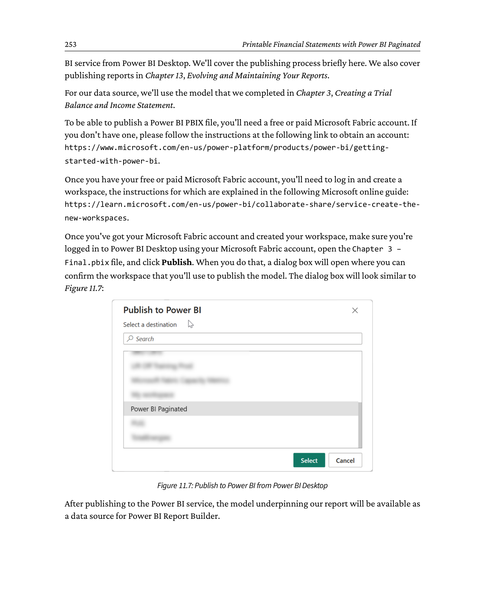

```
   Power BI Desktop - Publish dialog

   +---------------------------------------------+
   | Publish to Power BI                        |
   |---------------------------------------------|
   |  Select a destination:                     |
   |                                             |
   |    o  My workspace                          |
   |    o  Finance shared workspace              |
   |    o  Reporting shared workspace    [v]     |
   |    o  Sandbox                               |
   |                                             |
   |  [ ] Replace dataset (if it exists)         |
   |                                             |
   |              [Select]  [Cancel]             |
   +---------------------------------------------+

   Pick the destination workspace, then click Select.  Power BI
   Desktop pushes the .pbix up to the Power BI service.
```

After publishing to the Power BI service, the model underpinning our report will be available as a data source for Power BI Report Builder.

Now open Power BI Report Builder, where we'll start with a blank report. Use *File | New* to launch the New Report window, as shown in Figure 11.8. From this menu, click *Blank Report*.

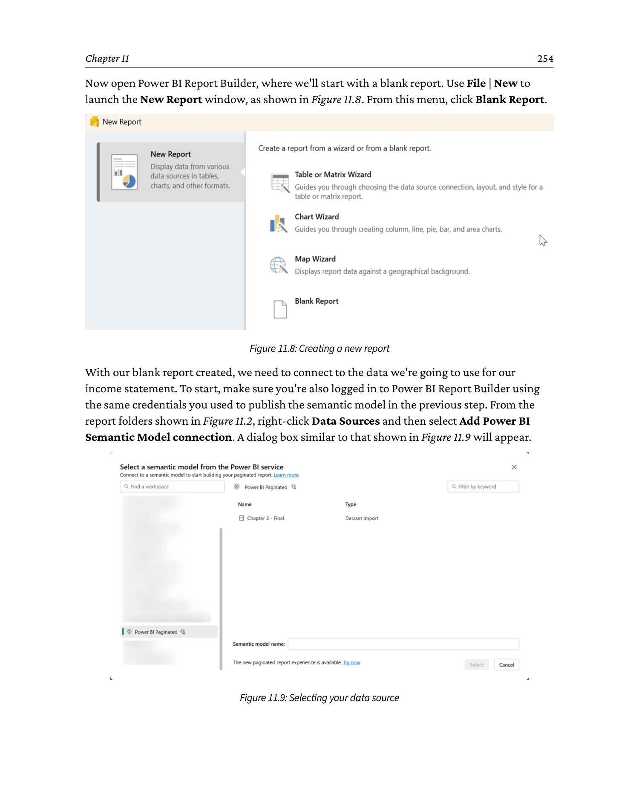

```
   Power BI Report Builder - New Report

   +--------------------------------------------+
   | New Report                                 |
   |--------------------------------------------|
   |  o  Blank Report                           |
   |  o  Report Wizard                          |
   |  o  Report Part - blank                    |
   |  o  Report Part based on an existing part  |
   |  o  Chart Wizard                           |
   |                                            |
   |                [OK]   [Cancel]             |
   +--------------------------------------------+

   We choose Blank Report for the income statement example.
```

With our blank report created, we need to connect to the data we're going to use for our income statement. To start, make sure you're also logged in to Power BI Report Builder using the same credentials you used to publish the semantic model in the previous step. From the report folders shown in Figure 11.2, right-click *Data Sources* and then select *Add Power BI Semantic Model connection*. A dialog box similar to that shown in Figure 11.9 will appear.


```
   Power BI Report Builder - Add Power BI Semantic Model connection

   +--------------------------------------------------+
   | Power BI Semantic Model connection               |
   |--------------------------------------------------|
   |  Workspace: [Finance shared workspace      v]    |
   |                                                  |
   |  Semantic model:                                 |
   |     - Chapter 3 - Final.pbix                     |
   |     - Sales.pbix                                 |
   |     - Inventory.pbix                             |
   |                                                  |
   |              [OK]   [Cancel]                     |
   +--------------------------------------------------+

   Pick the workspace, then pick the semantic model that the
   paginated report should run against.
```

From the workspace you used to publish the semantic model, you can then choose the semantic model as the data source for the paginated report.

When you see the semantic model under *Data Sources* in the folders, right-click on the new data source and select *Add Dataset*. You'll see the dialog box that appears in Figure 11.10:

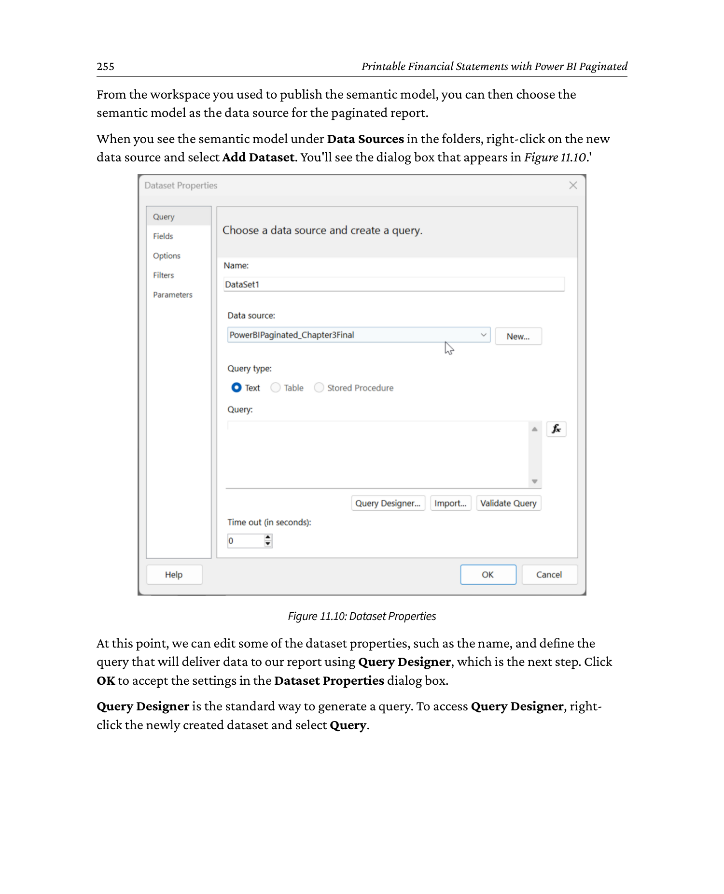

```
   Power BI Report Builder - Dataset Properties

   +----------------------------------------------+
   | Dataset Properties                           |
   |----------------------------------------------|
   |  Name:     [TrialBalance              ]       |
   |  Data source: [Semantic Model         v]      |
   |                                              |
   |  Query type:  o Text   o Table   o SharePoint |
   |                                              |
   |  Query string:                               |
   |  +--------------------------------------+    |
   |  |  <generated by Query Designer>      |    |
   |  +--------------------------------------+    |
   |                                              |
   |  Timeout:                                    |
   |     [ ]  No timeout                          |
   |                                              |
   |                       [Query Designer...]    |
   |                       [OK]  [Cancel]         |
   +----------------------------------------------+

   The "Query Designer" button on the right opens the visual
   query builder for this dataset (Figures 11.11-11.14).
```

At this point, we can edit some of the dataset properties, such as the name, and define the query that will deliver data to our report using Query Designer, which is the next step. Click *OK* to accept the settings in the Dataset Properties dialog box.

Query Designer is the standard way to generate a query. To access Query Designer, right-click the newly created dataset and select *Query*.

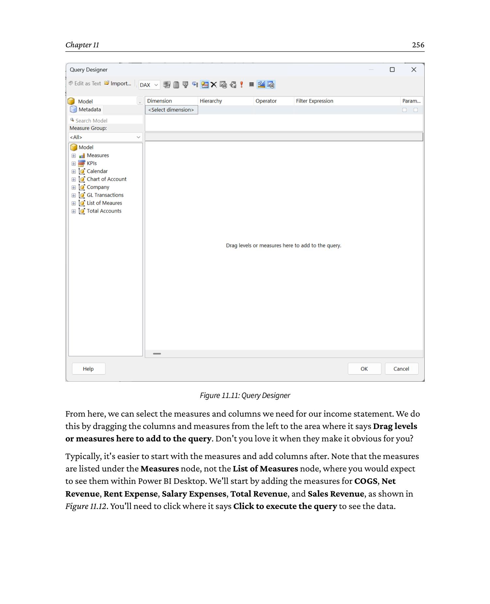

```
   Power BI Report Builder - Query Designer (empty)

   +------------------------------------------------------+
   | Query Designer                                       |
   |------------------------------------------------------|
   |  (database model)             Drag levels or        |
   |                                measures here to      |
   |    [Chart of Account]          add to the query      |
   |       v AccountNumber          +----------------+    |
   |       v AccountCategory        |                |    |
   |       ...                      |  (empty)       |    |
   |    [Calendar]                  |                |    |
   |       v Date                   +----------------+    |
   |       v FiscalYearName           [Click to execute] |
   |    [GL Transactions]                                |
   |       v Amount                Dimension | Filter...  |
   |    [Measures]                                       |
   |       v Total Revenue         <Select dim>   ...     |
   |       v Net Revenue                              ... |
   |       v COGS                                     ... |
   |       v Rent Expense                              ...|
   |       v Salary Expense                             ...|
   |       v Sales Revenue                              ...|
   +------------------------------------------------------+

   Drag fields from the model on the left into the canvas on
   the right to build the dataset query.
```

From here, we can select the measures and columns we need for our income statement. We do this by dragging the columns and measures from the left to the area where it says *Drag levels or measures here to add to the query*. Don't you love it when they make it obvious for you?

Typically, it's easier to start with the measures and add columns after. Note that the measures are listed under the *Measures* node, not the *List of Measures* node, where you would expect to see them within Power BI Desktop. We'll start by adding the measures for COGS, Net Revenue, Rent Expense, Salary Expenses, Total Revenue, and Sales Revenue, as shown in Figure 11.12. You'll need to click where it says *Click to execute the query* to see the data.

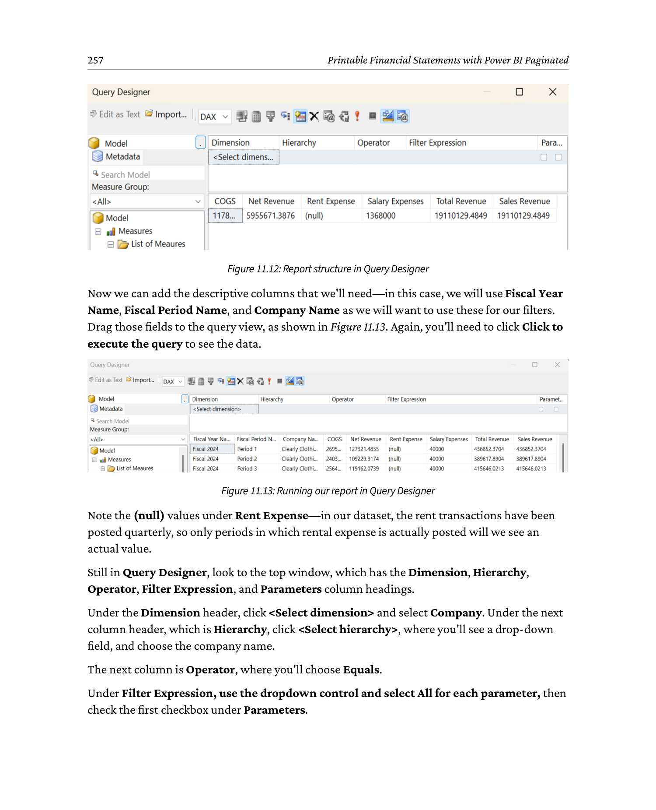

```
   Query Designer - measures added (drag from the left)

   +------------------------------------------------------+
   | Query Designer                                       |
   |------------------------------------------------------|
   |  (database model)             Drag levels or        |
   |    [Measures]                  measures here to      |
   |       v COGS                  add to the query      |
   |       v Net Revenue           +-------------------+  |
   |       v Rent Expense          |  COGS             |  |
   |       v Salary Expense        |  Net Revenue      |  |
   |       v Total Revenue         |  Rent Expense     |  |
   |       v Sales Revenue         |  Salary Expense   |  |
   |                               |  Total Revenue    |  |
   |                               |  Sales Revenue    |  |
   |                               +-------------------+  |
   |                                [Click to execute]    |
   +------------------------------------------------------+

   Click the Click to execute button to fetch a preview of the
   result set.
```

Now we can add the descriptive columns that we'll need - in this case, we will use Fiscal Year Name, Fiscal Period Name, and Company Name as we will want to use these for our filters. Drag those fields to the query view, as shown in Figure 11.13. Again, you'll need to click *Click to execute the query* to see the data.


```
   Query Designer - preview of the dataset

   +-----------------------------------------------------------+
   | Query Designer                                            |
   |-----------------------------------------------------------|
   |  drag-pane (measures + cols)   |  preview grid            |
   |                                |  +-------+------+------+ |
   |                                |  | Net   | Rent |Salry|| |
   |                                |  | Rev   | Exp  | Exp  || |
   |                                |  +-------+------+------+ |
   |                                |  | (null)| (nul)|  ...  | |
   |                                |  |   ... |  ... |  ...  | |
   |                                |  +-------+------+------+ |
   |                                |                          |
   |    [Click to execute the query]                           |
   +-----------------------------------------------------------+

   Rent Expense shows (null) for periods where rent wasn't posted -
   we post rent quarterly, so most rows have null.  This is the
   "natural" shape of the data and we will let the report deal
   with the nulls rather than trying to clean them out.
```

Note the (null) values under Rent Expense - in our dataset, the rent transactions have been posted quarterly, so only periods in which rental expense is actually posted will we see an actual value.

Still in Query Designer, look to the top window, which has the Dimension, Hierarchy, Operator, Filter Expression, and Parameters column headings.

Under the *Dimension* header, click *<Select dimension>* and select Company. Under the next column header, which is *Hierarchy*, click *<Select hierarchy>*, where you'll see a drop-down field, and choose the company name.

The next column is *Operator*, where you'll choose *Equals*.

Under *Filter Expression*, use the dropdown control and select *All* for each parameter, then check the first checkbox under *Parameters*.

Repeat this process to add the Calendar table, Calendar Year Name, and Fiscal Period Name. The final result is shown in Figure 11.14.

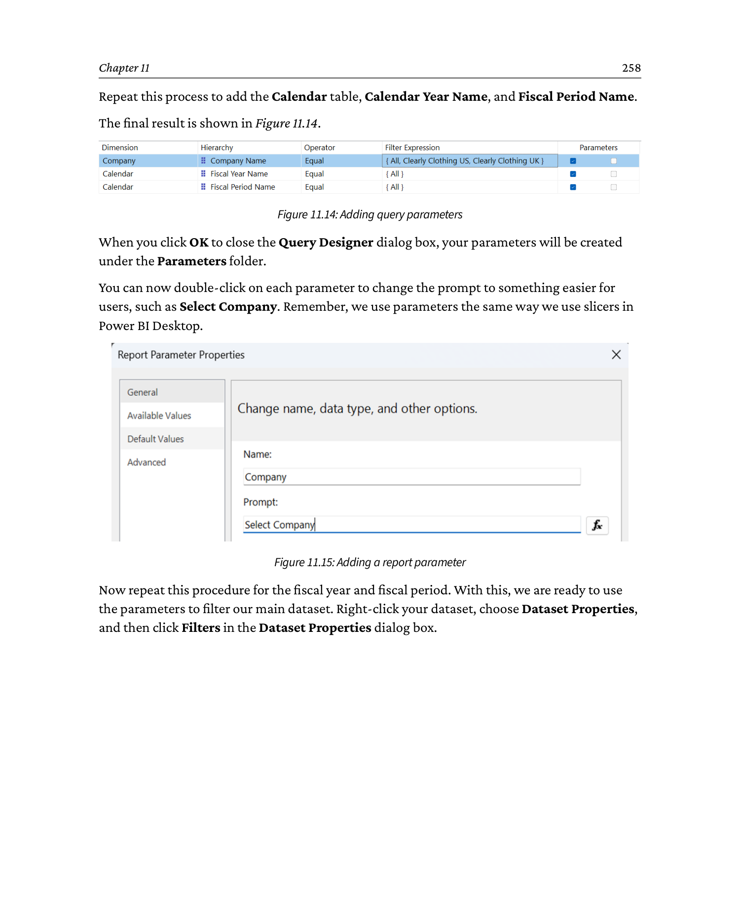

```
   Query Designer - parameter row

   +--------------------------------------------------------+
   | Dimension        | Hierarchy   | Operator | Filter ...|
   |--------------------------------------------------------|
   |  Company         | Company     |  Equals  |  [All]   *|
   |  Calendar        | FiscalYear  |  Equals  |  [All]   *|
   |                  |  Name                                |
   |  Calendar        | FiscalPerio |  Equals  |  [All]   *|
   |                  |  dName                                |
   +--------------------------------------------------------+

   * last column is "Parameters" - check the box on each row
     to expose the filter as a report parameter that the user
     can change at run time.
```

When you click *OK* to close the Query Designer dialog box, your parameters will be created under the *Parameters* folder.

You can now double-click on each parameter to change the prompt to something easier for users, such as *Select Company*. Remember, we use parameters the same way we use slicers in Power BI Desktop.


```
   Power BI Report Builder - Report Parameter Properties

   +-----------------------------------------------+
   | Report Parameter Properties                   |
   |-----------------------------------------------|
   |  Name:    [Company                      ]    |
   |  Prompt:  [Select Company              ]    |
   |  Data type: [Text                       v]    |
   |                                               |
   |  v  Allow blank value                          |
   |  v  Allow null value                           |
   |  o  Allow multiple values                      |
   |  o  Hidden                                     |
   |                                               |
   |  Available values:                             |
   |     o None   o Non-queried   o From query     |
   |                                               |
   |  Default values:                              |
   |     o None   o Null   o From query             |
   |                                               |
   |                       [OK]  [Cancel]           |
   +-----------------------------------------------+

   The "Prompt" string is the label the user sees in the
   report's parameter pane.
```

Now repeat this procedure for the fiscal year and fiscal period. With this, we are ready to use the parameters to filter our main dataset. Right-click your dataset, choose *Dataset Properties*, and then click *Filters* in the Dataset Properties dialog box.

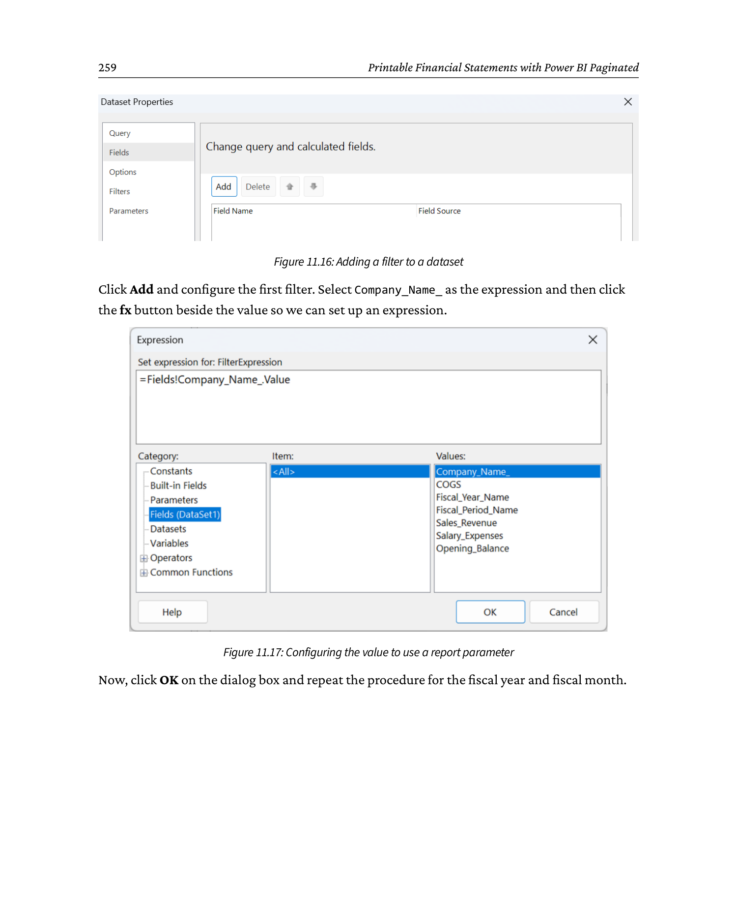

```
   Dataset Properties - Filters tab

   +--------------------------------------------------+
   | Dataset Properties                               |
   |---------|--------------------|                    |
   |  Query  |  Parameters  |  Filters  [v]           |
   |--------------------------------------------------|
   |  Filters:                                        |
   |    +-----------+----------+----------+--------+   |
   |    | Filter # | Express  | Operator | Value   |   |
   |    +-----------+----------+----------+--------+   |
   |    |           |          |          |         |   |
   |    | (empty)                                       |
   |    +-----------+----------+----------+--------+   |
   |                                                  |
   |   [Add]   [Delete]                               |
   |                                                  |
   |                          [OK]   [Cancel]         |
   +--------------------------------------------------+

   Click Add to add a filter row.  Each filter row binds
   the dataset to one of the report parameters.
```

Click *Add* and configure the first filter. Select *Company_Name_* as the expression and then click the *fx* button beside the value so we can set up an expression.


```
   Filter - Expression / Operator / Value (fx)

   +-----------------------------------+
   | Filter                            |
   |-----------------------------------|
   |  Expression:  [Company_Name_]     |
   |  Operator:    [=                 ]|
   |  Value:       [<Expression...>]  <- fx button
   +-----------------------------------+

   Click the fx button next to Value to open the expression
   dialog and pick the report parameter (e.g.  =Parameters!
   Company.Value).  The dataset is now bound to that parameter.
```

Now, click *OK* on the dialog box and repeat the procedure for the fiscal year and fiscal month.

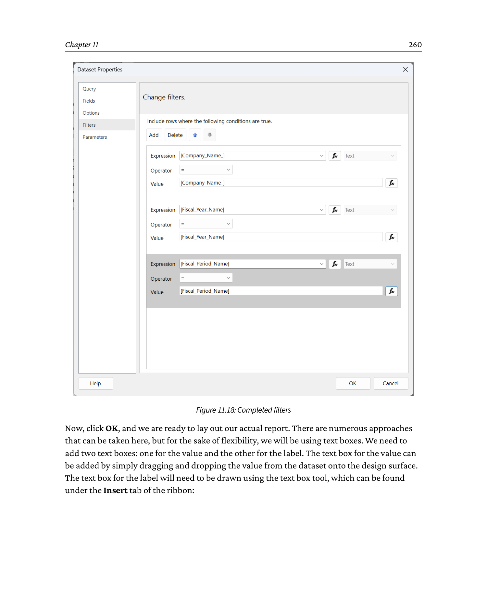

```
   Dataset Properties - Filters tab (filled in)

   +--------------------------------------------------+
   | Dataset Properties                               |
   |--------------------------------------------------|
   |  Filters:                                        |
   |    +-----------+--------------+--------+--------+ |
   |    | Filter #  | Expression   |Operator| Value  | |
   |    +-----------+--------------+--------+--------+ |
   |    |    1      | Company_Name_|   =    |[fx]    | |
   |    |    2      | FiscalYearN  |   =    |[fx]    | |
   |    |    3      | FiscalPeriod |   =    |[fx]    | |
   |    +-----------+--------------+--------+--------+ |
   |                                                  |
   |                          [OK]   [Cancel]         |
   +--------------------------------------------------+

   Three filters, one per parameter.  The dataset is now
   parameterised by Company, Year and Period.
```

Now, click *OK*, and we are ready to lay out our actual report. There are numerous approaches that can be taken here, but for the sake of flexibility, we will be using text boxes. We need to add two text boxes: one for the value and the other for the label. The text box for the value can be added by simply dragging and dropping the value from the dataset onto the design surface. The text box for the label will need to be drawn using the text box tool, which can be found under the *Insert* tab of the ribbon:

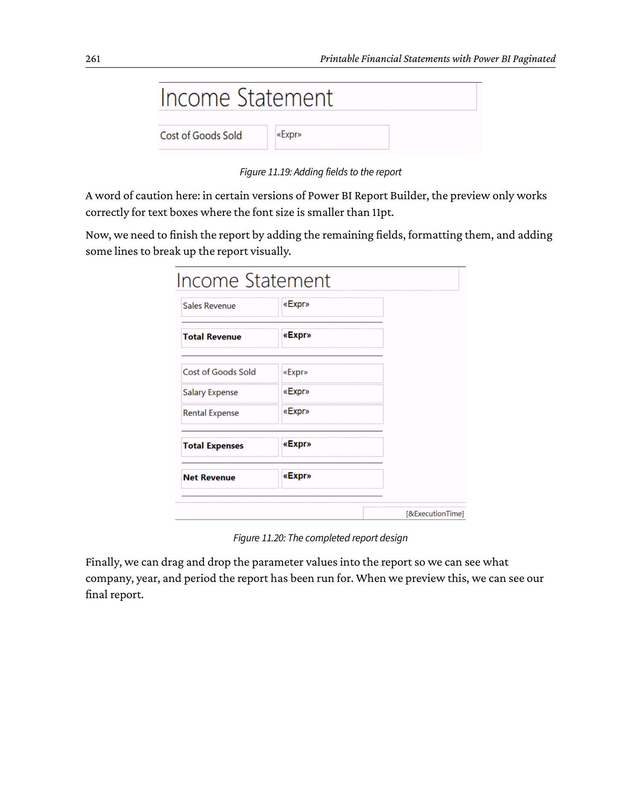

```
   Power BI Report Builder - dragging a value onto the design surface

   +------------------- design area ------------------+
   |                                                  |
   |   trial balance dataset (left)                   |
   |    [Total Revenue]   ==drag==>   +-----------+   |
   |    [Net Revenue  ]               |  $1,234   |   |
   |    [COGS        ]                |           |   |
   |    [Rent Expense]                |  text box |   |
   |    [Salary Exp  ]                |  (value)  |   |
   |    [Sales Rev   ]                +-----------+   |
   |                                                  |
   +--------------------------------------------------+

   Drop the field where the value should appear.  A second
   text box for the label is added by hand using the Insert
   tab's Text Box button.
```

A word of caution here: in certain versions of Power BI Report Builder, the preview only works correctly for text boxes where the font size is smaller than 11pt.

Now, we need to finish the report by adding the remaining fields, formatting them, and adding some lines to break up the report visually.


```
   Power BI Report Builder - completed report design

   +------------------- Page 1 -------------------+
   | Income Statement                              |
   | Company: <param>   Year: <param>   Period:... |
   |-----------------------------------------------|
   |                                               |
   |   Revenue                                     |
   |       Sales Revenue       1,200,000.00        |
   |       Total Revenue      (1,200,000.00)       |
   |                                               |
   |   Cost of Goods Sold                         |
   |       COGS                  700,000.00        |
   |                                               |
   |   Expenses                                    |
   |       Rent Expense          50,000.00        |
   |       Salary Expense       450,000.00        |
   |                                               |
   |-----------------------------------------------|
   |   Page 1 of 1                                 |
   +-----------------------------------------------+

   Labels are drawn in with the Text Box tool; values are
   dragged from the dataset.  Numbers are right-aligned.
```

Finally, we can drag and drop the parameter values into the report so we can see what company, year, and period the report has been run for. When we preview this, we can see our final report.

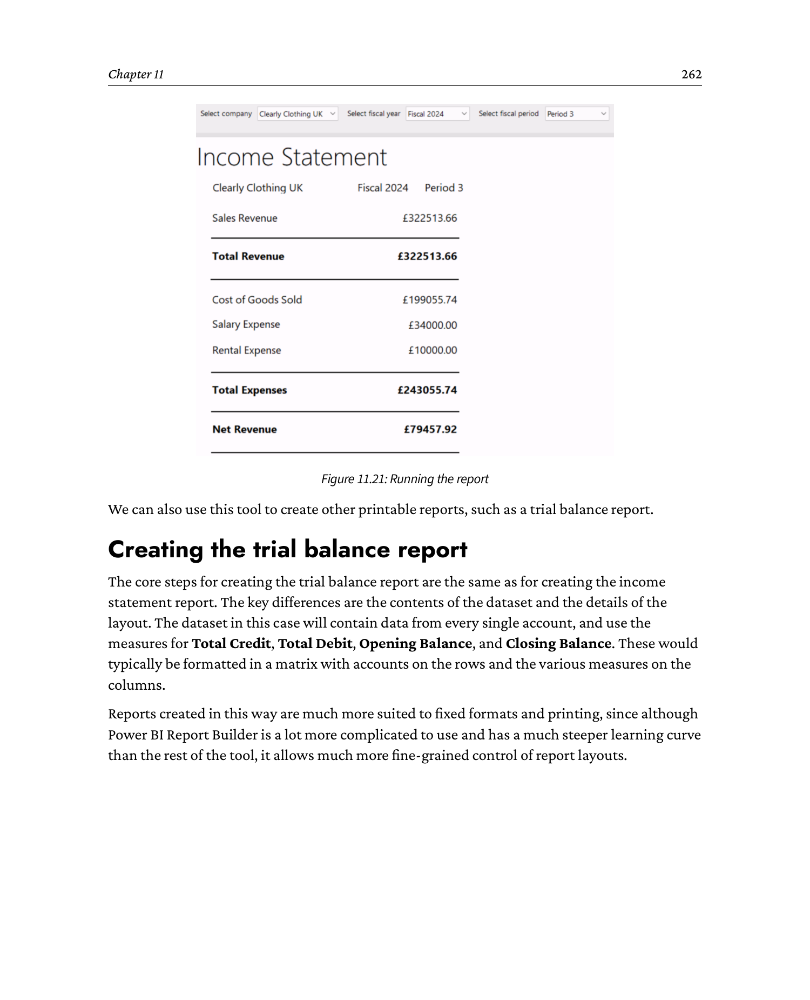

```
   Power BI Report Builder - preview / run

   +------------------- Income Statement -----------------------+
   |   Company: [Acme Corp      v]   Year: [2024   v]   Period:|
   |                                                          v]|
   |   [View Report]                                            |
   |------------------------------------------------------------|
   |                                                            |
   |   Income Statement                                          |
   |                                                            |
   |     Revenue                                                 |
   |       Sales Revenue         1,200,000.00                   |
   |       Total Revenue        (1,200,000.00)                  |
   |                                                            |
   |     Cost of Goods Sold                                      |
   |       COGS                  700,000.00                     |
   |                                                            |
   |     Expenses                                                |
   |       Rent Expense          50,000.00                      |
   |       Salary Expense       450,000.00                      |
   |                                                            |
   |                                            Page 1 of 1      |
   +------------------------------------------------------------+

   The parameter pane at the top is what the user changes to
   re-run the report for a different company, year, or period.
```

We can also use this tool to create other printable reports, such as a trial balance report.

## 11.5 Creating the trial balance report

The core steps for creating the trial balance report are the same as for creating the income statement report. The key differences are the contents of the dataset and the details of the layout. The dataset in this case will contain data from every single account, and use the measures for Total Credit, Total Debit, Opening Balance, and Closing Balance. These would typically be formatted in a matrix with accounts on the rows and the various measures on the columns.

Reports created in this way are much more suited to fixed formats and printing, since although Power BI Report Builder is a lot more complicated to use and has a much steeper learning curve than the rest of the tool, it allows much more fine-grained control of report layouts.

## 11.6 Summary

In this chapter, we looked in detail at how to create a printable report. While in the modern workplace, this may seem obsolete, it remains an important tool for us to have available. In the next chapter, we move to a current hot topic which is how we may use AI to drive financial decisions.
