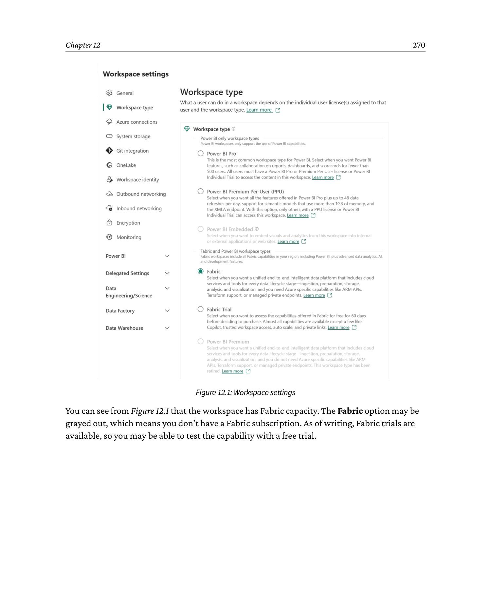
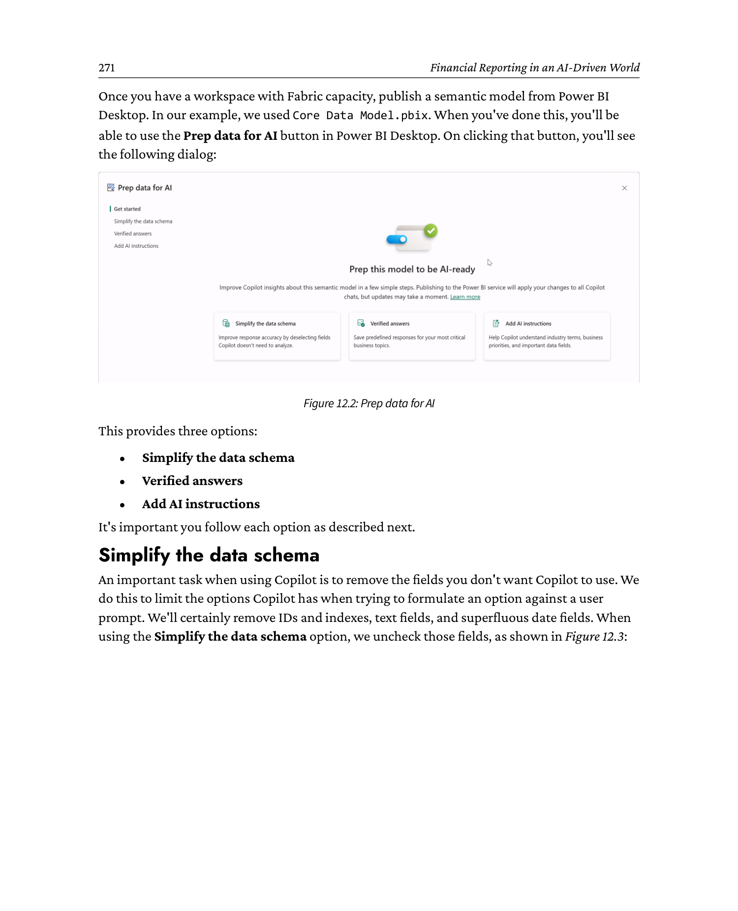
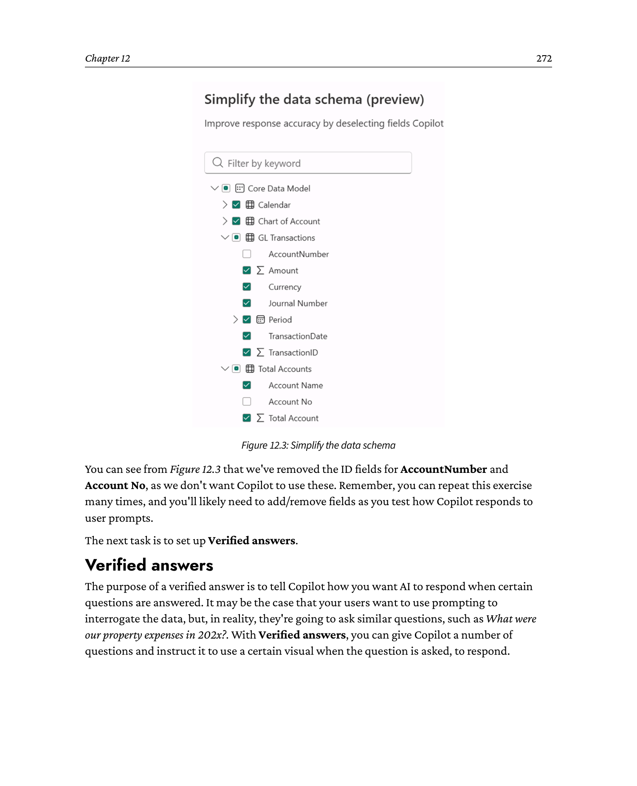
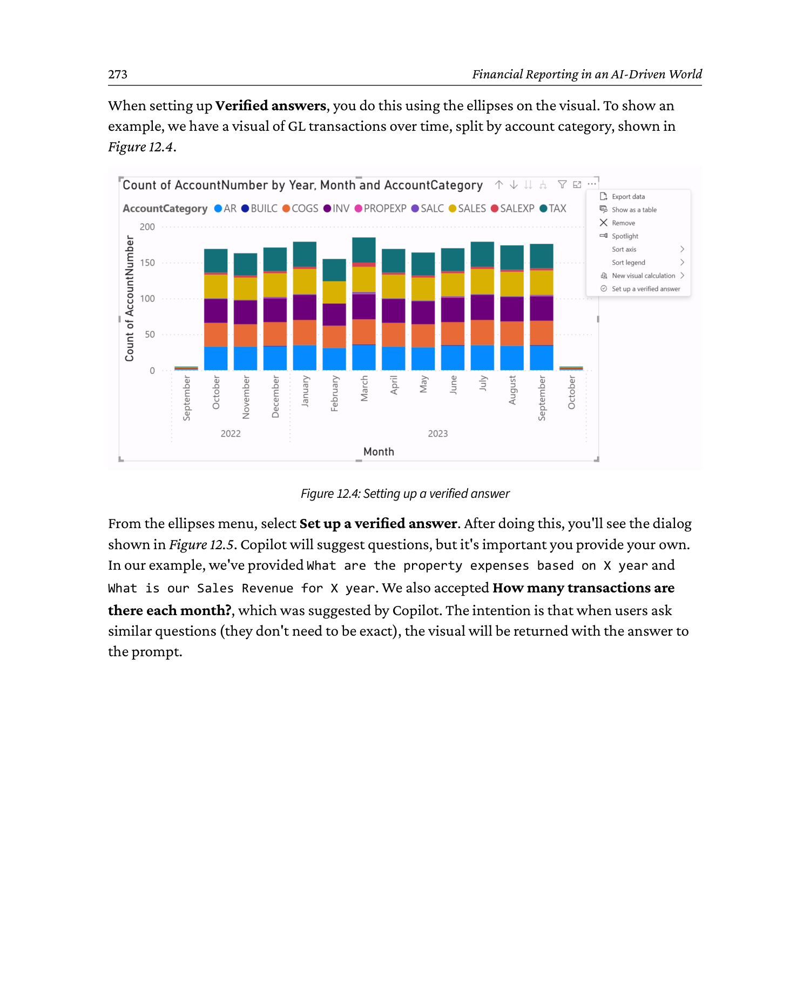
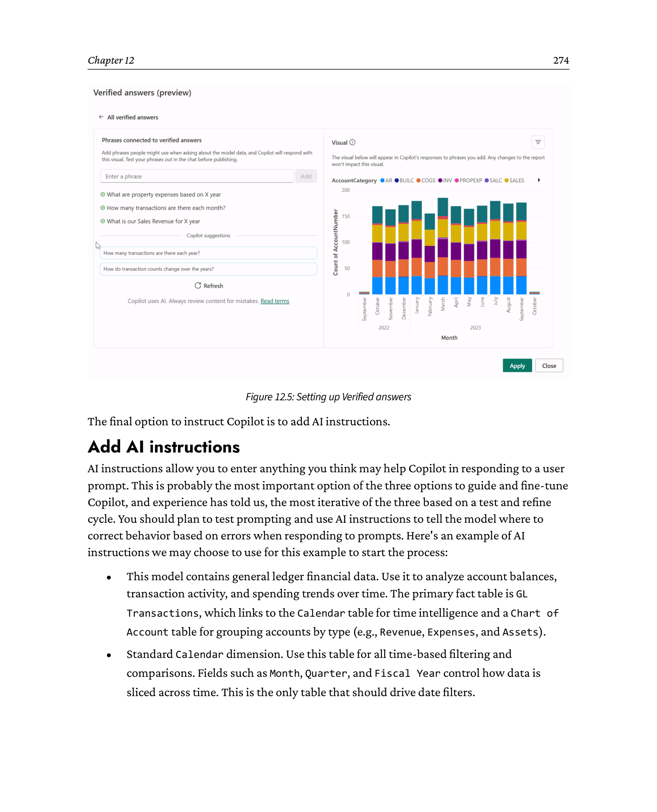
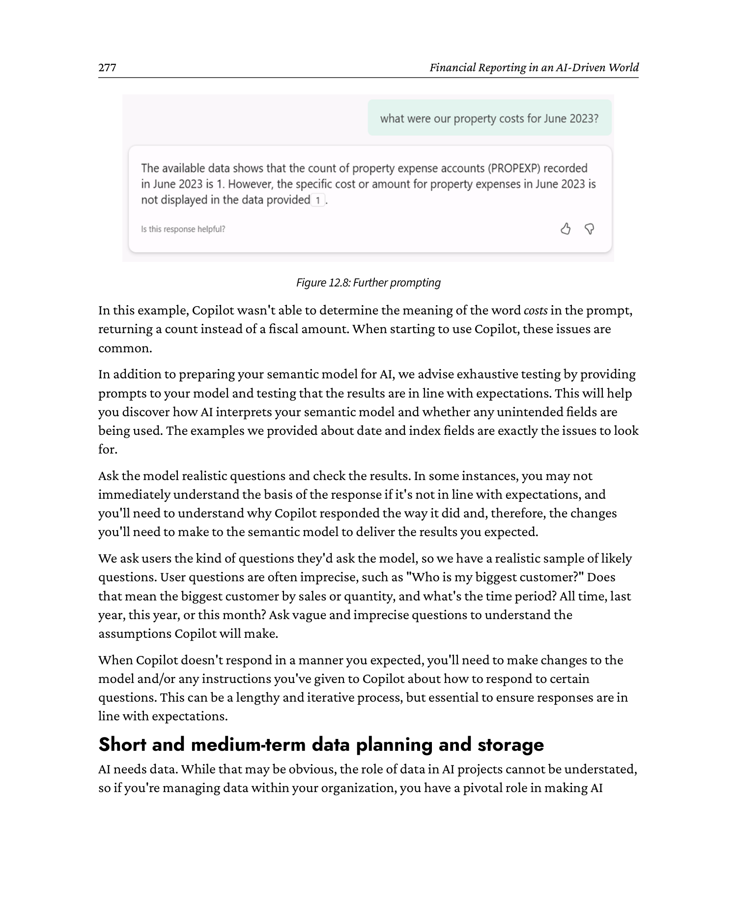
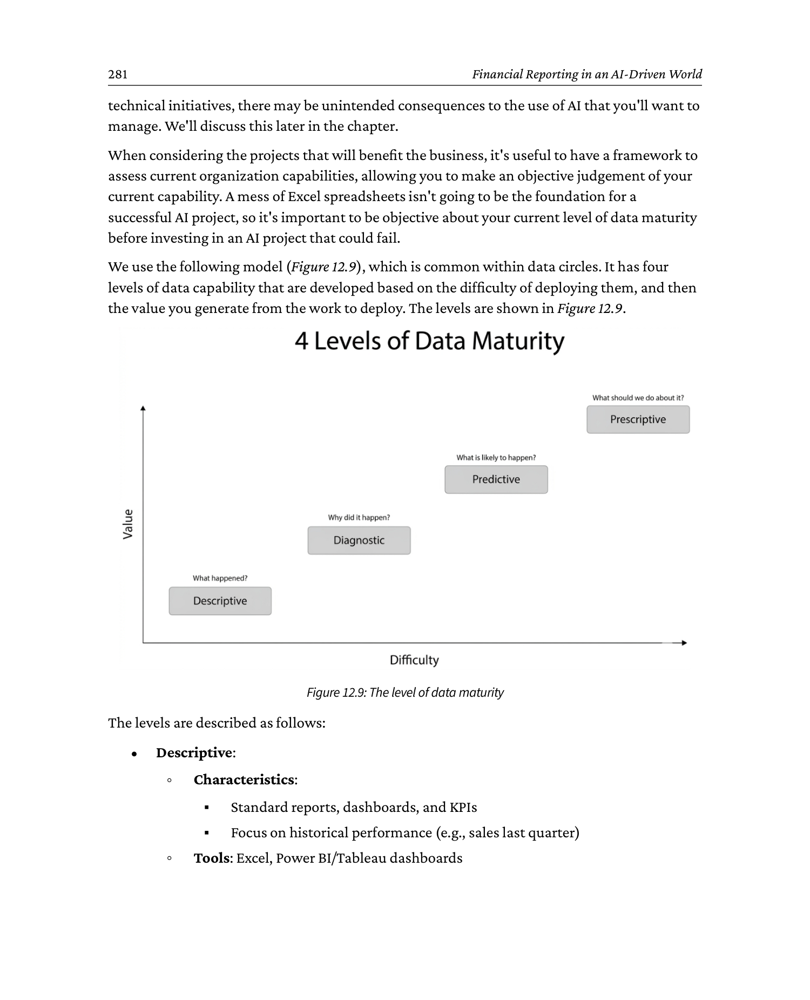

# 12 Financial Reporting in an AI-Driven World

Source: *Financial Modeling and Reporting with Microsoft Power BI* (Packt Publishing, 2026)
DOI: 10.0000/PACKT_FMRWPB_2026  |  GitHub: https://github.com/PacktPublishing/Financial-Modeling-with-Power-BI_Packt/tree/main/Chapter12
Page range: 294 - 319

## Introduction

Writing any book on a technical subject can be a nerve-racking experience. You wonder how current your words and screenshots will remain. Will there be a major UI refresh, rendering every screen-clip outdated? Will the product name change? Will there be a major technical breakthrough rendering most of the book instantly outdated?

While writing this book, this is the chapter we worried about the most. For every other chapter, we know the technical accuracy of the content, and for the majority of the book, we know the techniques will be relevant for many years to come.

The three of us have been in technology long enough to have witnessed the birth of modern computing and the rise of the internet, so we're experienced in managing change. In all cases, we endeavor to be at the forefront; that's our business.

That also applies to Artificial Intelligence (AI). But our fears for this chapter are how wrong we're going to get it, because we will get some of this wrong. Not wrong as we write it, but wrong in months and years to come. Maybe we're being hard on ourselves, and "outdated" is a better word. Sadly, we're not in possession of a crystal ball.

By the end of this chapter, you will understand the following:

- What AI is
- How to use generative AI tools to aid in report creation
- How Microsoft Fabric fits into AI and Power BI
- How to store data to enable AI insights
- The dangers and risks of using AI tools

We will start by looking at what AI actually is and what it can do.

## 12.1 What is AI?

Before we dive into how we can use AI, we should make it clear what we actually mean by AI.

### 12.1.1 Foundations of AI

AI refers to a broad set of technologies that perform tasks requiring human-like intelligence. These include the following:

- Machine learning, where systems learn patterns from data
- Deep learning and neural networks, which power more complex recognition and prediction
- Natural language processing (NLP), which allows machines to understand and generate human language
- Computer vision, which enables the interpretation of images and video

Together, these areas form the backbone of AI as it has developed during recent decades.

### 12.1.2 Looking at the current trends

More recently, our focus has shifted toward generative AI and AI agents. These approaches use Large Language Models (LLMs) that can respond to user prompts, generate content, and perform multi-step tasks.

Those are short explanations for complex topics, and we advise you to undertake your own research into AI to develop further understanding, beyond this chapter.

Our stance on this chapter is to equip you with general advice, based on principles rather than specifics. Those principles should last you longer than a "use function A to achieve result B" approach.

Therefore, in this chapter, we've set out to do the following:

- Show you where to start with an AI project based on an immediate requirement
- Explain how to organize your data in the short and long term for the AI projects you've planned and haven't planned
- Help you think about the development of AI within your organization

We're going to work through this chapter in the order of the preceding bullets, starting with where to start with an AI project. That may seem counterintuitive, as organization of data and understanding should be the foundations before you start. But we're seeing many instances of AI projects starting immediately, so we're trying to be as pragmatic as possible. To many who read this chapter, starting with long data management and storage projects may not be realistic in the face of organizational pressure. We believe you should still do the data management and storage projects, but we appreciate that it may not be an option.

OK, that's all the caveats over. If you're reading this as part of a data history project in 2040, just upload the entire book via your cerebral cortex interface and remember to leave the house at least once this month.

For everyone else, let's look at where to start an AI project.

## 12.2 Where do you start with an AI project?

We're going to start with where many organizations are currently starting.

Leaders in many organizations appear to be in the following modes:

- Excited about AI
- Confused about AI
- In self-protection mode and need to be seen within the organization to be working on internal AI initiatives

It's probably fair to say that many of the same leaders move between all three on a daily basis.

What's going on?

AI is a transformative technology and is being heavily marketed as such. Many people in many organizations are under immense pressure to adopt the technology so the organization doesn't fall behind. This is leading, in many cases, to a "throw spaghetti against the wall to see what sticks" approach. Inevitably, that leads to failed projects and wasted money.

There's a simple and effective (although not foolproof) method to deal with this problem. *Start with the business problem, not the technology.*

Wherever you or your organization are, the pressure to use AI is driving emotions and probably a few questionable decisions. As many organizations are experiencing similar patterns of behavior, now is the time to stay calm and focus on some basics to start an AI project.

We'd start with two requirements:

- A problem that can benefit from the application of AI
- A technical method to solve the problem (or a data science team to build it for you)

### 12.2.1 Start with a business need

There's an important distinction in comprehending where AI works well, so you can use it to solve problems that'll benefit from the technology. It's certainly not the answer to every problem, despite what a few people may want you to believe.

So, what does AI do well right now?

Above all, AI is good at taking a mass of information, summarizing it, and/or detecting patterns based on data.

Conversely, AI is not a good solution for issues involving human emotion, creativity, or strategic vision, not to mention pretty much all tasks that require a human body. I'm not using AI to fix my air conditioner, and I'd rather use AI to analyze sales trends to spot anomalies, as opposed to building a rebranding exercise with an accompanying strategic marketing plan.

In a finance function, you may want to start by applying AI to a cash flow forecast or error detection to speed up the month-end process. Whatever you choose to do, you'll need access to an AI model to help with the analysis, which we will discuss next.

### 12.2.2 A technical method to solve the problem

So, how do we get access to AI to help us solve these problems?

If you work in a very large organization, you may have the benefit of a data science team to build a solution.

If you don't, then you may need to look at off-the-shelf options you can configure to use. In most cases, we expect the latter to be the case.

Off-the-shelf options may come from the software vendor that built your application, or they may come from elsewhere. In all cases, it should have a relatively user-friendly method of building capability against your data.

As this is a Power BI book, let's start with the following scenario: I'm a Power BI user and want to use AI to help analyze my data.

## 12.3 Using Power BI and AI together

In starting to discuss Power BI and AI, let's be clear about what we're talking about and what we're not talking about.

What we are talking about is using generative AI to help analyze your data and produce visuals and insights using natural language prompts (hereafter, "prompts").

What we're not talking about is using AI to help write DAX, which we don't cover in this book, as our intention is to teach you the basics of DAX applied to finance. We've found that AI tools do a so-so job of writing DAX, which can sometimes be incorrect. If you want to analyze the data in your Power BI semantic model(s) using AI, you'll also need a Fabric subscription.

Fabric is Microsoft's end-to-end analytics platform, and Power BI is a component of Fabric. We will describe Fabric later in this chapter.

Fabric is a subscription-based service from Microsoft, although a different subscription type from Power BI. With Fabric, you purchase a subscription for compute capacity, not a $/user/month license. The subscription is consumption-based, meaning you pay while it runs.

Fabric and Power BI give you access to Copilot, which is Microsoft's product term for its AI offerings. For the sake of clarity, "Copilot" is used broadly within the Microsoft product portfolio, and the Copilot offering in, say, Excel, is different from the Copilot offering in Power BI and Fabric. It's also licensed differently, and a Copilot license that gives you AI features in the Office suite is a different license from the Fabric subscription license we're explaining here.

If you're unclear, we'd advise getting clarification from your IT function or whoever buys licenses in your organization. Licensing can be as complex as data, so we'll leave this with your experts.

Needless to say, Power BI combined with a Fabric capacity provides you with the capability to use a ChatGPT LLM against one or more semantic models that reside in a workspace that has Fabric capacity assigned to it. For a Power BI user, it's probably the easiest way to use AI against the data in a semantic model.

The most important step, for this scenario and any scenario involving the use of semantic models and AI, is to ensure that your model is a simple star schema and you remove columns that aren't required for the purpose of the project. Simplification is an essential step to successfully using Copilot with Power BI.

Why is this, and why isn't AI clever enough to just figure out the complexity?

You can, of course, publish a semantic model with complex relationships and all columns from the source tables. But when you start using the Copilot prompt in Power BI, you'll see some strange responses that'll be difficult to track back to the data. The reason is that Copilot needs to be told what data to use, or at least, that data needs to be restricted as much as possible.

To take an example, we've mentioned the challenges of using dates in your financial models, and especially the correct dates for the intended calculation. Sales reports that use the created date instead of the invoice date will place the transactions in the wrong date buckets, and your reporting will be incorrect. Therefore, if you give Copilot multiple dates, how does it know which one to pick? It doesn't, and you need to provide clear instructions or, even better, restrict the options it has.

*To be successful with any data and AI project, make it easy for AI.*

To start using Copilot with a semantic model, you'll need a Fabric licensed workspace in Power BI. To see whether a workspace has Fabric capability, check Workspace settings and choose the Workspace type option:



```
   Power BI service - Workspace settings (Workspace type)

   +---------------------------------------------+
   | Workspace settings                         |
   |---------------------------------------------|
   |  [General]  [License info]  [+ New tab]     |
   |---------------------------------------------|
   |  Workspace type                             |
   |    o  Personal                              |
   |    o  Pro     (requires Pro / PPU)          |
   |    #  Fabric  (Fabric capacity assigned)    |
   |    o  Premium (legacy, pre-Fabric)          |
   |                                             |
   |  The Fabric option may be greyed out if     |
   |  you don't have a Fabric subscription.      |
   |  A Fabric trial may be available.           |
   +---------------------------------------------+
```

You can see from Figure 12.1 that the workspace has Fabric capacity. The Fabric option may be grayed out, which means you don't have a Fabric subscription. As of writing, Fabric trials are available, so you may be able to test the capability with a free trial.

Once you have a workspace with Fabric capacity, publish a semantic model from Power BI Desktop. In our example, we used *Core Data Model.pbix*. When you've done this, you'll be able to use the *Prep data for AI* button in Power BI Desktop. On clicking that button, you'll see the following dialog:



```
   Power BI service - Prep data for AI

   +---------------------------------------------+
   | Prep data for AI  <semantic model name>     |
   |---------------------------------------------|
   |  Pick the steps you want to apply:          |
   |                                             |
   |  [x]  1. Simplify the data schema           |
   |  [x]  2. Verified answers                   |
   |  [x]  3. Add AI instructions                |
   |                                             |
   |  Description:                               |
   |   These steps make it easier for Copilot    |
   |   to choose the right tables and fields     |
   |   when answering natural-language prompts.  |
   |                                             |
   |                    [Apply]   [Cancel]        |
   +---------------------------------------------+
```

This provides three options:

- Simplify the data schema
- Verified answers
- Add AI instructions

It's important you follow each option as described next.

### 12.3.1 Simplify the data schema

An important task when using Copilot is to remove the fields you don't want Copilot to use. We do this to limit the options Copilot has when trying to formulate an option against a user prompt. We'll certainly remove IDs and indexes, text fields, and superfluous date fields. When using the *Simplify the data schema* option, we uncheck those fields, as shown in Figure 12.3:



```
   Power BI - Simplify the data schema (column picker)

   +--------------------------------------------------------+
   | Simplify the data schema                               |
   |--------------------------------------------------------|
   |  Hide fields Copilot shouldn't use:                    |
   |                                                        |
   |  Chart of Account          [v]                          |
   |     AccountNumber          [ ]  <-- hide (no meaning) |
   |     Account No             [ ]  <-- hide (no meaning) |
   |     AccountCategory        [x]  <-- keep              |
   |     AccountName            [x]  <-- keep              |
   |  GL Transactions           [v]                          |
   |     TransactionID          [ ]  <-- hide              |
   |     Amount                 [x]  <-- keep              |
   |     PostDate               [x]  <-- keep              |
   |     Description            [x]  <-- keep              |
   |  Calendar                  [v]                          |
   |     Date                   [x]  <-- keep              |
   |     FiscalYearName         [x]  <-- keep              |
   |     CreatedOn              [ ]  <-- hide              |
   |     UpdatedOn              [ ]  <-- hide              |
   |                                                        |
   |                                [Apply]    [Cancel]     |
   +--------------------------------------------------------+

   Principle: only the columns Copilot actually needs to answer
   the kinds of prompts you expect should be visible.  Anything
   else is just noise (or worse, a trap).
```

You can see from Figure 12.3 that we've removed the ID fields for *AccountNumber* and *Account No*, as we don't want Copilot to use these. Remember, you can repeat this exercise many times, and you'll likely need to add/remove fields as you test how Copilot responds to user prompts.

The next task is to set up Verified answers.

### 12.3.2 Verified answers

The purpose of a verified answer is to tell Copilot how you want AI to respond when certain questions are answered. It may be the case that your users want to use prompting to interrogate the data, but, in reality, they're going to ask similar questions, such as *What were our property expenses in 202x?*. With Verified answers, you can give Copilot a number of questions and instruct it to use a certain visual when the question is asked, to respond.

When setting up Verified answers, you do this using the ellipses on the visual. To show an example, we have a visual of GL transactions over time, split by account category, shown in Figure 12.4.



```
   Power BI - ellipses on a visual (verified-answer trigger)

   +---------------------------------+
   | GL Transactions over time        |
   |  (column chart, by AcctCategory) |
   |                                  |
   |     ##                           |
   |    ## ##                         |
   |   ##  ##                         |
   |  ##  ##   ##                     |
   |  ##  ##  ## ##                   |
   |  ##  ##  ## ##  ##               |
   |  ##  ##  ## ##  ##               |
   |                                  |
   |  (.) ellipsis  ====expand===>     |
   |                                  |
   |  +-----------------------------+ |
   |  | Export data                 | |
   |  | Show as a table             | |
   |  | Spotlight                   | |
   |  | Get insights                | |
   |  | Set up a verified answer <--+-- click here
   |  | ...                         | |
   |  +-----------------------------+ |
   +---------------------------------+
```

From the ellipses menu, select *Set up a verified answer*. After doing this, you'll see the dialog shown in Figure 12.5. Copilot will suggest questions, but it's important you provide your own. In our example, we've provided *What are the property expenses based on X year* and *What is our Sales Revenue for X year*. We also accepted *How many transactions are there each month?*, which was suggested by Copilot. The intention is that when users ask similar questions (they don't need to be exact), the visual will be returned with the answer to the prompt.



```
   Power BI - Verified-answers dialog

   +----------------------------------------------------------+
   | Verified answers                                         |
   |----------------------------------------------------------|
   |  Suggested questions (Copilot):                          |
   |     [How many transactions are there each month?]        |
   |                                                          |
   |  Your own questions:                                     |
   |     [What are the property expenses based on <year>  ]   |
   |     [What is our Sales Revenue for <year>             ]   |
   |     [How many transactions are there each month?     ]   |
   |                                                          |
   |  Linked visual:  GL Transactions over time (by AcctCat)  |
   |                                                          |
   |                        [Save]    [Cancel]                |
   +----------------------------------------------------------+

   The user prompt doesn't need to be exact; if the question is
   "close enough" to one of these, the verified visual is
   returned with the answer.
```

The final option to instruct Copilot is to add AI instructions.

### 12.3.3 Add AI instructions

AI instructions allow you to enter anything you think may help Copilot in responding to a user prompt. This is probably the most important option of the three options to guide and fine-tune Copilot, and experience has told us, the most iterative of the three based on a test and refine cycle. You should plan to test prompting and use AI instructions to tell the model where to correct behavior based on errors when responding to prompts. Here's an example of AI instructions we may choose to use for this example to start the process:

This model contains general ledger financial data. Use it to analyze account balances, transaction activity, and spending trends over time. The primary fact table is GL Transactions, which links to the Calendar table for time intelligence and a Chart of Account table for grouping accounts by type (e.g., Revenue, Expenses, and Assets). Standard Calendar dimension. Use this table for all time-based filtering and comparisons. Fields such as Month, Quarter, and Fiscal Year control how data is sliced across time. This is the only table that should drive date filters.

GL Transactions is a fact table containing one row per journal entry line. Each row has an amount (credit/debit), posting date, account number, and reference keys to the Account Categories and Date tables. Positive amounts represent debits; negative amounts represent credits (or adjust per your convention).

Chart of Account is a dimension table that maps individual GL accounts to broader groupings such as Revenue, Cost of Goods Sold, and Operating Expenses. Use this table to roll up transactions by financial statement category.

Figure 12.6 shows these instructions entered into *Add AI instructions*:


```
   Power BI - Add AI instructions

   +----------------------------------------------------------+
   | Add AI instructions                                      |
   |----------------------------------------------------------|
   |  Free-text field:                                        |
   |  +----------------------------------------------------+  |
   |  | This model contains general ledger financial       |  |
   |  | data.  Use it to analyze account balances,         |  |
   |  | transaction activity, and spending trends over     |  |
   |  | time.                                              |  |
   |  |                                                    |  |
   |  | The primary fact table is GL Transactions, which   |  |
   |  | links to the Calendar table for time intelligence  |  |
   |  | and a Chart of Account table for grouping accounts |  |
   |  | by type (e.g., Revenue, Expenses, Assets).         |  |
   |  |                                                    |  |
   |  | Standard Calendar dimension.  Use this table for   |  |
   |  | all time-based filtering and comparisons.  Fields  |  |
   |  | such as Month, Quarter, and Fiscal Year control   |  |
   |  | how data is sliced across time.  This is the only  |  |
   |  | table that should drive date filters.              |  |
   |  |                                                    |  |
   |  | GL Transactions is a fact table containing one row |  |
   |  | per journal entry line.  Each row has an amount    |  |
   |  | (credit/debit), posting date, account number, and  |  |
   |  | reference keys to the Account Categories and Date  |  |
   |  | tables.  Positive amounts represent debits;        |  |
   |  | negative amounts represent credits (or adjust per  |  |
   |  | your convention).                                  |  |
   |  |                                                    |  |
   |  | Chart of Account is a dimension table that maps    |  |
   |  | individual GL accounts to broader groupings such   |  |
   |  | as Revenue, Cost of Goods Sold, and Operating      |  |
   |  | Expenses.  Use this table to roll up transactions  |  |
   |  | by financial statement category.                   |  |
   |  +----------------------------------------------------+  |
   |                                                          |
   |                                  [Save]    [Cancel]      |
   +----------------------------------------------------------+
```

Once you've followed these three steps, you can start testing prompts either in Power BI Desktop or within the Power BI service. If using the service, make sure you republish your model. To test in Desktop, click on the *Copilot* button under the *Home* tab. When you do so, the Copilot sidebar will open, and a prompt will appear.

In Figure 12.7, we asked Copilot, *what is the PROPEXP amount for year 2023?*. This is very specific to the model, as we know the Property Expenses category is called PROPEXP. Copilot got this correct:


```
   Power BI - Copilot sidebar, prompting on PROPEXP

   +-------------------------------------------------------+
   |  Copilot                                              |
   |-------------------------------------------------------|
   |  [You]  What is the PROPEXP amount for year 2023?     |
   |                                                       |
   |  [Copilot]                                            |
   |   The total Property Expenses for fiscal year 2023    |
   |   is $30,000.                                         |
   |                                                       |
   |   How I got there:                                    |
   |     - Filtered GL Transactions to AccountCategory     |
   |       = "PROPEXP"                                     |
   |     - Filtered Calendar to FiscalYearName = "2023"    |
   |     - Summed Amount                                   |
   |                                                       |
   |   +-----------------------------------------+         |
   |   |  Verified answer (returned visual)      |         |
   |   |     ##  ##  ##  ##                      |         |
   |   |    #### #### #### ####                  |         |
   |   |    #### #### #### ####                  |         |
   |   +-----------------------------------------+         |
   +-------------------------------------------------------+
```

Also note that Copilot tells you how it gets to $30,000.

We then tested with a similar question, using different terminology, which was *what were our property costs for June 2023?*, and we got the response in Figure 12.8:



```
   Power BI - Copilot sidebar, a less-precise prompt

   +-------------------------------------------------------+
   |  Copilot                                              |
   |-------------------------------------------------------|
   |  [You]  What were our property costs for June 2023?   |
   |                                                       |
   |  [Copilot]                                            |
   |   There were 42 property-related transactions in      |
   |   June 2023.                                          |
   |                                                       |
   |   How I got there:                                    |
   |     - Filtered GL Transactions to AccountCategory     |
   |       = "PROPEXP"                                     |
   |     - Filtered Calendar to MonthName = "June"        |
   |       and FiscalYearName = "2023"                    |
   |     - Counted rows                                    |   <-- not what the
   |                                                       |       user asked for
   +-------------------------------------------------------+

   Note:  the user asked for "costs" (an amount), but Copilot
   returned a count.  The "costs" word wasn't tied to the
   amount in Copilot's interpretation.  This is exactly the
   kind of misinterpretation that the AI instructions are
   meant to fix - iterate on them until the response is
   correct.
```

In this example, Copilot wasn't able to determine the meaning of the word *costs* in the prompt, returning a count instead of a fiscal amount. When starting to use Copilot, these issues are common.

In addition to preparing your semantic model for AI, we advise exhaustive testing by providing prompts to your model and testing that the results are in line with expectations. This will help you discover how AI interprets your semantic model and whether any unintended fields are being used. The examples we provided about date and index fields are exactly the issues to look for.

Ask the model realistic questions and check the results. In some instances, you may not immediately understand the basis of the response if it's not in line with expectations, and you'll need to understand why Copilot responded the way it did and, therefore, the changes you'll need to make to the semantic model to deliver the results you expected.

We ask users the kind of questions they'd ask the model, so we have a realistic sample of likely questions. User questions are often imprecise, such as "Who is my biggest customer?" Does that mean the biggest customer by sales or quantity, and what's the time period? All time, last year, this year, or this month? Ask vague and imprecise questions to understand the assumptions Copilot will make.

When Copilot doesn't respond in a manner you expected, you'll need to make changes to the model and/or any instructions you've given to Copilot about how to respond to certain questions. This can be a lengthy and iterative process, but essential to ensure responses are in line with expectations.

### 12.3.4 Short and medium-term data planning and storage

AI needs data. While that may be obvious, the role of data in AI projects cannot be understated, so if you're managing data within your organization, you have a pivotal role in making AI successful. If managing data and not intricately involved in any AI projects, there's a high chance of failure.

Another thing we do know about AI is that the benefit has a direct correlation with the quality and volume of data you have to work with. To be effective, AI needs good-quality data, and generally, the more data, the better. But if your data is limited, AI can still have value. Conversely, what we also know about AI is that using poor-quality data is a very bad strategy. The common misconception that AI will just fix it is, well, a common misconception.

We also understand that a project to get all data in good shape for AI is probably unrealistic for most organizations, so we suggest not starting there. It's too much to take on and will randomize the organization, missing some quick wins. But that project needs to start somewhere, and it's far better to start the data project in parallel with the immediate need AI projects, as opposed to not at all.

Let's consider a different starting point, that you've not begun to plan how AI will benefit you, or have just started considering how AI may benefit you. What do you do with your data? There are a few defining characteristics:

- Your data is clean. To test, you may want to clean a subset of your data, which will be quicker and give you more control over outcomes. You can introduce more data over time.
- Table and column labels use commonly understood business language, not cryptic developer labels.
- Tables and columns that aren't required are removed from the model, or the AI is instructed to ignore them. Columns such as IDs and system data that don't support the purpose aren't going to help AI analyze your data and, in some instances, may be incorrectly used by AI. We had a recent example where data in a numeric ID column was used to answer a generative question for a specific sales result.
- If many columns have similar data, only use the column(s) you need. Dates are a great example. If you have multiple date columns, which is very common, remove the columns you don't need. Otherwise, you give AI the opportunity to use the wrong column.

If you've taken the right steps now, you'll be ready when you start AI projects, and we're 100% certain that good quality data, in abundance, will benefit you. It may not ensure project success, but your project certainly won't fail due to data.

As you work with AI, plan to evolve your data structures as you go through test cycles to ground your data. If your model isn't delivering desired or consistent results, you may need to revisit your data to make changes. Test again and see whether that improves the results.

Remember that testing your AI model is a critical task, and the process of testing has to be a priority for a successful project and deployment.

We've just discussed some short-term tactics for using your data to support AI projects, so what are the longer-term actions you can take to help make your AI projects successful?

## 12.4 Long-term considerations for AI projects

Short-term tactical data plans are useful to help your organization learn about how to be effective with AI, but that needs to be paired with some long-term systemic data policies so your data is ready for whatever strategies the business wants to follow.

That means that we need to think about how to store data to make it readily available for AI tasks in the future, rather than for the purpose of reporting. Depending on how you want to process your data, the Power BI semantic model is not a good place to store your data if you want to process it for AI workloads. In fact, a semantic model shouldn't be considered as a data storage mechanism.

Add to that, it's often not easy to directly access the data in a Power BI model, other than via Power BI, and we need to consider ways to store our data outside of Power BI to help you manage AI projects in the future. There are several approaches we can take to this.

The first, and simplest, is to leave the data in the source system. We're considering financial data, so we can assume that at least seven years of history will be preserved at source, and in most cases, this should be enough. If your source financial application is mainstream, the data structures should be well designed by the developers. It's also worth considering how much historical data you'll need. In many cases, when you go too far back in time, the structure of the business was different, so, for example, 15-year-old data has little relevance to today.

The preferred method of handling this data is to move it out of the source system and put it somewhere else for later processing. To understand the specifics of how to do this and the choice of tools, please refer to any of the great texts on data lakes, lakehouses, and data warehouses. A detailed explanation of these concepts is outside the scope of this book, but we'll cover the basics.

There are many choices for how to store data, but they generally come down to whether it makes more sense to store the data in a structured form, such as a SQL database, or unstructured, such as a data lake. Or something in between, such as a lakehouse.

The general considerations are how much data you're storing and the cost implications. Typically, storing data in a data lake can be more cost-effective, especially for larger datasets. Since the data will generally be used in bulk, the advantages of storing the data in a SQL database may not transpire. Normally, this option would be considered if and only if there is an additional need to process the data in smaller subsets than would be typical for AI.

The other decision is how to move the data into the data store for AI. Leaving aside specific tools, there are two main approaches: a regular trickle or a periodic bulk load of all the data. While the bulk load pattern is certainly easier to design and implement, the trickle feed (for example, created and modified rows each day) will mean you're constantly up to date.

There is no right or wrong approach to this, just considerations when planning for an AI future.

### 12.4.1 Think about how you develop AI capabilities

You have many choices about how you develop your AI capabilities, and those choices are growing almost monthly as new services are launched.

It may be the case that your financial application provider is already beginning to provide AI capabilities in the application you use, so you may get some quick wins by deploying those.

In lieu of some off-the-shelf capabilities, to start planning for how AI could help your business, you'll need to consider the following:

- What are the use cases within the finance function, and what impact should you expect to see? Examples could be accelerating the close process, automating reconciliations, or detecting anomalies.
- What resources and skills do we need to develop the strategy and begin the initial projects? In general composition, the roles you'll need will resemble the roles we proposed in Chapter 1, *Identifying Your Reporting Needs and Data Sources*, for your Power BI project team. Naturally, you'll also need some data science, machine learning, and data engineering skills. That doesn't need to be in the form of full-time employees; you may choose to employ external consultants as you ramp up, then employ personnel as your use becomes widespread.
- What technical platforms will you need to support this initiative?
- What data will you need to support the scenarios?
- What is the organizational readiness to adopt these technologies and the change management processes to take your current workforce on this journey?

Few organizations will or should transition from no AI to lots of AI overnight; there are steps we recommend to help you understand the technology and assist in the transition.

There may be a question, and we do hear it, which is "Why not just go all-in?".

You certainly can, but that approach involves risk, like any major organizational change project, so the ultimate arbiter is how much risk you're willing to accept. As with other technical initiatives, there may be unintended consequences to the use of AI that you'll want to manage. We'll discuss this later in the chapter.

When considering the projects that will benefit the business, it's useful to have a framework to assess current organization capabilities, allowing you to make an objective judgement of your current capability. A mess of Excel spreadsheets isn't going to be the foundation for a successful AI project, so it's important to be objective about your current level of data maturity before investing in an AI project that could fail.

We use the following model (Figure 12.9), which is common within data circles. It has four levels of data capability that are developed based on the difficulty of deploying them, and then the value you generate from the work to deploy. The levels are shown in Figure 12.9.



```
   Data maturity - four levels

   value ^
         |
         |   Diagnostic                Prescriptive
         |   "Why did this             "What should we
         |    happen?"                  do, and let AI
         |                              act on it"
         |                              (real-time decision
         |                               making, AI-assisted
         |                               operations)
         |
         |   Descriptive               Predictive
         |   "What happened?"          "What will happen?"
         |   (standard reports,        (forecasting, regression,
         |    dashboards, KPIs,        classification, Azure ML,
         |    sales last quarter)      demand forecasting)
         |
         +--------------------------------------------> difficulty
            low                                     high

   The four levels are usually placed in a 2x2 with
   "difficulty of deploying" on the X axis and "value
   generated" on the Y axis.

   - Descriptive: standard reports and dashboards, historical
     focus, not AI-ready yet.
   - Diagnostic: drill-downs, ad hoc queries, statistical
     analysis, AI-ready for narrow use cases.
   - Predictive: forecasting models, scale and govern them.
   - Prescriptive: optimization, AI recommendations, closed-
     loop systems where AI acts.
```

The levels are described as follows:

**Descriptive:**

- *Characteristics:*
  - Standard reports, dashboards, and KPIs
  - Focus on historical performance (e.g., sales last quarter)
  - Tools: Excel, Power BI/Tableau dashboards
- *AI readiness check:*
  - The organization is not AI-ready yet
  - Organization is likely still data-reactive
  - You're capturing data, but not analyzing cause or forecasting trends
- *Next steps:*
  - Improve data quality, governance, and accessibility
  - Start instrumenting systems to capture richer, real-time data
  - Begin centralizing data sources for consistency

**Diagnostic:**

- *Characteristics:*
  - Root cause analysis and correlation tracking
  - Use of drill-downs, statistical analysis, and ad hoc queries
  - Tools: SQL, R/Python for basic stats, and more advanced BI tools
- *AI readiness check:*
  - You are AI-ready for narrow use cases
  - You've developed analytical thinking and are starting to test hypotheses
  - You understand key drivers behind outcomes - essential for building AI models
- *Next steps:*
  - Pilot machine learning models (e.g., churn prediction and demand forecasting)
  - Build cross-functional teams to explore AI ideas with business impact
  - Ensure proper data lineage and feature documentation

**Predictive:**

- *Characteristics:*
  - Forecasting models, regression, and classification
  - Using historical patterns to predict future outcomes
  - Tools: Python/R, Azure ML, AutoML, DataRobot, and so on
- *AI readiness check:*
  - You have solid ground for AI expansion
  - Models are likely already in use - time to focus on scaling, accuracy, and governance
  - You can start exploring advanced AI, such as deep learning and NLP
- *Next steps:*
  - Move toward MLOps: versioning, retraining, and monitoring models
  - Integrate predictions into business workflows or apps (e.g., through Power Platform or APIs)
  - Evaluate model bias and explainability frameworks

**Prescriptive:**

- *Characteristics:*
  - Optimization models, AI recommendations, and simulations
  - Suggested actions based on predictions
  - Use of reinforcement learning, decision intelligence, and automation
  - Tools: Currently, this is chiefly delivered via custom-developed applications
- *AI readiness check:*
  - Highly competent, ready for transformative AI
  - Capable of creating closed-loop systems where AI doesn't just inform but acts (e.g., robotic process automation and AI co-pilots)
- *Next steps:*
  - Implement real-time decision-making and AI-assisted operations
  - Use generative AI to explore and test decision scenarios
  - Prioritize governance, human oversight, and audit trails for AI actions

Your AI readiness is very dependent on where you sit, from descriptive to prescriptive, so objectively placing yourself within one of the categories is a good starting point. At least you're in a good place to move forward, understanding the road ahead. This should also reduce the risk that a project is aborted or fails.

## 12.5 Working with Microsoft Fabric

We mentioned Fabric earlier in the chapter; here, we provide some more detail.

While Power BI continues to thrive as a standalone product, it also forms one of the core components of Microsoft Fabric. Fabric is Microsoft's unified, cloud-hosted data analytics platform. Power BI represents the data visualization engine within Fabric and continues to have all the same functionality that we have come to know in the standalone product, but, used within Fabric, the capability of the platform goes beyond what Power BI can do on its own.

The Fabric platform itself is built on top of OneLake, a data lake solution designed to hold all an organization's data. From this base, it provides capabilities for data engineering, data science, data warehousing, and business intelligence. As of late 2025, traditional databases are also being introduced into the platform, which will make Fabric a one-stop shop for almost any data analytics need an organization might have.

Throughout the platform, Copilot provides built-in AI capabilities to help the user produce analyses quickly and easily. This means that generative AI is available across the platform's capabilities.

We've already discussed a number of considerations around how to store data for AI workloads, such as using a data lake or database to store raw data, and Fabric provides a platform in OneLake. It also provides the means to get the data there. One of the key capabilities in Fabric is the ability to create data pipelines in much the same way as you can in Azure Data Factory to import data at scale into the OneLake storage.

The data engineering and data warehousing capabilities allow organizations to create complete analytical solutions and work with ad hoc analyses.

### 12.5.1 Storage

The OneLake storage built into Fabric is designed to reduce the amount of data that needs to be moved around an organization. As a data lake, it is capable of storing almost any kind of data, from financial to data gleaned from social media, such as videos and photographs. For the most part, we are interested in more structured data, as this is generally the nature of financial data. Here, we need to get the data into OneLake since it is highly unlikely that the financial management system will be using OneLake natively (although, of course, tighter integration from Microsoft products is likely to be coming in the future). We also need to consider the data formats to use: for smaller datasets, something simple such as CSV may be suitable, whereas for larger datasets, a more advanced format such as Parquet might be the right choice.

### 12.5.2 Data warehouse and data lakehouse

Fabric allows managing data in both warehouses and lakehouses. Typically, the warehouse is going to be more suitable for structured and semi-structured data, where tools such as SQL will be the main means of interacting with the data. Lakehouses are better suited for less structured data sources and highly heterogeneous data, and interacting with that data using tools such as Spark. While financial data in itself will tend toward being a better use case for warehousing, if the overall needs of the organization require the processing of a lot of unstructured data, then a lakehouse might be the better option.

In either case, and especially where we are looking toward leveraging AI, the medallion architecture will serve an organization well. Typically, this will involve creating three layers of data:

- Bronze: Typically holding the raw data as exported from the source
- Silver: Holding cleansed and augmented data (although see Chapter 10, *Testing and Fine-Tuning Your Data*, for why to be careful in cleansing)
- Gold: Data that is structured for analysis

The gold layer would be best suited to creating the sorts of Power BI reports we've been discussing throughout this book. This sort of data is streamlined for reporting and may lose some of the details that we need for AI workloads. This is where the silver layer comes in. This layer preserves the details and is therefore well-suited to training AI models and inferring conclusions using such a model.

Whether you are using a data warehouse or a data lakehouse, typically, the data will still be stored in OneLake. This means that large amounts of ingested data can be persisted in the bronze layer and allow for historical reloads or retrospective changes to business logic without bringing that data into expensive database storage.

### 12.5.3 Data factory and data engineering

One of the main use cases for the data factory capability in Fabric is for the ingestion and transformation of data. Data used in the preceding medallion architecture example will need to be ingested from the source system and landed into the bronze layer, from here it will be de-duplicated, enriched, and cleansed into the silver layer, and finally, transformed and aggregated to create the gold layer. This work is generally all done by the data factory capability, but more interactive tools, such as notebooks, are also available. Notebooks can be a powerful tool for data analysts to carry out ad hoc and exploratory work using organizational data. They can be a good starting point for too for experimenting with AI.

### 12.5.4 Data science

As with all areas of AI, the data science capability in Fabric represents a fast-changing landscape, and some of the features we describe here are in preview and therefore subject to change. At its heart, it integrates data science and machine learning right into the Fabric platform, and consequently, right into Power BI, too. Fabric data science is a collection of tools for data science and machine learning, incorporating both low-code/no-code tooling and full pro-code tooling to create, train, and consume machine learning models. These outputs can then be consumed directly into Power BI reports.

The notebook function in Fabric data science facilitates data exploration by data scientists and can be used to aid the ingestion of data into OneLake. If we have data already structured into a medallion architecture, the silver layer would likely be the prime source of data for machine learning experiments.

On the pro-code side, there is integration with Python and Apache Spark for processing data at scale. Python is one of the most popular languages for machine learning due to the large number of libraries available that lend themselves to machine learning workloads. For more "traditional" statistical workloads, there is also the R language. R is popular among statisticians due to the specialized libraries available for statistical analysis. Both of these languages can be used within notebooks.

For teams that lack direct expertise in AI and machine learning, there is AI Services. Formerly Azure Cognitive Services, this offers prebuilt AI models for workloads such as text analytics and translation services.

Throughout all of Fabric data science, there is Copilot. Whether you are just starting out with data science or are a seasoned professional, Copilot is able to assist in working with data and data science. It will have access to the datasets you are working on and be able to take a bigger overview of the data than any human can reasonably expect to. As a result, it can help with questions on how to cleanse and prepare data, and even suggest code that you can use within your data science experiments. As ever, though, be careful that any code it suggests works and doesn't expose you to any security breaches. We tackle these risks in more detail in the *Understanding the risks of AI* section.

### 12.5.5 Real-time intelligence

In most financial use cases, loading data daily is close enough to real time not to need any special tools to do it, especially if there are overnight batch processes to post to the GL from other subledgers. There are related topics, however, that may ask for much more up-to-the-minute approaches. We discussed in Chapter 8, *Managing Inventory Data*, how to manage inventory data, but what if we could monitor stock levels in real time? Fabric has built-in tools for streaming and transforming data from source into reports and dashboards in near-real time.

### 12.5.6 Power BI

If you are publishing Power BI reports to be shared, this is the Fabric capability you will most likely already be using. Power BI is the visualization engine for Fabric and is tightly integrated across all of the other Fabric workloads. For example, if you create a data warehouse in Fabric, you can immediately create a new report from that without leaving your browser. And the same applies across other areas of Fabric.

## 12.6 Understanding the risks of AI

"Garbage in, garbage out." This has never been truer than in our modern AI-driven world, but what does it mean? Essentially, anything misprogrammed or fed with the wrong data can rapidly generate an incorrect response and will do it consistently.

In non-AI systems, it's easier to test these and ensure that these errors do not get through to the final production code, although by no means guaranteed.

When we start working with AI, we have a more complex problem. AI algorithms will change the output based on learning from the data they've been trained on, and herein lies the key problem: how good is that data? Since we cannot be certain of what data the AI is using, we need to ensure that the data being used to train the AI model is good, comprehensive, and unbiased.

One of the risks of AI is the risk of hallucination. That is to say that the algorithm can come up with spurious results, not based on reality. An example of this can be found in the field of image recognition and classification. An example given in [When will AI misclassify? Intuiting failures on natural images - PMC](https://pmc.ncbi.nlm.nih.gov/articles/PMC10082388/) shows that a bird casting a shadow may be misidentified by an AI image classification algorithm as a sundial.

And this is the crux of what we have to remember. AI is not actually intelligent. In the preceding example, the algorithm has no idea what a sundial is or what a bird is, but a sundial is a shadow-casting object, and so is the bird. A human intelligence will bring more context and identify that this is more likely a bird, but you cannot guarantee an AI system will do that.

So, when you want to start working with AI, you need to look carefully at your data and understand whether it is good enough to train an AI model. If your data is of poor quality, AI is not a magic bullet that will fix the problem. Any intelligence, artificial or real, will make bad decisions when those decisions are made on bad data. As such, it is vital to ensure that the data you are training a predictive model on is the best it can be. And in these circumstances, it can be acceptable to start processing data to remove outliers.

But what if you don't want to train your own model? What about using pretrained models?

While they may have been trained on bigger datasets, and this can reduce the impact of outliers, they come with their own risks.

Most of these models will come from commercial providers, and these providers are reluctant to share the specific data they are using to train their models. Therefore, these models can start producing unexpected results, so care must be taken to keep validating the outputs from these predictions.

It's also worth considering when not to use AI predictive models. AI is typically non-deterministic, that is to say, given the same set of inputs, there is no guarantee the output will always be the same.

Rather, predictions made by AI are probabilistic; they're based on the probability of outcomes. This poses a problem when you use AI to predict things that are broadly deterministic. The outcome, for example, of a small price increase will typically have a fairly linear impact on the gross margin. This is especially true for non-elective purchases such as groceries as there's a limit beyond which the consumer can reduce their overall spend. That said, there are areas around pricing where AI could be valuable since it can factor in the impact of price change on the customer's chances of making the purchase at all.

Finally, we must consider the risks of generative AI in creating reports and writing code. There has been a trend in recent years for the use of generative AI by non-professionals to create code to build everything from small utility scripts right the way up to full-blown applications. To be clear, there is nothing inherently wrong with using AI tools to produce code. Where the problems begin, however, is when nobody in the organization knows what the code produced actually does. This will raise numerous issues from maintainability to data security. Let's look at some of these in detail.

### 12.6.1 Maintainability

If nobody knows how the code works, how will you fix it if it goes wrong? The obvious answer here is to go back to the AI that generated the code, but to what extent can you now trust it? After all, it got the code wrong in the first place. It might be that the original prompt was wrong, but just as likely is the possibility that the model was trained too long ago and is working off old information, or else it has been improperly grounded and is repeating information that was wrong in the first place. After all, it is not uncommon to see responses on internet forums that are just false.

### 12.6.2 Accuracy

If you have used AI to generate code, how sure are you that the output is accurate? This can be mainly covered by comprehensive testing. AI is not necessarily any more error-prone than a human developer, but a human developer having an understanding of how the code relates to the data is better positioned to understand the edge cases that testing can miss.

### 12.6.3 Security

This is the big one. If you truly do not understand the code, how sure are you that it is not sending your data to bad actors or otherwise leaking it on the internet? In a Power BI context, it is very unlikely that this will happen with DAX calculations. But of course, Power BI is more than DAX. You can add Python scripts, and Power Query can make calls to web APIs, so it is vital to understand what the code is doing and protect your data assets.

### 12.6.4 Managing and mitigating the risk

So, does all of this mean we should be avoiding AI? Clearly, that is not practical. But the risks need to be managed.

The risks posed by AI can be fairly easily managed by the imposition of a strong governance process. This is an area that needs to be considered from the perspective of policy, rather than technological controls. As an organization, it is important that there is a clear, enforceable, and enforced policy framework for the use of AI tools.

That framework should consider the following:

- Acceptable use of generative AI
- Peer review process for code built by AI (although this should apply to all code, no matter what)
- Appropriate use cases for AI-driven predictive analytics
- Review process for the accuracy of predictions
- Data loss prevention procedures
- Response protocols in the case of data leaks or other issues detected in AI usage

Such a framework should also be reviewed on a regular basis to ensure that it remains in compliance with the regulations of the day.

## 12.7 Summary

In this chapter, we learned what AI is and how it can be used in finance reporting and business intelligence projects. We considered how generative AI can be leveraged to increase productivity and help create new reports. We looked at how we can store data for AI and the steps we need to take to ensure that the organization is ready for AI. In the context of Power BI, we saw how it fits into Microsoft Fabric and, finally, looked at the dangers and risks associated with AI and how we can create a governance framework to mitigate them.
