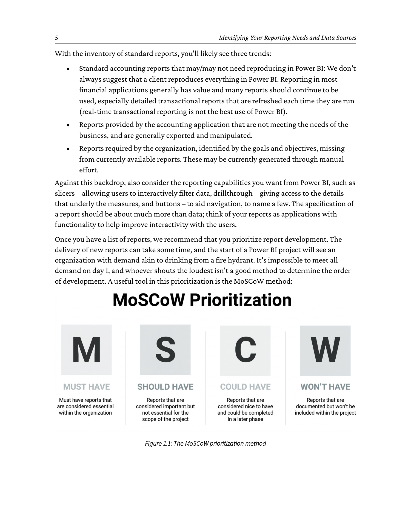
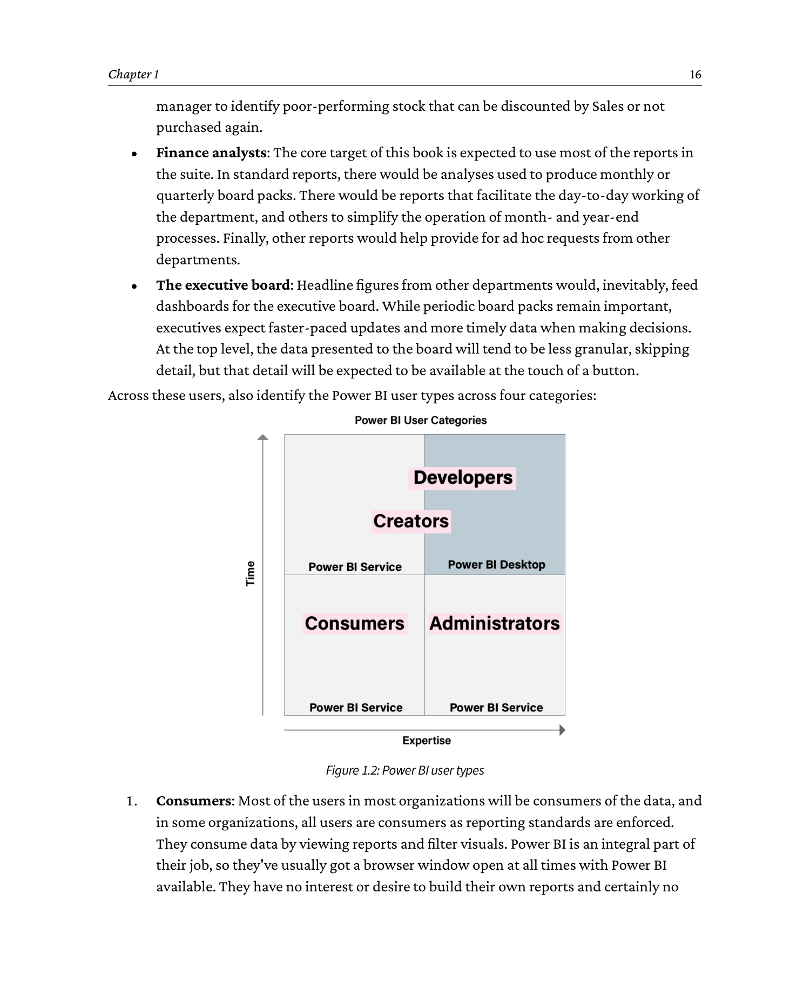

# Chapter 1: Identifying Your Reporting Needs and Data Sources

**Source: *Financial Modeling and Reporting with Microsoft Power BI* (Packt Publishing, 2026)**

DOI: 10.0000/PACKT_FMRWPB_2026  |  GitHub: https://github.com/PacktPublishing/Financial-Modeling-with-Power-BI_Packt/tree/main/Chapter1

_Page range: 30 - 53_

---

The landscape of financial reporting is undergoing a rapid transformation, fueled by modern analytics tools such as Power BI. The reason for the shift is due to both the adoption of new technology and the embracing of smarter ways of using data. As organizations move from static, two-dimensional reporting to interactive advanced analytics, knowing how to manage the transition is crucial for success.

In this chapter, you'll learn how to structure a Power BI project from the ground up, ensuring smooth implementation. We'll also cover the importance of understanding your audience, identifying key stakeholders for your reports and insights, and how to identify the data sources that power your analytics models. Finally, we'll discuss best practices for enabling self-service analytics, empowering your team to make informed decisions independently.

By the end of this chapter, you will have learned about the following topics:

- Structuring a comprehensive project scoping document for successful implementation
- Segmenting your audience to deliver the right data to the right people
- Identifying and assessing the data sources that underpin your Power BI models
- Exploring strategies to enable effective self-service analytics across your organization

The starting point should be a proper project scoping exercise where a process is followed to set the organization up for a successful implementation. We cover that next.

> **Note: Your purchase includes a free PDF copy + exclusive extras**
>
> Your purchase includes a DRM-free PDF copy of this book, 7-day trial to the Packt+ library (no credit card required), and additional exclusive extras. See the *Free benefits with your book* section in the Preface to unlock them instantly and maximize your learning.

---

## 1.1 Setting project scope

Setting project scope is fundamental to the success of any project; a Power BI implementation is no different. A project's scope is far bigger than the list of reports you want to produce; it defines every aspect of the project. A good project scope should set a budget, a timeframe, and resources, and then be communicated to and agreed upon by the project team. Once signed off, the project scope should be the operating manual for the project. Yes, it'll more than likely change as the project progresses, and scope change needs to be part of the project scope.

To put this in context, let's look at a common path of Power BI adoption to understand why project scope is important.

The start of many Power BI projects is a curious employee with a business problem, data, and a free Power BI Desktop download. There's a particular report that needs to be produced, or the individual wants to impress their manager. Fast-forward via ad hoc online learning, some attractive interactive visuals, and an excited data-oriented executive, and interest is sparked in an organization. Power BI is the *thing* to use, and one curious employee will become many curious employees as they dip their toes into the water of this new and exciting tool. Many Power BI fires will be lit around the organization, and PBIX files will be frequently emailed around it.

This is a common form of adoption. Everyone is excited and wants to be on board. Many people are using Power BI, albeit in a self-learned and uncoordinated manner.

Then, reports start to show cracks, there are issues with incorrect data, and no one is certain about which Power BI file (PBIX) in their inbox is current. Confidence starts to wane, and Power BI falls into limited use. To be safe, many users return to their tried and trusted best friend, Excel.

There are common elements to this form of technical adoption that cause issues:

- Untrained/self-trained employees using a complex product and introducing errors.
- A lack of understanding of how to deploy Power BI via the Power BI Service, treating it like any other file-based application. Therefore, reporting is distributed via email or OneDrive/SharePoint/file shares.
- No version control garners uncertainty about which file to use. The organization has many versions, many of which are, generally imperceptibly, slightly different from each other.

In some organizations, the Power BI project may be saved by an experienced member of the IT team who has been here before, recognizes the signs, and realizes that a properly formed project will save the day. There's nothing wrong with the technology and its capability to meet once-heady expectations. If the organization follows the basics of IT project management, the technology will deliver.

In other cases, cognitive dissonance sets in as people within the organization wrestle with the contradiction that the tool that promised so much is not delivering on once-elevated expectations.

It won't surprise you that we don't recommend the approach outlined, as we often work with organizations that have been through a variant of the aforementioned situation. That said, it sometimes takes a curious employee to introduce new thinking into some organizations, so we can't pretend to be completely opposed. In reality, the reasons that drove the organization to Power BI are all completely valid; the technology is capable of everything first envisaged, and in most cases, much more.

As mentioned in the previous section, Power BI involves a mix of disciplines and processes, and the start of any well-executed project is proper scoping. Even if the genesis of the project is the curious employee, it's important for the organization to take control of the implementation and adoption process.

Proper scoping follows a process to understand and structure the reporting requirements within the finance function. Power BI projects are inherently complex with multiple moving parts, and a project scope is far more than a list of required reports. It's an articulation of all aspects of the project that should inform anyone new to the project about the requirements, purpose, and process to deliver success, including a definition of what success looks like.

There's an abundance of material available on IT project scoping that we don't want to repeat here, as the length of the book will quickly grow, but we wanted to document a concise scoping process that's focused on a successful Power BI project within a finance function.

We urge all organizations to have some level of education on Power BI to understand its capabilities. Power BI, like all products, has strengths and weaknesses, so it's useful to understand the product, its features, and what best practice use looks like in a few similar organizations. This will set the tone for the project scoping and stop requests for capabilities outside of Power BI's functionality.

This can be completed in a half-day workshop with a consultant expert in Power BI who has relevant expertise and the ability to explain the concepts to a lay audience.

After an education session, here's a simple checklist you can work through to scope your Power BI project.

### 1.1.1 Setting clear goals and objectives

You should agree, in simple terms, on the purpose of the project, with some clear goals and objectives. This is more specific than *Implement Power BI in Finance*, although that could be an overall name for the project. Your goals will be broad intentions, and your objectives should be specific and measurable. It's common to link goals and objectives, so there's a clear correlation between the broad intention of the goal and the specifics of the objective. Here are some examples:

**Goal: Enhance financial reporting efficiency**

Objectives:

- Within 6 months, all standard finance reports will be capable of being run daily without the need for human intervention.
- Create Power BI dashboards that cover key financial metrics such as revenue, expenses, and profit margins within the next six months.

**Goal: Improve stakeholder satisfaction with the quality of financial reporting**

Objectives:

- 80% satisfaction rating from report stakeholders based on a standard qualitative and quantitative survey to be run every 3 months.
- Scores less than 80% to be investigated with corrective plans implemented to maintain an over 80% score.

A half-to-one-day workshop with the project team's core members is a great way to brainstorm through goals. We recommend an experienced facilitator who can guide the team through the process, avoiding the inevitable rabbit-holes that are often entered during the discussions and consume valuable hours. It's important to get the goals and objectives written and circulated quickly for agreement.

Goals and objectives should be easily understood, using clear and concise language that is common parlance for the culture of the organization.

### 1.1.2 Detailed scoping - list of reports to create

Part of the evaluation is an inventory of the reports you currently have in place and why they're not providing the insights you need. This will help identify the gaps in functionality and what needs to be developed. You'll likely see common themes with the gaps, such as a lack of flexibility, missing information, and having to export to Excel to provide the detail required by the organization.

With the inventory of standard reports, you'll likely see three trends:

- **Standard accounting reports** that may/may not need reproducing in Power BI: We don't always suggest that a client reproduces everything in Power BI. Reporting in most financial applications generally has value and many reports should continue to be used, especially detailed transactional reports that are refreshed each time they are run (real-time transactional reporting is not the best use of Power BI).
- **Reports provided by the accounting application** that are not meeting the needs of the business, and are generally exported and manipulated.
- **Reports required by the organization**, identified by the goals and objectives, missing from currently available reports. These may be currently generated through manual effort.

Against this backdrop, also consider the reporting capabilities you want from Power BI, such as slicers - allowing users to interactively filter data, drillthrough - giving access to the details that underly the measures, and buttons - to aid navigation, to name a few. The specification of a report should be about much more than data; think of your reports as applications with functionality to help improve interactivity with the users.

Once you have a list of reports, we recommend that you prioritize report development. The delivery of new reports can take some time, and the start of a Power BI project will see an organization with demand akin to drinking from a fire hydrant. It's impossible to meet all demand on day 1, and whoever shouts the loudest isn't a good method to determine the order of development. A useful tool in this prioritization is the MoSCoW method:



```
   The MoSCoW prioritization method - 4 priority buckets

   +====================+  +====================+  +====================+  +====================+
   |      Must have     |  |    Should have     |  |     Could have     |  |  Won't have (now)  |
   |--------------------|  |--------------------|  |--------------------|  |--------------------|
   | Non-negotiable for |  | Important - adds    |  | Desirable but not  |  | Postponed or out   |
   | the project goals. |  | significant value. |  | necessary. Build   |  | of scope for this  |
   |                    |  | Plan for phase 2.  |  | only if time and   |  | release. May be    |
   |                    |  |                    |  | resources permit.  |  | revisited later.   |
   +====================+  +====================+  +====================+  +====================+
             ^                       ^                       ^                       ^
             |  Critical path        |  High value           |  Nice-to-have         |  Out of scope
             |  Deliver first        |  After must-haves     |  After should-haves  |  Document for later

   Reading the acronym:
     M  =  Must have       (critical, ships first)
     S  =  Should have     (important, plan for phase 2)
     Co =  Could have      (desirable, build if time allows)
     W  =  Won't have      (out of this release, captured for future)

   Typical MoSCoW split:  Must 60%  |  Should 20%  |  Could 15%  |  Won't 5%
```


The MoSCoW method is a commonly used technique to prioritize requirements or tasks in project management and software development. It also works well for Power BI during the scoping phase. It helps stakeholders understand the importance and urgency of each item to ensure that the most critical tasks are completed first. The acronym MoSCoW stands for the following:

**1. Must have:**

   These are the most critical reports that are non-negotiable to deliver the goals and objectives set in the previous exercise. These may not be the reports that form statutory reporting or deliver basic accounting processes, such as trial balance, as these may come from your accounting application, and you may choose to maintain them there.

**2. Should have:**

   These are important reports that will add significant value but may not meet the project's goals. These reports can be assigned to phase 2 of the project, after the must-have reports have been delivered.

**3. Could have:**

   These are desirable but not necessary reports. They are considered nice-to-haves and can be included if time and resources permit or possibly pushed back to a long-term maintenance project.

**4. Won't have (this time):**

   These are reports that have been agreed to be postponed or left out of the project's scope. They are worth capturing as they may be considered for future releases or projects.

MoSCoW sessions are often run as brainstorms where the project team lists everything, then categorizes the results of the brainstorm into the four buckets. This isn't always easy, especially for should-have and could-have reports, as the differences between them may cause disagreement.

When working on Power BI implementations, we generally work to a 90/10 rule. 90% of our time is spent building data models, and 10% of our time is spent on the reports and visualizations our users interact with daily. That sometimes seems strange when we first introduce the concept to our customers. Why is so little time spent on the part users interact with daily? The reason is simple: when we get the data model structure and measures correct, and we know the list of reports required, the visuals are relatively easy. That's why the report list prepared in this section is so important. It means we know what the data model(s) need to contain to support the required reports.

It's worth consulting with your Power BI developers once the MoSCoW prioritization has been completed, as some should-have or could-have reports may be derivatives of the must-have reports and could be easily accommodated because of the work scheduled to deliver them.

Developers are especially prone to the negative effects of task switching, and an extra hour to build measures for a should-have report while engaged on the model can easily turn into 2-3 hours if asked to break the workflow for a few weeks or months. We appreciate that this may contradict some of our advice for prioritization, as you could end up delivering a could-have report before a should-have, but you may choose to be practical and cost-effective with resources.

### 1.1.3 Report standards

As Power BI allows users to be creative with report design, we advise that standards are set for all reports at an early stage, so reports have a common user interface. A Power BI project shouldn't be an opportunity for the free artistic expression of each report developer. It's a business project, not an art class. Standards make it easier for users to work with the reports as they'll conform to a common look and feel. Users will understand new reports, and new employees will be able to quickly learn corporate standards. We advise that you consider the following:

- **Layout of your reports:** Adopt a consistent layout with user interface elements. To some extent, Power BI reports should be considered similar to apps, as there are capabilities that provide functionality such as filtering and drillthrough. It's important to use these consistently so users know what to look for and where in the report. The layout of a report should not be governed by the person who built the report, as you'll end up with a myriad of different report styles that'll confuse your users.
- **Color scheme and branding:** Our general advice is to use corporate branding color schemes for your reporting. Assign colors to user interface elements so they are consistent and easy to recognize by your users.
- **Naming conventions:** Names should be obvious and descriptive for the end user.

We've seen many examples where one organization's Power BI reports have very different styles that detract from usability. It's common for many Power BI report developers to work on one project, and we recommend a review of correct processes on all reports, so they meet the standards described previously.

### 1.1.4 Security and access

Plan which users or roles need access to which reports. Understand the sensitivity of your data and who should see what data. You have granularity of access to reports and data with Power BI, with two main security methods:

- **Workspaces and apps** where reports reside in folders and users are granted access to the folders. To clarify, reports are saved to workspaces, then published to apps.
- **Row-level security**, where data is filtered according to the user. All users see the same report, but different data. We often deploy this where organizations are broken down into operating companies or subsidiaries, and each subsidiary has its own finance manager who needs to see the company they are responsible for. Row-level security allows you to deploy a single report where each finance manager just sees the organizations they are responsible for. This topic is covered in more detail in *Chapter 13, Evolving and Maintaining Your Report*.

Workspaces/apps and row-level security work together. Therefore, a report will reside in a workspace/app, and users are granted access to the workspace/app. Furthermore, the users may be subject to row-level security that governs the data they view in the workspace/app. It's important to note that row-level security is optional; workspaces are not.

To make user management easier, you can use Microsoft 365 security groups, so you add the security group to the workspace, and the users that belong to the security group will be added. As users are added to and removed from security groups, they will gain and lose access to the workspaces.

### 1.1.5 Data sources

It's important to list your potential data sources for the project with organizational owners included as project stakeholders (discussed later, in the *Identifying your data sources* section). Understand what access you need from which system and communicate with the system owners to set expectations about the need to access the data and to understand considerations of accessing the data. To provide an example, some organizations use the payroll capabilities of their ERP application. Payroll records are treated with the highest confidentiality by most organizations, for obvious reasons. So, if the project team needs to access the database tables for finance, should they be able to see payroll data? If the answer is no, user access roles will be required for the team to see finance tables, but not payroll tables.

Another important consideration with data sources is the effect of data refresh on the source application. If the application is hosted on-premise or in a data center with fixed compute resources, Power BI refreshes at scale may degrade application responsiveness to core users. You may want to consider a data warehouse architecture where necessary tables are copied to a separate server overnight or when a few users are using the application, so performance issues are not an issue.

The other major consideration that would drive a Power BI project is the need to consolidate data from multiple different systems; for example, if there is a need to report across a group of companies that use different financial recording systems. In this case, the *standard* reports are effectively negated anyway. While a trial balance is broadly the same across all applications, the specifics of the format will be different, and even the calendars and chart of accounts may vary. In these cases, a further piece of work needs to be considered in the project scoping: how to map between these different datasets. This will be covered in more detail in the chapters looking at how to implement a model, but this is an area that will need engagement from the appropriate subject matter experts within the business.

### 1.1.6 Stakeholder identification and engagement

Your stakeholders are people involved and impacted by the project. We've provided the following list of some common stakeholders that we see in the projects we serve. The list is role-based, so one individual could fill multiple roles, and we recommend that all roles are considered, even if you initially feel that not all roles are relevant. For example, if you don't have a data security function within your organization, this should be a good reason to assign someone to understand the risk of data leakage and methods to mitigate the risks.


- **Project sponsor:**
  - For Power BI and finance projects, usually the CFO, but it can also be the CEO.
  - Has the authority to approve budgets, changes, and key project decisions.
- **Project manager:**
  - Responsible for planning, executing, and closing the project.
  - Manages the project team, resources, schedule, and scope.
- **Project team:**
  - Includes all the individuals working to deliver the reports for the project, ensuring they're in line with the standards set in the project scope.
  - The project team can include data architects, report developers, and end users, led by the project manager.
- **IT department:**
  - Many of the Power BI finance projects we work on are led by the finance function, with the IT department as an important stakeholder.
  - Provides technical expertise, support, and provisioning of the technical and licensing infrastructure.
- **End users and data owners:**
  - The individuals or groups who will use the final reports.
  - Provide valuable feedback on functionality, speed, design, and usability.
- **Stakeholders from other departments:**
  - Representatives from departments that will be affected by the project, such as marketing, finance, HR, or operations.
  - They provide input on requirements and ensure the reporting outputs align with departmental needs.
- **Security team:**
  - Ensures that the project adheres to security policies and best practices.
  - Identifies potential security risks and implements measures to mitigate them.

It's important to set expectations with stakeholders of their role(s) and purpose early in the project. We also recommend that stakeholders have time allocated to execute project tasks, such as testing reports, so the project isn't held back by stakeholders being *too busy*.

### 1.1.7 Risk management

Identify potential risks early and develop mitigation strategies. Include a risk management plan in the project scope. Common risks during a Power BI project are as follows:

- Resource availability with competing business priorities. Hearing that something hasn't been done because something else more important came up is common. You'll need a plan to avoid this from the start.
- The technical risk of getting information from diverse systems is frequently an issue. We recommend a proof of concept for all aspects to understand where issues are likely to arise.
- Scope creep (despite this exercise) is a factor with all projects and should be listed.

The risk management plan should be revisited on a frequent basis to monitor mitigation actions and record new risks as they arise, with their own mitigation plans. As with all the project documentation we describe, please consider them live documents that are updated as the project progresses.

### 1.1.8 Resource planning and time management

Identify the resources (human, financial, technical) required for the project. Ensure resource availability and allocation are planned and signed off. One of the most common challenges for a Power BI project is resource availability, as we've mentioned previously.

Develop a project timeline with realistic deadlines. We generally deliver based on an agile methodology through project sprints where the work is divided into one- or two-week (generally two) sprints. At the end of each sprint, completed work is reviewed, and the project is course-corrected for the next sprint as lessons are learned. The benefit of this method is quick and frequent delivery of reports and report updates. For most finance organizations, a pure agile methodology is not required, and we recommend a mix of project planning methods to help set expectations for budget and timeframes.

Using a hybrid methodology, you'll plan the overall delivery timeframe and phases using a waterfall methodology. This will help you understand the overall timeframes of the project and allow you to plan when resources will be required for certain phases. Testing and training are good examples where you'll need certain people within the organization to plan time to be available.

In execution, you can get the best of the Agile methodology through sprints by having daily standups, feedback through retrospective meetings, and incremental releases that keep the desire for continual delivery satiated.

> **Note: Agile versus waterfall methodology, and sprints**
>
> Waterfall methodologies are generally the more *traditional* project methodologies - in a waterfall methodology, all aspects of the project are built, tested, and then released to the users all in one go.
>
> Agile methodologies, by contrast, break the work up into smaller parcels that can be released piece by piece over a period of time. Using such methods, it is possible to release elements of a project much earlier and start gaining a return on investment much sooner.
>
> Sprints are the basic unit of work that an agile project is broken into. Typically, they consist of 2-week periods at the end of which there is normally a release of the work done within that sprint.

### 1.1.9 Change control process

Establish a change control process to handle scope changes. Your scope will change throughout your project, and this should be expected and managed. We've seen too many instances of users directly asking developers for changes without consideration of how the change affects the overall scope or conflicts with other requirements. Change requests need to be submitted to the project team and signed off on a frequent basis to allow developers to maintain their workflow.

Change control should include the following as a minimum:

- A request form completed to log the change request. This can be a Power App, a SharePoint list, or a DevOps or Jira case.
- A method of dealing with change requests. This can be an individual or a change control board that meets frequently to discuss and accept/decline change requests.
- Adding the accepted change request to the schedule of work or sprints to assess the impact on the project.
- The incorporation of agreed changes into the test plan.

Remember that all changes have an impact on the timeframe and cost of the project. These can be positive and negative, as change sometimes means cutting functionality that isn't required.

### 1.1.10 Test plan

Testing is an essential part of a Power BI project to help you deliver quality reports, so we've devoted *Chapter 10, Testing and Fine-Tuning Your Data*, to this subject. This section briefly describes how to incorporate testing into your project scope.

Testing has two interesting distinctions in Power BI projects. The first is that most users think it's optional, and the second is that most users expect the developers to deliver perfect, accurate reports.

Here's some friendly advice, italicized for dramatic impact:

> *Testing your reports is a business task. Do not expect your developers to do it.*

For the purposes of the scoping document, each report needs to have at least one tester assigned to the report who will sign it off as being correct. If it's not correct, they will work with the developer until the report is correct. You'll need definitions of what is being tested and signed off on, with functional aspects:

- Accuracy of data
- Working slicers
- Speed

There are also non-functional aspects:

- Adherence to design guidelines
- Correct use of color
- Neatness of layout
- Accessibility

We recommend building a checklist that can be used as a guide for the testers to check off as they test and record any issues.

### 1.1.11 Training plan

As Power BI has capabilities that most people in your organization won't have experienced, comprehensive training is essential for users to understand the new tool and to get the best from it.

In our training, we seek to conceptualize how Power BI is different from standard application reports in terms of functionality and how you can interact with data. We also train users on the flexibility of Power BI and how measures can easily be added to help understand and analyze data. If users are exporting Power BI data to Excel, you have a training problem.

For the purposes of the project scope, the training plan should identify the purpose of the training, who will deliver it, and the users who will be trained. We segment users, described in the section - *Who needs to use your reports?*

Think about users in two ways:

- Where they sit functionally in the organization. Finance is obvious, but you'll also have many users of financial reports outside of the finance function, such as operations, management, or purchasing.
- Their skill level or desired skill level with Power BI. The majority of your users will be consumers of the Power BI data. Some will want to create reports based on validated data models, and a subset may even have the skills to become developers. All these groups will need a different level of training.

The training plan needs to reflect your potential users in both functional and skill requirements. You'll also need to plan to train users over time who join and move within your organization, so make sure you plan for repeatability of the material.

### 1.1.12 Communication plan

Develop a communications plan that articulates the who, what, frequency, and channel.

- **Who** will be your project team, project stakeholders, and the wider organization, as many people will interact with Power BI at some point, even if it's presented at a meeting?
- **What** is the purpose of communication? Projects generate lots of detailed information, so identification of different types of information is essential to decide who needs to see it. For example, users probably don't need to see how many change requests have been generated in a week, but will want to understand functional changes that will affect them.
- **What** is the frequency of communication? We recommend communicating at set times/days of the week or month so recipients of the communications know what to expect and when to expect it.

The communications channel is also important. We have many options within organizations, such as Teams and Slack, and most of them allow @mentions. People still use email, although we don't recommend spamming people with project updates, as they won't get read. Use whatever works in your organization so people can easily find the information when required.

Plan to be clear and concise with your communications and follow a standard format.

### 1.1.13 Documentation and sign-off

Document all aspects of the project scope and obtain sign-off from key stakeholders. This ensures alignment and commitment.

The project scope is a living document. As changes happen to the project, the scope needs to be updated to document the changes. We recommend storing the document somewhere that everyone required can see it, but only a few people can change it. Like any document that changes frequently, don't distribute it by email, as you'll encounter versioning issues with many people working on outdated versions on their hard drives or email inboxes.

Depending on the size and complexity of your project, you may choose to skip some of this list. Conversely, you may need to expand certain aspects to suit specific circumstances. Having to make some architectural changes, such as implementing a data warehouse, may necessitate a section on the implications of this architectural requirement. Whatever you choose to exclude, include, or expand upon, we strongly recommend a good scope as the guide for the rest of the project.

You may not need everything in the requirements of project scoping that we've described here, but we ask that you consider everything. Power BI projects are complex, with many moving parts. The purpose of a detailed project scope and plan is to help you navigate the occasional bump in the road, as they will occur. Thorough planning rarely has downsides, especially if there are issues and you can quickly deal with them. And if everything goes to plan, you just did your job well.

---

## 1.2 Who needs to use your reports?

While the focus of this book is the finance department, the data models produced will have information useful for many users across the organization. When built correctly, Power BI provides a single version of the truth, and its flexible reporting capabilities allow for reports that suit many users in their own visual style and language. Departments outside of Finance can therefore have reports to suit their own needs, using different visuals or layouts. If language and measures are used consistently, it's a powerful capability. Put another way, if you use the term *Net Sales* against a measure, then always use that term for that measure. Conversely, ensure measures across multiple models called *Net Sales* are calculated using an identical formula so they produce consistent results.

A common example is building data models that link transactions in the sales ledger to the salesperson responsible for the customer or territory that originated the sale. The finance department may not need this level of detail or data linkage, but the sales department certainly will. Based on the 90/10 rule discussed earlier, it's not a huge amount of work when building data models to accommodate the other departments.

We mentioned the identification of stakeholders in the previous section as an important part of your project scoping exercise. For the purpose of who needs to use your reports, we think of these stakeholders in two ways:

- Users from other departments could benefit from the reporting, especially when repurposed for their specific needs.
- Users across the organization with specific skillsets may need or want to take advantage of Power BI's self-service capabilities. We discuss the concept of self-service in more detail in the next section, but we will introduce the concept of user types here.

Starting with departmental users, here are some common examples where financial data can benefit:

- **Sales:** The most obvious department that would have a use for financial reporting would be sales. For example, analysis of revenue data will provide key insights into sales KPIs. This is especially true if this data can be linked to information about the customers sold to and the products sold. Typically, Sales will be interested in trends and the relationship between revenue KPIs and product and customer information. This will need consideration of how the data model can support drill-through to lower levels of data and provide interactive visuals. Other finance measures, such as margins and aged debt, will also be useful to the sales team.
- **Purchasing:** The purchasing department will be interested in understanding the spend by category and vendor, minimizing the costs, and increasing the stock turnover. They will, therefore, in addition to Cost of Goods Sold (COGS) measures, be interested in analyses of the best performing products - in this requirement, there is an overlap with the Sales department.
- **Stock control:** One of the core interests of stock control in financial reporting is to reduce poorly performing inventory. Here, the need is to see the stock turn measure, and how that is improving - or not - over time. This would allow a stock control manager to identify poor-performing stock that can be discounted by Sales or not purchased again.
- **Finance analysts:** The core target of this book is expected to use most of the reports in the suite. In standard reports, there would be analyses used to produce monthly or quarterly board packs. There would be reports that facilitate the day-to-day working of the department, and others to simplify the operation of month- and year-end processes. Finally, other reports would help provide for ad hoc requests from other departments.
- **The executive board:** Headline figures from other departments would, inevitably, feed dashboards for the executive board. While periodic board packs remain important, executives expect faster-paced updates and more timely data when making decisions. At the top level, the data presented to the board will tend to be less granular, skipping detail, but that detail will be expected to be available at the touch of a button.

Across these users, also identify the Power BI user types across four categories:



```
   Power BI user types - from most numerous to least

        +-------------------------------------------------------+
        |  CONSUMERS                                           |
        |  The largest group in most organizations              |
        |  View and filter pre-built reports                    |
        |  No interest in building reports or writing DAX      |
        +-------------------------------------------------------+
                                   ^
                                   |  smaller subset
                                   v
        +-------------------------------------------------------+
        |  CREATORS                                            |
        |  Consume existing reports AND want a blank canvas    |
        |  Build their own visuals and reports on data models   |
        |  Use Power BI service rather than Desktop (advised)  |
        +-------------------------------------------------------+
                                   ^
                                   |  even smaller group
                                   v
        +-------------------------------------------------------+
        |  DEVELOPERS                                          |
        |  Build and maintain models, measures, and reports     |
        |  Support end users and help train creators           |
        |  Best deployed alongside experienced consultants      |
        +-------------------------------------------------------+
                                   ^
                                   |  smallest group
                                   v
        +-------------------------------------------------------+
        |  ADMINISTRATORS                                      |
        |  Manage users, workspaces, and row-level security     |
        |  Check licensed employees and enable new features    |
        |  Monitor that reports are working correctly          |
        +-------------------------------------------------------+

   Typical organisation split (rough guideline):
        Consumers      60-80%   of users
        Creators       10-25%   of users
        Developers      5-10%   of users
        Administrators  1-3%    of users
```


### 1.2.1 Power BI user types

1. **Consumers:** Most of the users in most organizations will be consumers of the data, and in some organizations, all users are consumers as reporting standards are enforced. They consume data by viewing reports and filter visuals. Power BI is an integral part of their job, so they've usually got a browser window open at all times with Power BI available. They have no interest or desire to build their own reports and certainly no ambition to write a single line of Data Analysis eXtensions (DAX) - the main language used for calculations in Power BI. Most of your reporting is built for these users.

2. **Creators:** A smaller subset of users will be creators. These users will consume the reports already built and want a blank canvas to work with the data models to build their own visuals and reports. They have a curiosity to analyze data on their own terms and want to build their own visuals to see data according to their specific needs. Yes, they can work with a report developer to specify a report and have the developer build the report but there's something in the process of experimentation with the data that scratches an itch to create. Some of our clients have policies that Power BI reporting will only cater to consumers, as they want verified sign-off reports in the organization (creators generally don't develop reports in line with the reporting standards), and they'll often find creators downloading data to analyze in Excel. Creators may work on both the Power BI service and Power BI Desktop, although we always warn about the risks of many users working with Power BI Desktop due to file sharing and versioning. The Power BI service and Power BI Desktop have feature parity for building visuals and reports, so pushing creators to the Power BI service is advisable.

3. **Developers:** You may find some of your users have the desire or aptitude to become Power BI developers. We generally warn organizations of the risks of many untrained or unmanaged developers because that can introduce reporting anarchy, as described at the start of the book. But, for many organizations, a few employees who can be trained to support the ongoing management of Power BI models can be extremely cost-effective. Another valuable contribution of the developer can be to work with users to help train them or provide daily support when questions arise due to their understanding of the core workings of Power BI. However, you decide to use these users, they generally exist in most organizations and when deployed alongside experienced consultants, can provide a cost-effective and flexible support resource.

4. **Administrators:** As Power BI deployments have become more complex over time, the role of Administrator has become more important. The Administrator fulfills several functions within the organization. Generally, these are as follows:

   a. Deployment/removal of users to/from workspaces and row-level security filters if appropriate
   b. Checking licensed employees
   c. Enabling new features
   d. Checking reports are working correctly

In most cases, your users will change over time, alongside your usage of Power BI. Again, in most cases, that generally means more users alongside more functionality, so this is an area that's important to manage carefully.

The next step in identification that's just as important as your users is your data sources, which is the subject we cover next.

---

## 1.3 Identifying your data sources

One of the many benefits of Power BI is the ability to take data from many sources and present mashed-up data transparently to your users. The data may be from multiple sources, but it's woven to tell a coherent story, with your users blissfully unaware. Choosing and working with many data sources requires some thought and planning.

At its core, the data model will take data from the financial recording system - this could be a system aimed at the SME market, such as Xero or QuickBooks, or it could be a large enterprise-scale system such as Microsoft Dynamics, SAP, or Oracle.

It is also likely that in larger organizations, there will be more than one instance of the accounting or ERP system or multiple accounting and ERP systems. Even where only one system is in use, there may well be multiple legal entities with independent ledgers configured in use. As you can see, this world gets complex fast. Add separate financial planning and budgeting applications or spreadsheets, and you have many moving parts required to build your data models and reports.

Here's a list of considerations with your data sources:

- **What data do you need from the source?** Taking an example from the more complex end of the spectrum, a normal SAP enterprise implementation will have somewhere between 80,000 and 100,000 tables. Tables then have a varying number of columns, with complex tables (more than likely the ones you'll need) having hundreds of columns. Just to make life more complex, the table and field names are generally 5- or 6-character codes, taken from German. You certainly won't need all of those tables and fields, and in the case of SAP, it's well documented online, so finding the tables and key fields is not quite as daunting as the preceding description.
- **When you have your data, how do you need to filter it?** Financial applications generally store all transactions, even if you think they've been deleted or deactivated. In most cases, a *delete* is actually a soft *delete* where transactions remain, but users don't see them. However, when you connect Power BI to the data, you will see all of those *deleted* transactions, so you'll need to filter them out. Then you'll need to think about credit memos, debit memos, accruals, and reversals. They'll all be included within the data you've just downloaded, so if you simply SUM the Amount field, you'll not get the number you expected. Filtering is your friend.
- **Is there any data within the data source that's confidential, such as payroll?** In most cases, you'll need a profile set up for Power BI to access the data. Profiles give certain rights and privileges over what data can be viewed and whether data can be created, read, updated, or deleted (CRUD). Generally, users will just require read privileges, but you may need to also restrict data based on sensitivity or confidentiality.
- **Depending on the location of your data source**, you may need to consider the effects of Power BI demand on the server(s). If you have an on-premise production environment that's near capacity and users are complaining about response times from the application, Power BI will become another demand that could potentially cause further performance degradation. You therefore need to consider upgrading the server, a data warehouse, or being very specific about when data is refreshed. As so many accounting and ERP systems are cloud-hosted, these issues may not present a problem to most normal-sized businesses, but you'll still have to plan for them.

If you have concerns about any of the preceding, a Proof of Concept (POC) exercise is generally a good way to derisk your project with minimal impact on time and budget. In a POC, you'll quickly build an environment to service your Power BI needs based on 1 or 2 must-have reports, allowing you to test any specific unknowns. We regularly advise clients on the wisdom of a POC at the early stages of a project to identify any issues that could derail progress if uncovered at a later stage.

Returning to the specifics of your financial reporting, cases where there is consolidation across different ledgers, there will need to be, at a minimum, a mechanism to map between different charts of accounts and calendars. Even if the different entities currently use the same calendars and chart of accounts, it's always possible for them to diverge at some point in the future when changes are made to the finance application. While it's possible to address this when the issue arises, that would turn a relatively simple change in the finance system into a much more complex change that impacts the whole reporting estate. It's far better to address this from the outset. We will look at ways of doing this in the next chapter, but at the inception of the project, you should establish the following:

- The format of this dataset
- How the data will be stored
- Who will be responsible for maintaining it
- What the mechanism for maintaining it will be

Beyond the core financial system, the sources of data will depend a lot on the audiences identified for the reports. Here are some examples:

- Product information that would be useful to sales and purchasing
- Inventory information for the stock controllers
- Sales order information
- Purchase order data
- Budgets and forecasts

In this book, we concentrate on how inventory and budget information can be included in the financial data model, since these tend to be trickier to handle, but the general principle remains the same.

In larger organizations, it would be expected that inventory data would be brought in from the main ERP system, but equally, it would not be unusual for there to be additional warehouse management systems in play too. For SMEs, the more common pattern would be for there to be one or more warehouse management systems in use that reside separately from the financial management data. In these cases, there needs to be consideration of how this data is linked to the financial transactions taken from the financial management system. Consideration needs to be given to the following:

- How are stock movements posted to the general ledger?
- What is the mapping between inventory transactions and ledger accounts?
- What level of detail is needed (warehouse level, location level, etc.)?
- Does product information also get recorded in the general ledger?
- What is the inventory costing model?

Budgeting modules are frequently included in financial management packages - and almost always available in larger ERP systems. Those modules are, however, often not well used. It is frequently the case that budgets are managed on various spreadsheets, as this makes it easier for budget planners to try out different scenarios and see the effects of changes quickly, without complex import procedures or time-consuming data entry. We need to consider the following:

- Where is the budget being stored?
- How is that controlled?
- What is the update schedule?
- How is the quality of that data enforced?

We generally recommend that a list of data sources with access details be stored somewhere for updates and future reference. Your list of sources will expand and change over time, so keeping track is essential when personnel and technology change. Service accounts instead of user accounts will help maintain continuity and mitigate against the risk of personnel changes.

As you can see, identification and management of data sources is critically important for the success of your Power BI project. Users need accurate data delivered securely, and the organization has to make sure its interests are being protected through proper management of sensitive data. This management of data is especially important when considering and planning for employee self-service of data sources, which is becoming a growing trend.

---

## 1.4 Planning for self-service

Self-service business intelligence provides non-technical users with access to data and tools, allowing them to build their own reports and visuals, rather than relying on technical resources to build for them. In many ways, users have had a form of self-service business intelligence through exporting to Excel, with self-service becoming a method to formalize that approach through proper management of data and tools, avoiding the problems that have come with exporting to Excel.

There are varying shades of self-service reporting, as the meaning behind the term has become a gray area. At its heart, it's the concept that users of reports are not reliant on central delivery, but can access the data they need, when they need it. There are, however, different levels of reporting that can all be described as self-service.

At its most unstructured, nothing is provided centrally, and all reporting is left in the hands of the consumers of the reports. That means no datasets, no models, no calculations, and certainly no reports. The report consumers would be given access to the data and left to their own devices. Where the requirement is for ad hoc, one-off analyses, this can be useful, but it requires a group of highly skilled analysts and is a high-risk strategy since there would be no shared single source of truth. This form of self-service is therefore very rare, and almost always supplemented by a less extreme form. You may gather from the tone of our language that we certainly don't recommend this approach, as in many ways, many organizations have had this approach through exporting to Excel. The main downsides are as follows:

- Time taken for inexperienced users to build their own reports
- Risk of incorrect analysis and calculations caused by a lack of expertise
- Lack of definition of standard concepts in the organization, such as net sales
- Duplication of reports due to a lack of coordinated planning

Next would be a semi-structured model whereby datasets, models, and calculations are provided, and report consumers are left to create their own reports and augment the models. This has the advantage of allowing every report user to build the reports they need while maintaining trusted datasets. The downside, of course, is that there would be no consistent reporting format, which makes collaboration more difficult.

A structured or balanced approach to self-service allows for models, calculations, and many standard reports to be built with the tools to build new reports on validated datasets, given to trained users. Experience tells us that, in most organizations, most users have little interest in building their own reports and will generally gravitate towards a report that's been built by an experienced developer. There is generally a subset of users who have the desire and capability to build their own reports based on validated datasets. This changes from function to function and organization to organization, and we certainly see instances where there's a thirst for data and a desire to work with the data to experiment, build inferences, and draw conclusions. But the norm is pre-built reports for most people and self-service for a few.

Although not self-service, there is a model where all reports are provided centrally, and users don't have the capability to build their own reports. This is certainly a valid approach for certain organizations where data precision or security is paramount. It's certainly not self-service, although we include it for completeness.

So, is self-service for you? Some form is almost bound to be, few organizations want to manage a totally top-down approach where a department produces and distributes all reports. Those organizations that do so frequently find a proliferation of spreadsheets as users circumvent that restriction. At the very minimum, it is best practice to allow some form of self-service, and likely some sort of hybrid of the preceding.

Consider the following: the CEO wants to quickly check in on monthly revenues. They want to be able to do this each day and do not want to have to do much more than click a button to get there. For the CEO, all they really want is the most restrictive form of self-service: pre-built reports that can be run on demand. In the same organization, a management accountant may need a report that contains data from the trial balance but is focused on a restricted time period and for only a limited number of account codes. They may wish to use an existing data model to create a bespoke report to meet that need. Finally, a financial analyst may be asked to produce a custom report that is not met by any existing modeling. They will need access to the data sources so they can produce that report from the ground up. So here, for three different audiences, we have three different self-service models, all within the same organization.

There is also a significant downside of self-service (and any form of *citizen* developer, data scientist, or analyst): it takes people away from their day job to go and create reports (or apps, etc.). In planning for self-service, it is important to consider how much time an individual is expected to spend self-serving, where that time could be spent on their day job, and balance that against the value they can get from some level of self-service as opposed to waiting on a central IT department producing a report for them.

Once again, how to do this will come down to the different audiences and skillset in the organization:

- How much time do you want an individual to spend creating a report?
- Will this distract from the job they are actually employed to do?
- Could a greater degree of autonomy make them more effective?
- Is there a risk that greater autonomy could undermine trust in data?
- Does the individual have the skills to self-serve?

Self-service reporting will, at least for the foreseeable future, be a part of all corporate reporting solutions. As such, it needs to be considered as part of a Power BI project from the very beginning. From the start of implementation, we need to develop with consideration of the following:

- Who will use self-service?
- What skills do they have?
- How will they self-serve?
- Tailor the data model accordingly.

---

## 1.5 Summary

In this chapter, we discussed the key factors that contribute to the success of a Power BI project. In particular, we explored how to define the project scope and the factors that influence the specific reports to be built. We also covered the importance of planning effective resource allocation, implementing a proper test plan, and ensuring adequate training and communication for report users.

In the chapters that follow, we get into the details of how you'll build your Power BI reports and how you engage with your users and roll out to the organization. Success in a Power BI project is much more than clean DAX and the fastest-loading reports. It's about engaging and working with your organization to cater to their needs, and taking them on a journey about how Power BI can transform your organization.

---

_Generated by `convert_chapter1.py` + `build_chapter1_md.py` on 2026-06-16._
