# Chapter 2: The Basic Model for Financial Reporting

**Source: *Financial Modeling and Reporting with Microsoft Power BI* (Packt Publishing, 2026)**

DOI: 10.0000/PACKT_FMRWPB_2026  |  GitHub: https://github.com/PacktPublishing/Financial-Modeling-with-Power-BI_Packt/tree/main/Chapter2

_Page range: 54 - 83_

---

In the previous chapter, we described how to plan your Power BI project. Adoption of Power BI is high across organizations as its popularity has become almost viral. Proper project management disciplines are required to successfully implement the product and use it to its full potential. A project scope alongside an understanding of your user base and data sources will prepare your organization for the long term when considering self-service business intelligence and AI.

In this chapter, we start to look at the data model, or *semantic model* in Power BI terminology. Your semantic model defines how data is composed, its relationships, and how you can present it in Power BI. The art of data modeling is a critical skill when working with Power BI, and we'll discuss some best practices related to modeling data for financial reporting.

When using Power BI, a well-structured semantic model is critical to the accuracy and speed of your reporting. Most of the work for any set of reports is based on shaping, filtering, calculating, and cleaning the data that supports the visualizations your users interact with. We generally work to a 90/10 rule when working with Power BI, which means 90% of our time is data modeling and 10% building visuals. So, if you thought Power BI is all about building eye-catching visuals for corporate reporting and presentations, then, of course, you're right. How you allocate your time to get there is the important part.

By the end of the chapter, you will understand the following:

- How to create the core data entities, such as transactions and the chart of accounts, in the Power BI data model
- How to create relationships between the core entities
- The different approaches to modeling data across multiple companies or legal entities
- The considerations needed when working across multiple currencies, and the pitfalls that can come with calculating foreign exchange in the reporting model

Let's start with creating the core entities.

---

## 2.1 Creating the core entities

When working with financial reporting, the basic structure consists of three elements or entities, which are the calendar, transactions, and chart of accounts. In this chapter, we describe all three and what you need to consider when working with your own financial data.

At the end of this section, we start to look at our accompanying working example, so you have a model that you can use to help your own financial modeling.

### 2.1.1 Getting familiar with common terminology

Before we dive into how to create your core entities, there are some key terms we need to explain first to help you understand how to structure your data properly, as follows:

- Database
- Table
- Entity
- Relationships
- Facts and dimensions
- Schema

Let's take a detailed look at each of these.

#### 2.1.1.1 Database

The data for your financial application will be held in a database, which is the digital storage and management of your data, allowing new data to be written and existing data to be stored and manipulated. You may have interacted with Microsoft Access as a database or even used a SharePoint list, which is a basic form of a database. Databases have many features that provide peace of mind for the storage and safeguarding of your data, which are outside the scope of this book. One important database structural element is a table, which we explain next.

#### 2.1.1.2 Table

A database is comprised of many tables that store data. A table provides a structure for a specific record, which will be composed of rows and columns. Each row is a specific record (e.g., a Sales Order line) and each column will represent a different variable or attribute, such as date, quantity, price, and customer. A database has many tables to break down the information stored for efficiency. Therefore, the sales order will generally have a Sales Order header and Sales Order line items as separate tables. The Sales Order header will contain a customer ID, so the Sales Order line items don't have to; they just have a link to the Sales Order header record. In turn, the Sales Order header won't have all the details of the customer, such as ship-to and bill-to addresses, as that'll be stored in the Customer table. Your Sales Order lines may only include a product ID, because that will link to the Product table.

This is in the name of efficiency, so records are only stored once. When dealing with millions of records and finite computing power, efficiency matters.

You'll notice that we referred to a Product table in the singular, then both the Sales Order Header table and the Sales Order Item table as a combination that makes up the overall concept of a sales order. In database terms, we refer to both Product and Sales Order as entities, which is the concept we'll tackle next.

#### 2.1.1.3 Entity

An entity represents a real-world object or concept. Therefore, customers and products are entities, and in the context of this chapter, the calendar, general ledger, and chart of accounts are also entities. Within your database, many tables will be entities, such as your Customer table, but there will also be tables that aren't entities. Customer Order is a common table used in financial applications to store the relationship between a customer and a product that's been ordered. It defines a relationship between entities but isn't an entity in itself. This is highlighted in *Figure 2.1*, where we depict how a single table can be an entity in the case of the Product table; however, in the case of the Sales Order and Sales Order Line tables, both are required to become a single entity.

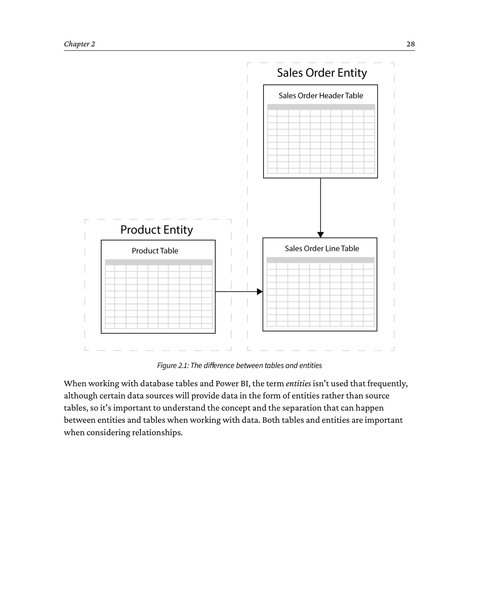

```
   The difference between tables and entities

   Single table  =  single entity  (simple case)
   +-------------------------------------+
   | Product  (ProductID, Name, Price)    |  <-- 1 table, 1 entity
   +-------------------------------------+

   Multiple tables  =  single entity  (composite case)
   +----------------------+      +----------------------+
   | Sales Order Header   |      | Sales Order Line     |
   | (OrderID,            |  +   | (LineID,             |
   |  CustomerID,         |      |   OrderID  --> ,     |
   |  OrderDate)          |      |   ProductID,         |
   +----------------------+      |   Quantity,          |
                                  |   UnitPrice)         |
                                  +----------------------+
                       =
                  ONE Sales Order entity
                  (a header is meaningless without its lines)
```


When working with database tables and Power BI, the term *entities* isn't used that frequently, although certain data sources will provide data in the form of entities rather than source tables, so it's important to understand the concept and the separation that can happen between entities and tables when working with data. Both tables and entities are important when considering relationships.

#### 2.1.1.4 Relationships

We connect the tables from our database according to related entities to form relationships between the tables. In some regards, relationships work a little like VLOOKUP in Excel, only more powerful since a relationship can be defined once and then reused in different ways across a whole Power BI file. This is important for the efficiency of our data processing, as we tell the database how the tables relate to each other. Relationships should be based on unique identifiers (IDs), or in database terms, primary keys. For example, each product will have an ID that is unique. When specifying a product in a Sales Order line, the row for the Sales Order line will use the product ID, not the name or any other characteristic. Within the Product table, the IDs will be unique for each product, and each product will only exist once within the table. However, on the Sales Order Line table, we may sell the same product many times to the same or different customers, so one product may exist many times. When we join the Product table to the Sales Order Line table, we connect the product IDs, and this becomes a one-to-many (from the Product table to the Sales Order Line table) relationship. In Power BI, relationships can be the following:

- One-to-one
- One-to-many
- Many-to-many

One-to-one is unusual, as it could be argued that a one-to-one relationship should actually be a single table. One-to-many is the norm, and many-to-many should be avoided. There are multiple reasons why many-to-many should be avoided; the main reasons are performance and data integrity. When we see many-to-many relationships, there are frequently records on either table that don't exist in the other table. When you attempt to filter your data between your tables in calculations, you can't be certain the filter will work as intended, potentially leading to incorrect results. In instances where you see a many-to-many relationship, a bridging table is recommended. A bridging table is a single table that contains the unique IDs from the two tables involved in the many-to-many relationship. Each of the original tables can then be related to the bridging table via a one-to-many relationship. In this way, you can remove the explicit many-to-many relationship, improving the readability and performance of the overall data model.

Now that we have entities and relationships, we start to define our data in terms of facts and dimensions.

#### 2.1.1.5 Facts and dimensions

In the data analytics world, we have two key concepts when describing our data: facts and dimensions. When explaining how to create the core entities you'll need for your financial reporting, the concepts of facts and dimensions will be critical to understand how to properly structure your data.

In your finance application, you'll have transactions such as sales orders, purchase orders, and journals. To take the sales order, you'll sell X amount of a product at price Y to a customer with a fulfillment date. The sales order is initially a method to log and manage the transaction, then it becomes a long-term record of the event for your financial reporting to show what was sold and when. When aggregated, your sales orders allow you to understand and account for revenue to the business.

In data analytics terms, *facts* are transactions, such as sales orders. They're specific events and can be quantified. To take a sales order (and to be reasonably generic), it'll have a product or service, a quantity, a price, and dates for fulfillment. The product, customer, and date components of the sales order are all *dimensions* and provide context to the facts of the sales order; they provide the descriptive framework in which the data resides. Dimensions have several characteristics in that they describe and categorize the facts. Typically, dimensions are relatively short tables (few rows) but often wide (many columns). Conversely, facts tend to be longer but narrower. They can also provide a hierarchy, such as date (think year, quarter, month, and day). In *Figure 2.2*, we show how fact and dimension tables can connect to each other using one-to-many relationships. Between the Sales Order Header and Sales Order Lines tables, we're connecting the Customer, Product, and Date dimension tables to the Sales Order Line/Header fact tables.

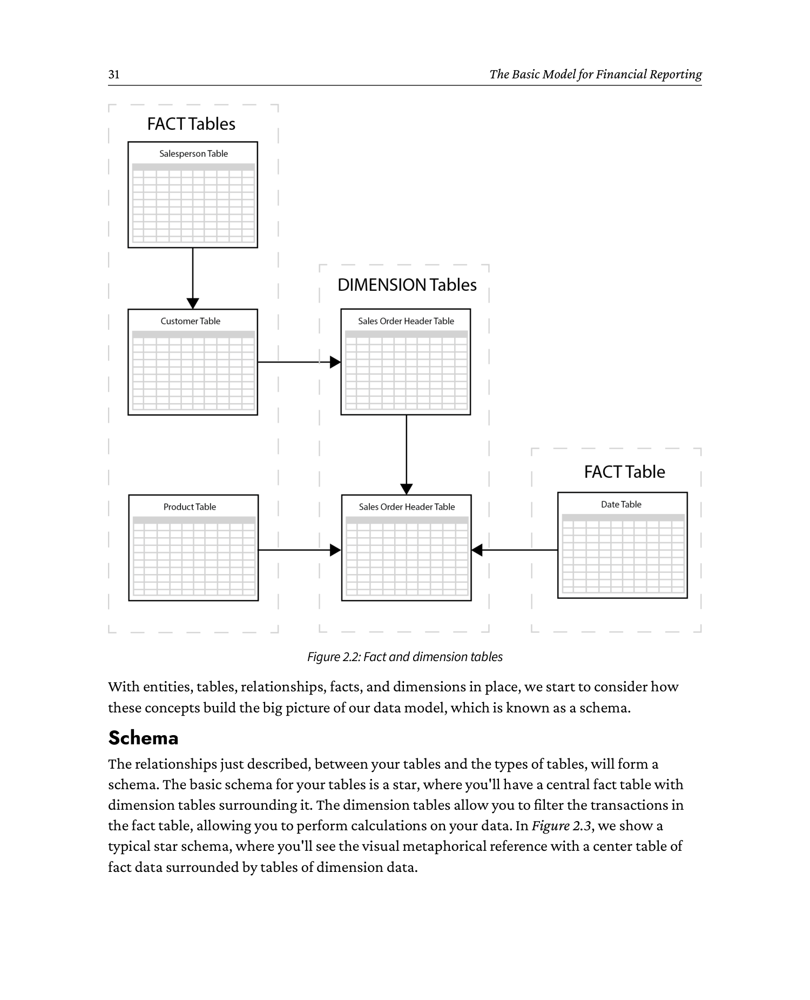

```
   Fact and dimension tables

      +-----------+      +-----------+      +-----------+
      | Customer  |      | Product   |      | Calendar  |
      | (CustID,  |      | (ProdID,  |      | (Date,    |
      |  Name)    |      |  Name,    |      |  Year,    |
      +-----------+      |  Price)   |      |  Month)   |
            \              +-----------+      +-----------+
             \                 |                 /
              \                |                /
               \               v               /
                \    +------------------------+
                 +-->|  Sales Order           |
                      |  Header / Lines        |  <-- fact table
                      |------------------------|
                      |  OrderID, OrderDate    |
                      |  CustID  --->          |
                      |  ProdID  --->          |
                      |  Date     --->         |
                      |  Quantity, UnitPrice   |
                      +------------------------+

   Dimensions (short + wide) describe.  Facts (narrow + long) measure.
```


With entities, tables, relationships, facts, and dimensions in place, we start to consider how these concepts build the big picture of our data model, which is known as a schema.

#### 2.1.1.6 Schema

The relationships just described, between your tables and the types of tables, will form a schema. The basic schema for your tables is a *star*, where you'll have a central fact table with dimension tables surrounding it. The dimension tables allow you to filter the transactions in the fact table, allowing you to perform calculations on your data. In *Figure 2.3*, we show a typical star schema, where you'll see the visual metaphorical reference with a center table of fact data surrounded by tables of dimension data.

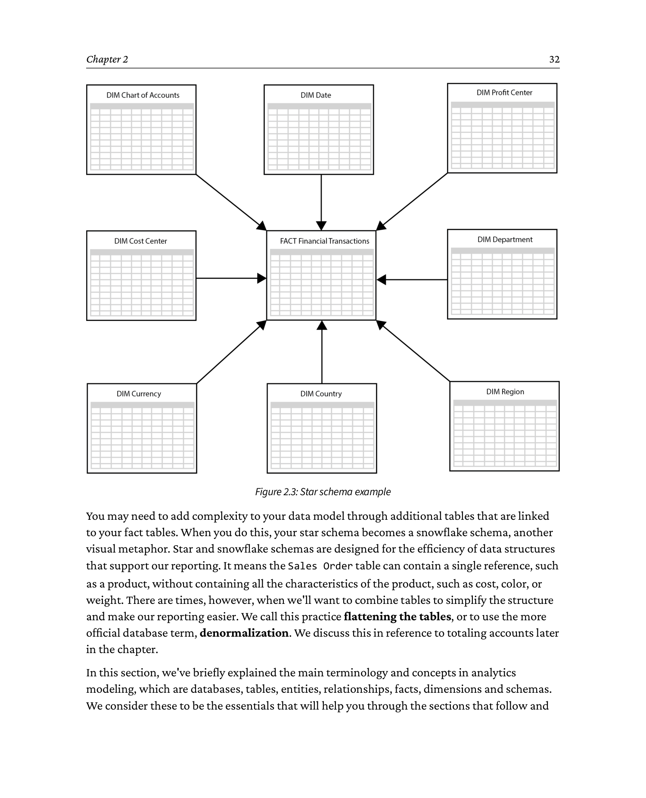

```
   Star schema

                          +-----------+
                          |  Date     |
                          +-----------+
                               |
                               |
   +-----------+                |                +-----------+
   | Customer  |----------------+    +-----------|  Product  |
   +-----------+                |    |           +-----------+
                               |    |
                               v    v
                        +-------------------+
                        |                   |
                        |   Fact: Sales     |
                        |   Orders          |
                        |                   |
                        +-------------------+
                               ^
                               |
                        +-----------+
                        |  ...      |  (other dimensions)
                        +-----------+
```


You may need to add complexity to your data model through additional tables that are linked to your fact tables. When you do this, your star schema becomes a *snowflake schema*, another visual metaphor. Star and snowflake schemas are designed for the efficiency of data structures that support our reporting. It means the Sales Order table can contain a single reference, such as a product, without containing all the characteristics of the product, such as cost, color, or weight. There are times, however, when we'll want to combine tables to simplify the structure and make our reporting easier. We call this practice *flattening* the tables, or to use the more official database term, *denormalization*. We discuss this in reference to totaling accounts later in the chapter.

In this section, we've briefly explained the main terminology and concepts in analytics modeling, which are databases, tables, entities, relationships, facts, dimensions and schemas. We consider these to be the essentials that will help you through the sections that follow and prepare you for other texts on this topic. With these new terms, let's start applying them to the world of financial modeling.

### 2.1.2 The common structure of financial applications

While financial systems may have unique table structures, the way transactions are recorded is fundamentally the same across all accounting systems. This consistency allows for the creation of a common structure within one or many Power BI semantic models to house all ledger transactions, whether from single or multiple systems. This becomes particularly valuable when working with clients who use multiple financial applications across different companies, as it enables consolidated financial reporting. Although this process can be complex, it is achievable. We won't delve into that level of detail in this book, but it's important to know that it's possible.

At the heart of the financial semantic model, we consider three entities that may be contained in multiple tables: the calendar, the chart of accounts, and transactions. On top of this, it's possible to extend the model in various directions - we will be looking in future chapters specifically at journal entries, inventory, and budget, but the same ideas can extend into sales, purchasing, manufacturing, and more.

In the GitHub repository of this book (https://github.com/PacktPublishing/Financial-Modeling-with-Power-BI_Packt), we have Power BI models you can download and use to follow our examples. We must start with a warning: the actual structure of your finance system will differ, and it'll certainly be more complex, but the basic structure will be the same, just as the basic measures and visualizations will be the same. Of the three entities we explain, you'll need to create one yourself (calendar), and the other two (transactions and chart of accounts) will come from the finance application. Creating a Calendar table is a core skill for working with Power BI, and we explain why and how to do it in the next section.

The upcoming sections explain these entities, and then we have the working example you can load into Power BI from the sample files.

> **Note: Clearly Clothing - the working example for this book**
>
> Throughout this book, we will be using examples from a fictional clothing retailer, *Clearly Clothing*. We will walk through creating a full suite of financial reports using this company, adding complexity as we go. Initially, however, we will start with a simple model using just one legal entity. Later in this chapter, we will add additional legal entities to report across the whole group.

### 2.1.3 Calendar

Starting with the Calendar table, possibly the first question is why you need such a table; surely transactions have dates? Of course, transactions do have dates, often many dates, but what they don't have is structure beyond numerical day, month, and year. The requirements for date reporting, or time intelligence, vary from organization to organization, but most will need month names, some want to see the long name (e.g., January), and others will just want the short name (e.g., Jan).

Many organizations have fiscal calendars in addition to a Gregorian calendar (1st January to 31st December) that need to be catered for. For example, the Microsoft fiscal calendar runs from July 1st to June 30th. Most often, this means a different start and end date to the year, but sometimes, fiscal periods do not map exactly to calendar months - for example, in a 4-4-5 pattern. To deal with this complexity, we add some *helper* fields to the Calendar table that help us map fiscal periods to ordinary periods.

All of this, and more, is accommodated by a Calendar table.

A common structure for a Calendar table follows in *Table 2.1*:

**Table 2.1: Common fields for a Calendar table**

| Field name | Description |
|---|---|
| Full Date | This represents the unique identifier - or primary key - for the table |
| Day Name | The day name |
| Day of Week | The day number in the week; this will be used for sorting days |
| Calendar Week Name | A name for the calendar week (e.g., Week 3) |
| Calendar Week Sort | The number of the week within the year; if the year starts partway through a week, you may wish to number from 0 |
| Calendar Month Name | The name of the month |
| Calendar Month Sort | The number of the month in the year |
| Calendar Quarter Name | A name for the quarter (e.g., Quarter 2) |
| Calendar Quarter Sort | The number indicating the quarter in the year |
| Calendar Year Name | The name of the year, although this would normally just be a numerical value, such as 2024 |
| Calendar Year Sort | The sort order for the year, if the year name is not numerical |
| Calendar Day of month | (Optional) number indicating the day of the month |
| Calendar Day of Quarter | (Optional) number indicating the day of the quarter |
| Calendar Day of Year | (Optional) number indicating the day of the year |
| Fiscal Week Name | Name of the fiscal week; it is good practice to give this a name distinct from the calendar version |
| Fiscal Week Sort | Number indicating the week in the year |
| Fiscal Period Name | The name of the fiscal period - ignore opening and closing periods for now |
| Fiscal Period Sort | The sort order for the period |
| Fiscal Quarter Name | The name of the fiscal quarter |
| Fiscal Quarter Sort | The sort order for the quarter |
| Fiscal Year Name | The name of the fiscal year (e.g., 2024/5) |
| Fiscal Year Sort | The order - since the fiscal year is likely to be a text name, this will be needed |

In addition to these, there may be other calendars that need to be added, based on organizational needs. For example, an education establishment may need to add details of the academic year and include additional fields, such as semesters and terms. Whilst it is possible to build most of this from data stored in the systems of record, it is often expedient to build much of this data in a spreadsheet and import it into your semantic model. This is especially true where there are a lot of custom fields involved or more complex helper fields for sorting are needed.

With a Calendar table, each row will represent a day, so the table will be a reasonable size, although certainly not large by Power BI's capabilities. As with all things in the data world, it's sensible to keep the table as small as is functional to provide the best performance. At a minimum, however, the dates must go back at least as far as the history to be imported into the model, and probably a few years into the future. The shorter the future import, the more maintenance will be required in the long term, but the model will be more performant. Managing data is full of trade-offs.

In addition to the Calendar table, you may also consider a Periods table - this would just handle fiscal periods and is especially useful when handling opening and closing periods (P0 and P13) that should not be included in *normal* periods.

Once we have a Calendar table in place, we'll find it far easier to manage and visualize our transactional data. In the following sections, we'll discuss our main dimension table, Chart of Accounts, followed by the general ledger (GL) transactions table, which is a fact table.

### 2.1.4 Chart of Accounts

The Chart of Accounts is a critical component that categorizes transactions into their various accounts and types. This is also the place where you can consolidate different charts of accounts from different systems in one centralized table and map different accounts together.

The basis of your chart of accounts table should look something like this:

**Table 2.2: Chart of Accounts basic table structure**

| Field name | Description |
|---|---|
| Account ID | Either the account number for the account, or a sequential ID - the latter is useful if you are mapping accounts from different systems |
| Account Number | The account number from the source system |
| Account Name | The human-readable name for the account |
| Account Type | High-level type of account (e.g., Balance Sheet or Profit and Loss) |
| Account Category | A more detailed category (e.g., Revenue or COGS) |

These fields will (usually) create a basic hierarchy, from *Account Type -> Account Category -> Account Number/Name*. Please see *Figure 2.4* for a visual example. The purpose of the hierarchy is to enable Power BI to calculate totals based on the various levels. In computing, we talk about *parent-child* relationships where one (e.g., mother) can have many children, but one child can only have one (biological) mother. When we explained relationships earlier in the chapter, the one-to-many relationship is also a parent-child relationship.

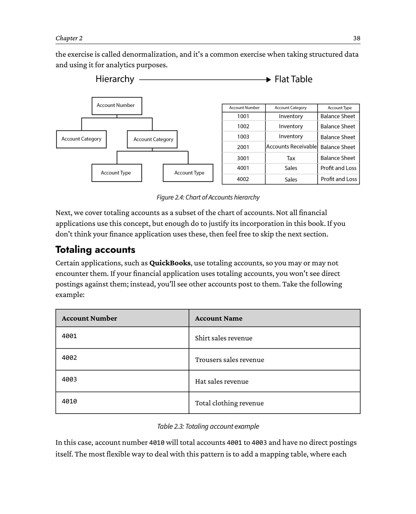

```
   Chart of Accounts hierarchy
   (Account Type -> Account Category -> Account Number -> Account Name)

   +-----------------------+
   |   Account Type        |   e.g. Balance Sheet / P&L
   +-----------------------+
              |
              |  one-to-many
              v
   +-----------------------+
   |   Account Category    |   e.g. Revenue, COGS, Assets
   +-----------------------+
              |
              |  one-to-many
              v
   +-----------------------+
   |   Account Number      |   e.g. 4001, 4002, 4003
   +-----------------------+
              |
              |  one-to-many
              v
   +-----------------------+
   |   Account Name        |   e.g. "Shirt sales revenue"
   +-----------------------+

   Parent-child hierarchy: each "many" has exactly one parent.
   In Power BI, this is denormalized into a single flat table.
```


There may also be other hierarchies and relationships to consider, for example, parent-child relationships in the chart of accounts, or accounts being grouped together into *totaling accounts*, which are accounts used for the summation of other accounts (discussed next).

Power BI does not offer a direct way to handle parent-child relationships, but it does contain the tools to manage them. In doing so, we make explicit all the levels of the hierarchy. Consider this: logically, the parent-child relationships we have in our accounts form a hierarchy. To translate to a format that Power BI can readily understand, we transform the data into a tabular structure where we take the hierarchical data structure and build a single table. The unique values in the table will be at the lowest level of the hierarchy, and each row will contain the entire structure. The data from your financial application will usually be represented in a parent-child structure, where you will have separate tables for each level of the hierarchy. In this case, we would have tables for Account Type, Account Category, and Account Number.

Using the tools in Power Query (sometimes also referred to as *Transform Data* after the name of the button that launches it), we're able to merge these tables into one. In database terms, the exercise is called *denormalization*, and it's a common exercise when taking structured data and using it for analytics purposes.

Next, we cover totaling accounts as a subset of the chart of accounts. Not all financial applications use this concept, but enough do to justify its incorporation in this book. If you don't think your finance application uses these, then feel free to skip the next section.

#### 2.1.4.1 Totaling accounts

Certain applications, such as QuickBooks, use totaling accounts, so you may or may not encounter them. If your financial application uses totaling accounts, you won't see direct postings against them; instead, you'll see other accounts post to them. Take the following example:

**Table 2.3: Totaling account example**

| Account Number | Account Name |
|---|---|
| 4001 | Shirt sales revenue |
| 4002 | Trousers sales revenue |
| 4003 | Hat sales revenue |
| 4010 | Total clothing revenue |

In this case, account number 4010 will total accounts 4001 to 4003 and have no direct postings itself. The most flexible way to deal with this pattern is to add a mapping table, where each account is represented as totaling itself, along with the totaling accounts and the children they sum up, as follows:

**Table 2.4: Totaling account posting structure**

| Account Number | Totaling Account | Totaling Account Name |
|---|---|---|
| 4001 | 4001 | Shirt sales revenue |
| 4002 | 4002 | Trousers sales revenue |
| 4003 | 4003 | Hat sales revenue |
| 4001 | 4010 | Total clothing revenue |
| 4002 | 4010 | Total clothing revenue |
| 4003 | 4010 | Total clothing revenue |

This allows you to create a table containing the accounts and amounts themselves alongside the totaling accounts.

If you want to look at the core data model from the GitHub site (https://github.com/PacktPublishing/Financial-Modeling-with-Power-BI_Packt/tree/main/Chapter2), you'll see the following example for totaling accounts:

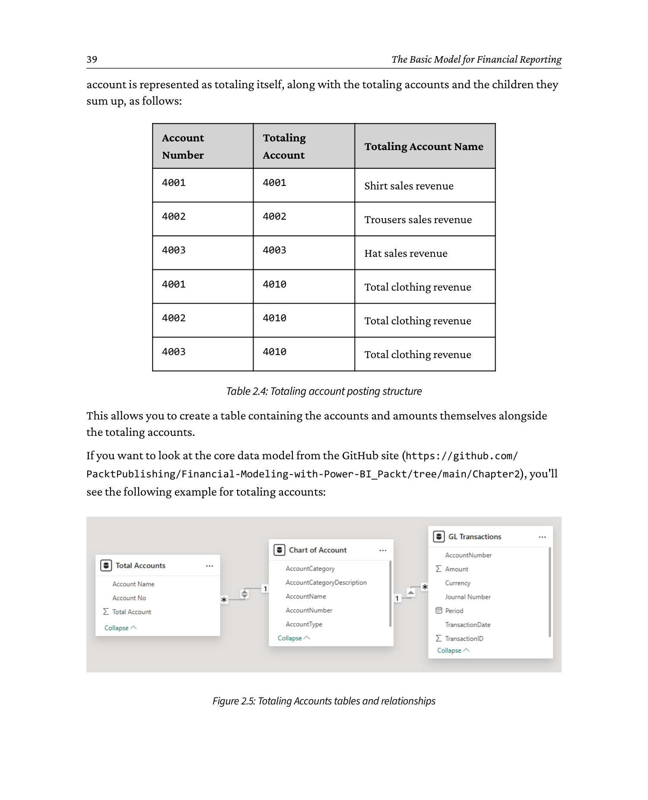

```
   Totaling Accounts - data model

   +-----------------+    *  -----  1    +------------------+    *  -----  1    +------------------+
   | GL Transactions |------------------>| Chart of         |<------------------| Total Accounts   |
   | (AcctNo, Amount,|                   | Accounts         |                    | (AcctNo,         |
   |  Date, ...)     |                   | (AcctNo, Name,   |                    |  TotAcctNo,      |
   +-----------------+                   |  Type, Category) |                    |  TotAcctName)    |
                                         +------------------+                    +------------------+
                                                  ^
                                                  |
                                              bidirectional
                                          (Total -> Chart of Accounts)

   Why bidirectional here:  Total Accounts is the only table on its side of
   the relationship, and it must filter the Chart of Accounts to compute
   summed amounts. In any other context we would avoid bidirectional
   relationships for performance and clarity reasons.
```


When we look at the data tables in the core data model, you'll see GL Transactions, Chart of Account, and Total Accounts. There's a two-way or bidirectional relationship between the Total Accounts and Chart of Accounts, which allows the Total Accounts table to filter the Chart of Accounts table. Generally, the side of the *one* table filters the *many* table, which is the standard one-to-many relationship. In this case, we've implemented a bidirectional relationship so the *many* side can filter the *one* side. We generally advise against bidirectional relationships as they can cause calculation and performance issues with your data model, but in this case, the filtering table, Total Accounts, is not connected to any other tables. We will examine this in more detail in the next section. When you look at the Power BI visuals, you'll see the following table:

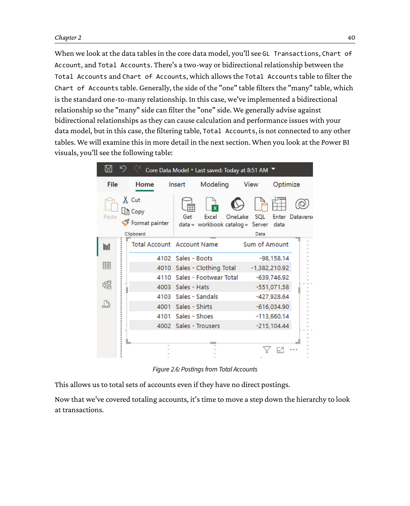

```
   Postings rolled up via Total Accounts

   +------------------+----------+----------+--------------------------------+
   | Account Number   | Debit    | Credit   | Comment                       |
   +------------------+----------+----------+--------------------------------+
   | 4001  Shirts     |  10,000  |          | direct posting                |
   | 4002  Trousers   |   5,000  |          | direct posting                |
   | 4003  Hats       |   2,000  |          | direct posting                |
   +------------------+----------+----------+--------------------------------+
   | 4010  Total      |          |  17,000  | SUM(4001+4002+4003) - no own  |
   |   clothing rev.  |          |          | postings, computed by the      |
   |                  |          |          | Total Accounts relationship    |
   +------------------+----------+----------+--------------------------------+

   Account 4010 itself has zero direct postings; the 17,000 is derived by
   linking 4001/4002/4003 -> 4010 through the Total Accounts table.
```


This allows us to total sets of accounts even if they have no direct postings.

Now that we've covered totaling accounts, it's time to move a step down the hierarchy to look at transactions.

### 2.1.5 Transactions

Finally, we can consider the transactions. In our data model, we create a table to hold basic transaction details that will represent your GL. In your finance application, you'll probably have one, possibly two tables that will act as a central repository for your GL transactions. The transaction table is a type of table known as a *fact table*, as we described earlier in the *Facts and dimensions* section. Typically, fact tables should be narrow (few columns) but contain many rows, and you may have to remove unwanted or unused columns that are part of the tables. It's typical to have many columns within the tables of commercial finance applications that are unrelated to your implementation, so please remove them using *Choose Columns* in Power Query (this is covered in the next chapter). You'll find that this will also make your life easier when navigating the data. The context of the transaction is provided by the dimension tables (such as Calendar and Chart of Accounts), which were described previously. These dimension tables should have a few rows, but can typically have many columns (as we have seen in the Calendar table).

The pattern for a ledger transaction table could resemble the following example, in *Table 2.5*:

**Table 2.5: GL transactions example table**

| Field name | Description |
|---|---|
| Transaction ID | ID for the transaction taken from the source system. |
| Source System ID | (Optional) Good practice when taking data from multiple source systems. |
| Date | Transaction date, used to link to the Calendar table. |
| Period | Accounting period, used to link to the Periods table. |
| Account No | Links to the chart of accounts. |
| Currency | (Optional) Needed if working in multiple currencies. |
| Debit (transaction currency) | (Optional) Debit amount in the transaction currency. |
| Credit (transaction currency) | (Optional) Credit amount in the transaction currency. |
| Total (transaction currency) | Total amount in the transaction currency. Even if the source does not have this explicitly, calculate it! It will make your life so much easier. |
| Debit (Accounting currency) | (Optional) Only needed in multi-currency, the debit amount in the accounting currency. |
| Credit (accounting currency) | (Optional) Only needed in multi-currency, the credit amount in the accounting currency. |
| Total (accounting currency) | (Optional) Only needed in multi-currency, the total amount in the accounting currency. |

Now that we've covered the core entities that you'll use for your financial reporting, it's time to roll up our sleeves and look at how we manage and manipulate this data in Power BI.

---

## 2.2 Managing relationships in Power BI

To help you start working with Power BI quickly, we've included the files used in the examples we've used for this book. For this section, please refer to the *Core Data Model.pbix* file.

The first item to check is how Power BI relates the data tables that are loaded. As a default setting (which can be changed in *Options and Settings*), Power BI will automatically attempt to relate key columns within the tables as they are loaded. This can be based on identical column names and data types, with a preference for one-to-many relationships. For example, *CustomerID* on the Customer table will automatically be related to *CustomerID* on the Sales Orders table. Please note, Power BI doesn't always get this correct, as column names aren't always named consistently, so it may be the case that *CustomerID* on the Customer table needs to be linked to *CustomerName* on the Sales Order table.

To look at the example file, navigate to the data model view, and you'll see the example in *Figure 2.7*:

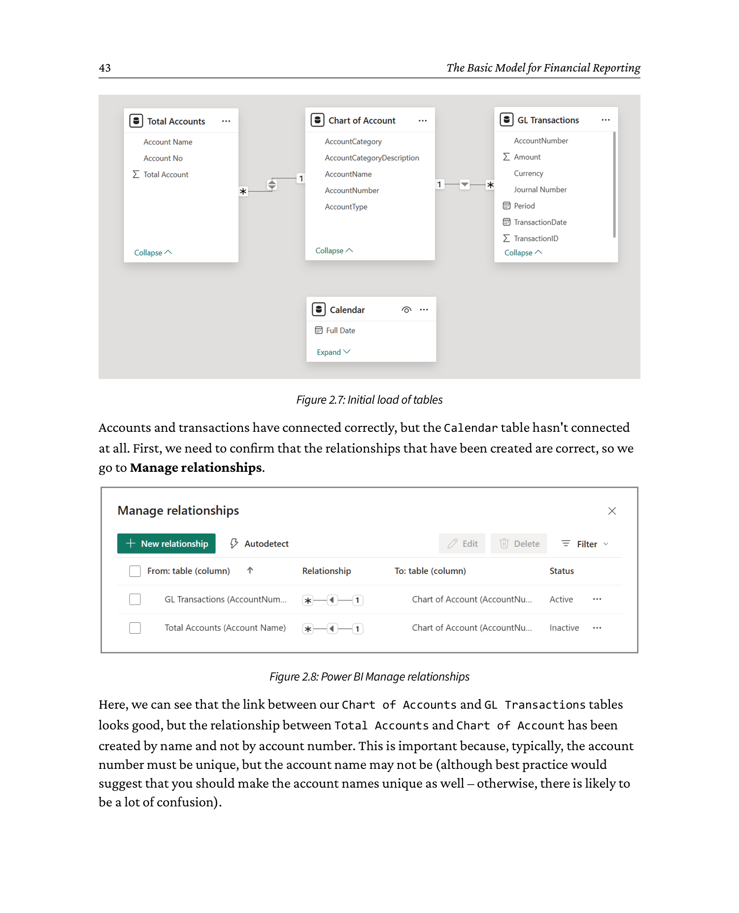

```
   Power BI auto-detect: initial state of relationships

   [Total Accounts]  *  ----  1  [Chart of Accounts]  *  ----  1  [GL Transactions]
                                  |
                                  |   <-- NO relationship created
                                  |       (field names differ:
                                  |        Full Date  vs  TransactionDate)
                                  v
                            [Calendar]
                            (orphan - not connected to anything)

   What went right:  Total Accounts -> Chart of Accounts, Chart of Accts -> GL Transactions.
   What went wrong :  Calendar has no link to GL Transactions.
                     Also, the Total-Accounts -> Chart-of-Accounts link was
                     created on AccountName (NOT unique) instead of
                     AccountNumber (unique).
```


Accounts and transactions have connected correctly, but the Calendar table hasn't connected at all. First, we need to confirm that the relationships that have been created are correct, so we go to *Manage relationships*.


```
   Manage relationships dialog

   +----------------------------------------------------------------------+
   |  Power BI  |  Manage relationships                                   |
   |----------------------------------------------------------------------|
   |  Active    From table            To table            Cardinality     |
   |  ----------------------------------------------------------------    |
   |  [ ]       Chart of Accounts     GL Transactions     Many to One     |
   |  [X]       Chart of Accounts     Total Accounts      Many to One (*) |
   |  [ ]       Calendar              GL Transactions     (missing)       |
   |                                                                      |
   |  (*)  the Total Accounts -> Chart of Accounts link was made on       |
   |       AccountName.  This is a problem - account NAME is not unique.  |
   +----------------------------------------------------------------------+
```


Here, we can see that the link between our Chart of Accounts and GL Transactions tables looks good, but the relationship between Total Accounts and Chart of Account has been created by name and not by account number. This is important because, typically, the account number must be unique, but the account name may not be (although best practice would suggest that you should make the account names unique as well - otherwise, there is likely to be a lot of confusion).

From here, we can correct that relationship, which we do by editing the relationship as follows:

1. Click *Manage relationships*.
2. Check the box next to *Total Accounts* and the *Chart of Account* options.
3. Click *Edit* and select the fields in the dialog box shown in *Figure 2.9*.

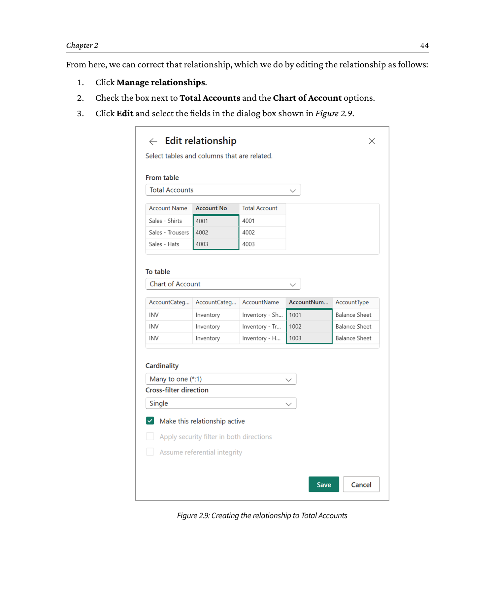

```
   Edit relationship: Total Accounts  <->  Chart of Accounts

   +----------------------------------------------+
   |  Edit relationship                           |
   |----------------------------------------------|
   |  From table:   Chart of Accounts             |
   |  From column:  AccountNumber   <-- FIXED     |
   |                                              |
   |  To table:     Total Accounts                |
   |  To column:    AccountNumber                 |
   |                                              |
   |  Cardinality:  Many to One (*:1)             |
   |  Cross filter: Single direction              |
   |  Make this relationship active:  [X]         |
   |                                              |
   |        [ OK ]            [ Cancel ]          |
   +----------------------------------------------+
```


Similarly, we can create the missing relationship that could not be detected, as the field names were different:

1. Again, select *Manage relationships*.
2. Click *New relationship*.
3. *From table* is the Calendar table, and *To table* is the GL Transactions table.
4. As shown in *Figure 2.10*, select *Full Date* from the Calendar table and *TransactionDate* from the GL Transactions table.
5. Click *Save* and watch Power BI form the relationship.

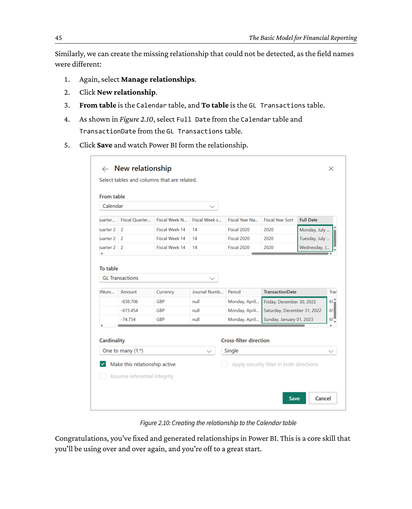

```
   New relationship: Calendar  <->  GL Transactions

   +----------------------------------------------+
   |  New relationship                            |
   |----------------------------------------------|
   |  From table:   Calendar                      |
   |  From column:  Full Date                     |
   |                                              |
   |  To table:     GL Transactions               |
   |  To column:    TransactionDate               |
   |                                              |
   |  Cardinality:  Many to One (*:1)             |
   |  Cross filter: Single direction              |
   |  Make this relationship active:  [X]         |
   |                                              |
   |        [ OK ]            [ Cancel ]          |
   +----------------------------------------------+
```


Congratulations, you've fixed and generated relationships in Power BI. This is a core skill that you'll be using over and over again, and you're off to a great start.

We've talked about relationships earlier in the chapter, but didn't cover filter direction, which we'll cover next.

### 2.2.1 Filter direction

Normally, we expect filters to be single-directional, from the one side to the many side; you can't filter from many to one. There are times when relationships need to be in both directions - such as to make our totals accounts work since the total account needs to filter the Chart of Accounts table. Finally, it follows that any one-to-one relationships must flow in both directions - again driving the question of whether these are truly separate objects.

### 2.2.2 Active versus inactive relationships

Between any two tables, there can only be one active relationship at any time - this is the default means by which data selected in one table can filter another. If that wasn't the case, the application of filtering as described previously would be ambiguous - that is to say that there are two paths via which the filter could be applied. Sometimes, if you try to activate an inactive relationship, the interface will not let you, as that would create more than one active relationship between two tables. So, what if there are two possible routes to join things? Say we have an invoice table, and we want to have an invoice date and a due date.

There are two possible approaches here. The first is to use an inactive relationship. An inactive relationship is shown in the interface by a dotted line. This can be referred to in DAX functions that allow you to roll up the calculations based on different relationships between the tables.

The second is to use a role-playing dimension that involves taking a second copy of the table you are filtering by (in this case, Calendar) and creating two active relationships. Which approach is correct will depend on the specific circumstances, but typically, the role-playing dimension will be the simpler and more flexible method. We look at role-playing dimensions in more detail in *Chapter 5, Handling Journal Entries*.

---

## 2.3 Modeling across multiple companies or legal entities

There will frequently be cases where an organization is made up of more than one company or legal entity. This can arise from a deliberate separation of a group's operations, especially common with multinationals, or from acquisitions. Since these companies may have different accounting systems - or at least different instances of the same system - consolidated reporting can cause a challenge, and this is often a key driver for building a suite of financial reports in Power BI. Indeed, even where an accounting system supports multiple companies, differences in the calendars and chart of accounts can render many built-in consolidations difficult or meaningless. In our example scenario, we have successfully piloted Power BI in the UK and now want to onboard the US trading entity.

As a result, we need to look at how we can add the data of multiple companies into the data model. There are broadly two approaches:

- **Approach 1**, where we link the company details to the Chart of Accounts and, therefore, to the transactions, or link the company to the transactions directly. This approach will tend to lead to a simpler structure for the Chart of Accounts, but can make consolidation difficult.
- **Approach 2**, where we link the company code directly to the transaction, which will be more performant, but will make the Chart of Accounts structure more complicated and harder to add new companies later; however, it will make consolidations easier.

First, we need to add a company table; regardless of the final approach we use, the essential fields are in *Table 2.6*.

**Table 2.6: Essential fields for the company**

| Field name | Description |
|---|---|
| Company ID | Unique ID for the company |
| Company Name | The display name of the company |
| Accounting Currency | (Optional) If different companies use different currencies |

Let's look at each approach in a bit more detail.

### 2.3.1 Approach 1 - linking the company to the chart of accounts

Here, we need to add a *Company ID* field to the chart of accounts. At the same time, we must ensure that every account ID in the chart of accounts is unique. Therefore, if two or more companies have the same account numbers (account ID), the solution is either to use a surrogate key that is looked up during the import process (this is typically the case when importing from a data warehouse, although it can be generated in Power Query) or, more commonly, creating a compound key by concatenating the company ID with the account number and some sort of separator. You will also need to add columns for the consolidated account structure.

Here, the Chart of Accounts table should resemble *Figure 2.11*:

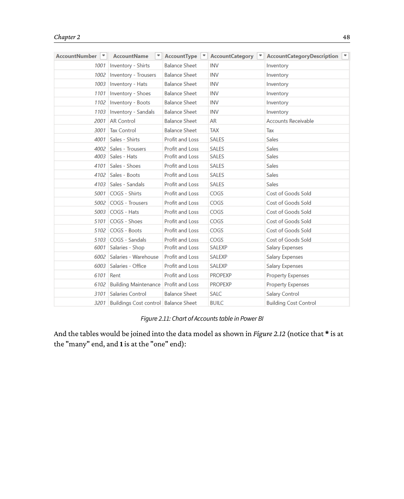

```
   Chart of Accounts table in Power BI  (Approach 1: Company -> CoA)

   +------------+----------+------------------+----------+------------------+
   | AccountID  | Acct No  | Account Name     | Type     | Category         |
   +------------+----------+------------------+----------+------------------+
   | UK-4001    | 4001     | Shirt sales      | Revenue  | Sales revenue    |
   | UK-4002    | 4002     | Trousers sales   | Revenue  | Sales revenue    |
   | UK-4003    | 4003     | Hat sales        | Revenue  | Sales revenue    |
   | UK-4010    | 4010     | Total clothing   | Revenue  | Sales revenue    |
   | US-4001    | 4001     | Shirt sales      | Revenue  | Sales revenue    |
   | US-4002    | 4002     | Trousers sales   | Revenue  | Sales revenue    |
   | US-4100    | 4100     | Sales tax        | Liability| Current liab.    |
   +------------+----------+------------------+----------+------------------+
     ^
     AccountID is a compound key:  {CompanyCode}-{AccountNumber}
     (used because UK and US share the same account numbers but are
      different legal entities)
```


And the tables would be joined into the data model as shown in *Figure 2.12* (notice that `*` is at the *many* end, and `1` is at the *one* end):

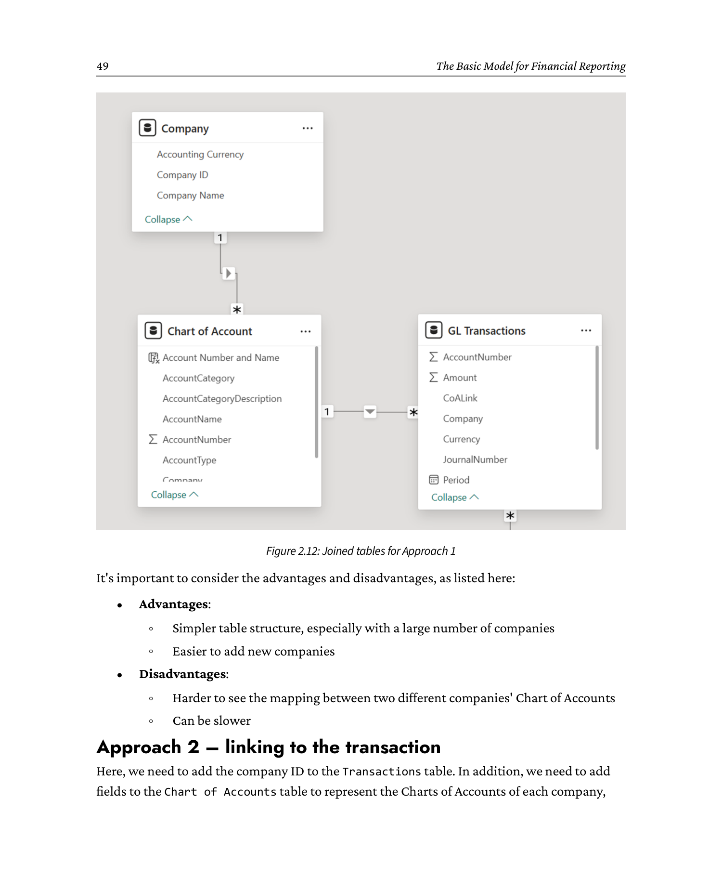

```
   Approach 1: company on the Chart of Accounts

   +---------------+        +---------------------+        +-----------------+
   | Company       |  1     | Chart of Accounts   |   1     | GL Transactions |
   | (CompanyID,   |------->| (AccountID [PK],    |-------->| (AccountID,     |
   |  CompanyName, |   *    |  AccountNumber,     |    *    |  Date, Amount)  |
   |  AcctCurrency)|        |  AccountName,       |         |                 |
   +---------------+        |  CompanyID [FK])    |         +-----------------+
                            +---------------------+

   "*" is on the many side; "1" is on the one side.
   Chart of Accounts row count =  N companies  x  M accounts per company.
```


It's important to consider the advantages and disadvantages, as listed here:

**Advantages:**

- Simpler table structure, especially with a large number of companies
- Easier to add new companies

**Disadvantages:**

- Harder to see the mapping between two different companies' Chart of Accounts
- Can be slower

### 2.3.2 Approach 2 - linking to the transaction

Here, we need to add the *company ID* to the Transactions table. In addition, we need to add fields to the Chart of Accounts table to represent the Charts of Accounts of each company, and a set of columns to represent the consolidated structure. Again, in this case, there needs to be a unique key for each account, and that key needs to be looked up for each account imported from the source.

Here, the Chart of Accounts table will look similar to the example in *Figure 2.13*:

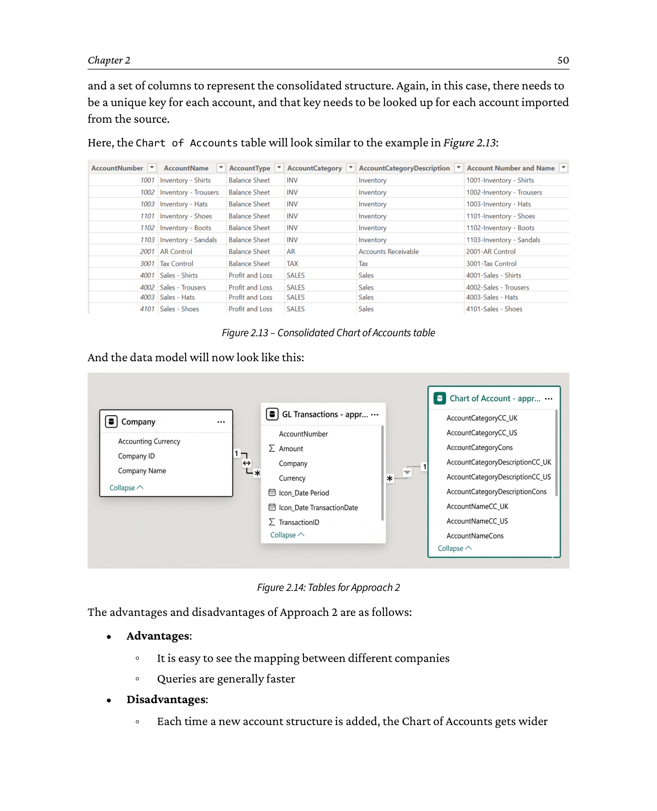

```
   Consolidated Chart of Accounts (Approach 2)

   +----------+----------+----------+-----------+-----------+-----------+-----------+
   |AcctID    |AcctNo    |AcctName  |CompanyID  |ConsolAcct |ConsolType |ConsolCat  |
   +----------+----------+----------+-----------+-----------+-----------+-----------+
   | 1        | 4001     | Shirts   | UK        | R-SALES-1 | Revenue   | Sales     |
   | 2        | 4002     | Trousers | UK        | R-SALES-1 | Revenue   | Sales     |
   | 3        | 4001     | Shirts   | US        | R-SALES-1 | Revenue   | Sales     |
   | 4        | 4002     | Trousers | US        | R-SALES-1 | Revenue   | Sales     |
   | 5        | 4100     | SalesTax | UK        | L-TAX-1   | Liability | Tax       |
   | 6        | 4100     | SalesTax | US        | L-TAX-1   | Liability | Tax       |
   +----------+----------+----------+-----------+-----------+-----------+-----------+

   Each company has its own set of AcctNo / AcctName columns; consolidated
   accounts (ConsolAcct, ConsolType, ConsolCat) hold the group-level
   category that the report can roll up to.
```


And the data model will now look like this:


```
   Approach 2: company on the transactions

   +-----------------+        +---------------------+        +-----------------+
   | Company         |   1    | Chart of Accounts   |   *    | GL Transactions |
   | (CompanyID,     |------->| (AccountID [PK],    |<-------| (AccountID,     |
   |  CompanyName,   |        |  UK_AcctNo,         |   *    |  CompanyID,     |
   |  AcctCurrency)  |        |  US_AcctNo,         |        |  Date, Amount)  |
   +-----------------+        |  UK_AcctName,       |        +-----------------+
            ^                 |  US_AcctName,       |                ^
            |                 |  ConsolAcct, ...)   |                |
            |                 +---------------------+                |
            +------------------------------------------------------+
                  one row per (CompanyID, AccountID) combo

   Transactions now carry CompanyID directly. Chart of Accounts has
   parallel columns for each company structure (UK_*, US_*) and a
   consolidated set of columns for group-level roll-ups.
```


The advantages and disadvantages of Approach 2 are as follows:

**Advantages:**

- It is easy to see the mapping between different companies
- Queries are generally faster

**Disadvantages:**

- Each time a new account structure is added, the Chart of Accounts gets wider
- It is unwieldy in complex organizations
- Problems can arise with consolidations

A potential *halfway house* exists where there may be two or three structures used by many companies, so the Chart of Accounts table would only need a few mapping columns. For the remainder of the book, we will use Approach 1 since this is the most flexible way of modeling data for the widest range of organizations.

---

## 2.4 Considerations for foreign exchange

Ideally, if there is a need for handling foreign exchange, this should be handled in the accounting systems and not in an ad hoc way in the reporting system. If a legal entity transacts in many currencies, it would be common practice for the accounting system to hold transaction amounts in at least the transaction currency and the accounting currency for that legal entity. Furthermore, if an accounting system supports multiple legal entities using different accounting currencies, it would be common practice (although not universal) to store a third reporting currency. In all of these cases, the best course of action is almost always to use the values stored in the accounting system. This means that there is no possibility of discrepancy between the reports and the accounting system. And after all, the accounting system is the system of record and is supposed to be definitive.

But what about other situations where this is not possible? Consider an organization where there are multiple legal entities using different systems. They may well have different accounting currencies and are not guaranteed to have the facility for an additional reporting currency, or, for historical reasons, such as acquisitions, they may use different reporting currencies. In any case, to create a consolidated reporting suite, all the currencies need to be converted into a single currency.

The first step is to get exchange rate data; in an ideal world, this would be sourced from an accounting system. If this is not the case, you will need to source data from elsewhere. Most likely, this will be from a web service - these come in free and paid variants. The price is generally set by the number of API calls allowed and the speed of updates. Typically, for most accounting systems, an update cadence of once per day is sufficient, since that is the normal granularity of posting to the general ledger. Most web APIs at all pricing tiers offer more than enough calls for updates to financial reporting.

Once the exchange rate data is available, the next step is to consider the strategy for converting and displaying the data. There are two basic approaches: *static* or *dynamic*. By far the easiest approach is static, and a dynamic approach should only be used if there is a clear need to display the values in different currencies at the touch of a button. This is a rare situation and should be avoided as it adds unnecessary complexity and maintenance costs. We will look in more detail in a future chapter at the calculations needed to use a dynamic approach.

Taking a static approach, the conversion can be done either during data load or by using calculated columns in DAX. The way to do this will depend on how exactly you intend to use the exchange rate data. If you are using daily spot rates, then it is almost certainly going to be more efficient to do the calculation during data load.

If, on the other hand, you need to use an average rate - for example, a 30-day moving average, or an average over the current period - then it is usually easier to handle this using calculated columns. We will examine this further in *Chapter 4, Common DAX Measures*.

### 2.4.1 Pitfalls of calculating foreign exchange in the data model

It must be noted that there are significant downsides to calculating foreign exchange in the data model, rather than the accounting system. Most obvious is the fact that it will mean that values in the converted currency will almost certainly not match properly or add up as expected. If the currencies we are converting between are relatively stable, this is not a big issue, as the variation is usually <1% of the overall transaction value. If the relative values are more volatile, though, there may be a more significant problem.

But how does this occur? Essentially, the mechanism is changing exchange rates between related transactions. Suppose we raise an invoice for 100 GBP, and on the day we raise it, the exchange rate makes that 120 USD. In our transactional system, we debit 100 GBP to the Accounts Receivable control account, and in the report, we convert that to 120 USD. A month later, we receive payment, so we credit the AR control with 100 GBP. All good, the accounting system and the report show a balance of 0 for that on the AR control. However, if the exchange rate has changed - let's say that 100 GBP is now worth 119 USD - the report will show a credit of 119 USD, leaving a debit balance of 1 USD. That means that there will be a contradiction between the base currency and the converted currency. In an accounting system, exchange rate variations between accounting and transaction currencies can be handled via postings to the realised loss/gain to exchange rate accounts. Reporting systems do not create their own transactions, so they are unable to handle this in this way. As such, converted values in the reports need to carry a health warning.

The other big issue is processing - the more calculated currencies you need, and the more complex the logic behind the calculation, the slower things will be. If you are tied to doing this in the reporting layer, you will also be tied to a service to provide those rates. And if you change providers, be prepared to have to re-engineer all reports using that.

Given the complexity, the limitations, and the downsides mentioned previously, think very carefully about whether the value that calculating exchange rates in the reporting is really worth it. Usually, that investment is better used to improve the source system.

---

## 2.5 Summary

In this chapter, we've started our journey in financial modeling for Power BI by focusing on how the core entities are either created or located within your financial application. Learning some important terms along the way, we then explained how the basic structure of financial systems follows a similar pattern, so you'll be well prepared to apply it using your own financial data. We looked at totaling accounts, which you may need, and finished by considering the complexities of multi-company and foreign transactions. We have to say that the last two examples are complex, but you'll now have a basic idea of how to deal with them.

We now have a basic model to start working with. In the next chapter, we'll start to apply some of Power BI's core language, Data Analysis eXpressions (DAX).

---

_Generated by `convert_chapter2.py` + `build_chapter2_md.py` on 2026-06-16._
