# Chapter 3: Creating a Trial Balance and Income Statement

**Source: *Financial Modeling and Reporting with Microsoft Power BI* (Packt Publishing, 2026)**

DOI: 10.0000/PACKT_FMRWPB_2026  |  GitHub: https://github.com/PacktPublishing/Financial-Modeling-with-Power-BI_Packt/tree/main/Chapter3

_Page range: 84 - 111_

---

In *Chapter 2, The Basic Model for Financial Reporting*, we began work on our Power BI model by loading and relating the tables, starting the process of building a semantic model. This gave Power BI information on the context between the tables, providing the basis to relate the various elements of data. Good practices in data modeling are the foundation of Power BI. However, so far, we haven't visualized anything, and we're sure that many of you will be keen to see something tangible.

Before we can visualize our data, we need to do some further enrichment of our data model. Unless we do this, we'll be limited as to what we can do beyond simple aggregations, and since every balance will add up to zero, what would be the point? We'll need some calculations for items such as revenue, costs, opening and closing balances, and the difference between them. To do this, we'll use Power BI to add some calculations. As a foundation for this book, we've assumed some prior Power BI knowledge and recommended basic training if you haven't worked with Power BI. From this point, we'll assume you have some knowledge as we introduce Data Analysis eXpressions (DAX).

By the end of the chapter, you will be able to demonstrate the following competencies:

- Understand and work with fundamental DAX calculations and apply them to a semantic model populated with sample finance data
- Know how to build visuals for a Trial Balance and Income Statement
- Understand the value of adding slicers to the model to help analyze visuals

---

## Technical requirements

To follow the worked examples in this chapter and beyond, you'll need a Windows PC with an internet connection, and you'll also need to download Power BI Desktop.

For more details, we suggest you access the following link, where Microsoft details the download process for Power BI Desktop and the PC hardware requirements: https://learn.microsoft.com/en-us/power-bi/fundamentals/desktop-get-the-desktop.

You will also need the resources from the `Chapter3` folder in the GitHub repository: https://github.com/PacktPublishing/Financial-Modeling-with-Power-BI_Packt/tree/main/Chapter3.

---

## 3.1 Introduction to DAX calculations

DAX is the language that allows us to work with our data in Power BI, enabling us to add measures, columns, and tables, and then create advanced and complex formulas. It's designed to be capable of dealing with very large datasets and is an immensely powerful component of Power BI. Understanding how to use DAX properly is essential for developing good habits as your skills progress. Don't worry - we'll start with basic examples that you'll be able to immediately employ in your everyday work.

We've mentioned before, and it's worth repeating, that initial impressions could suggest that DAX is identical to the formula language in Excel. In some instances, that may be the case, but please don't make this assumption; it can behave differently, even when a function has an identical name. `IF` is a good illustration. In Excel, an `IF` statement works row by row on cell values directly, whereas an identical `IF` statement in DAX can work with columns and measures and may produce different results based on the filter context being applied to the data model. An Excel and DAX `IF` statement with identical data can produce different results.

For this chapter, we'll keep it simple to ease you into DAX for your financial reporting. We'll cover DAX in more detail in *Chapter 4, Common DAX Measures*. In this chapter, we'll work through examples that create the trial balance and income statements, and we'll show you how to calculate the following:

- Opening balance
- Closing balance
- Debits
- Credits
- Totals filtered by Chart of Accounts (CoA) properties
- Calculations based on the aforementioned points

### 3.1.1 Understanding measures and calculated columns

To start, let's look at your first decision when writing DAX, which is whether you're creating a measure or a calculated column (defined next). What's the difference, and why is it important to start with this decision? First and foremost, you must make this decision one way or the other, so this seems like a good starting point. Calculated columns are perhaps easier to conceptualize as you can see them in your data as they extend an existing data table. You won't immediately see a measure until you apply it to a visualization on the canvas within Power BI Desktop.

Calculated columns are columns of data that extend your data tables within Power BI. They don't change or extend the table in your source financial system; they just do this within the Power BI model. Therefore, if I have columns for sales quantity and unit price, I may want to extend my table with a sales quantity x unit price calculation so that I can see the total for the row.

Measures are calculated aggregations of data from the tables within your semantic model. They exist for the purposes of a visual and the evaluation changes based on filtering and user interactions. They do not extend your data model. So, why not just create calculated columns? There are two reasons:

- As data models grow, efficiency is critical to the speed of operation. More data means more processing, and more processing can mean slower reporting. Adding columns means more processing.
- In many cases, creating a calculated column is not helpful. If I want to calculate the sum of a list of numbers, a column doesn't help as it'll contain the total of the entire column, in every row. It's nonsensical to the objective.

In contrast to columns, measures don't extend tables as they provide a calculation that exists for the purposes of the visualization. Take the following example in *Figure 3.1*:

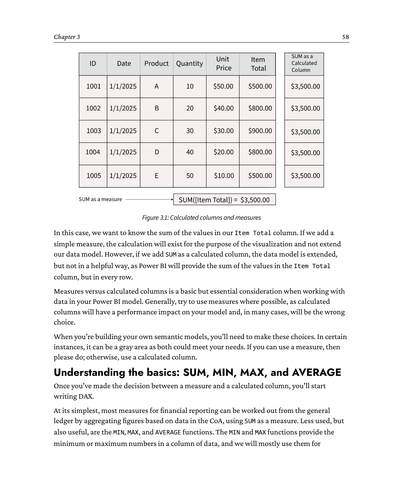

```
   Calculated columns and measures

   CALCULATED COLUMN (extends the table, written for every row):
   +----------------------------------+----------------+
   | Item          | Qty | UnitPrice  | Item Total     |
   +----------------------------------+----------------+
   | Item A        |   2 |       10   |   20  (row)    |
   | Item B        |   5 |        8   |   40  (row)    |
   | Item C        |   3 |       15   |   45  (row)    |
   +----------------------------------+----------------+
       ^
       |  the SUM() calculated column shows 105 in EVERY row
       |  - it is duplicated per row, which is misleading
       |    unless you specifically want the column grand total
       +--------------------------------------+
                                              v

   MEASURE (computed at query time, only when a visual requests it):
   +----------------------------------+
   | Item Total (MEASURE)            |
   |  = SUM([Item Total])            |
   +----------------------------------+
   +----------------------------------+
   | Q1 2026:    105   <- aggregates |
   | Q2 2026:    150   only the rows |
   | Year:       255   the filter    |
   |                       touches   |
   +----------------------------------+
   Result updates automatically with slicers, filters, and user interactions.
```


In this case, we want to know the sum of the values in our Item Total column. If we add a simple measure, the calculation will exist for the purpose of the visualization and not extend our data model. However, if we add `SUM` as a calculated column, the data model is extended, but not in a helpful way, as Power BI will provide the sum of the values in the Item Total column, but in every row.

Measures versus calculated columns is a basic but essential consideration when working with data in your Power BI model. Generally, try to use measures where possible, as calculated columns will have a performance impact on your model and, in many cases, will be the wrong choice.

When you're building your own semantic models, you'll need to make these choices. In certain instances, it can be a gray area as both could meet your needs. If you can use a measure, then please do; otherwise, use a calculated column.

### 3.1.2 Understanding the basics: SUM, MIN, MAX, and AVERAGE

Once you've made the decision between a measure and a calculated column, you'll start writing DAX.

At its simplest, most measures for financial reporting can be worked out from the general ledger by aggregating figures based on data in the CoA, using `SUM` as a measure. Less used, but also useful, are the `MIN`, `MAX`, and `AVERAGE` functions. The `MIN` and `MAX` functions provide the minimum or maximum numbers in a column of data, and we will mostly use them for modifying the behavior of other measures, in particular, in conjunction with `CALCULATE`, which we'll deal with more thoroughly in *Chapter 4, Common DAX Measures*. The `AVERAGE` function tends to be less used since, in most use cases, it's desirable to have base measures for the numerator and denominator, so explicitly dividing one by the other is a common approach.

Let's take a basic example:

```dax
Total Amount = SUM('GL Transactions'[Amount])
```

This calculation is the most basic form of DAX. It's a measure that asks Power BI to add up the numbers in a column, and when we begin work on a semantic model, it'll almost always be our starting point.

In Power BI, we also have the `SUMX` function, which differs from `SUM` in that it performs a row-by-row calculation and then sums the results. We use `SUMX` when we need to calculate across multiple columns because it iterates across each row, performs the calculation, stores the result, and then sums each row's result to provide the overall result. The `SUM` function works straight down each row in the column to add up the numbers and provide a result. *Figure 3.2* illustrates this:

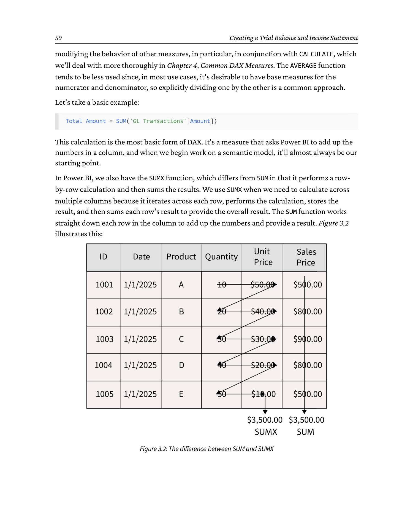

```
   The difference between SUM and SUMX

   SUM  -  aggregates an existing column.  No row iteration.
   +--------------------------------------------+
   | Item | Row Total                           |
   |------|------------+                        |
   |  1   |   20       |                        |
   |  2   |   40       |  SUM([Row Total])      |
   |  3   |   45       |  --------->  105       |
   +--------------------------------------------+
                 (column already contains the row total)

   SUMX  -  iterates ROW by ROW, evaluates an expression per row, then sums.
   +--------------------------------------------+
   | Item | Qty | UnitPrice                     |
   |------|-----|----------+                    |
   |  1   |  2  |   10    |  SUMX iterates row  |
   |  2  |  5  |    8    |  by row, computing   |
   |  3  |  3  |   15    |  Qty*Price each row  |
   +-------------------------- then sums to 105  |
                                              v
   SUMX('Table', [Qty] * [UnitPrice])  --> 105

   Rule of thumb:
     - Use SUM   when the row total is already in a column.
     - Use SUMX  when you have to compute the value across columns
                 or apply a per-row filter.
```


If you have row totals in your table and purely want to add all the numbers, use `SUM`. It's more efficient and faster than `SUMX`. When you don't have row totals but have the basis of the calculation, you'll need to use `SUMX`.

The `SUMX` function also allows us to add filters to the row-by-row calculation, which can be used to create total credit and debit measures that allow us to create a trial balance:

```dax
Total Debit =
SUMX(
    FILTER(
        'GL Transactions',
        'GL Transactions'[Amount] > 0
    ),
    'GL Transactions'[Amount]
)
```

In this example, we calculated the sum of `Amount` from the `GL Transactions` table, applying a filter to only consider values greater than 0. We also used the `GL Transactions'[Amount]` field instead of the `Total Amount` measure, which we did for clarity to explain the calculation (you can use either). Most commonly, `SUMX` will be used to produce filtered outputs, but it can also be used to calculate across several columns in a table since the expression is being evaluated for each row, prior to being added up. This can be useful if a table has quantity and unit values but not the total value. For example, an inventory table may look like this:

**Table 3.1: Inventory transactions**

| SKU Code | Qty | Unit Cost |
|---|---|---|
| FrmlSh-bk-06 | 10 | 30 |
| FrmlSh-bk-07 | 13 | 31 |
| FrmlSh-bk-08 | 38 | 32 |

We can calculate the total value as follows:

```dax
Total Value =
SUMX(
    'Inventory',
    'Inventory'[Qty] * 'Inventory'[Unit Cost]
)
```

We'll dive deeper into managing your inventory data in *Chapter 8, Managing Inventory Data*.

The `MIN`, `MAX`, and `AVERAGE` functions all work broadly the way you would expect (similar to Excel), returning the minimum value of a column, the maximum value of a column, and the arithmetic mean of the numerical values in a column. All three also have an "X" variation and behave much like how `SUMX` works. They also have "A" variations - `MINA`, `MAXA`, and `AVERAGEA`. These versions in general only work on numerical columns and ignore blank values, and their usefulness tends to be limited; they are mentioned here only for completeness.

From these functions, we can now start to create some measures that we'll want to use across our financial reports. Please remember that this is not an exhaustive list, merely a sample based on common requirements.

## 3.2 Adding measures to the data model

Now that you know some basics about calculated columns and measures, let's continue to build out our data model.

We'll start with the core data model, which is stored in this book's GitHub repo at https://github.com/PacktPublishing/Financial-Modeling-with-Power-BI_Packt. Download the Power BI model called `Core Model.pbix`. We have also included a Power BI model called `Chapter 3 Final.pbix`, which is a version with all the examples used within this chapter. If you get stuck at any point, this model is a great reference.

Our first task is to create a place to store our measures. A common practice in Power BI is to separate your measures from data tables within their own dedicated table. This helps you quickly and easily differentiate and find measures that have been written for the model. It's not essential; you can store measures within your data tables, but all our examples work based on a separate table for measures. Let's start by creating that table to store our measures:

1. From the Modeling tab, click *New table* as shown in *Figure 3.3*:

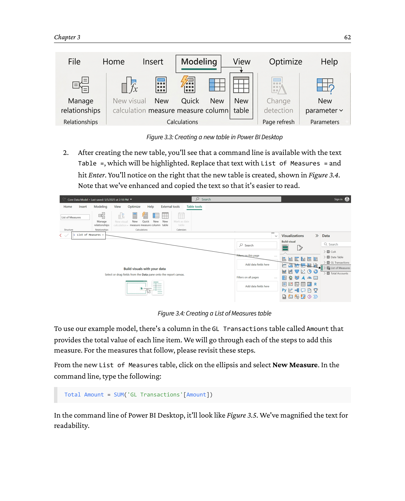

```
   Creating a new table in Power BI Desktop

   +----------------------------------------------------------------+
   | Power BI Desktop - Modeling tab                                |
   |----------------------------------------------------------------|
   |  Home  |  Insert  |  Modeling  [active]  |  View  |  Optimize  |
   |                                                                  |
   |       +---------+      +-------+    +----+    +----+    +----+|
   |       | New     |      | New   |    |New |    |New |    |New ||
   |       | column  |      | table |    |meas|    |calc|    |hier||
   |       +---------+      +-------+    +----+    +----+    +----+|
   |                            ^^^^^^^^                              |
   |                            click HERE to open the new-table      |
   |                            formula bar                            |
   +----------------------------------------------------------------+

   Result:  a formula bar appears at the top of the canvas with
            "Table =" highlighted - this is what you replace with
            "List of Measures =".
```


2. After creating the new table, you'll see that a command line is available with the text `Table =`, which will be highlighted. Replace that text with `List of Measures =` and hit *Enter*. You'll notice on the right that the new table is created, shown in *Figure 3.4*.


```
   Creating a List of Measures table

   Formula bar (after typing the new-table name):
   +--------------------------------------------------------------+
   | List of Measures =                                          |
   +--------------------------------------------------------------+
   Press Enter - the new table is added to the model:

   +----------------+
   |  List of       |
   |  Measures      |  <-- new, empty table sitting in the
   |                |     Data panel next to your data tables
   +----------------+
```


To use our example model, there's a column in the `GL Transactions` table called `Amount` that provides the total value of each line item. We will go through each of the steps to add this measure. For the measures that follow, please revisit these steps.

3. From the new `List of Measures` table, click on the ellipsis and select *New Measure*. In the command line, type the following:

```dax
Total Amount = SUM('GL Transactions'[Amount])
```

In the command line of Power BI Desktop, it'll look like *Figure 3.5*. We've magnified the text for readability.

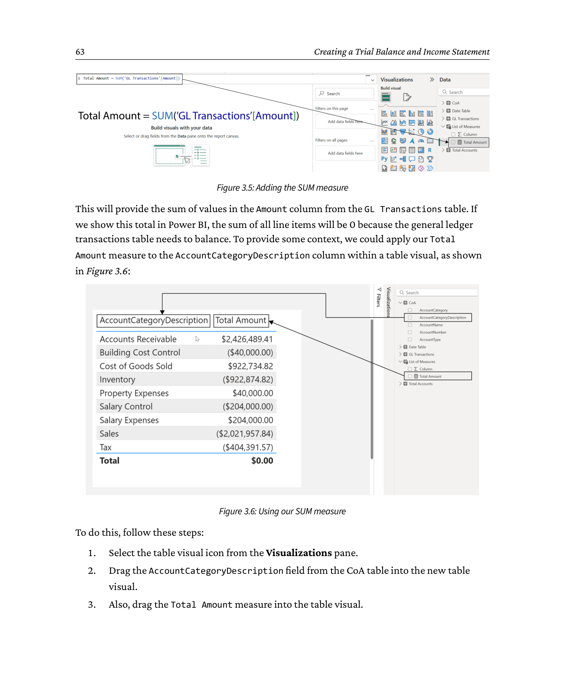

```
   Adding the SUM measure

   Step 1:  From the new List of Measures table, click the ellipsis (...)
            and choose New Measure.
   Step 2:  In the formula bar, type:

   +--------------------------------------------------------------+
   | Total Amount = SUM('GL Transactions'[Amount])               |
   +--------------------------------------------------------------+
   Press Enter.

   Power BI Desktop provides IntelliSense (auto-complete) as you type.
   The new measure appears inside the List of Measures table.
```


This will provide the sum of values in the `Amount` column from the `GL Transactions` table. If we show this total in Power BI, the sum of all line items will be 0 because the general ledger transactions table needs to balance. To provide some context, we could apply our `Total Amount` measure to the `AccountCategoryDescription` column within a table visual, as shown in *Figure 3.6*:


```
   Using our SUM measure (built-in table visual)

   +--------------------------------+----------------+
   | AccountCategoryDescription     | Total Amount   |
   +--------------------------------+----------------+
   | Cost of Goods Sold             |      12,500.00 |
   | Property Expenses              |       4,800.00 |
   | Sales Revenue                  |     -85,000.00 |  <-- credit balance
   | Salary Expenses                |      22,000.00 |
   |                                |                |
   |  Total                         |     -45,700.00 |
   +--------------------------------+----------------+

   Power BI auto-filters the Total Amount measure by the row's
   AccountCategoryDescription, so the breakdown is automatic - this
   is the basic trial balance pattern emerging from a single SUM.
```


To do this, follow these steps:

1. Select the table visual icon from the Visualizations pane.
2. Drag the `AccountCategoryDescription` field from the CoA table into the new table visual.
3. Also, drag the `Total Amount` measure into the table visual.

You'll note that we formatted the `Total Amount` measure to 2 decimal places, so if you see too many decimal places, set the decimal places in the Measure tab that appears. This is done by selecting the measure in the Data panel, then choosing the number of decimal places under the Measure tools tab.

In *Figure 3.6*, we can see that Power BI automatically breaks down our measure based on items from the `AccountCategoryDescription` field. It does this because of the link between the Chart of Account and GL Transactions tables that we created in the previous chapter.

You'll also notice this simple example has provided a basic trial balance.

The `SUM` function is just one aggregation we could have applied, and just like Excel, we could have also used `MIN`, `MAX`, `AVERAGE`, and `COUNT` against the column of data as follows:

```dax
Minimum Amount = MIN('GL Transactions'[Amount])
Maximum Amount = MAX('GL Transactions'[Amount])
Average Amount = AVERAGE('GL Transactions'[Amount])
Count of Values = COUNT('GL Transactions'[Amount])
```

To reiterate, it's a good practice to store your measures in a separate table where they can be found during report creation; that way, you won't confuse data in your tables with your measures. You can place your measures in any table, but for the examples throughout this book, we're using the `List of Measures` table.

### 3.2.1 Adding our credit and debit totals

Our next step is adding the credit and debit totals, which involves `SUMX`. We separate the credits and debits to work on the trial balance visual. In our example, the values balance, but in reality, they may not, so this method will help you quickly spot issues.

For our credit and debit totals, we use `SUMX` as we want values that are greater than or less than zero, respectively. To calculate the correct values, we'll combine the `FILTER` command with our `SUMX` command, where we ask Power BI to provide all values greater than zero or less than zero and add them up. The `Total Debit` measure looks like this:

```dax
Total Debit =
SUMX(
    FILTER(
        'GL Transactions',
        'GL Transactions'[Amount] > 0
    ),
    'GL Transactions'[Amount]
)
```

You'll notice that Power BI tries to help you with the syntax of the measure as you type it; this is a code completion aid called IntelliSense.

`SUMX` is an iterator function that calculates row by row and iterates down the data table. If you're unsure about how it works, please skip back to *Figure 3.2*. It starts at the top row of the table and checks whether the GL Transactions amount is greater than zero. If yes, it gets added to the total; if no, it gets ignored.

In a similar way, we can write a measure for `Total Credit` by reversing the greater-than sign:

```dax
Total Credit =
SUMX(
    FILTER(
        'GL Transactions',
        'GL Transactions'[Amount] < 0
    ),
    'GL Transactions'[Amount]
)
```

Both the `Total Debit` and `Total Credit` measures will ignore transactions that equal 0, which, of course, will not impact the total.

Now that we have some basic measures, we can use them as the foundation for further calculations. It's important to note the benefit of DAX in using calculations as the basis for other calculations; think of one DAX measure as a building block for other DAX measures. The minimum measures needed to create an income statement are for revenue and expenses of various kinds. In our example CoA, we've kept revenue very simple - that is, retail sales. Many organizations have many income streams, and you'll want to customize your calculations to that. We provide a few examples here to get you started, and we're sure you'll develop many more of your own as your skills develop.

We can now combine our `Total Amount` measure with `SUMX` to write measures that calculate sales revenue, cost of goods sold (COGS), salary expenses, and building lease expenses.

Starting with sales revenue, we'll filter our `Total Amount` measure using the `Sales` category from `AccountCategoryDescription` in the Chart of Account table. Because the Chart of Account table and the GL Transactions tables are linked, Power BI will be able to do this as follows:

```dax
Sales Revenue =
SUMX(
    FILTER(
        'Chart of Account',
        'Chart of Account'[AccountCategory] = "SALES"
    ),
    [Total Amount]
) * -1
```

> **Note:** We multiply by -1 as the normal posting here will be a credit, but we want to show a positive number on the income statement.

Similarly, COGS is calculated thus:

```dax
COGS =
SUMX(
    FILTER(
        'Chart of Account',
        'Chart of Account'[AccountCategory] = "COGS"
    ),
    [Total Amount]
)
```

COGS is not the only expense we have as an organization. Again, to keep it simple, we're going to look at two other types of expenses with slightly different approaches to handling them - salaries and rents:

```dax
Salary Expenses =
SUMX(
    FILTER(
        'Chart of Account',
        'Chart of Account'[AccountCategory] = "SALEXP"
    ),
    [Total Amount]
)
```

In our Chart of Account table, Rent has an ID within the `AccountNumber` field of 6101. It also shares `PROPEX` as an `AccountCategory` value and `Property Maintenance` as an `AccountCategoryDescription` value with the `AccountName` value of `Building Maintenance`. In an ideal world, you would change this data to be more convenient, but we're going to assume it's not feasible, so we have to work around it. In this case, we'll filter based on the specific `Account Number` column from the Chart of Account table:

```dax
Rent Expense =
SUMX(
    FILTER(
        'Chart of Account',
        'Chart of Account'[AccountNumber] = 6101
    ),
    [Total Amount]
)
```

Now, we can create the final measures we will need for our income statement so that we can show the total revenue, total expense, and net income. We'll start by calculating a measure for total revenue. In our example, our total revenue is equal to sales revenue:

```dax
Total Revenue = [Sales Revenue]
```

Then, we do the same for total expense:

```dax
Total Expenses = [COGS]+[Rent Expense]+[Salary Expenses]
```

Finally, we create a measure for net income:

```dax
Net Income = [Revenue]-[Expenses]
```

Finally, we need opening and closing balances for the Trial Balance. We'll start with the opening balance:

```dax
Opening Balance =
SUMX(
    FILTER(
        ALL('Calendar'[Full Date]),
        'Calendar'[Full Date] < MIN('Calendar'[Full Date])
    ),
    [Total Amount]
)
```

Then, we'll deal with the closing balance:

```dax
Closing Balance =
SUMX(
    FILTER(
        ALL('Calendar'[Full Date]),
        'Calendar'[Full Date] < MAX('Calendar'[Full Date])
    ),
    [Total Amount]
)
```

The `MIN` and `MAX` dates here, coupled with the `ALL` function, will return all transactions prior to that point. If a report is filtered for a year, the `MAX` date will return the end of the year, and the `MIN` date will return the start of the year. Depending on the postings that go into non-operating periods as the year is rolled over, these might need to be more complicated, either to exclude those periods or to only allow the calculation to look into the current financial year.

In this section, we started the DAX journey by creating a `List of Measures` table in Power BI Desktop. Then, we populated our `List of Measures` table with several measures that we'll need for our income statement. In the next section, we'll show you how to create that income statement.

> **Note:** Please note that this is not an exhaustive list of measures needed to prepare a complete income statement. The exact measures you will require will depend on the nature of your organization, business needs, and the jurisdiction in which you operate.

## 3.3 Creating an income statement

Now that we have our measures, we can build our income statement. The income statement is one of the simplest financial statements, dealing with the profit and loss accounts. In our version, we'll limit the number of income and expense categories for simplicity, but the basic idea of building the report remains the same, no matter how many categories you have. Within the standard Power BI visuals, there's no income statement template, so we'll walk you through the process of building one.

We'll start in the report designer view, and on a blank canvas, we'll select the Matrix visual, as shown in *Figure 3.7*:

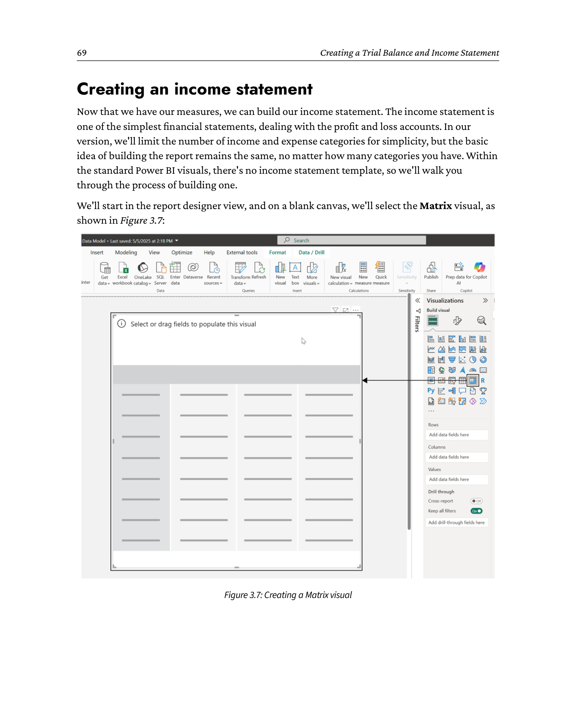

```
   Creating a Matrix visual

   Visualizations pane - matrix icon highlighted:
   +----------+----------+----------+----------+----------+
   | stacked  | line     | clustered|  matrix  |  ...     |
   | column   | chart    | column   |  ACTIVE  |          |
   | chart    |          | chart    |  ^^^^^   |          |
   +----------+----------+----------+----------+----------+

   A blank matrix is dropped on the canvas.  We will populate the
   Rows / Values / Columns buckets with our measure fields.
```


We'll start by adding our expense accounts. Select `COGS`, `Rent Expenses`, and `Salary Expenses` from the `List of Measures` table. You can either check the box next to the measure or drag the item to the visual.

Your matrix will show the measure text and values as columns, so we need to switch them to rows as follows (you can also see an example in *Figure 3.7*):

1. From the Visualizations pane, click *Format your Visual*.
2. While on the Visualizations pane, select the Visual tab.
3. Select *Values*, then *Options*.
4. Under Options, select *Switch values to rows*.

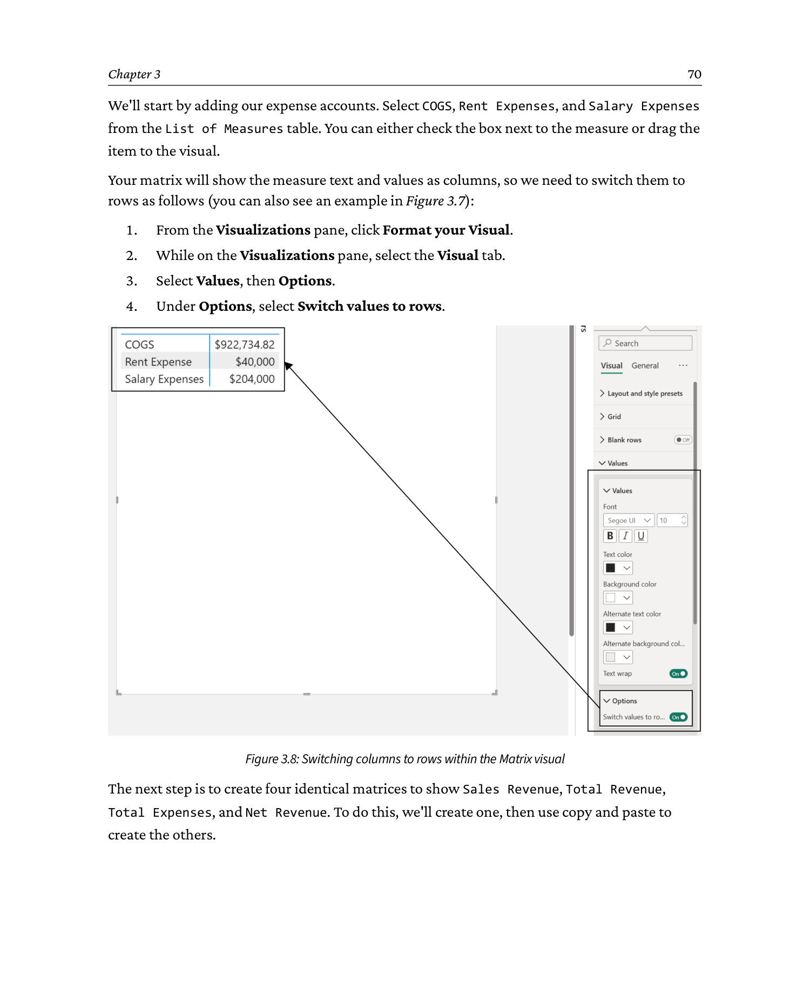

```
   Switching columns to rows within the Matrix visual

   Visualizations pane | Visual tab | Values | Options
   +------------------------------------------------------+
   |  Format your visual  [Visual] [Format]               |
   |------------------------------------------------------|
   |  > Values                                              |
   |      + Add data fields                                 |
   |      + Options                                         |
   |          - Switch values to rows      [ ON ]   <--    |
   |          - Show items with no data     [ ]            |
   |          - Preserve formatting          [ ]            |
   |          ...                                           |
   +------------------------------------------------------+
```


The next step is to create four identical matrices to show Sales Revenue, Total Revenue, Total Expenses, and Net Revenue. To do this, we'll create one, then use copy and paste to create the others.

Start by creating another matrix and add a `Sales Revenue` measure. You'll then need to create a new measure called `Blank` as follows:

```dax
Blank = BLANK()
```

Then, add the `Blank` measure to the matrix, which will look like this:

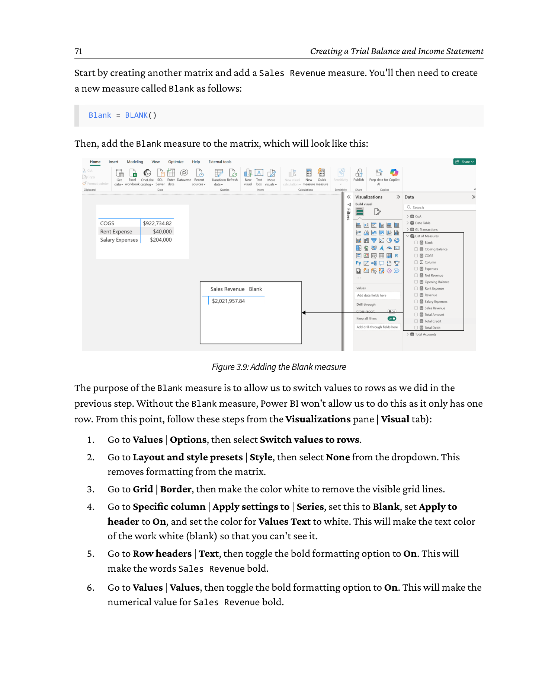

```
   Adding the Blank measure

   Create a new measure:
   +----------------------------+
   | Blank = BLANK()            |
   +----------------------------+

   Add the Blank measure to the matrix (it produces an empty cell
   whose only purpose is to enable Switch values to rows when the
   matrix has only one real row).

   +--------------------------------+
   | Sales Revenue                  |
   +--------------------------------+
   |           (blank)              |
   +--------------------------------+
```


The purpose of the `Blank` measure is to allow us to switch values to rows as we did in the previous step. Without the `Blank` measure, Power BI won't allow us to do this as it only has one row. From this point, follow these steps from the Visualizations pane | Visual tab):

1. Go to *Values | Options*, then select *Switch values to rows*.
2. Go to *Layout and style presets | Style*, then select *None* from the dropdown. This removes formatting from the matrix.
3. Go to *Grid | Border*, then make the color white to remove the visible grid lines.
4. Go to *Specific column | Apply settings to | Series*, set this to `Blank`, set *Apply to header* to *On*, and set the color for *Values Text* to white. This will make the text color of the work white (blank) so that you can't see it.
5. Go to *Row headers | Text*, then toggle the bold formatting option to *On*. This will make the words Sales Revenue bold.
6. Go to *Values | Values*, then toggle the bold formatting option to *On*. This will make the numerical value for Sales Revenue bold.

Your matrix will look like the example in *Figure 3.10*:

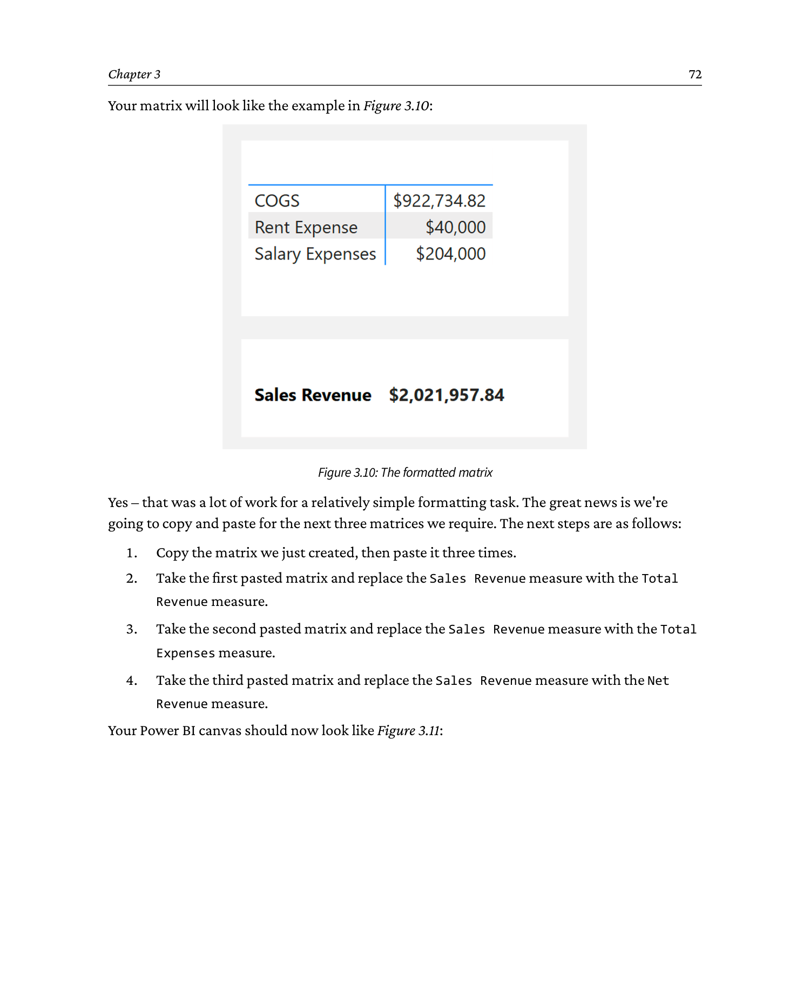

```
   The formatted matrix

   +--------------------------------+
   | Sales Revenue                  |   <- row label is bold
   |         85,000.00              |   <- value is bold
   +--------------------------------+

   No grid lines, no style preset, blank column hidden via white
   text on white background.  This is the master matrix that we
   copy/paste three times for the other sections.
```


Yes - that was a lot of work for a relatively simple formatting task. The great news is we're going to copy and paste for the next three matrices we require. The next steps are as follows:

1. Copy the matrix we just created, then paste it three times.
2. Take the first pasted matrix and replace the `Sales Revenue` measure with the `Total Revenue` measure.
3. Take the second pasted matrix and replace the `Sales Revenue` measure with the `Total Expenses` measure.
4. Take the third pasted matrix and replace the `Sales Revenue` measure with the `Net Revenue` measure.

Your Power BI canvas should now look like *Figure 3.11*:

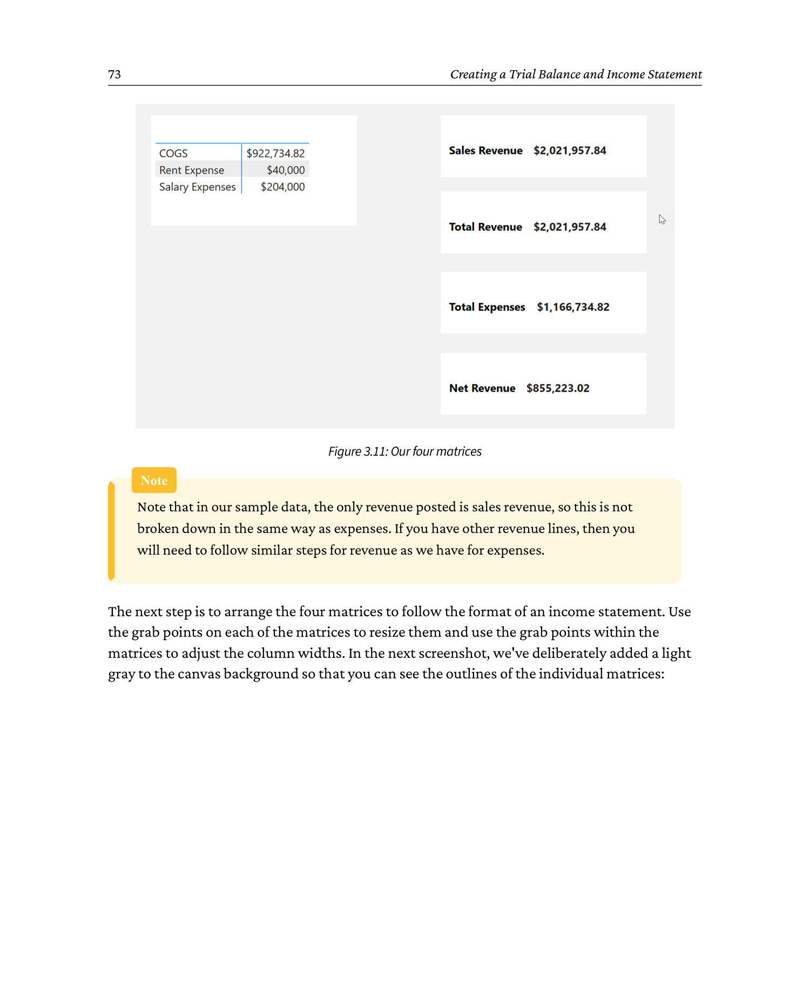

```
   Our four matrices (the raw layout before positioning)

   +----------------------+   +----------------------+
   | COGS                 |   | Rent Expenses        |
   |         12,500.00    |   |        4,800.00      |
   +----------------------+   +----------------------+
   +----------------------+   +----------------------+
   | Salary Expenses      |   |                      |
   |         22,000.00    |   |                      |
   +----------------------+   +----------------------+
                       (the two empty placeholders are the Sales Revenue
                        / Total Revenue / Total Expenses / Net Revenue
                        matrices, in various stages of build)
```


The next step is to arrange the four matrices to follow the format of an income statement. Use the grab points on each of the matrices to resize them and use the grab points within the matrices to adjust the column widths. In the next screenshot, we've deliberately added a light gray to the canvas background so that you can see the outlines of the individual matrices:

> **Note:** In our sample data, the only revenue posted is sales revenue, so this is not broken down in the same way as expenses. If you have other revenue lines, then you will need to follow similar steps for revenue as we have for expenses.

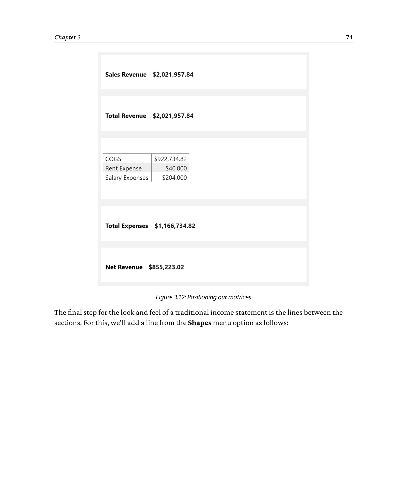

```
   Positioning our matrices (canvas background shown light gray)

   +==================================================================+
   |                       INCOME STATEMENT                            |
   +==================================================================+
   |   COGS                  |                                          |
   |        12,500.00        |   Rent Expenses                          |
   |                          |        4,800.00                         |
   +----------------------+----------------------------------------------+
   |   Salary Expenses     |                                            |
   |        22,000.00      |   <blank placeholders for Total Revenue,  |
   +----------------------+   Total Expenses, and Net Income go below>   |
   +==================================================================+

   Resize each matrix by its corner grab point; align the
   left edges and the column widths.
```


The final step for the look and feel of a traditional income statement is the lines between the sections. For this, we'll add a line from the Shapes menu option as follows:

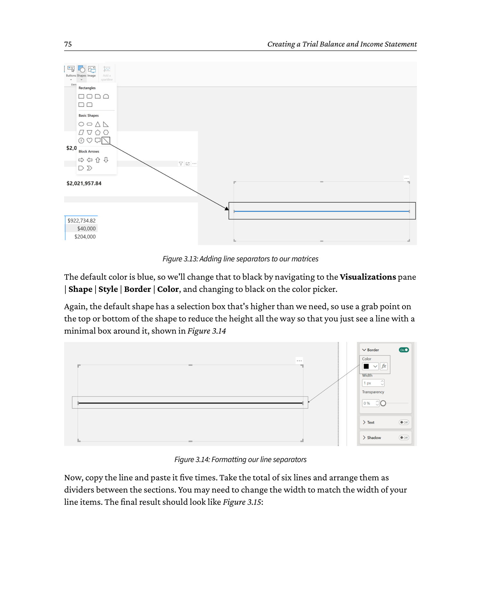

```
   Adding line separators to our matrices

   Insert tab | Shapes  -> pick the line shape
   +------------------------------------------------------------------+
   |  Insert | Modeling | View | Optimize | Help                     |
   |------------------------------------------------------------------|
   |  +-------+  +-------+  +-------+  +-------+                      |
   |  | Text  |  | Image |  | Shape |  | Button|                      |
   |  +-------+  +-------+  +-------+  +-------+                      |
   |                       ^^^^^^^^                                    |
   |                       pick the "Line" shape here                 |
   +------------------------------------------------------------------+

   The default shape is blue.  We change Border | Color to black.
   A line is dropped on the canvas between sections.
```


The default color is blue, so we'll change that to black by navigating to the Visualizations pane | Shape | Style | Border | Color, and changing to black on the color picker.

Again, the default shape has a selection box that's higher than we need, so use a grab point on the top or bottom of the shape to reduce the height all the way so that you just see a line with a minimal box around it, shown in *Figure 3.14*:


```
   Formatting our line separators

   +----------+
   |  ----    |  <-- selection box is much taller than the line
   |  ----    |      itself; we drag the top/bottom grab points
   |  ----    |      all the way in so only the line remains
   |  ----    |
   +----------+

   Result:

   ____________  <--  a single thin horizontal line, with
                       a minimal selection rectangle around it
```


Now, copy the line and paste it five times. Take the total of six lines and arrange them as dividers between the sections. You may need to change the width to match the width of your line items. The final result should look like *Figure 3.15*:

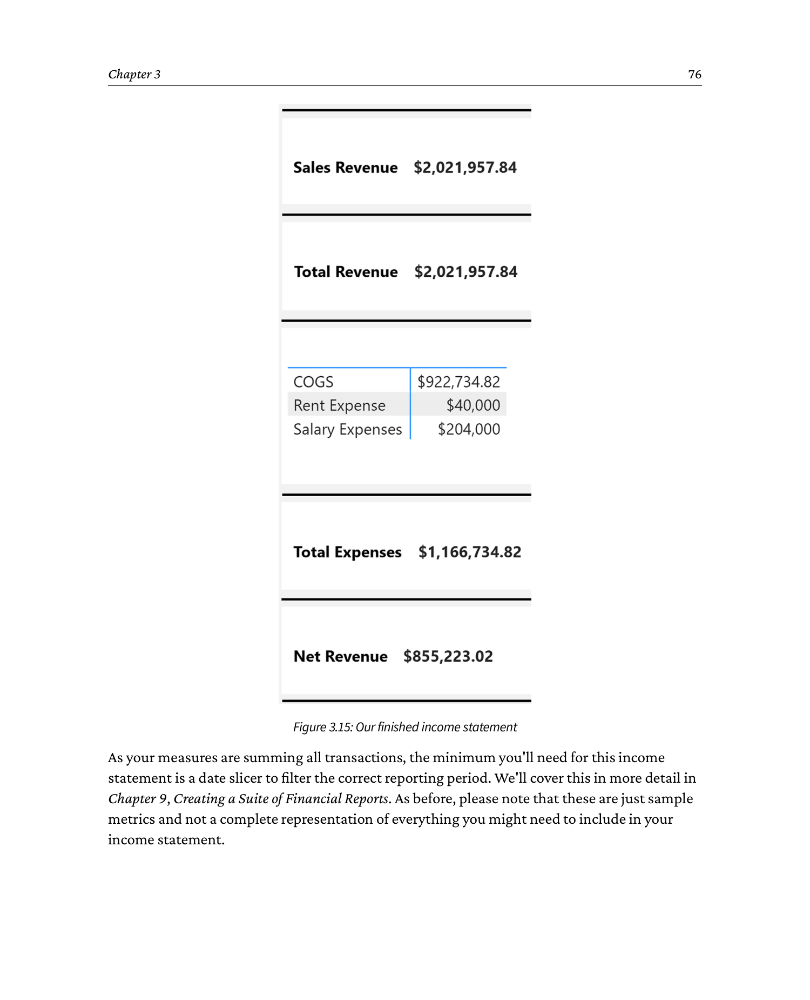

```
   Our finished income statement

   +======================================================================+
   |                       INCOME STATEMENT                                |
   +======================================================================+
   |   COGS                  |   Rent Expenses                              |
   |        12,500.00        |        4,800.00                               |
   +----------------------------------------------------------------------+
   |   Salary Expenses       |                                              |
   |        22,000.00        |                                              |
   +--------------------------------+-------------------------------------+
   |   Sales Revenue          |       85,000.00                            |
   +--------------------------------+-------------------------------------+
   |   Total Revenue          |       85,000.00                            |
   +--------------------------------+-------------------------------------+
   |   Total Expenses         |       39,300.00                            |
   +--------------------------------+-------------------------------------+
   |   Net Income             |       45,700.00                            |
   +--------------------------------+-------------------------------------+

   (Numbers shown are illustrative - actual values come from the
   semantic model filtered by the date slicer.)
```


As your measures are summing all transactions, the minimum you'll need for this income statement is a date slicer to filter the correct reporting period. We'll cover this in more detail in *Chapter 9, Creating a Suite of Financial Reports*. As before, please note that these are just sample metrics and not a complete representation of everything you might need to include in your income statement.

In this example, we've built a very traditional and simple income statement. You may choose to use the Matrix visual in Power BI so that you can have more interactivity. There are many versions on this theme, so please feel free to experiment with the examples in the book to better suit your organization.

In this section, we got started with DAX measures and visualizations to build our income statement. In the next section, we're going to extend our Power BI skills by building a trial balance.

## 3.4 Creating a trial balance

Now that we have an income statement, the next foundation in financial reporting is a Trial Balance. This is a report that will exist in all accounting systems, so we might well pose the question, Why create this ourselves? There are reasons why we might want to create a Trial Balance report in Power BI:

- We're consolidating across different systems, and each system will have its own Trial Balance. One way to get an organization-wide Trial Balance is to create one ourselves.
- We're reconciling our semantic model in Power BI back to the accounting system. If the trial balance in Power BI and the Trial Balance in our accounting system match, we have high confidence in the integrity of our data.
- It enables us to carry out an accuracy check to ensure that total debits equal total credits, helping to identify errors in the ledger.
- It helps with error detection to aid in pinpointing discrepancies or mistakes in journal entries and accounts.
- It serves as a preliminary step in preparing financial statements, providing a summary of account balances.
- It facilitates the auditing process by providing a clear overview of account balances.
- It serves as a management tool to assist management in assessing the overall financial position and performance of the organization.
- It helps identify accounts that need adjustments before finalizing financial statements.

A trial balance report is essential for ensuring the accuracy of financial records, as it helps identify discrepancies and confirms that total debits equal total credits, thereby supporting the integrity of the accounting process.

Creating a trial balance itself is easier than creating an income statement, since we use the Matrix visual to show the four basic measures we need:

- Opening Balance
- Debit
- Credit
- Closing Balance

These can then be used directly in the matrix and grouped by account code.

### 3.4.1 Steps to create our Trial Balance

Our first step is to create a new calculated column in our model that shows both Account Number and Account Name. We do this for readability and are going to select the Chart of Account table. Click on *New Calculated Column*, and use the following DAX, as shown in *Figure 3.16*:

```dax
Account Number and Name = 'Chart of Account'[AccountNumber] & "-" & 'Chart of Account'[AccountName]
```

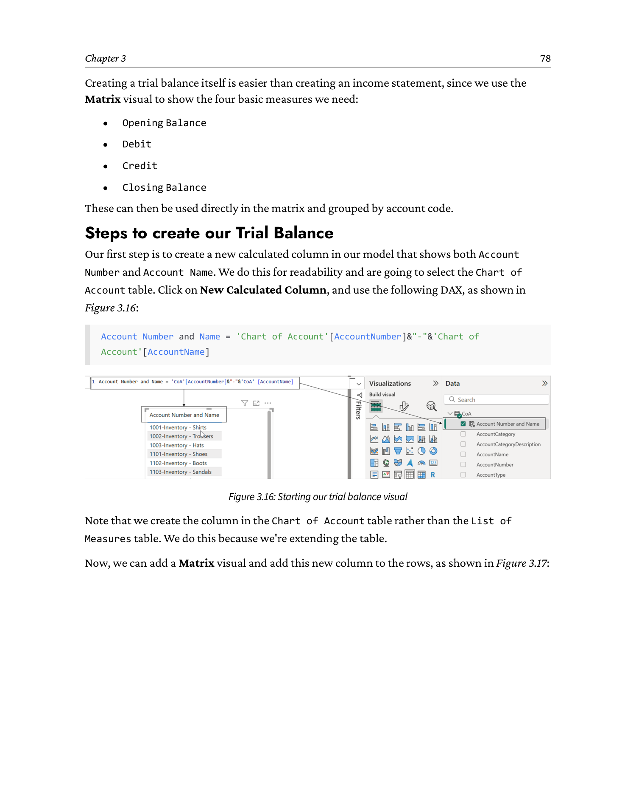

```
   Starting our trial balance visual

   Step 1:  New calculated column on the Chart of Account table.
            Click New Calculated Column, then type:

   +----------------------------------------------------------------+
   | Account Number and Name =                                     |
   |     'Chart of Account'[AccountNumber] & "-" &                 |
   |     'Chart of Account'[AccountName]                           |
   +----------------------------------------------------------------+

   The new column appears inside the Chart of Account table; it
   joins the account number with the account name for readability
   (e.g. "4001 - Shirt sales").
```


Note that we create the column in the Chart of Account table rather than the List of Measures table. We do this because we're extending the table.

Now, we can add a Matrix visual and add this new column to the rows, as shown in *Figure 3.17*:

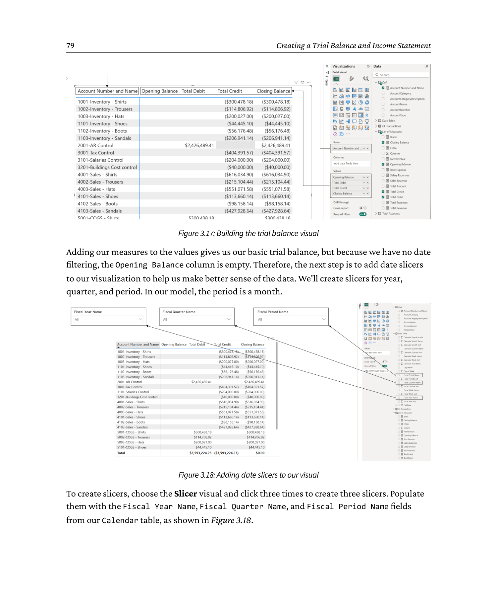

```
   Building the trial balance visual

   Add a Matrix visual; drag fields to:
     Rows      ->  Account Number and Name
     Values    ->  Opening Balance, Debit, Credit, Closing Balance

   +--------------------------------+----------+---------+---------+----------+
   | Account Number and Name        | Open Bal. | Debit   | Credit  | Close    |
   +--------------------------------+----------+---------+---------+----------+
   | 4001 - Shirt sales             |          | 10,000  |         |          |
   | 4002 - Trouser sales           |          |  5,000  |         |          |
   | 4003 - Hat sales               |          |  2,000  |         |          |
   | 4010 - Total clothing revenue  |          |         | 17,000  |          |
   +--------------------------------+----------+---------+---------+----------+

   Opening Balance is empty until we add date slicers.
```


Adding our measures to the values gives us our basic trial balance, but because we have no date filtering, the Opening Balance column is empty. Therefore, the next step is to add date slicers to our visualization to help us make better sense of the data. We'll create slicers for year, quarter, and period. In our model, the period is a month.


```
   Adding date slicers to our visual

   +------------------+   +-------------------+   +--------------------+
   | Fiscal Year Name |   | Fiscal Quarter    |   | Fiscal Period      |
   |------------------|   |-------------------|   |--------------------|
   | 2024       [v]   |   |  Q1 2024      [v] |   |  Jan 2024      [v] |
   +------------------+   +-------------------+   +--------------------+

   Three slicers - one for year, one for quarter, one for period -
   all drawn from the Calendar table's fiscal hierarchy.  Period in
   this model is a month.  Once added, the Opening Balance
   column starts to populate.
```


To create slicers, choose the Slicer visual and click three times to create three slicers. Populate them with the `Fiscal Year Name`, `Fiscal Quarter Name`, and `Fiscal Period Name` fields from our Calendar table, as shown in *Figure 3.18*.

You'll notice the periods are not ordered correctly, so we need to address this. Go to the Data panel and navigate to the Calendar table. Then, select the `Fiscal Period Name` column and choose *Sort By Column*. Now, choose `Fiscal Period Sort`.

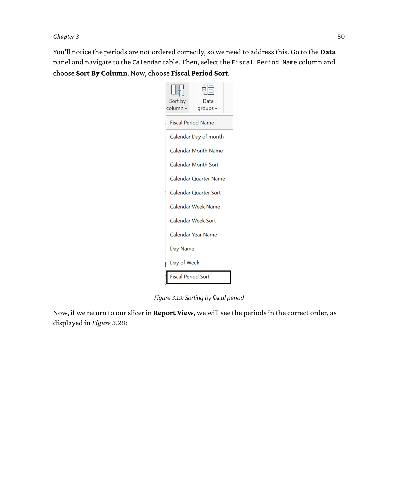

```
   Sorting by fiscal period

   Data panel | Calendar table | Fiscal Period Name column
   +--------------------------------------------------+
   |  Fiscal Period Name                              |
   |  Fiscal Period Sort   <-- right-click -> Sort    |
   |                          by column -> this one   |
   +--------------------------------------------------+

   The fiscal periods are stored as text ("January", "February"...),
   which sorts alphabetically.  We need to sort them chronologically,
   so we point Sort By Column to the numeric Fiscal Period Sort
   helper column.
```


Now, if we return to our slicer in Report View, we will see the periods in the correct order, as displayed in *Figure 3.20*:

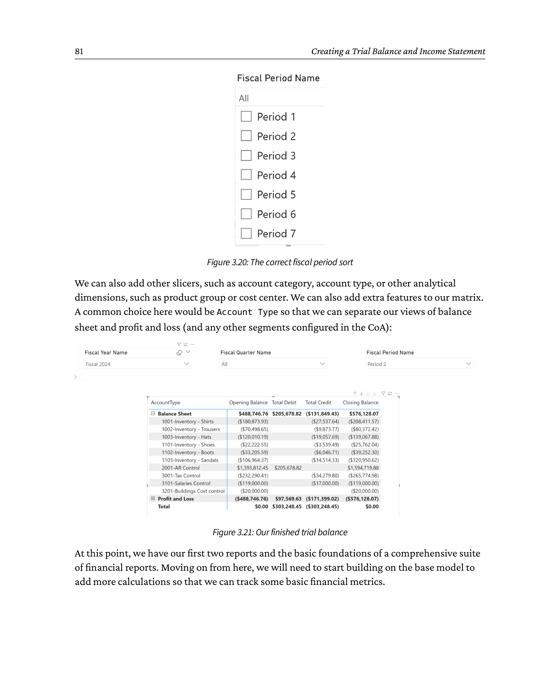

```
   The correct fiscal period sort (now in chronological order)

   +--------------------+
   | Fiscal Period      |
   |--------------------|
   |  Jan 2024     [v]  |
   |  Feb 2024          |
   |  Mar 2024          |
   |  Apr 2024          |
   |  May 2024          |
   |  Jun 2024          |
   |  Jul 2024          |
   |  Aug 2024          |
   |  Sep 2024          |
   |  Oct 2024          |
   |  Nov 2024          |
   |  Dec 2024          |
   +--------------------+

   The slicer is now in calendar order, not alphabetical.  Same trick
   applies to Fiscal Quarter Name (Q1, Q2, Q3, Q4) and Fiscal Year
   Name (2023, 2024, 2025...).
```


We can also add other slicers, such as account category, account type, or other analytical dimensions, such as product group or cost center. We can also add extra features to our matrix. A common choice here would be Account Type so that we can separate our views of balance sheet and profit and loss (and any other segments configured in the CoA):


```
   Our finished trial balance

   +================+=========+===========+==========+==========+==========+
   | Acct No - Name | Open    | Debit     | Credit   | Close    | AcctType |
   +================+=========+===========+==========+==========+==========+
   | 1000 - Cash    |  5,000  |  12,000   |  -8,000  |  9,000   | B/S      |
   | 1200 - AR      |  3,500  |   9,500   |  -7,200  |  5,800   | B/S      |
   | 2000 - AP      | -2,000  |  -4,200   |   6,500  | -2,300   | B/S      |
   +----------------+---------+-----------+----------+----------+----------+
   | 4001 - Shirts  |     0   |  10,000   |         |  10,000  | P&L      |
   | 4002 - Trsr    |     0   |   5,000   |         |   5,000  | P&L      |
   | 4003 - Hats    |     0   |   2,000   |         |   2,000  | P&L      |
   | 6101 - Rent    |     0   |           |  -4,800  |  -4,800  | P&L      |
   | 7000 - Salary  |     0   |           | -22,000  | -22,000  | P&L      |
   | 8000 - COGS    |     0   |           | -12,500  | -12,500  | P&L      |
   +================+=========+===========+==========+==========+==========+
   | TOTAL          |  6,500  |  24,300   | -48,000  | -17,200  |          |
   +================+=========+===========+==========+==========+==========+

   Filtered by the year/quarter/period slicers; grouped by the
   AccountType column so Balance Sheet (B/S) and P&L are
   visually separate.
```


At this point, we have our first two reports and the basic foundations of a comprehensive suite of financial reports. Moving on from here, we will need to start building on the base model to add more calculations so that we can track some basic financial metrics.

This report can now be used with slicers and filters to enable dynamic analysis, allowing users to easily drill down into specific accounts and periods for a more detailed understanding of financial performance.

The final state of this report can be found in the GitHub repository, in the Power BI file named `Chapter 3 - Final.pbix`: https://github.com/PacktPublishing/Financial-Modeling-with-Power-BI_Packt/tree/main/Chapter3.

## 3.5 Summary

In this chapter, we continued to work on the semantic model from the previous chapter by building DAX measures and Power BI visuals to develop basic income statement and trial balance reports. You learned the difference between a calculated column and a measure and where to use both. Then, we added essential DAX measures into the semantic model to support the production of financial reports. Finally, we saw how to use some of the visual components of Power BI for financial reporting.

In the next chapter, we will help to expand your use of DAX by explaining some common DAX measures used in financial reporting.

---

> **Note: Get this book's PDF version and more**
>
> Scan the QR code (or go to https://www.packtpub.com/unlock). Search for this book by name, confirm the edition, and then follow the steps on the page.

> **Note:** Keep your invoice handy. Purchases made directly from Packt don't require an invoice.

---

_Generated by `convert_chapter3.py` + `build_chapter3_md.py` on 2026-06-16._
