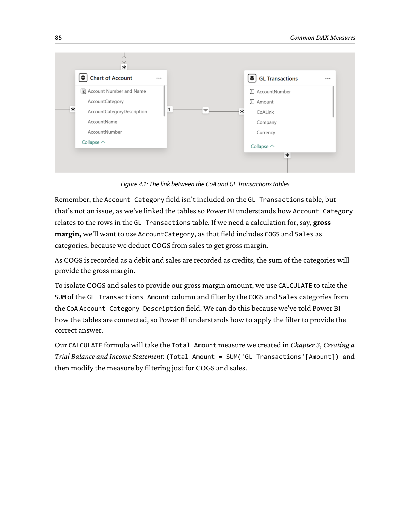
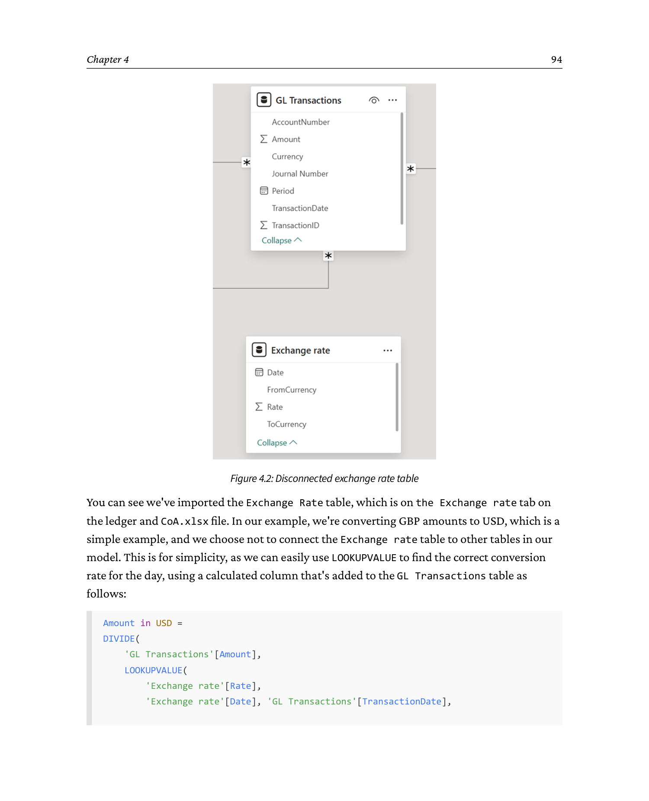
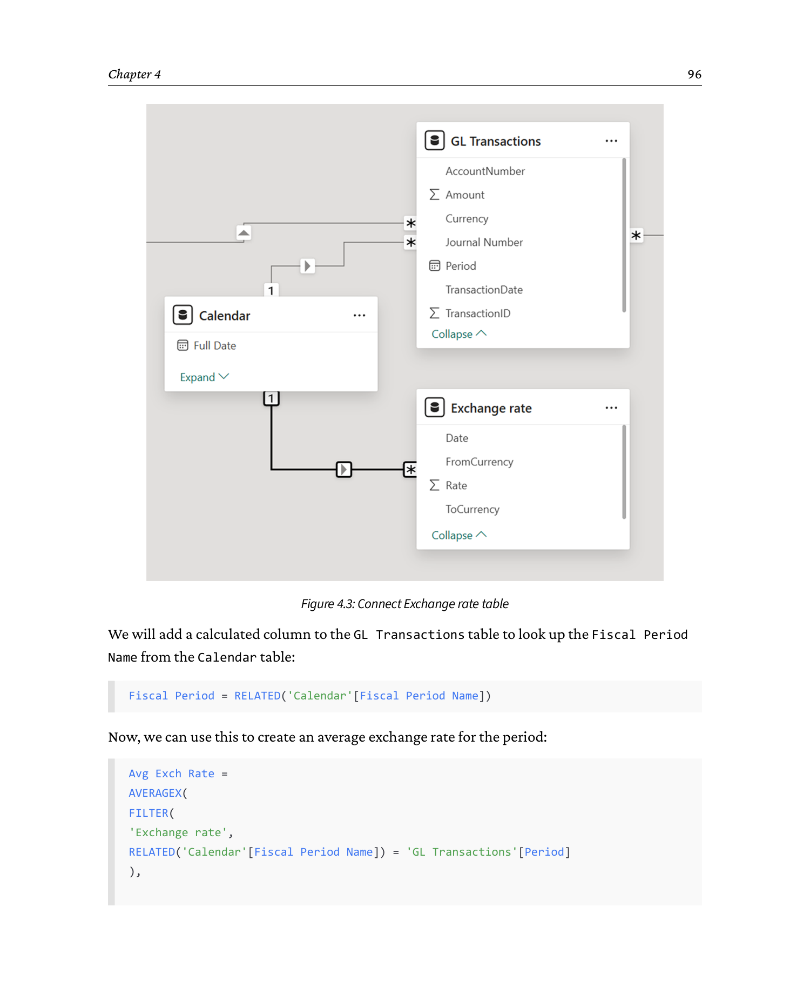
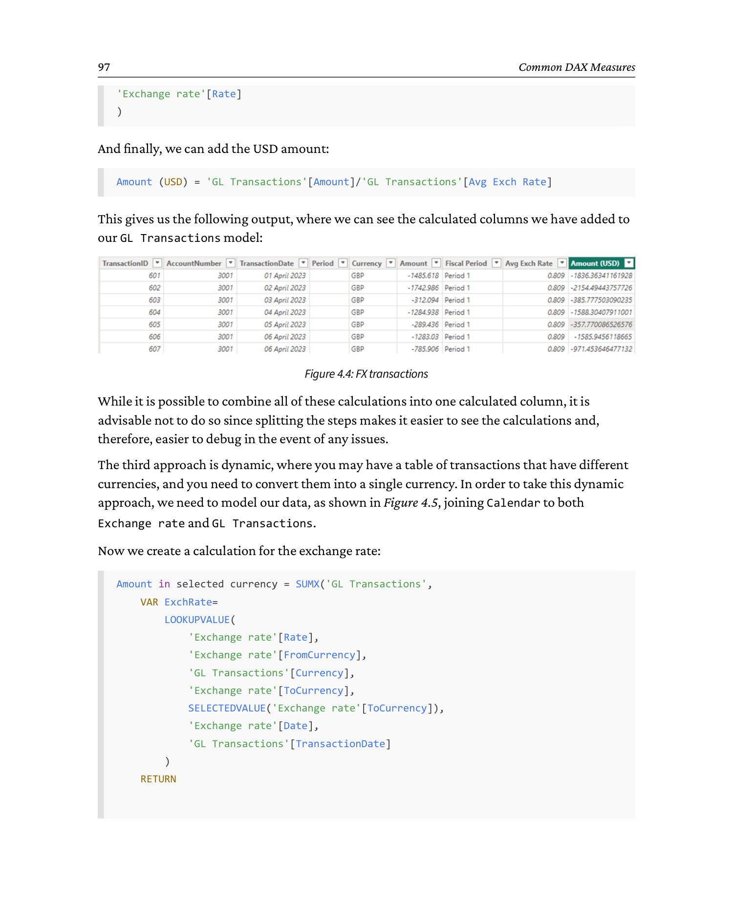
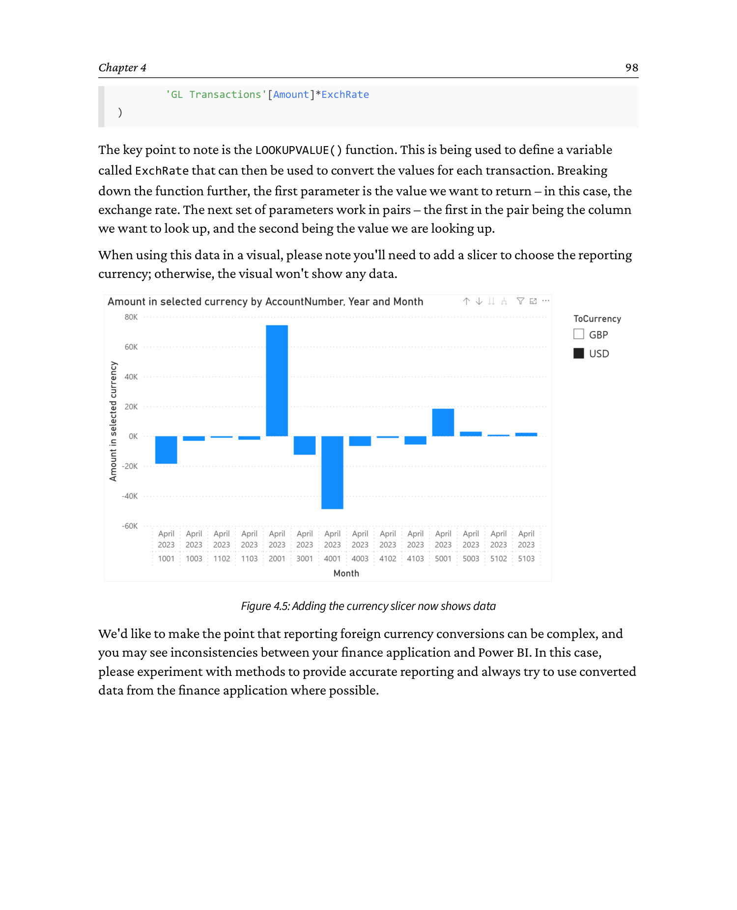

# Chapter 4: Common DAX Measures

**Source: *Financial Modeling and Reporting with Microsoft Power BI* (Packt Publishing, 2026)**

DOI: 10.0000/PACKT_FMRWPB_2026  |  GitHub: https://github.com/PacktPublishing/Financial-Modeling-with-Power-BI_Packt/tree/main/Chapter4

_Page range: 112 - 129_

In *Chapter 3, Creating a Trial Balance and Income Statement*, we started to apply DAX to populate visualizations for the Trial Balance and Income Statement reports. In this chapter, we're going to build on that work by introducing some of the most common DAX measures that finance professionals use. The intention is to maintain the momentum of the previous chapter by going deeper into the DAX language to develop your skills through the applied use of DAX.

We started gently in *Chapter 3, Creating a Trial Balance and Income Statement*, with a few step-by-step examples. As we're working on the basis that readers of this book already have some DAX knowledge, we're going to pick up the pace and focus on how to write and use DAX without step-by-step guides. By now, you know how to add measures and write DAX, so you'll be able to apply our examples.

We'll start by introducing the `CALCULATE` function. After that, we'll cover percentages and time intelligence, and end with DAX functions for foreign exchange. We also recommend using one of the many DAX guides available to understand these functions in depth to accompany this chapter. Our intention is to introduce these concepts in the context of financial reporting as opposed to being a lengthy or definitive guide, so please supplement this chapter as required with additional resources to deeply understand how the DAX commands work.

By the end of the chapter, you will do the following:

- Appreciate the importance of `CALCULATE` as a DAX function and begin to understand the importance of `CALCULATE` within financial reporting and more broadly
- Understand how to use DAX for the calculation of percentages within your financial reports
- Learn how to use DAX for time-based comparisons such as month-on-month and year-on-year, including comparisons for non-standard reporting calendars such as 4-4-5
- Understand how to apply DAX to foreign exchange calculations

---

## Technical requirements

If you wish to follow along with the calculations in this chapter, start with the `Chapter3 - Final.pbix` file in the `Chapter3` folder of the GitHub repository: https://github.com/PacktPublishing/Financial-Modeling-with-Power-BI_Packt/tree/main/Chapter3.

The final state of the model at the end of this chapter can be found in the `Chapter 4` folder, called `Chapter4 - Final.pbix`: https://github.com/PacktPublishing/Financial-Modeling-with-Power-BI_Packt/tree/main/Chapter4.

---

## 4.1 Introducing CALCULATE

The `CALCULATE` function is one of the most powerful and versatile functions in DAX. It plays a pivotal role in crafting financial calculations and enabling users to redefine the filter context dynamically within a calculation.

OK, what does that mean, especially the "filter context" part?

When we discuss "filter context" in DAX, we generally refer to how we use filters to show subsets of data. In *Chapter 3, Creating a Trial Balance and Income Statement*, we added slicers to the Trial Balance report for Year, Quarter, and Period. Slicers are filters that allow users to interact with reports and show subsets of data, such as data for a particular fiscal period, such as June 2024. Filtering report data can be performed onscreen through slicers or on the Filter panel. We can also build filters directly into our DAX. We did this in *Chapter 3, Creating a Trial Balance and Income Statement*, where we used `SUMX` and `FILTER` together.

There are times when you don't want users to use onscreen filters for certain data. For instance, we often want visuals in Power BI reports to be specific. For example, we may have a metric for sales of shirts in the USA, labeled onscreen as *Sales of Shirts in the USA*. For the integrity of the metric, we don't want users to be able to apply a filter that adds, for example, hat sales to that metric. Therefore, we need a method to maintain the context of that filter, or the *filter context*. `CALCULATE` allows us to do this.

While `CALCULATE` is often categorized as an advanced DAX function and is typically introduced later in DAX tutorials, its importance to financial reporting means we need to cover it early in this book.

To further illustrate this concept, let's consider a gross margin example. In our financial model, we have the CoA table linked to the GL Transactions table via a one-to-many relationship on the `AccountNumber` field. This setup allows us to perform calculations and aggregations that respect the relationships between tables, as shown in *Figure 4.1*:



```
   The link between the CoA and GL Transactions tables
   (Relationship View, 1 : *  on AccountNumber)

   +--------------------+ 1     * +----------------------+
   |  Chart of Account  |----------|   GL Transactions    |
   |--------------------|          |----------------------|
   |  AccountNumber (K) |          |  AccountNumber  (FK) |
   |  AccountName       |          |  TransactionDate     |
   |  AccountCategory   |          |  Amount              |
   |  AccountType       |          |  Description         |
   |  ...               |          |  ...                 |
   +--------------------+          +----------------------+

   Lookup direction:  CoA (1)  -->  GL Transactions (*)
   Cross-filter:       single (one-to-many)

   Because of this relationship we can write
       CALCULATE( [Total Amount],
                  FILTER( 'Chart of Account',
                          'Chart of Account'[AccountCategory] = "SALES" ) )
   and Power BI will automatically fan the filter out to the GL Transactions
   table - no join logic in the measure itself.
```


Remember, the `Account Category` field isn't included on the GL Transactions table, but that's not an issue, as we've linked the tables so Power BI understands how `Account Category` relates to the rows in the GL Transactions table. If we need a calculation for, say, gross margin, we'll want to use `AccountCategory`, as that field includes COGS and Sales as categories, because we deduct COGS from sales to get gross margin.

As COGS is recorded as a debit and sales are recorded as credits, the sum of the categories will provide the gross margin.

To isolate COGS and sales to provide our gross margin amount, we use `CALCULATE` to take the `SUM` of the GL Transactions `Amount` column and filter by the COGS and Sales categories from the CoA `Account Category Description` field. We can do this because we've told Power BI how the tables are connected, so Power BI understands how to apply the filter to provide the correct answer.

Our `CALCULATE` formula will take the `Total Amount` measure we created in *Chapter 3, Creating a Trial Balance and Income Statement* (`Total Amount = SUM('GL Transactions'[Amount])`) and then modify the measure by filtering just for COGS and sales.

The formula looks like this:

```dax
Gross Margin =
CALCULATE(
    [Total Amount],
    FILTER(
        'Chart of Account',
        'Chart of Account'[AccountCategory] = "SALES" ||
        'Chart of Account'[AccountCategory] = "COGS"
    )
) * -1
```

> **Note:** We are multiplying by -1 so that the figure is shown as a positive number for clarity in visuals.

In this case, the `CALCULATE` formula is reasonably simple and straightforward to read. Let's dissect it further:

- It asks Power BI to calculate the total amount, but only show the data for sales and COGS
- The `||` symbol tells Power BI that the calculation is "or" rather than "and"

Here, the result is a measure that calculates gross margin dynamically, respecting any filters applied to the report, such as date ranges, regions, or product categories. There may be times when we need to ignore the filters; we'll look at a few examples later.

To take another example, let's look at revenue.

### 4.1.1 Revenue

We briefly looked at revenue in *Chapter 3, Creating a Trial Balance and Income Statement*, when we created the total sales revenue. In that example, we only had one category in our chart of accounts. We may have other income streams, such as shipping and handling.

There are two ways to approach this - either to create measures for each income category and add them up, or we can create a measure that incorporates more categories into our revenue measure, like this:

```dax
Total Revenue = CALCULATE(
    [Total Amount],
    FILTER(
        'Chart of Account',
        'Chart of Account'[AccountCategory] = "SALES" ||
        'Chart of Account'[AccountCategory] = "OTHERINC"
    )
) * -1
```

Again, we use the `||` symbol, meaning "or," so this measure filters the total amount where the account category is `SALES` or `OTHERINC`. Of course, if you want to see both categories separately on your income statement, you will want to calculate each separately and add them in a further measure.

This section has been a concise and relatively gentle introduction to the use of `CALCULATE`. Its application can be far more complex, and often is. Later, in the *Time intelligence* sub-section, we have some similar, easy-to-digest examples of `CALCULATE` to help introduce the command. A comprehensive examination of the `CALCULATE` function is beyond the scope of this book. Its importance to DAX cannot be underestimated, and we encourage you to explore its application within your own DAX models.

We're going to now cover a subject that should be familiar to most of you, percentages and the `DIVIDE` function.

## 4.2 Percentages

Percentages and ratios are fundamental in financial analysis, serving as a universal language for expressing the financial health of an organization. Whether evaluating profitability, efficiency, or liquidity, these metrics provide a standardized way to compare performance across periods, departments, or companies.

The basis of percentages can be calculated very simply by dividing one number by another and formatting the measure as a percentage in Power BI. For example, gross margin can be calculated as follows:

```dax
Gross Margin % =
(
    ([Total Revenue] - [COGS]) / [Total Revenue]
)
```

Let's break down this formula:

- The numerator, `([Total Revenue] - [COGS])`, represents gross profit
- The denominator, `[Total Revenue]`, ensures the result is expressed as a proportion of total revenue

We can choose to multiply the measure by 100 at the end of the formula to provide the percentage, or we can format our measure as a percentage within Power BI.

> **Note:** We generally choose to format the percentage in Power BI since we can use this measure within other measures, so it's disadvantageous to include the multiplication by 100.

When calculating percentages, in most circumstances, a simple divide (`/`) will work, although we can experience problems if total sales revenue is 0, as we're asking Power BI to divide by 0, which will generate an error.

Generally, this is unlikely, but it does happen, and we advise taking some steps to make the formula more robust so users don't experience errors in the event of a divide by 0.

The first method is to use the `DIVIDE` function in DAX, which is a "safe" divide as it avoids errors if the denominator is blank or zero.

```dax
Gross Margin % =
DIVIDE(
    [Total Revenue] - [COGS],
    [Total Revenue],
    0
)
```

In this case, if the value of the denominator is 0, then the last value will be returned instead of an error message - in this case, 0.

In some cases, you may want to use DAX to raise an error message because you want to identify data issues. In this case, use the `IF` and `ERROR` functions, such as in the following DAX example:

```dax
Gross Margin % =
IF(
    [Total Revenue] = 0,
    ERROR("Not defined - total revenue is 0 within this filter"),
    ([Total Revenue] - [COGS]) / [Total Revenue]
)
```

Here, if the total sales revenue in the current context of the report is 0, then the error message will be returned; otherwise, the calculation will be used.

For the remainder of this book, to maintain brevity, we will use the `DIVIDE` function for all ratio and percentage measures.

Percentages are at the core of our financial calculations. The next essential function we'll cover is time intelligence. We've already looked at some basic time-based aspects of our semantic model, such as the calendar table and date slicers. We'll explore them in more detail in the next section by showing you how to do time-based comparative calculations.

## 4.3 Time intelligence

In order to track how financial metrics are changing, we need to track our data over time, by using Power BI's time intelligence functions.

We will focus our attention on two ideas: period-to-date and period-on-period change. The ideas behind these can be extended to more use cases. The examples here will use revenue, but again, you can substitute any measure into these, such as accounts receivable or inventory.

Before we start, we use the words "easy" and "hard" deliberately. Power BI has a full set of time intelligence features that work with our standard calendars. If your organization uses standard calendars, Power BI's functions make time intelligence very easy. That can extend to offset fiscal years, such as starting the fiscal year in July, instead of January. We must make some adjustments to the calendar table, but it's still straightforward, fitting into the "easy" category.

The "hard" way is necessary when using alternate financial calendars, such as 4-4-5 quarters, as they don't use standard months. Accommodating these calendars takes more work, but it's achievable, and we document methods to do this.

### 4.3.1 Period to date - the easy way

If your financial calendar aligns with the regular (Gregorian) calendar, Power BI's built-in time intelligence functions are probably the easiest way to build period-to-date (and by extension, quarter-to-date, and year-to-date) calculations. Here, we will see how to use the `TOTALMTD` function to calculate month-to-date revenue. Here's a DAX example:

```dax
Revenue MTD =
TOTALMTD(
    [Total Revenue],
    'Calendar'[Full Date],
    ALL('Calendar')
)
```

Let's break down this measure:

- We start with the DAX function `TOTALMTD`, which means total month to date
- The second component is the amount, and we use the measure we created earlier, which is `Total Revenue`
- We then need to provide the time component, which is the `Full Date` column from our calendar table, which provides the full date for each day, row by row
- Finally, we add the `ALL` function as a filter to the calculation that removes or ignores any other date filters

The `ALL` function has the effect of removing any applied date filters from Power BI. Why do this?

We add this as a safeguard against users applying filters that are less than one month, which can provide misleading data. If `TOTALMTD` is applied to, for example, a single day, Power BI will return what appears to be a month-to-date result for that single day. Most users would like to avoid this, so we add `ALL` to remove this risk.

DAX also includes quarter and year-to-date in the form of `TOTALQTD` and `TOTALYTD` functions. Both work in a similar manner, although `TOTALYTD` has a fourth parameter, which is the year-end date.

### 4.3.2 Period to date - the hard(er) way

Some users may find that the default `TOTALMTD` function does not cater to their corporate financial calendar; this is especially true if you use a 4-4-5 style financial calendar. In this case, we have to derive our own rolled-up functions based on our actual calendar. Here, we will look at how we can calculate month-to-date revenue using `CALCULATE` and some filters.

```dax
Revenue MTD =
CALCULATE(
    [Total Revenue],
    FILTER(
        ALL('Calendar'),
        'Calendar'[Full Date] <= MAX('Calendar'[Full Date]) &&
        'Calendar'[Fiscal Period Sort] = MAX('Calendar'[Fiscal Period Sort]) &&
        'Calendar'[Fiscal Year Sort] = MAX('Calendar'[Fiscal Year Sort])
    )
)
```

At first glance, this calculation might seem unusual, so let's break it down, step by step:

1. Once again, the `CALCULATE` function is used to adjust the behavior of the `Total Revenue` measure.
2. The `FILTER` function determines the specific subset of dates over which the `Total Revenue` measure is calculated, focusing on the dates within the current month.
3. To ensure other filters on the calendar table don't interfere, we use the `ALL` function to temporarily remove any existing filters. This gives us full control over the filtering logic.
4. The rest of the `FILTER` function allows us to define custom fiscal periods and years using the `Fiscal Period Sort` and `Fiscal Year Sort` columns from the calendar table. We use these fields within the calculation, but the important field where fiscal periods are set is `Fiscal Period Name`, which is a row-by-row mapping of fiscal period to a specific day of the year.

That's how we align our 4-4-5 reporting calendar, or other calendar options your organization may use.

This customization ensures that the calculation aligns with our fiscal calendar rather than the standard Gregorian calendar.

The inclusion of the `MAX` function ensures that all dates up to and including the current date are captured in the calculation. This is especially useful for creating dynamic, time-sensitive reports.

This approach provides flexibility by letting us categorize and view data based on fiscal periods and years. Additionally, since our calendar table includes a `Fiscal Quarter Sort` column, we can easily adapt the calculation to analyze data by fiscal quarters as well.

### 4.3.3 Period-on-period calculations

Again, we have easy and hard ways to do this, and again, your approach will depend on the alignment of your financial calendar with the regular calendar. Before we can get as far as showing the calculation, we need to establish current versus prior period actuals. In this context, we consider "current" to be the month we have currently selected in our report, and prior to be the period immediately before that.

Once again, we will start the easy way. The first part is to get the prior period revenue, and for this, we can use the `PARALLELPERIOD` function as follows:

```dax
Revenue (Prior Period) =
CALCULATE(
    [Total Revenue],
    PARALLELPERIOD(
        'Calendar'[Full Date],
        -1,
        MONTH
    )
)
```

Note that we don't have an `ALL` function here, as this time we will rely on the actual selected date. The calculation again takes our `Total Revenue` measure and modifies it. We use `PARALLELPERIOD` to look at the `Full Date` column in our calendar table and calculate the `Total Revenue` based on the prior month, hence the `-1`, `MONTH` component of the calculation, which asks Power BI to calculate based on the current month -1. The `-1` could be `-12` for the same month in the prior year, and `MONTH` could be `YEAR`.

We then use the following measure to calculate the net difference between periods:

```dax
Revenue Growth = [Total Revenue] - [Revenue (Prior Period)]
```

This method works well when your fiscal periods and years match the standard calendar. However, if your fiscal periods and years differ from the standard calendar, you'll need to adopt the following approach.

For this, we can build on the `Revenue MTD` measure from before. We use the `CALCULATE` function to modify `Revenue MTD`, then use `DATEADD` as a filter to shift the dates back 1 month for the calculation:

```dax
Revenue (Prior Month to Date) =
CALCULATE(
    [Revenue MTD],
    DATEADD(
        'Calendar'[Full Date],
        -1,
        MONTH
    )
)
```

Now we can calculate Revenue Growth as follows:

```dax
Revenue Growth = [Revenue MTD] - [Revenue (Prior Month to Date)]
```

When this is applied to complete months, the comparison will be between two complete months. When applied to incomplete months, we will see a comparison of similar periods.

This same technique can be applied to weeks, quarters, and years by changing the specific details.

Finally, if you are using a 4-4-5 accounting period pattern, this technique will not work. There are potential ways of getting comparisons, but we have chosen not to cover that here, as in that period structure, 2 out of 3 comparisons will be between a 4-week and a 5-week period, rendering the calculation meaningless. In those cases, you should look to measure growth on a weekly, quarterly, and yearly basis only.

We have kept the focus here on the most common forms of time intelligence - that is to say, period to date and period on period. In calculating period-on-period, we also covered a third common pattern - that of the time shift as we calculated the prior period (noting that all these calculations can be adapted to any type of period).

Now that we have seen the basic calculations and some time intelligence, you can build on these to create more complex and specific measures for your organization.

In the next section, we'll cover an area that will affect some of you - foreign exchange calculations.

## 4.4 Foreign exchange

In *Chapter 2, The Basic Model for Financial Reporting*, we looked at methods to manage foreign exchange in our data model and how it may be undesirable to use calculations in a data model that could differ from the calculations in your finance system(s). That said, it's often necessary to do some foreign exchange calculations, so we'll explain some methods.

To follow the examples in this chapter, you'll need the `Exchange Rate` tab of the `Ledger and CoA.xlsx` file in the `Chapter3` folder of this book's GitHub repository referenced at the start of this chapter.

In this section, we explain three methods for calculating foreign exchange using Power BI. Please use the method that matches your specific use case. The three methods are as follows:

1. Conversions based on a daily exchange rate where you're converting one currency to another
2. Conversions based on a calculated average of the exchange rate for a month, again based on a simple model of converting one currency to another
3. Dynamic conversions where the currency changes on a transaction-by-transaction basis, so DAX needs to identify the currency and apply the correct conversion rate

Of the three methods, the easiest approach is method 1, where we work out spot rates for each day with a fixed or single target currency. Let's assume that we have an exchange rate table in our model like this:



```
   Disconnected exchange rate table

   Data panel:
   +----------------+
   |  Chart of      |
   |  Account       |     +-------------+         +----------------+
   +----------------+     | Calendar    |         | GL             |
                          +-------------+         | Transactions   |
                                                  +----------------+
                          +----------------+      (none of the
                          | Exchange rate |       above connects
                          |  NOT LINKED   |       to Exchange rate)
                          +----------------+

   Table preview:
   +------------+---------------+-------------+--------+
   |    Date    | FromCurrency  | ToCurrency  |  Rate  |
   +------------+---------------+-------------+--------+
   | 2024-01-02 |      USD      |    GBP      | 0.7854 |
   | 2024-01-02 |      USD      |    EUR      | 0.9117 |
   | 2024-01-03 |      USD      |    GBP      | 0.7861 |
   | 2024-01-03 |      USD      |    EUR      | 0.9132 |
   |   ...      |     ...       |    ...      |  ...   |
   +------------+---------------+-------------+--------+

   We deliberately leave this table disconnected and use LOOKUPVALUE
   to reach into it from a calculated column on GL Transactions.
```


You can see we've imported the `Exchange rate` table, which is on the `Exchange rate` tab on the `Ledger and CoA.xlsx` file. In our example, we're converting GBP amounts to USD, which is a simple example, and we choose not to connect the `Exchange rate` table to other tables in our model. This is for simplicity, as we can easily use `LOOKUPVALUE` to find the correct conversion rate for the day, using a calculated column that's added to the GL Transactions table as follows:

```dax
Amount in USD =
DIVIDE(
    'GL Transactions'[Amount],
    LOOKUPVALUE(
        'Exchange rate'[Rate],
        'Exchange rate'[Date], 'GL Transactions'[TransactionDate],
        'Exchange rate'[FromCurrency], "USD"
    )
)
```

We are dividing here because we are converting from USD to GBP. If you convert from GBP to USD, you will multiply. The `LOOKUPVALUE` function is like `VLOOKUP` in Excel, but more powerful:

- The first argument represents the value we want to return - in this case, the exchange rate
- The next four values come in pairs; these are our conditions. The first pair is the column we are searching in, and the second is the value we are searching for

The expression is asking to "return the exchange rate where the date matches the transaction date on the current row, and the `FromCurrency` field is `USD`."

When you add converted amounts, you'll want to duplicate any measures previously created, clearly marking the converted currency. In this example, we create a USD version:

```dax
Total Debit (USD) =
SUMX(
    FILTER(
        'GL Transactions',
        'GL Transactions'[Amount] > 0
    ),
    'GL Transactions'[Amount in USD]
)
```

Our second example uses average rates. This can be an effective method to buffer against some of the reporting challenges discussed in *Chapter 2, The Basic Model for Financial Reporting*, where the finance application and Power BI reporting may have some differences. In this case, we would apply the same rate to all transactions in each month, so if an invoice is raised and paid in a month, all the offsets for that exchange would, in fact, balance back to the finance application.

This time, we need to join the exchange rate into the model via the calendar table, connecting the `Full Date` column from the Calendar table to the `Date` column of the Exchange rate table:



```
   Connect Exchange rate table (Relationship View)

   +----------------+  1   *  +----------------+  *   1 +----------------+
   |   Calendar     |---------| Exchange rate  |--------|  GL            |
   |----------------|         |----------------|        |  Transactions  |
   |  Date      (K) |         | Date     (FK1) |        | TransactionDate|
   |  Full Date     |         | FromCurrency  |        |  Amount        |
   |  FiscalYear    |         | ToCurrency    |        |  ...           |
   |  FiscalPeriod  |         |  Rate         |        |                |
   |  ...           |         |                |        |                |
   +----------------+         +----------------+        +----------------+

   (The chart shows the line drawn between Calendar[Full Date] and
   Exchange rate[Date].)

   This join is what makes the Fiscal Period calculated column
   (RELATED('Calendar'[Fiscal Period Name])) possible - and hence
   the AVERAGEX() measure that follows it.
```


We will add a calculated column to the GL Transactions table to look up the Fiscal Period Name from the Calendar table:

```dax
Fiscal Period = RELATED('Calendar'[Fiscal Period Name])
```

Now, we can use this to create an average exchange rate for the period:

```dax
Avg Exch Rate =
AVERAGEX(
    FILTER(
        'Exchange rate',
        RELATED('Calendar'[Fiscal Period Name]) = 'GL Transactions'[Period]
    ),
    'Exchange rate'[Rate]
)
```

And finally, we can add the USD amount:

```dax
Amount (USD) = 'GL Transactions'[Amount] / 'GL Transactions'[Avg Exch Rate]
```

This gives us the following output, where we can see the calculated columns we have added to our GL Transactions model:



```
   FX transactions

   +---------+------------+-----------+-----------+-----------+-----------+
   |  Date   |  Account   |  Amount   | Amount in | Fiscal    | Avg Exch  |
   |         |            |   (GBP)   |   USD     | Period    |   Rate    |
   +---------+------------+-----------+-----------+-----------+-----------+
   | 02-01   | 4001 Shirt |   850.00  |  1,082.50 |  Jan 2024 |  0.7854   |
   | 02-01   | 6101 Rent  | -200.00   |   -254.66 |  Jan 2024 |  0.7854   |
   | 03-01   | 4001 Shirt | 1,275.00  |  1,621.99 |  Jan 2024 |  0.7861   |
   | 03-01   | 8000 COGS  | -425.00   |   -540.61 |  Jan 2024 |  0.7861   |
   |   ...   |   ...      |   ...     |   ...     |   ...     |   ...     |
   +---------+------------+-----------+-----------+-----------+-----------+

   The three rightmost columns are calculated columns added to the
   GL Transactions table; Amount in USD uses DIVIDE+LOOKUPVALUE,
   Avg Exch Rate uses AVERAGEX+FILTER+RELATED, and Amount (USD) is
   the final simple division.
```


While it is possible to combine all of these calculations into one calculated column, it is advisable not to do so since splitting the steps makes it easier to see the calculations and, therefore, easier to debug in the event of any issues.

The third approach is dynamic, where you may have a table of transactions that have different currencies, and you need to convert them into a single currency. In order to take this dynamic approach, we need to model our data, as shown in *Figure 4.5*, joining Calendar to both Exchange rate and GL Transactions.

Now we create a calculation for the exchange rate:

```dax
Amount in selected currency =
SUMX('GL Transactions',
    VAR ExchRate =
        LOOKUPVALUE(
            'Exchange rate'[Rate],
            'Exchange rate'[FromCurrency], 'GL Transactions'[Currency],
            'Exchange rate'[ToCurrency],  SELECTEDVALUE('Exchange rate'[ToCurrency]),
            'Exchange rate'[Date],       'GL Transactions'[TransactionDate]
        )
    RETURN
    'GL Transactions'[Amount] * ExchRate
)
```

The key point to note is the `LOOKUPVALUE()` function. This is being used to define a variable called `ExchRate` that can then be used to convert the values for each transaction. Breaking down the function further, the first parameter is the value we want to return - in this case, the exchange rate. The next set of parameters work in pairs - the first in the pair being the column we want to look up, and the second being the value we are looking up.

When using this data in a visual, please note you'll need to add a slicer to choose the reporting currency; otherwise, the visual won't show any data.



```
   Adding the currency slicer now shows data

   +-----------------+      +--------------------------------------+
   | ToCurrency  [v] |      |  Amount in selected currency         |
   |-----------------|      |--------------------------------------|
   |  USD       [v]  |      |                                      |
   |  GBP            |      |    5,423.66    USD                   |
   |  EUR            |      |                                      |
   |  ...            |      +--------------------------------------+
   +-----------------+

   (slicer)                (card visual driven by the measure)

   The slicer drives SELECTEDVALUE('Exchange rate'[ToCurrency]) inside
   the LOOKUPVALUE call - without a selection, no row in the exchange
   rate table matches and the visual is blank.
```


We'd like to make the point that reporting foreign currency conversions can be complex, and you may see inconsistencies between your finance application and Power BI. In this case, please experiment with methods to provide accurate reporting and always try to use converted data from the finance application where possible.

---

## 4.5 Summary

In this chapter, we continued our journey into the DAX language with a specific focus on the needs of the finance professional. We covered the differences between measures and calculated columns, took a more detailed look at the basic aggregations that we introduced in *Chapter 3, Creating a Trial Balance and Income Statement*, and took a first look at the `CALCULATE` function and how that can be used to control filtering. We then looked at the best ways to handle percentages and introduced the concept of time intelligence. Finally, we expanded on the considerations we covered in *Chapter 2, The Basic Model for Financial Reporting* to show how we can handle foreign exchange where that is necessary.

In the next chapter, we're going to focus on the very specific area of the considerations around dealing with journals.

---

> **Note: Get this book's PDF version and more**
>
> Scan the QR code (or go to https://www.packtpub.com/unlock). Search for this book by name, confirm the edition, and then follow the steps on the page.

> **Note:** Keep your invoice handy. Purchases made directly from Packt don't require an invoice.

---

_Generated by `convert_chapter4.py` + `build_chapter4_md.py` on 2026-06-16._
