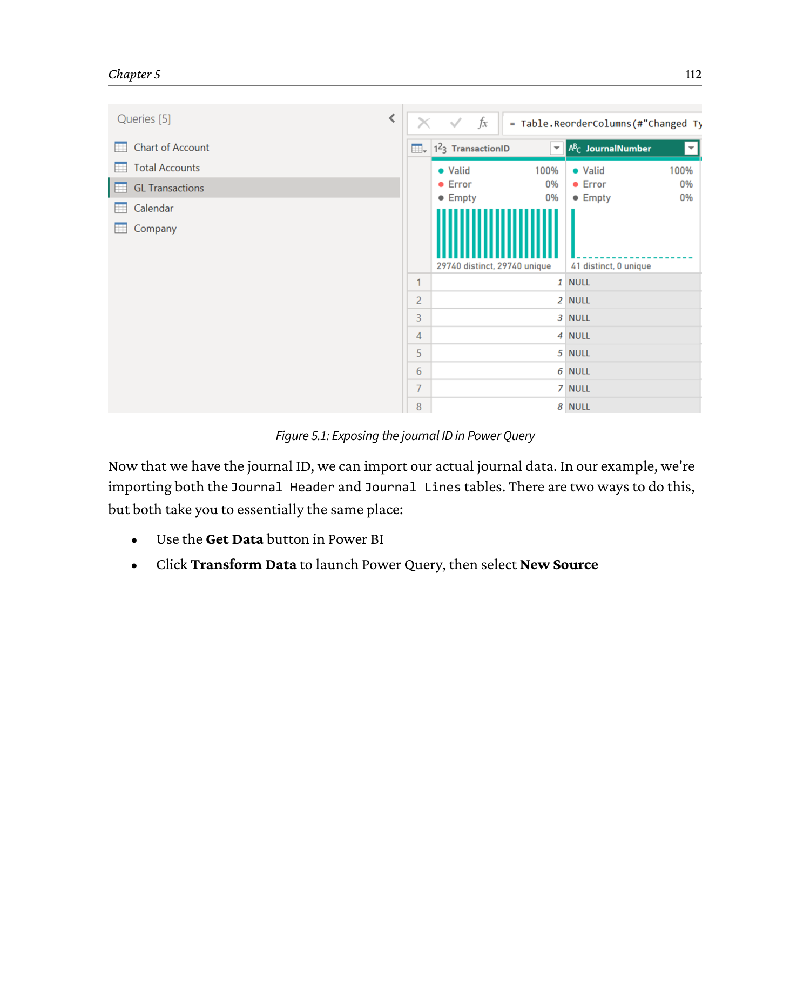
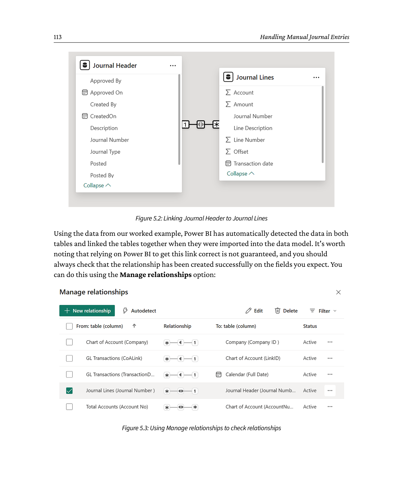
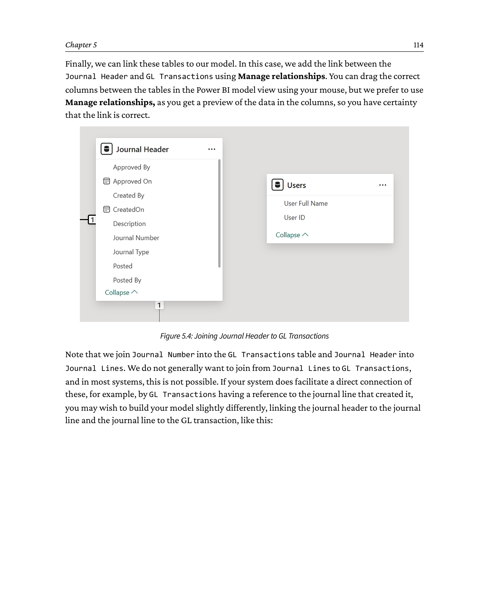
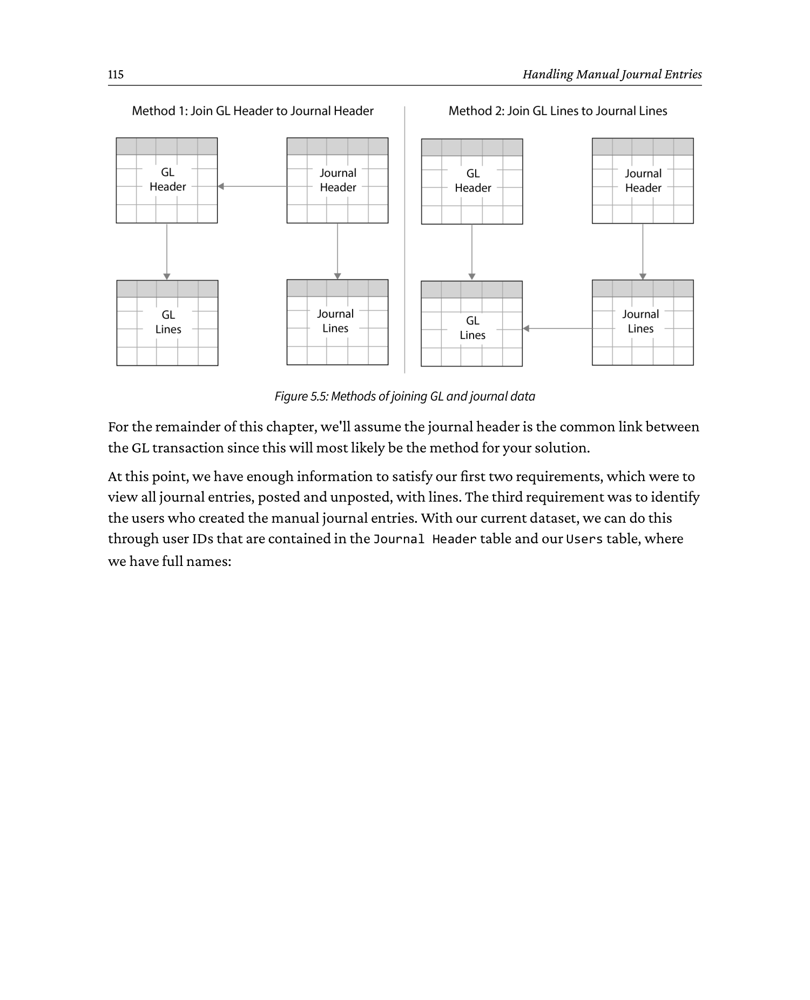
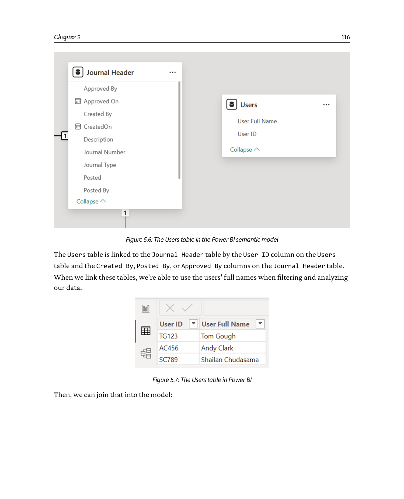
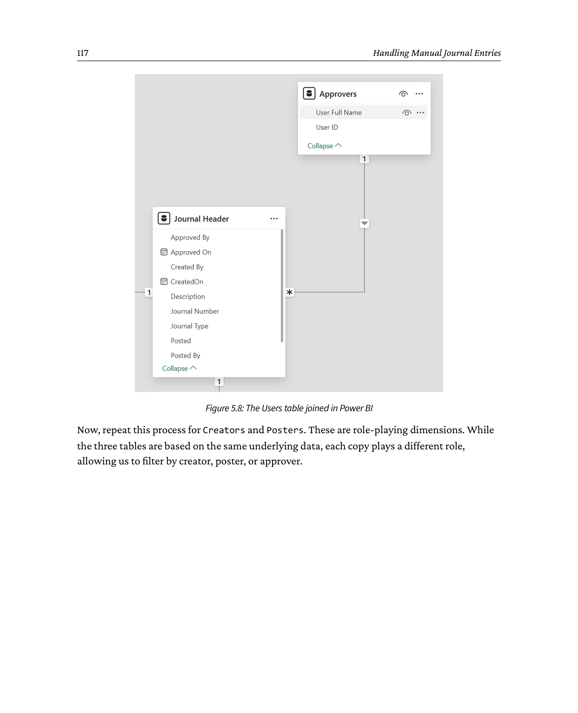
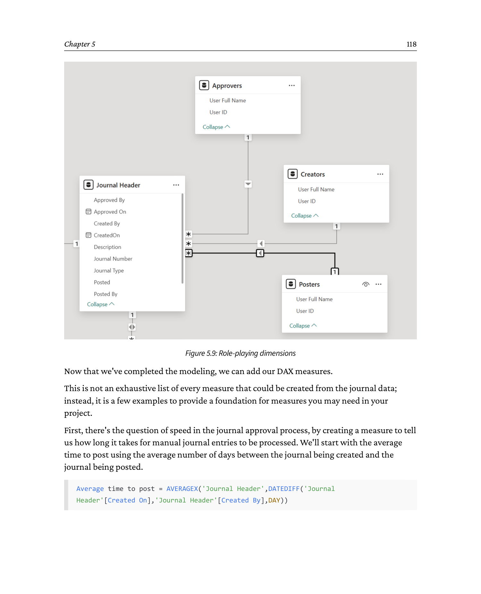

# Chapter 5: Handling Manual Journal Entries

**Source: *Financial Modeling and Reporting with Microsoft Power BI* (Packt Publishing, 2026)**

DOI: 10.0000/PACKT_FMRWPB_2026  |  GitHub: https://github.com/PacktPublishing/Financial-Modeling-with-Power-BI_Packt/tree/main/Chapter5

_Page range: 130 - 151_

In the last chapter, we furthered our understanding of DAX by focusing on some applied areas in finance. In this chapter, we're going to be even more applied, by looking at manual journal entries and how to deal with them, the data we can derive from them, and how we can include them in our data model.

Although we use the term *manual journals* in this chapter, the principles apply to many manual adjustments you may need to apply to your financial reporting.

Manual journal entries are manually-entered transactions that don't fit neatly into the "normal" transactions generated by the finance system during the normal course of business. They can be adjustments, corrections, or special entries that are entered to provide a complete picture of financial and business operations. Businesses don't run perfectly, and manual journal entries allow you to deal with imperfections. Manual journal entries in an Enterprise Resource Planning (ERP) system are user-entered financial transactions that allow businesses to record adjustments, corrections, or non-standard entries directly into the general ledger, ensuring accurate and customized financial reporting.

To be clear, we differentiate manual journal entries from the normal business transactions that are automatically created by financial management applications, such as transactions that are created for non-routine reasons or are unique. They sit outside of normal logic and are, hence, important to control and track.

While the examples in this chapter focus on manual journal entries, it also applies to any other non-standard data in the data model, such as invoicing details, purchase and sales orders, or production orders in a manufacturing environment. Moreover, it allows us to cover some important topics in Power BI - in particular, that of role-playing dimensions.

When manual journals are created, General Ledger (GL) transactions will also be posted, which raises the question about the need to include manual journal entries separately. In some Power BI implementations, we haven't included manual journals as a subset of the GL transactions, and that's a valid approach. In other implementations, we've included manual journals due to the additional contextual information they provide when analyzing financial data. We have to say, the more common approach is to include manual journal entries as a specific subset of the GL, and both approaches are valid - both include a full picture of a company's finances.

We'll first consider why they are important and the reasons for including them, and the reasons we may decide they're unnecessary. We'll also discuss the difference between journal headers and lines, and why you may/may not want to include journal lines. From there, we'll consider the sort of data, both descriptive and numerical, we can get from the manual journals and how that maps into the idea of fact and dimension data. Finally, we'll look at how we can join that to our existing data model, and the potential impacts and pitfalls from it.

By the end of the chapter, you will understand the following:

- When to include manual journal entries
- How to add new objects to the data model
- How to use role-playing dimensions

---

## Technical requirements

To follow the worked examples in this chapter and beyond, you'll need a Windows PC with an internet connection, and you'll also need to download Power BI Desktop.

For more details, we suggest you access the following link, where Microsoft details the download process for Power BI Desktop and the PC hardware requirements: https://learn.microsoft.com/en-us/power-bi/fundamentals/desktop-get-the-desktop.

The model picks up from where *Chapter 4, Common DAX Measures*, left off with the `Chapter 4 - Final.pbix` file, which can be found in the GitHub repository at https://github.com/PacktPublishing/Financial-Modeling-with-Power-BI_Packt/tree/main/Chapter4.

The sample data we use, and the final point we reach in the chapter, is the `Chapter 5 - Final.pbix` file, which can be found in the GitHub repository at https://github.com/PacktPublishing/Financial-Modeling-with-Power-BI_Packt/tree/main/Chapter5.

---

## 5.1 Understanding the value of including manual journal entries

In all our financial implementations, we discuss how we include manual journal entries into the data that will be presented in visualizations. The choices are as follows:

- Do we include manual journal data, separate from the GL transactions?
- Do we just include manual journal header data or header and line?

To be clear, manual journal data is always included as it's part of the GL transaction data. The debate is centered around the amount of detail required when analyzing the data and what journal header and line-item data can add.

There's a school of thought that Power BI is an analytics tool that aggregates and calculates large volumes of data and, therefore, isn't a good tool for reporting on individual transactions. To some extent, that's true, but in almost every implementation of Power BI, we include drill-through capability to allow users to see the details of a transaction, so they don't need to refer to the financial application to understand those details. As manual journals are generally corrections, it may or may not be important to see the data via drill-through in Power BI.

Next, let's look at the reasons to include/exclude manual journal data.

Here are the main reasons for including manual journal entries:

- **Improves the accuracy of insights:**
  - Manual journal entries correct errors, allocate costs, and adjust accruals, which are necessary for accurate financial reporting
  - Excluding their details may hinder a user's ability to gain detailed insights that may be lacking from their corresponding GL record
- **Supports compliance and auditability:**
  - Manual journal entries are often created to meet regulatory requirements, such as Generally Accepted Accounting Principles (GAAP) and International Financial Reporting Standards (IFRS)
  - Including them in Power BI ensures that compliance-related adjustments are reflected in reports, helping maintain transparency, completeness, and audit readiness
- **Facilitates period-end analysis:**
  - End-of-period adjustments (e.g., depreciation and accruals) are crucial for understanding true profitability and financial performance
  - Including these ensures an accurate analysis of financial outcomes for decision-making
- **Provides granular detail:**
  - Manual journal entries often include detailed narratives and context about adjustments
  - These details can add value in BI by providing explanatory power behind financial movements
- **Enables scenario planning:**
  - Manual journal entries often represent discretionary adjustments
  - Including them allows Power BI to model scenarios, such as the impact of strategic adjustments or management overrides

Here are the main reasons for excluding manual journals:

- **Potential for overwriting automated insights:**
  - Manual journal entries often adjust or override automated data
  - If your semantic model is not built correctly, this could distort original trends or metrics in BI, making it harder to analyze the base data accurately
- **Complexity in data integration:**
  - Manual journal entries often require additional work to ensure they are correctly mapped into the BI system
- **Increased maintenance:**
  - Manual journal entries can vary in structure and purpose, possibly requiring updates to Extract, Transform, and Load (ETL) processes
- **Limited predictive value:**
  - Manual journal entries often represent unique, one-time adjustments
  - Their inclusion might skew predictive analytics or trend analysis in BI systems, as they may not represent recurring business behavior
- **Audit and security concerns:**
  - Including manual journal entries requires additional controls to ensure sensitive adjustments are handled securely
  - Without robust governance, there is a risk of exposing sensitive financial data or unapproved adjustments

There are valid reasons to include or exclude manual journal entries as a separate part of your reporting environment, and each business needs to make that decision; in many cases, it's contextual to the nature of the business. In some cases, you may not need them to be considered for special attention, and in some cases, you may. Our objective is to highlight the fact that every implementation process should consider the question of inclusion or exclusion.

So, with that in mind, let's consider the general structure of a manual journal, how it maps to the GL transaction, and what useful information can be gleaned from it.

### 5.1.1 Exploring the structure of manual journal entries

Typically, manual journal entries in a finance system will be split across two tables (this can vary): a header table containing information about the journal itself, and a line-item table that details the financial movements that it will trigger. A typical journal header will contain information such as the following:

**Table 5.1: Journal header**

| Column | Description |
|---|---|
| Journal Entry Number | A unique ID for the journal |
| Journal Entry Type | What type of movement is represented here? |
| Description | Typically, there will be some sort of free-text description. |
| Created By | Who created the journal entry? |
| Created On | When was it created? |
| Approved By | Who approved it? |
| Approved On | When was it approved? |
| Posted | Has the journal entry been posted to the GL? |
| Posted By | Who posted the journal? |
| Posted On | When was it posted? |

Journal lines will typically look something like this:

**Table 5.2: Journal lines**

| Column | Description |
|---|---|
| Journal Entry Number | To link to the header |
| Line number | Together with the journal number, this is a unique ID |
| Line Description | What this line is for |
| Transaction date | May or may not be present - sometimes posting date is used |
| Amount | The amount for the transaction |
| Account | The account to post to |
| Offset | The account to offset to |

When a manual journal entry is posted, it will generate transactions in the GL transactions table. Usually, we will see two lines posted in the GL for every line in the journal transactions, one for the account and the other with a reversed sign, in the offset account. Once again, systems may operate differently, and you may find there are processes behind the scenes that can add complexity to this, but the fundamental concept is the same across the board.

For clarity, let's see how this might work in reality. We'll create a manual journal entry to write off some stock.

Here is an example header posting:

**Table 5.3: Example journal header posting**

| Field | Value |
|---|---|
| Journal Number | ST-123 |
| Journal Type | Stock |
| Description | Write off damaged stock |
| Created By | TG123 |
| Created On | 1/06/2023 |
| Approved By | AC456 |
| Approved On | 2/6/2026 |
| Posted | Y |
| Posted By | SC789 |
| Posted On | 3/6/2023 |

Here is an example line posting:

**Table 5.4: Example journal line posting**

| Journal Number | Line Number | Line Description | Transaction Date | Amount | Account | Offset |
|---|---|---|---|---|---|---|
| ST-123 | 1 | Write off damaged shirts | 1/06/2023 | -20 | 1001 | 2001 |
| ST-123 | 2 | Write off damaged gloves | 1/06/2023 | -50 | 1002 | 2001 |

Once posted, this will generate transactions as follows:

**Table 5.5: Example journal transactions on the GL transactions table**

| Journal # | Account # | Transaction Date | Currency | Amount |
|---|---|---|---|---|
| ST-123 | 1001 | 1/06/2023 | GBP | -20 |
| ST-123 | 2001 | 1/06/2023 | GBP | 20 |
| ST-123 | 1002 | 1/06/2023 | GBP | -50 |
| ST-123 | 2001 | 1/06/2023 | GBP | 50 |

In our example, we have a journal entry number appearing on the GL, which is essential if we're going to link this data. It may be that this is not directly available through the GL tables in your system, and in that case, there may be a voucher number used to link back via other tables to the journal entry number. If no such route exists, it may well be impossible to link this data up, but that would be a very rare circumstance.

You will note the created by, approved by, and posted by fields are in the form of usernames, rather than actual names - this is typical for most systems. To make this data usable, we are going to want to create a Users table as well, so we can map this data:

**Table 5.6: Users table**

| User ID | User Full Name |
|---|---|
| TG123 | Tom Gough |
| AC456 | Andy Clark |
| SC789 | Shailan Chudasama |

Now that we have identified what is in our manual journals, we can turn our attention to how we need to structure them to help us perform analyses and provide more context for our figures.

## 5.2 Deriving facts and dimensions from the manual journals

The most common use of manual journal entry data is to add descriptive context to the GL transactions. This is important as it will often link to who created a manual journal, who approved it, explanations of why it was done, and other related narrative data.

Typically, journal entries are linked to the GL at the journal entry header and not the line, so any descriptions at a line level may be lost unless the table containing the lines is imported and connected to the headers.

Here, we have our second decision, which is whether to include journal entry lines.

The decision is always based on the context of the business and the requirements for reporting. If journal entries are extensively used, users may benefit from the contextual and descriptive data from the lines. If the use of journal entries is limited or follows a common pattern, we may not need the additional data from the lines. For the rest of this chapter, we'll assume you're importing journal lines with the headers, but please remember it's a choice.

Our basic journal dimension will look something like this:

**Table 5.7: Journal dimension table**

| Column | Description |
|---|---|
| Journal Entry Number | A unique ID for the journal entry |
| Journal Entry Type | What type of movement is represented here? |
| Created By | Who created the journal entry? |
| Created On | When was it created? |
| Approved By | Who approved it? |
| Approved On | When was it approved? |
| Posted By | Who posted the journal? |
| Posted On | When was it posted? |

Note, we're dropping the free text description. Such fields are generally not useful for structured data analysis since they could contain anything and would not be suitable for use in categories on a visual. That is not to say they have no value at all; you may still want to include them for a drill-down or for use by data science tools. As the information will be available in the source system, you can retrieve it at a later date.

In addition to dimensional data from the journal entries, we'll generally need to add more measures. Adding measures to include the total value of the journal can be useful when looking to categorize and understand the purpose. Other measures you could derive from the journal entries could include the following:

- Time to approve
- Number of journal entries created per user
- Average lines per journal

As manual journal entries can fit outside of business norms, the number of journal entries, who created them, and when they were approved can be important to track.

There are two broad approaches you can take at this point:

- One is to import journal lines and calculate your measures over those
- The other is to create a summarized table of your journal lines (*Table 5.8*)

**Table 5.8: Summarized table of journal lines**

| Column | Description |
|---|---|
| Journal Number | The unique ID for the journal |
| Number of lines | Total number of lines in the journal |
| Total Value | Note that once rolled up, this will hide individual credits and debits |
| Time to approve | Days from creation to approval |
| Time to post | Days from approval to posting |

These can be added to the journal header table to make the model simpler or left as a separate table if preferred.

This works well if you're only bringing in posted journal entries, but if you intend to bring in unposted journal entries too, it's a good idea to include all lines, since a summary of an unposted journal will tell you little of any real value. In this case, measures of total value and number of lines will be better handled in DAX, and time to approve and time to post will be added to the journal dimension.

Now that we understand what we want to bring into our data model, we can look at how to link it together.

## 5.3 Linking manual journal entry data to the GL transaction

To demonstrate the most complete method for linking journal data, we will assume the following:

- We're interested in both posted and unposted journal entries
- We require the journal lines
- We need to analyze who creates, approves, and posts journal entries

The first step is to add the journal number column to the GL Transactions table. Check whether the journal ID is on the GL Transactions table and make sure it's clearly identified. You may need to change the name of the column in Power Query if the name used is unclear or cryptic. If you still don't have the journal ID, it may be the case that you're looking at a restricted column view, so you'll need to speak to someone responsible for the data you're receiving from the financial application or data warehouse. Note that not every transaction will necessarily have a journal number attached; this is especially true if most postings are automatic, although again, this varies by system.



```
   Exposing the journal ID in Power Query

   Power Query editor - Applied Steps pane on the right, data preview in
   the middle:

   +---------------+------------+--------------+-----------+-----------+
   | JournalNumber | AccountNo  | TransDate    | Amount    | Currency  |
   +---------------+------------+--------------+-----------+-----------+
   | ST-123        | 1001       | 1/06/2023    |    -20.00 | GBP       |
   | ST-123        | 2001       | 1/06/2023    |     20.00 | GBP       |
   | ST-123        | 1002       | 1/06/2023    |    -50.00 | GBP       |
   | ST-123        | 2001       | 1/06/2023    |     50.00 | GBP       |
   | JE-9001       | 4001       | 5/06/2023    |   -250.00 | GBP       |
   |   ...         |  ...       |   ...        |     ...   |  ...      |
   +---------------+------------+--------------+-----------+-----------+

   The JournalNumber column is highlighted - we right-click the header
   and choose Rename if needed, then Close & Apply.  The journal ID is
   now exposed on the GL Transactions table and ready to be linked.
```


Now that we have the journal ID, we can import our actual journal data. In our example, we're importing both the Journal Header and Journal Lines tables. There are two ways to do this, but both take you to essentially the same place:

- Use the *Get Data* button in Power BI
- Click *Transform Data* to launch Power Query, then select *New Source*



```
   Linking Journal Header to Journal Lines (Relationship View)

   +----------------+  1   *  +----------------+
   | Journal Header |---------| Journal Lines  |
   |----------------|         |----------------|
   | JournalNumber K|         | JournalNumber F|
   | JournalType    |         | LineNumber     |
   | Description    |         | LineDescription|
   | CreatedBy      |         | TransactionDate|
   | CreatedOn      |         | Amount         |
   | ApprovedBy     |         | Account        |
   | ApprovedOn     |         | Offset         |
   | PostedBy       |         |                |
   | PostedOn       |         |                |
   +----------------+         +----------------+

   Cross-filter direction: single (one-to-many, header -> lines).
```


Using the data from our worked example, Power BI has automatically detected the data in both tables and linked the tables together when they were imported into the data model. It's worth noting that relying on Power BI to get this link correct is not guaranteed, and you should always check that the relationship has been created successfully on the fields you expect. You can do this using the *Manage relationships* option:


```
   Using Manage relationships to check relationships

   Manage relationships dialog
   +--------------------------------------------------------------+
   |  Manage relationships in this model                          |
   |--------------------------------------------------------------|
   |  Active                                                    |
   |    Journal Header (1) -> Journal Lines (*)                  |
   |        on  Journal Header[JournalNumber]                    |
   |             Journal Lines [JournalNumber]                   |
   |        Cardinality:  One to many                           |
   |        Cross filter:    Single                             |
   |        Make this relationship active:   [x]                 |
   |                                                              |
   |  [ Edit... ]  [ Delete ]  [ Activate ]  [ Deactivate ]      |
   +--------------------------------------------------------------+

   The preview columns on the right confirm that the join is on the
   correct fields before we commit.
```


Finally, we can link these tables to our model. In this case, we add the link between the Journal Header and GL Transactions using *Manage relationships*. You can drag the correct columns between the tables in the Power BI model view using your mouse, but we prefer to use *Manage relationships*, as you get a preview of the data in the columns, so you have certainty that the link is correct.



```
   Joining Journal Header to GL Transactions

   +----------------+  1   *  +----------------+
   | Journal Header |---------| GL Transactions|
   |----------------|         |----------------|
   | JournalNumber K|         | JournalNumber F|
   | JournalType    |         | AccountNumber  |
   | CreatedBy      |         | TransactionDate|
   | ApprovedBy     |         | Amount         |
   | PostedBy       |         |                |
   +----------------+         +----------------+

   The header is the only place we link the journal to the GL; lines
   are reached from the header.  This is the common pattern we will
   work with for the rest of the chapter.
```


Note that we join Journal Number into the GL Transactions table and Journal Header into Journal Lines. We do not generally want to join from Journal Lines to GL Transactions, and in most systems, this is not possible. If your system does facilitate a direct connection of these, for example, by GL Transactions having a reference to the journal line that created it, you may wish to build your model slightly differently, linking the journal header to the journal line and the journal line to the GL transaction, like this:



```
   Methods of joining GL and journal data

   Method A (used in this chapter) - header is the common link
   +----------------+  1   *  +----------------+
   | Journal Header |---------| Journal Lines  |
   |----------------|         +----------------+
   |     JournalNumber K
   +--------|-------+
            |  1
            v
   +----------------+
   | GL Transactions|  (joined on JournalNumber)
   +----------------+

   Method B (alternative) - line is the common link
   +----------------+  1   *  +----------------+
   | Journal Header |---------| Journal Lines  |
   +----------------+         +--------|-------+
                                       |  1
                                       v
                            +----------------+
                            | GL Transactions|  (joined on
                            +----------------+    LineNumber)

   We use Method A in the rest of the chapter.
```


For the remainder of this chapter, we'll assume the journal header is the common link between the GL transaction since this will most likely be the method for your solution.

At this point, we have enough information to satisfy our first two requirements, which were to view all journal entries, posted and unposted, with lines. The third requirement was to identify the users who created the manual journal entries. With our current dataset, we can do this through user IDs that are contained in the Journal Header table and our Users table, where we have full names:



```
   The Users table in the Power BI semantic model

   Data panel:
   +----------------+   +----------------+   +----------------+
   | Chart of       |   | Calendar       |   | GL             |
   | Account        |   |                |   | Transactions   |
   +----------------+   +----------------+   +----------------+
   +----------------+   +----------------+   +----------------+
   | Journal Header |   | Journal Lines  |   |  Users  NEW    |
   +----------------+   +----------------+   +----------------+
   | UserID | Name  |
   |--------|--------|
   | TG123  | Tom Gough         |
   | AC456  | Andy Clark        |
   | SC789  | Shailan Chudasama |
   |  ...   |  ...              |
   +----------------+

   The Users table is added with Get Data -> Excel/CSV.  It will be
   linked to the Journal Header on the UserID column.
```


The Users table is linked to the Journal Header table by the User ID column on the Users table and the Created By, Posted By, or Approved By columns on the Journal Header table. When we link these tables, we're able to use the users' full names when filtering and analyzing our data.


```
   The Users table in Power BI (table view of the data)

   +---------+--------------------+
   | User ID | User Full Name     |
   +---------+--------------------+
   | TG123   | Tom Gough          |
   | AC456   | Andy Clark         |
   | SC789   | Shailan Chudasama  |
   |   ...   |   ...              |
   +---------+--------------------+

   This is the table that will be linked to Journal Header on
   UserID, giving us readable names instead of bare IDs.
```


Then, we can join that into the model:



```
   The Users table joined in Power BI

   +----------------+  *   1  +----------------+
   | Journal Header |---------|  Users         |
   |----------------|         |----------------|
   | CreatedBy   FK |         | UserID      K  |
   | ApprovedBy  FK |         | UserFullName   |
   | PostedBy    FK |         |                |
   +----------------+         +----------------+

   Cross-filter: single
   Cardinality : many-to-one

   (We will be doing this three times - once for CreatedBy, once for
   ApprovedBy, once for PostedBy - that is the role-playing pattern.)
```


Now, repeat this process for Creators and Posters. These are role-playing dimensions. While the three tables are based on the same underlying data, each copy plays a different role, allowing us to filter by creator, poster, or approver.



```
   Role-playing dimensions (three copies of the same Users data)

                        +----------------+
                        |    Users       |
                        | (source data)  |
                        +-------+--------+
                                |
                +---------------+---------------+
                |               |               |
                v               v               v
        +-------------+  +-------------+  +-------------+
        |   Users     |  |   Users     |  |   Users     |
        | (Created By)|  | (Approved   |  | (Posted By) |
        |             |  |    By)      |  |             |
        +-------------+  +-------------+  +-------------+
                |               |               |
                v               v               v
        +-------------------------------------------------+
        |               Journal Header                     |
        |  CreatedBy   ApprovedBy   PostedBy  ...          |
        +-------------------------------------------------+

   The three Users tables are physically separate in the model but
   point at the same underlying data.  Each copy plays a different
   role (created / approved / posted), so we can filter on each
   independently - this is the role-playing dimension pattern.
```


Now that we've completed the modeling, we can add our DAX measures.

This is not an exhaustive list of every measure that could be created from the journal data; instead, it is a few examples to provide a foundation for measures you may need in your project.

First, there's the question of speed in the journal approval process, by creating a measure to tell us how long it takes for manual journal entries to be processed. We'll start with the average time to post using the average number of days between the journal being created and the journal being posted.

```dax
Average time to post = AVERAGEX(
    'Journal Header',
    DATEDIFF(
        'Journal Header'[Created On],
        'Journal Header'[Created By],
        DAY
    )
)
```

In a similar way, we can look at average time to approve, or average time from approval to posting, depending on what we want to try to improve or manage.

Next, we can look at the average number of lines in a journal. The more lines, the more items that have been adjusted, which can help show where problems are and what can be done to address them. As ever, there are several ways to tackle this; we'll look at two of them.

First, we add a calculated column to the Journal Header table to count the number of rows in the related table, Journal Lines:

```dax
Lines = COUNTROWS( RELATEDTABLE('Journal Lines') )
```

Then, we can simply add a measure to calculate the average of the new Lines column:

```dax
Average Journal lines = AVERAGE('Journal Header'[Lines])
```

This approach, although needing two calculations, can be more transparent than doing it all in one, and is certainly easier to debug. However, if you prefer to do it all in one, then the `AVERAGEX` function comes to our aid again:

```dax
Average Journal Lines = AVERAGEX(
    'Journal Header',
    COUNTROWS( RELATEDTABLE('Journal Lines') )
)
```

The final example will be to look at journal values, which can tell us how large the adjustments are and help in controlling the scale of the adjustments needed. The average journal value can be created as follows (for an all-in-one calculation):

```dax
Journal Avg Value = AVERAGEX(
    'Journal Header',
    SUMX(
        RELATEDTABLE('Journal Lines'),
        'Journal Lines'[Amount]
    )
)
```

If you prefer to create this as a two-part calculation, then the column is calculated as follows:

```dax
Journal Value = SUMX(
    RELATEDTABLE('Journal Lines'),
    'Journal Lines'[Amount]
)
```

These calculations give some of the basic ideas of what can be calculated from the journal data. Building on these patterns, you can expand to measure what is relevant to your project or organization.

## 5.4 Summary

In this chapter, we looked at manual journal entries. It's a specific and important part of a Power BI implementation for some organizations. To start, we explained why manual journal entries are important to some organizations with a list of reasons that you may like to apply to your organization to help you decide.

We then looked at the considerations when including journal lines and why you may or may not choose to use them.

We then walked through the process of adding the Journal Header and Journal Lines tables to the Power BI semantic model with some DAX measures to help you get the most out of your data.

In the next chapter, we turn to the important task of data modeling. A good data model will make your calculations and visualizations faster and more accurate, so we're going to walk through the essential tasks you'll need to consider when importing data into your semantic model.

---

> **Note: Get this book's PDF version and more**
>
> Scan the QR code (or go to https://www.packtpub.com/unlock). Search for this book by name, confirm the edition, and then follow the steps on the page.

> **Note:** Keep your invoice handy. Purchases made directly from Packt don't require an invoice.

---

_Generated by `convert_chapter5.py` + `build_chapter5_md.py` on 2026-06-16._
