# Chapter 6: Streamlining with Power Query

**Source: *Financial Modeling and Reporting with Microsoft Power BI* (Packt Publishing, 2026)**

DOI: 10.0000/PACKT_FMRWPB_2026  |  GitHub: https://github.com/PacktPublishing/Financial-Modeling-with-Power-BI_Packt/tree/main/Chapter6

_Page range: 152 - 177_

In the previous chapter, we focused on an applied area when working with finance data: manual journal entries. In this chapter, we're going to change direction by focusing on some of our standard practices when shaping and managing the data we use for our semantic models.

When we think of Power BI, we need to think of two tools, not one. Power BI comprises Power BI and Power Query; the latter is launched by clicking the *Transform data* button from the Power BI ribbon and is used every time we work with Power BI. We're certain there will be some readers who haven't clicked *Home | Transform Data* to see what lies behind the button, and that's why we wrote this chapter to walk you through the basics of Power Query.

Power Query is an integral part of the Power BI process as an ETL tool. Great - another acronym, and what does it mean? ETL stands for **Extract, Transform, Load**, and is a common term in the data world that's certainly not unique to Power Query. There are many ETL tools available, and Power Query is the one built into Power BI; it's also built into Excel. The three components of ETL are described next:

- **Extract** allows us to connect to numerous data sources, from Excel files to databases to online services, and extract the data from the data source. Common examples are the capability to connect to your budgets in Excel, the data within your finance application, and an online FX conversion tool.
- **Transform** helps us clean up, reduce, and reshape our data so that it's more useful for consumption within Power BI. There's a maxim that applies to the data world: *Only carry what you need to survive.* Power Query helps us do just that.
- **Load** takes the transformed data and loads it into Power BI.

The size of financial data is often large in terms of the number of rows and columns, but in most cases, you won't need all of it. Less data means quicker queries, and it's also easier to manage. In this chapter, we'll look at what Power Query is, how we can use it to manage and reduce the amount of data we handle, and how it can transform and enrich the data we're working with. We also have a trick for working with AI tools to help with your column naming.

By the end of the chapter, you will be able to master the following:

- The need to use Power Query to streamline data
- The functions and tools offered by Power Query
- Some practical patterns that can be used in the real world

---

## Technical requirements

To follow the worked examples in this chapter and beyond, you'll need a Windows PC with an internet connection, and you'll also need to download Power BI Desktop.

For more details, we suggest you access the following link, where Microsoft details the download process for Power BI Desktop and the PC hardware requirements: https://learn.microsoft.com/en-us/power-bi/fundamentals/desktop-get-the-desktop.

The examples outlined in this chapter can be tried out in the `Chapter 6.pbix` model. A fully worked example from the *Correcting opening balances* section is found in the `Chapter 6 - Opening Balances.pbix` file. Both files can be found in the GitHub repository here: https://github.com/PacktPublishing/Financial-Modeling-with-Power-BI_Packt/tree/main/Chapter6.

---

## 6.1 What is Power Query?

Power Query is a tool that's capable of a wide range of data transformations. At its most basic, it can filter out rows and remove columns. In more complex scenarios, it can be used to create new columns, split columns into their constituent parts, and do time intelligence (TI) calculations. In financial modeling, we generally use Power Query to do the following:

- Remove unnecessary columns to make our data tables easier to manage
- Remove rows to focus on the data we need
- Rename columns, assisted by AI tools
- Unpivot data in matrices
- Split columns into constituent parts

There is a significant overlap between what we can do in Power Query and what we can do in DAX. The creation of calculated columns is a great example, and there is usually no standard or best practice method of dealing with these situations. You need to create a calculated column, and you know you can create it in both tools, so which one do you choose? One thing to consider is creating a column in Power BI; using DAX means you won't see it in Power Query - only in the Power BI report. As a result, you cannot use it as part of the data transformation process. If, however, you create that column in Power Query, you'll see it in both Power Query and Power BI and indeed be able to use that column as part of the data transformation process.

So, just create them all in Power Query? Depending on what you're trying to achieve, creating the column in Power Query may not be possible, as both tools have different capabilities. If you need an element of your data model (such as a relationship), then you must use DAX; beyond that, it's mostly your choice. That said, it's a good idea to set a policy and stick to it; otherwise, you'll create confusion and leave a situation where your data model is hard to maintain because there's no clear place to look for specific calculations.

To the developers among us, Power Query uses a language called M, which is a functional mashup language, having similarities to F#, though sufficiently different that an F# programmer would still have a learning curve to transition. Please don't let that put you off. Almost everything you'll need to do in Power Query is accessible via clicks, so it's unlikely you'll need to write any code. Yes, it can be a complex tool, but it's been made relatively easy to navigate.

Power Query is accessed from the *Transform data* button on the ribbon, as shown in *Figure 6.1*:

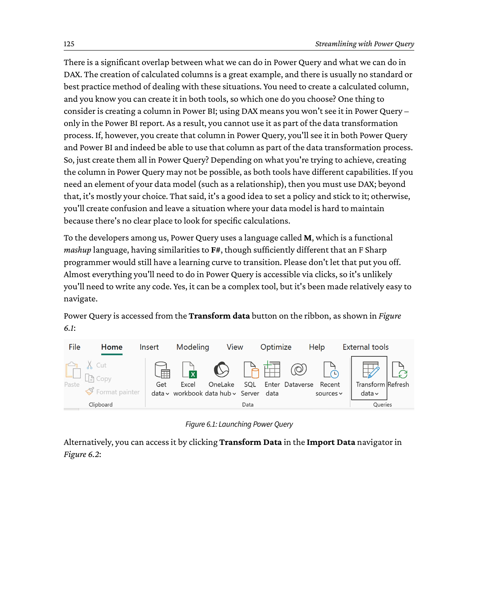

```
   Launching Power Query

   Home tab of the Power BI ribbon - the Transform data button:
   +--------------------------------------------------------+
   |  Home  | Insert | Modelling | View | Optimise | Help   |
   |------------------------------------------------------|
   |  [ Get data ] [Excel] [SQL] [Dataverse] ...            |
   |  [ Transform data ]    <-- this is the entry point    |
   +--------------------------------------------------------+

   Click Transform data to launch Power Query, where you can shape
   and clean the data before it is loaded into Power BI.
```


Alternatively, you can access it by clicking *Transform Data* in the *Import Data* navigator in *Figure 6.2*:

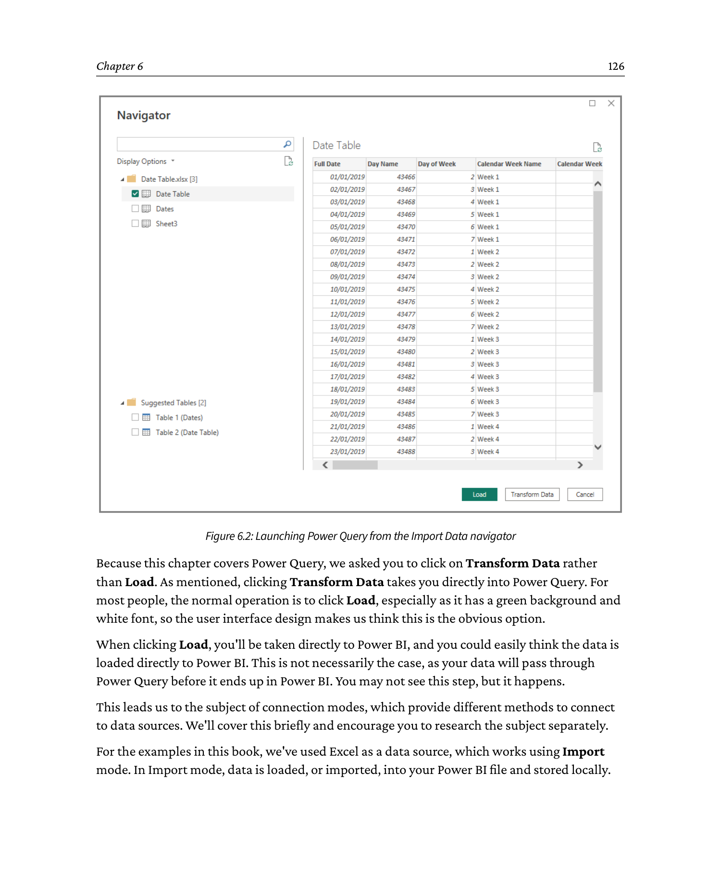

```
   Launching Power Query from the Import Data navigator

   Import Data navigator dialog
   +--------------------------------------------------------+
   |  Navigator                                             |
   |--------------------------------------------------------|
   |  [ File ] [ Database ] [ Power Platform ] ...         |
   |  [Transform Data]   [Load]   [Cancel]   <-- footer    |
   +--------------------------------------------------------+
   |  Display Options                                       |
   |    o Excel workbook contents                           |
   |    o Sheet name                                        |
   |  - GL Transactions                                     |
   |  - ChartOfAccount                                      |
   |  - Calendar                                            |
   |  - ...                                                 |
   +--------------------------------------------------------+

   We are using the Transform Data button (bottom) so the file
   opens in Power Query rather than being pushed straight into
   the Power BI model.
```


Because this chapter covers Power Query, we asked you to click on *Transform Data* rather than *Load*. As mentioned, clicking *Transform Data* takes you directly into Power Query. For most people, the normal operation is to click *Load*, especially as it has a green background and white font, so the user interface design makes us think this is the obvious option.

When clicking *Load*, you'll be taken directly to Power BI, and you could easily think the data is loaded directly to Power BI. This is not necessarily the case, as your data will pass through Power Query before it ends up in Power BI. You may not see this step, but it happens.

This leads us to the subject of connection modes, which provide different methods to connect to data sources. We'll cover this briefly and encourage you to research the subject separately. For the examples in this book, we've used Excel as a data source, which works using **Import mode**. In *Import mode*, data is loaded, or imported, into your Power BI file and stored locally. This provides a great user experience as Power BI uses VertiPaq to optimize efficiency, resulting in fast data retrieval and manipulation.

Power BI has other connection modes that you may need to use. **Direct Query** links to the data source but doesn't import the data to the Power BI semantic model; each time Power BI queries the data, it does so directly to the data source. You'll generally use this option when the dataset is too large to be imported into your semantic model.

**Live Connection** is similar to DirectQuery and is used when connecting to published semantic models or SQL Server Analysis Services (SSAS) tabular models.

Finally, **Direct Lake** is a connection mode specific to Microsoft Fabric, which we cover in *Chapter 12, Financial Reporting in an AI-Driven World*.

With connection modes briefly covered, let's get back to Power Query:

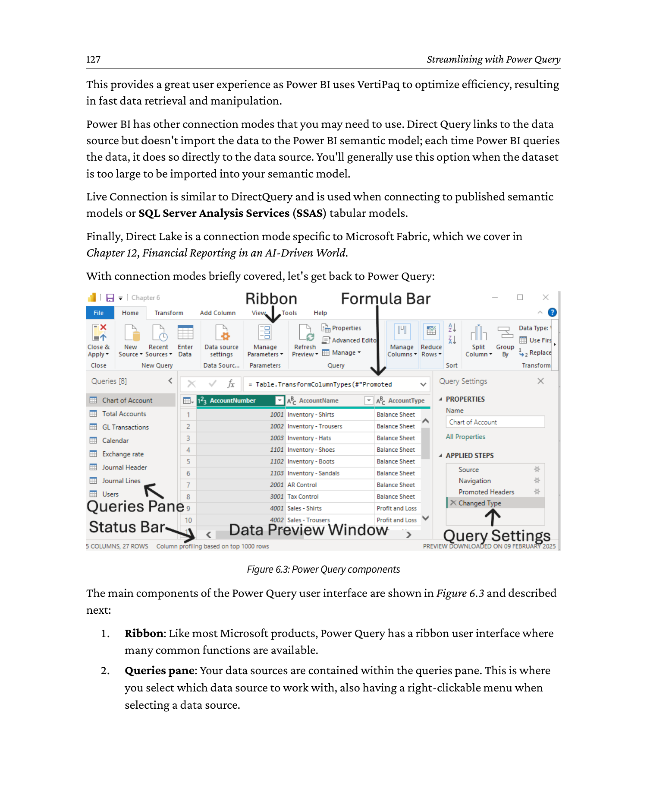

```
   Power Query components

   +---------------------------+-----------------------------+
   | 1. Ribbon                 | 5. Status bar (1,000 rows)   |
   |  +-----+-----+-------+    |                             |
   |  | Home| Trans| Add |     |                             |
   |  | Col | form | Col |      |                             |
   |  +-----+-----+-------+    +-----------------------------+
   | 2. Queries pane           | 4. Data preview window      |
   |  * GL Transactions        | (max 1,000 rows by default) |
   |  * ChartOfAccount         |                              |
   |  * Calendar               | 6. Query settings            |
   |  * ...                    |  Applied steps:              |
   |                           |    - Source                  |
   | 3. Formula Bar            |    - Removed Columns         |
   |  = Table.SelectRows(...)  |    - Changed Type            |
   |                           |    - ...                     |
   +---------------------------+------------------------------+
```


The main components of the Power Query user interface are shown in *Figure 6.3* and described next:

1. **Ribbon:** Like most Microsoft products, Power Query has a ribbon user interface where many common functions are available.
2. **Queries pane:** Your data sources are contained within the queries pane. This is where you select which data source to work with, also having a right-clickable menu when selecting a data source.
3. **Formula Bar:** The Formula Bar contains the M code for the current applied step that's selected.
4. **Data preview window:** The data preview window provides a view of fields within the current data source selected. Here, you can interact with the fields from the drop-down icon and right-click menu. It's important to note that the preview window is based on a maximum of 1,000 rows unless changed in the status bar (described next).
5. **Status bar:** The status bar shows statistics of your selected data source and allows you to change the column profiling from the default 1,000 rows to the entire dataset. Note that this will affect performance.
6. **Query settings:** The query settings display the name of the current data source selected and the applied transformation steps. When you make changes to your data, each step is shown in the applied steps, so you can make subsequent changes or undo transformations.

Now that we know the basics, let's put that into action and start transforming our datasets.

## 6.2 Using Power Query to reduce datasets

One of the most useful aspects of Power Query is reducing the size of your datasets. You might question why you'd want to do this; after all, computational power constantly increases, and storage is cheap, so why not just store everything? You certainly can do that, and some people do. We are going to warn you that processing unnecessary data always has a computational overhead. At first, you may not notice this, but over time, as data grows, you may start to. Here are some specific reasons to manage your model size:

- Power BI has limits on the size of the data model you can store; at the time of authoring this book, a Power BI Pro license limits you to a 1 GB model. Once these limits are met, your implementation gets more complicated, and you'll need to manage that model size or upgrade your license.
- Larger data models will mean slower response times to users. This can be a major barrier to user engagement, as users often become frustrated.
- Large datasets are more difficult to work with, especially when sifting through large numbers of columns to locate useful data.

So, what can we do about it? We generally begin with three steps to reduce new datasets:

1. Only import the required tables or entities.
2. Remove columns you don't need.
3. Remove rows you don't need.

Let's explore each step in more detail.

### 6.2.1 Only importing the required tables or entities

The first step is to consider whether you need every table available to you. It's tempting to import everything "just in case," but this will slow things down, increase complexity, and ultimately be counterproductive. So, the first step is to only import the data you'll need.

Building a model in Power Query and Power BI is usually an iterative process of importing essential tables, then adding/removing tables as you discover the structure of the dataset. Importing everything at the start will give you a verbose and unwieldy model, becoming exponentially harder to find the information you need as there's too much superfluous data to work with.

If you don't think you'll need it, don't import it. You can come back for it later.

### 6.2.2 Removing columns you don't need

Database tables come loaded with columns you don't need. Remember - software applications are built for many different uses, so there'll be many functions you don't need; think how many Excel functions you use compared to how many are available. To extrapolate further, your finance application has many database tables and columns to store data you don't use. It's normal as applications need to cater to many use cases, not just yours.

Taking an example, a standard Microsoft Dataverse environment has a table called `account`, which is used to store organizations you may interact with, whether they're customers, suppliers, or any other category. It's used to store the name, address, and other details of those organizations, and at the time of writing, the account entity has 263 columns. In some Power BI semantic models, we only require two of those columns (ID and name), but in general, we'll need approximately 20 columns if we include address and categorization. That's a reduction of over 90%.

Using the *Opening Balances.pbix* dataset let's remove the line description from the *Journal Lines* table since it's free text, and we don't want to analyze it. To do this, we simply select the column we want to remove and click *Choose Columns* from the ribbon (if we later decide we need this column back, we can remove this step from Power Query and reverse the action), shown in *Figure 6.4*:

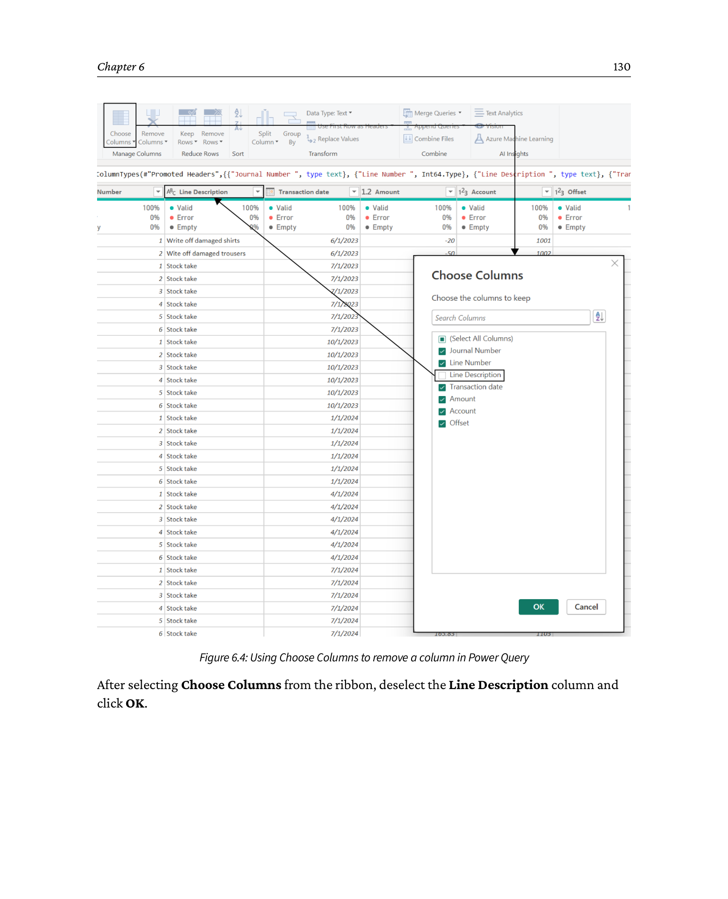

```
   Using Choose Columns to remove a column in Power Query

   Home tab ribbon - the Choose Columns button:
   +--------------------------------------------------------+
   |  Home | Transform | Add Column | View | Tools | Help   |
   |------------------------------------------------------|
   |  [ Manage Columns v ]                                  |
   |     [ Choose Columns... ]                              |
   |     [ Remove Columns  ]                                |
   |     [ Remove Other Columns ]                           |
   |  [ Keep Rows v ]   [ Remove Rows v ]   [ Sort v ]      |
   +--------------------------------------------------------+

   Select the column you want to remove and click Choose Columns.
   In the next dialog, deselect the unwanted column and click OK.
```


After selecting *Choose Columns* from the ribbon, deselect the *Line Description* column and click *OK*.

In general, the columns you will want to remove tend to be the following:

- **Free text:** These tend to be large and of limited analytical value.
- **System columns:** Useful for the system, but have no analytical value.
- **Binary data:** It is sometimes the case that systems store images, and so on, in the database. We can't use this in Power BI, and it tends to be very large indeed.
- **Any other columns you will not analyze.**

### 6.2.3 Removing rows you don't need

The second approach to make datasets smaller is to remove rows. The most common way of doing this is by date. Let's suppose we want to retain the past 3 years and the current financial year. If the current financial year is 2026, then we're going to remove all data prior to the start of 2023.

We need to consider how much historical data we need, and there's often an urge to retain more than we need. In most cases, users only work with the current year. In some cases, users will need to look at trends from the past 1 or 2 years. In very few cases, users will need to go back further. If you want to maintain a long history, we advise a separate model that is used for that specific purpose, while keeping daily use models limited by date.

To do this, you'll need to find the best date column to use. Data tables typically have many date columns: as a minimum, *Created Date* and *Modified Date*, which refer to the date the transaction was created and the date of the last modification or update to the transaction. You should also see a posting date when the transaction was posted to the general ledger. This is the date we normally want to use. It's important to select the correct date to ensure your transactions appear in the correct period and your TI calculations are correct. Choose the wrong field, and transactions will appear in the wrong month, and your Power BI report won't match the standard transactional report within your financial application. The easiest way to check is to run a transactional summary report by month from your finance application, then match back to a Power BI report. You may need to try using a few different dates until you get a match, and don't forget to check for time zones, as different time zones can place transactions in different months if the time of posting is important. Working with dates is generally more complex than most people think.

When you've found the correct date column, use the date filters in Power Query by clicking the drop-down icon on the column header and using the *Date Filters* option, shown in *Figure 6.5*.

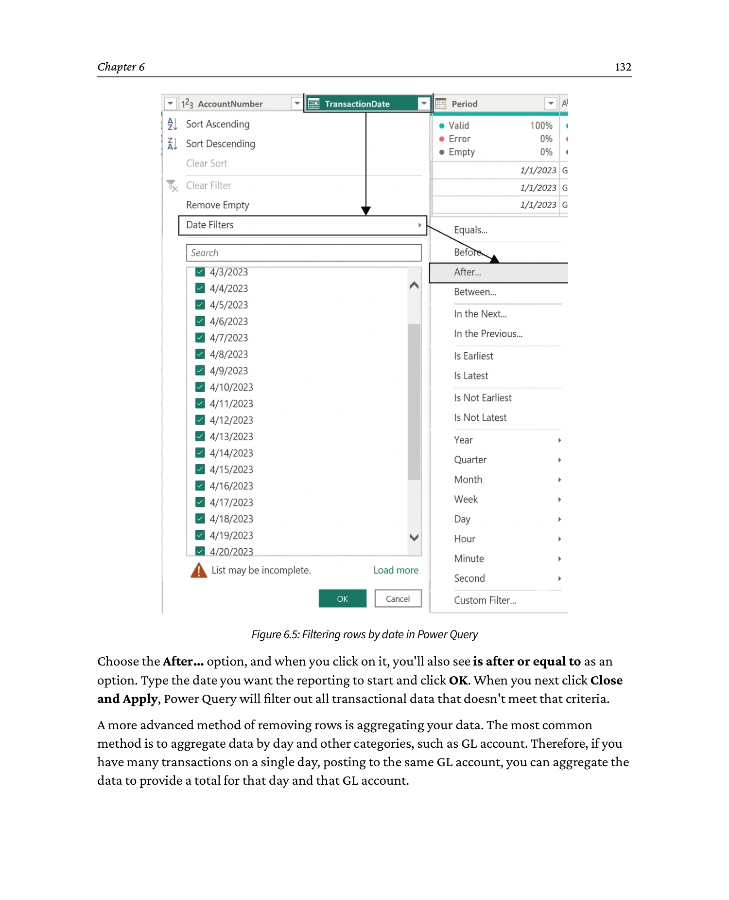

```
   Filtering rows by date in Power Query

   Drop-down on the TransactionDate column header, then Date Filters:
   +--------------------------------------------------+
   |  Sort Ascending                                 |
   |  Sort Descending                                |
   |  Clear Sort                                     |
   |--------------------------------------------------|
   |  Clear Filter                                   |
   |  Remove Filter                                  |
   |--------------------------------------------------|
   |  Date Filters              >                    |
   |    After ...             (we choose this)        |
   |    After or Equal To ...                         |
   |    Before ...                                    |
   |    Is in the Last ...                            |
   |    Is in the Next ...                            |
   |    Custom Filter ...                             |
   |--------------------------------------------------|
   |  Text Filters             >                      |
   |  Number Filters           >                      |
   +--------------------------------------------------+
   |  Search                                       |
   +--------------------------------------------------+

```


Choose the *After…* option, and when you click on it, you'll also see *is after or equal to* as an option. Type the date you want the reporting to start and click *OK*. When you next click *Close and Apply*, Power Query will filter out all transactional data that doesn't meet that criteria.

A more advanced method of removing rows is aggregating your data. The most common method is to aggregate data by day and other categories, such as GL account. Therefore, if you have many transactions on a single day, posting to the same GL account, you can aggregate the data to provide a total for that day and that GL account. Using Power Query to do this, you'll use the *Group By* function, which is under the *Transform* tab (*Figure 6.6*). Using the accompanying dataset, select the `{GL Transactions}` table and then click the *Group By* button. Select the *Advanced* radio button in the *Group By* dialog box and add the `TransactionDate` and `AccountNumber` columns. The next step is to enter the name and aggregation for a new column that Power Query will generate. In our example, we called the new column `Aggregated Amount`, the operation is `[SUM]`, and the column is `Amount`.

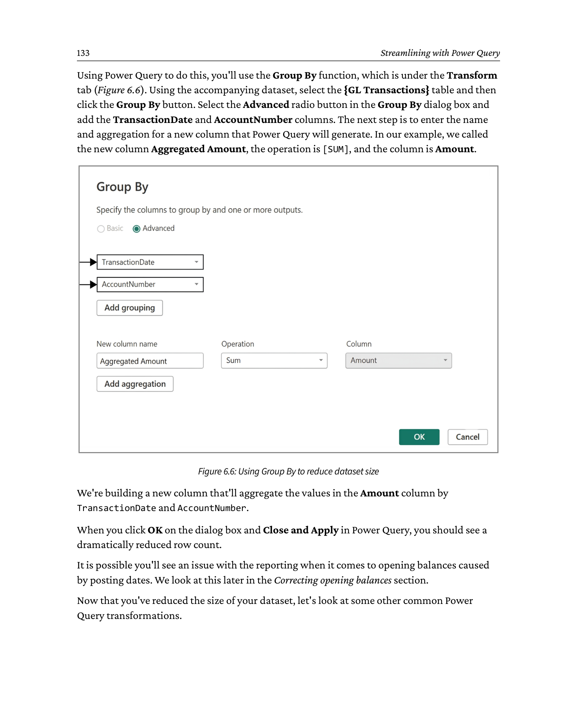

```
   Using Group By to reduce dataset size

   Group By dialog (Advanced mode)
   +--------------------------------------------------------+
   |  Group By                                              |
   |--------------------------------------------------------|
   |  ( ) Basic                                             |
   |  (o) Advanced                                          |
   |                                                        |
   |  Group by                                              |
   |    +-----------+     +-----------+                     |
   |    |Transaction|     |AccountNum |                     |
   |    |Date       |     |ber        |                     |
   |    +-----------+     +-----------+                     |
   |                                                        |
   |  New column name          Operation      Column        |
   |  +---------+ +---------+ +---------+                  |
   |  |Aggregated| |Sum      v| |Amount   v|                |
   |  |Amount    | +---------+ +---------+                  |
   |  +---------+                                           |
   |                                                        |
   |  [ OK ]   [ Cancel ]                                   |
   +--------------------------------------------------------+
```


We're building a new column that'll aggregate the values in the `Amount` column by `TransactionDate` and `AccountNumber`.

When you click *OK* on the dialog box and *Close and Apply* in Power Query, you should see a dramatically reduced row count.

It is possible you'll see an issue with the reporting when it comes to opening balances caused by posting dates. We look at this later in the *Correcting opening balances* section.

Now that you've reduced the size of your dataset, let's look at some other common Power Query transformations.

## 6.3 Common data transformations

In the previous section, we looked at how you can use Power Query to reduce the size of your dataset. In this section, we'll develop those skills with some common data transformations.

The lessons from the previous section are also transformations, but we wanted to separate the task of reducing your dataset from the task of transforming your data to make it easier to use and more accurate to work with.

Like the rest of the book, this is far from exhaustive. Power Query is the sole topic in many books, and we have only one chapter, as our core focus here is Power BI for finance, rather than Power Query alone. Our objective is to explain some common methods we employ when working with Power BI and Power Query in the context of modeling financial data.

In this section, we'll explain the following:

- Changing data types
- Adding conditional and custom columns
- Merging data
- Pivoting and unpivoting columns
- Changing column headers using AI to be readable by humans
- Correcting opening balances

Along the way, we'll see some essential Power Query practices we think you'll enjoy for long-term use.

### 6.3.1 Changing data types

One of the fundamental tasks when building a database table is to set the data types for each column. You've probably entered lots of data into Excel, and as Excel is cell-based, the data type for a column isn't a consideration, as you can enter text, numbers, and dates within a single column. You can't do this within a database, and you can't do this in Power Query or Power BI. Mix up data types in a single column, and Power Query will revert to the lowest standard, which is *Any*, as that'll accommodate every data type. You won't find it very useful, as a date in an *Any* column won't have TI capabilities, and a number will be stored as text.

Setting column types in Power BI is important as it allows the application to treat data according to its type, such as calculations for numbers and TI for dates.

In many cases, you'll find the column type is automatically set as Power Query can read the type from the data source. However, depending on the data source, Power Query may not have this information, so all columns will be imported as text. Fixing this is a simple task and worth your while.

If your data import has a set of columns that are exclusively type *All*, then click on the `ABC123` icon at the top left of the column, and you'll see the different column types you can set. Please use the column type to match the data in the column.

> **Note:** For more details on column types, follow Microsoft's official documentation at https://learn.microsoft.com/en-us/power-query/data-types, which lists column types and purposes.

As Power Query generally only samples the top 1,000 rows of data, you may notice errors when your data loads into Power BI. This often relates to row contents that are different from the column type you set, somewhere within the data. If this is the case, you'll need to go back to Power Query and resolve the issue before proceeding. This can be done by removing rows, setting the column back to *Any*, or replacing the errant data. The resolution will depend on how important the rows are.

### 6.3.2 Adding conditional and custom columns

Here's another Power BI/Power Query gray area. You can add columns in both, so which should you choose? There's no black and white answer to this one, although we generally try to do as much as we can in Power Query so that the data is in good shape when we use it in Power BI.

There are many reasons to add columns in existing data tables, such as the following:

- **Calculations** (e.g., price × quantity)
- **Categorization** (grouping of transactions by type or adding text to numeric drop-down values)
- **Cleaning** (adding flags to rows for data that may need to be cleaned)

You'll find that the ability to extend data tables in Power Query gives you flexibility and options for what you're able to do with your data.

**Conditional columns**

From Power Query, click the *Add Column* tab and click on *Conditional Column*.

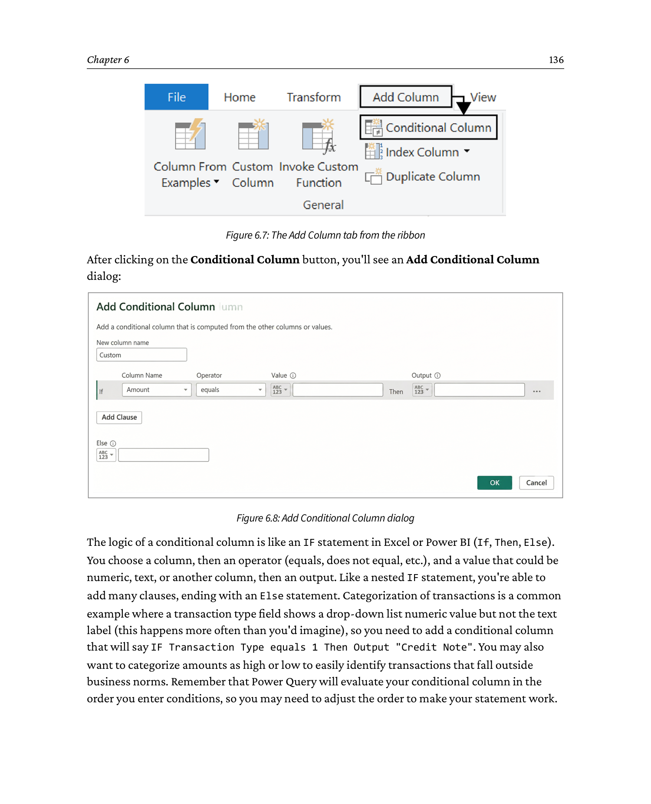

```
   The Add Column tab from the ribbon

   +--------------------------------------------------------+
   |  Home | Transform | Add Column | View | Tools | Help   |
   |------------------------------------------------------|
   |  [ General v ]    [ Text Column v ]                   |
   |     [ Column From Examples ]                          |
   |     [ Invoke Custom Function ]                        |
   |     [ Conditional Column ]                            |
   |     [ Custom Column ]     <-- M scripting             |
   |     [ Index Column ]                                  |
   |     [ Duplicate Column ]                              |
   |  [ From Number v ]  [ From Date v ]  [ From Time v ]  |
   +--------------------------------------------------------+
```


After clicking on the *Conditional Column* button, you'll see an *Add Conditional Column* dialog:


```
   Add Conditional Column dialog

   +----------------------------------------------------------+
   |  Add Conditional Column                                 |
   |----------------------------------------------------------|
   |  New column name: [TransactionTypeLabel            ]    |
   |                                                          |
   |  Clause 1                                                |
   |    Column: [TransactionType v]                           |
   |    Operation: [equals           v]                       |
   |    Value:    [1                  ]                       |
   |    Output:   [Credit Note        ]                       |
   |    [ Add clause ]                                       |
   |                                                          |
   |  Else:  [Unclassified            ]                       |
   |                                                          |
   |  [ OK ]   [ Cancel ]                                     |
   +----------------------------------------------------------+
```


The logic of a conditional column is like an IF statement in Excel or Power BI (*If, Then, Else*). You choose a column, then an operator (*equals, does not equal*, etc.), and a value that could be numeric, text, or another column, then an output. Like a nested IF statement, you're able to add many clauses, ending with an *Else* statement. Categorization of transactions is a common example where a transaction type field shows a drop-down list numeric value but not the text label (this happens more often than you'd imagine), so you need to add a conditional column that will say `IF Transaction Type equals 1 Then Output "Credit Note"`. You may also want to categorize amounts as high or low to easily identify transactions that fall outside business norms. Remember that Power Query will evaluate your conditional column in the order you enter conditions, so you may need to adjust the order to make your statement work.

**Custom columns**

The next common option for adding columns is a custom column. You can do everything from a conditional column in a custom column and much more, which begs the question: Why use a conditional column? Conditional columns work with an intuitive point-and-click interface, which makes it easier for users with limited experience to get the result they need. Custom columns require input using Power Query's native scripting language, M. M is relatively straightforward to use, although it's different from DAX, so don't rely on your DAX skills to get the syntax of M incorrect. To continue with the example of an IF statement, a conditional column using M could look like this:

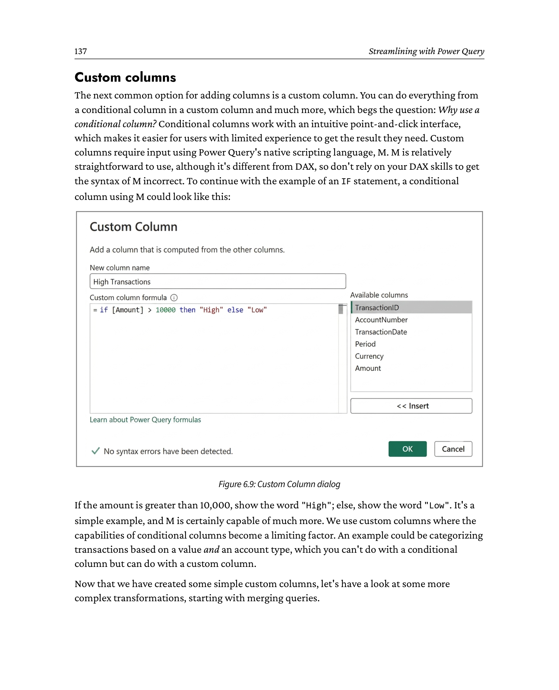

```
   Custom Column dialog

   +----------------------------------------------------------+
   |  Custom Column                                           |
   |----------------------------------------------------------|
   |  New column name: [AmountCategory                 ]      |
   |                                                          |
   |  Custom column formula:                                 |
   |  +----------------------------------------------------+  |
   |  | = if [Amount] > 10000 then "High" else "Low"       |  |
   |  +----------------------------------------------------+  |
   |                                                          |
   |  Tip: A common language (M) reference is available.      |
   |                                                          |
   |  [ OK ]   [ Cancel ]                                     |
   +----------------------------------------------------------+
```


If the amount is greater than 10,000, show the word "High"; else, show the word "Low". It's a simple example, and M is certainly capable of much more. We use custom columns where the capabilities of conditional columns become a limiting factor. An example could be categorizing transactions based on a value and an account type, which you can't do with a conditional column but can do with a custom column.

Now that we have created some simple custom columns, let's have a look at some more complex transformations, starting with merging queries.

### 6.3.3 Merging data

*Merge Queries* in Power Query allows us to merge data from separate tables, where we're adding one or many columns from one table to another. When we have a table structure in a database, developers look for efficiency by reducing redundancy or replication of data. For example, the `AccountNumber` column on the *GL Transactions* table may just include the account number, not the account name or other useful attributes. Those attributes will be on the *ChartOfAccount* table that's linked to the *GL Transactions* data via the account ID. This way, we store the *ChartOfAccount* attributes once on the *ChartOfAccount* table, and we don't repeat them on every line item on the *GL Transactions* table.

Merging queries undoes this, which probably seems counterintuitive as we've written about the importance of efficiency within our data model. What works for database efficiency doesn't always work for analytics efficiency; the term we use to describe this is **denormalization**. There are a few reasons why we may choose to do this:

- Queries may run faster with denormalization, as multiple joins between tables have a negative impact on query time
- Data models are simplified and easier to understand and work with for users
- Denormalized tables allow pre-aggregation of data for very large tables

Like many aspects of data, there's a trade-off with *Merge Queries* depending on the complexity of your model, and in most cases, you'll probably use *Merge* to make it easier to work with, unless you're working with very large and complex models.

An example of when and where you may want to do this is for a simple treatment of foreign exchange. Consider the situation where you need daily spot rates for a single currency conversion. We could use the method demonstrated in *Chapter 4, Common DAX Measures*, using DAX, or we could add the daily rate using *Merge*.

To use *Merge* in this example, follow these steps:

1. First, select the *GL Transactions* table in the *Queries* pane with a single click.
2. Then, from the *Home* tab in Power Query, we'll select *Merge*, which will launch the *Merge* dialog box.
3. You'll see the *GL Transactions* table and a dropdown to choose a table that will be merged from, where you'll select the *Exchange rate* table.
4. On the *GL Transactions* table, choose the `TransactionDate` field, and from the *Exchange rate* table, choose the `Date` field (*Figure 6.10*) and click *OK*.
5. The final column of the *GL Transactions* table will now be labeled *Exchange Rate* with an *Expand* column icon to the right of the field header.
6. When you select this, you can choose columns from the *Exchange rate* table to add to the *GL Transactions* table.
7. Select the columns you want to add and click *OK*. The selected columns will then be added to the *GL Transactions* table, matched by date.

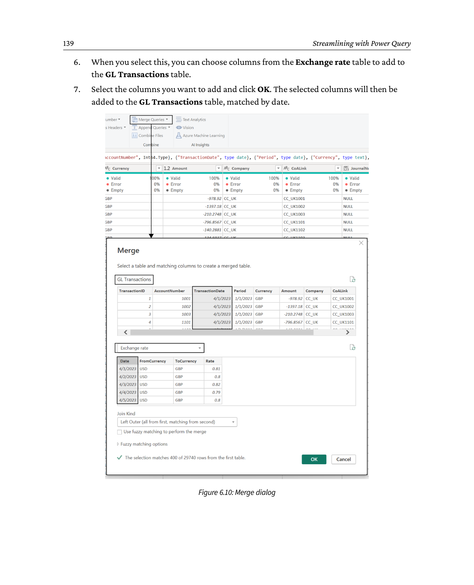

```
   Merge dialog

   +----------------------------------------------------------+
   |  Merge                                                   |
   |----------------------------------------------------------|
   |  Left table for merge: [GL Transactions      v]          |
   |  Right table for merge:[Exchange rate         v]         |
   |                                                          |
   |  Use fuzzy matching to perform the merge:  [ ]           |
   |  Match case:                                           [x]
   |                                                          |
   |  Left column              Right column                  |
   |  +---------------+        +---------------+              |
   |  |TransactionDate|        | Date          |              |
   |  +---------------+        +---------------+              |
   |                                                          |
   |  Join kind: [Left Outer (rows from the left) v]          |
   |                                                          |
   |  [ OK ]   [ Cancel ]                                     |
   +----------------------------------------------------------+
```


### 6.3.4 Pivoting and unpivoting columns

Pivoting and unpivoting columns in Excel is a common use, as we frequently use pivot tables as a presentation and analysis method. This section is titled *Pivoting and unpivoting columns*, but more focus will be on unpivoting columns, as it's a frequent transformation. It's common to ingest data into Power Query in a pivoted format, often from standard reports outputted from finance systems. Pivoted tables are like matrices in Power BI, where we have many columns with specific categories and values of an identical type. Aging buckets are a great example where we often see columns categorizing aged debt (31–60, 61–90, 91–120, etc.) and rows with customer names. At the intersection of each row and column is a value, which is the debt value within the aging bucket for that customer. It's a standard method we use to understand the data, as it's quick and easy to identify issues.

When ingesting data into Power Query/Power BI, the temptation is to work with the data in the pivoted form as output from the report. While tempting and often done, it's an ineffective method for the purposes of data analytics, as we limit what we can do with that data.

Returning to our example of aging buckets, it's impossible to compare period-on-period changes to aging buckets, as there is no relationship between them when each bucket is a column. For this and many other reasons, we unpivot.

When unpivoted, we can build measures that allow us to analyze the data in detail and make comparisons.

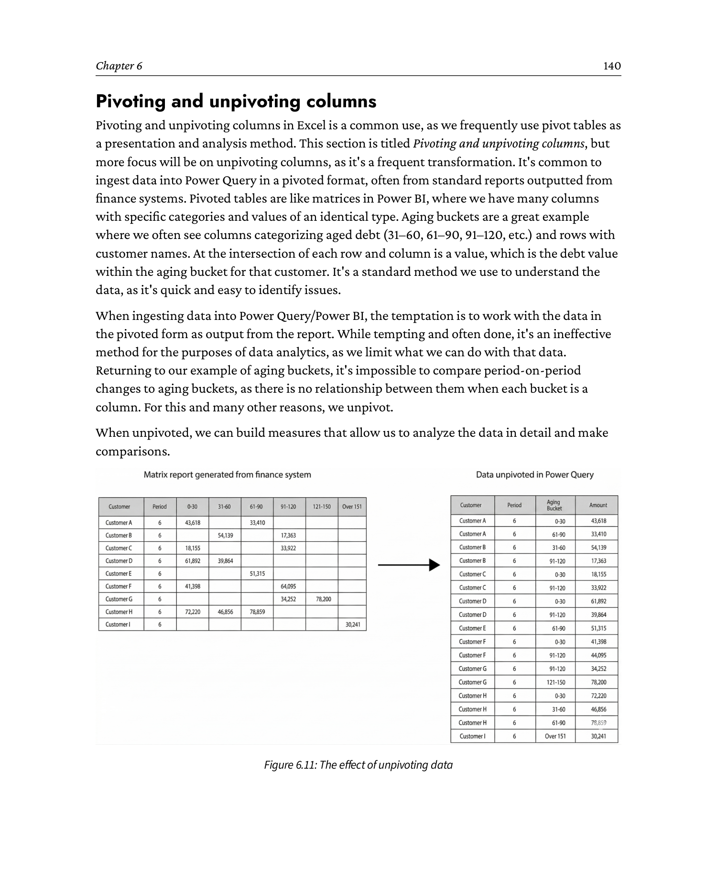

```
   The effect of unpivoting data

   BEFORE (pivoted - one column per aging bucket)
   +--------+---------+-------+-------+-------+--------+
   | Customer| 0-30    | 31-60 | 61-90 | 91-120| 120+   |
   +--------+---------+-------+-------+-------+--------+
   | ACME   |  1,000  |   500 |   0   |   0   |   0    |
   | BETA   |    200  |     0 |  100  |  200  |  300   |
   | ...    |  ...    |  ...  |  ...  |  ...  |  ...   |
   +--------+---------+-------+-------+-------+--------+

   AFTER (unpivoted - one row per bucket)
   +--------+----------+--------+
   | Customer|Bucket    | Value  |
   +--------+----------+--------+
   | ACME   | 0-30     |  1,000 |
   | ACME   | 31-60    |    500 |
   | BETA   | 0-30     |    200 |
   | BETA   | 61-90    |    100 |
   | BETA   | 91-120   |    200 |
   | BETA   | 120+     |    300 |
   | ...    | ...      |  ...   |
   +--------+----------+--------+

   The unpivoted form has more rows but supports period-on-period
   comparison and a clean link to the Date table on Period.
```


Our unpivoted table will have many more rows than the original report, but it is more efficient as we can use Power Query to filter out zero or null values from rows in the matrix.

When unpivoted and imported into Power BI, we can connect the `Period` column of the unpivoted table to the `Period` column in our *Date* table for period-on-period calculations using `SUMX` or `CALCULATE` and `FILTER`, discussed earlier.

### 6.3.5 Changing column names using AI to be readable by humans

This step in our Power Query basics is one that's been made easier by AI tools. It's often the case that column names in your finance application use text that doesn't make sense or is hard to read:

- **SAP** generally uses five-character field names, derived from German words. For example, the German term for sales organization is *Verkaufsorganisation*, and the field name in SAP for sales organization is `VKORG`. Even if you're a German speaker, the field name may not be too helpful.
- **Dynamics 365 Finance and Operations** capitalizes field names and has no spacing between words. For example, `INVOICECUSTOMERACCOUNTNUMBER` is *Invoice Customer Account Number*. From all capitals to mixed case with spacing, the text becomes far easier to read.

Software developers need standards to name fields, so all capitals with no spaces is common and for good reason. However, it doesn't make our data analytics lives easy when we need to interact with it.

Traditionally, we'd find a table that maps the field name to the field label and build a *Rename Columns* command in Power Query. We may even click each column header and rename it. Either way, it's time-consuming but required, so we do it.

The following method is not the most intuitive in terms of the steps you'll follow, but it allows you to use the power of AI to help with column renaming. We do have to warn you first that AI can make mistakes, so if you have any concerns, check the outputs. Despite the accuracy warning, this is a method that can save a lot of time and effort for a basic and necessary task:

1. In Power Query, select a table where you want to change the column names and click on the first column. Press `Ctrl + A` to select all columns in the table. Right-click any of the selected column headers and choose *Unpivot Only Selected Columns*.
2. In the Power Query command bar, copy all of the text (`Ctrl + A` and `Ctrl + C`) and paste it into Notepad.
3. In Notepad, delete the text `['=Table.Unpivot('` from the start of the pasted text and `"Attribute", "Value")]'` from the end of the pasted text. You'll be left with the table name and all of the fields in quotation marks, separated by commas.
4. In Notepad, add the following text: *"Please generate a Power Query rename.columns statement using this table [tablename] and the following fields. Please make the fields mixed case with spaces and easily readable by humans: {all of the fieldnames in quotation marks, separated by spaces}"*
5. Copy and paste the query into a generative AI (GenAI) tool such as Copilot, ChatGPT, or Claude.
6. Back in Power Query, delete the *Unpivoted Only Selected Columns* step, right-click on *Navigation* step, and select *Insert Step After*. Copy the `RenameColumns` statement generated in your GenAI tool into the command bar, making sure it starts with the `=` symbol. Press *Enter*, and all your columns should be successfully renamed.

A few things can go wrong, such as minor syntax errors; for example, missing the `=` symbol at the start or missing parentheses, although you should be able to get your GenAI tool to correct this. You may see repeated field texts from the tool, which can be resolved by adding a request to make all new field names unique or editing them manually yourself.

While this method may initially feel like a lot of steps, we're sure you'll find the effort worth it unless your column names are easy to read when loaded into Power Query.

## 6.4 Correcting opening balances

We've just looked at filtering datasets and mentioned a potential problem when filtering GL transaction data. The problem arises when filtering rows of our dataset by date. As we're excluding previous years' data, we won't have opening balances from the prior year, and our balances may therefore be incorrect. If, for example, the filter is only ever applied at the start of a financial year, and the system posts opening balances for the year into a special period (such as Period 0), then there should not be a problem. If, however, the system does not store opening balances (for example, the system calculates reports at runtime) or there is a need to filter partway through a financial year, we need to deal with creating opening balances.

The first step is to create a dataset to create opening balances by filtering GL transactions to only show those *BEFORE* the date we want to view the transactions from:

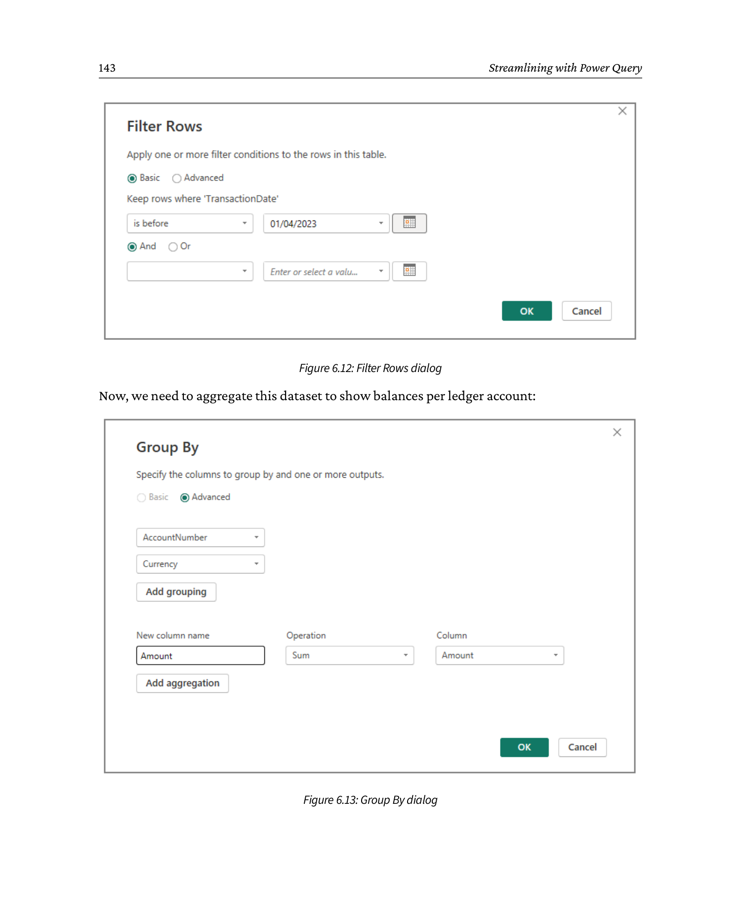

```
   Filter Rows dialog

   +----------------------------------------------------------+
   |  Filter Rows                                             |
   |----------------------------------------------------------|
   |  Keep rows where [TransactionDate]                       |
   |      [is before      v]                                  |
   |      [a fixed date   v]                                  |
   |      [1/1/2024    v]                                     |
   |                                                          |
   |   [And]  [Or]    [Add clause]                            |
   |                                                          |
   |  [ OK ]   [ Cancel ]                                     |
   +----------------------------------------------------------+
```


Now, we need to aggregate this dataset to show balances per ledger account:


```
   Group By dialog (for opening balances)

   +----------------------------------------------------------+
   |  Group By                                                |
   |----------------------------------------------------------|
   |  ( ) Basic                                               |
   |  (o) Advanced                                            |
   |                                                          |
   |  Group by                                                |
   |    +-----------+     +-----------+                       |
   |    |AccountNum |     | (no more) |                       |
   |    |ber        |     |           |                       |
   |    +-----------+     +-----------+                       |
   |                                                          |
   |  New column name        Operation      Column            |
   |  +---------+ +---------+ +---------+                    |
   |  | Amount  | | Sum   v | | Amount v|                     |
   |  +---------+ +---------+ +---------+                    |
   |                                                          |
   |  [ OK ]   [ Cancel ]                                     |
   +----------------------------------------------------------+
```


> **Note:** It is important to call the new column *Amount*, as we need column names in the opening balances to match column names in transactions in order to combine the two successfully.

This will result in a basic set of opening balances like this:

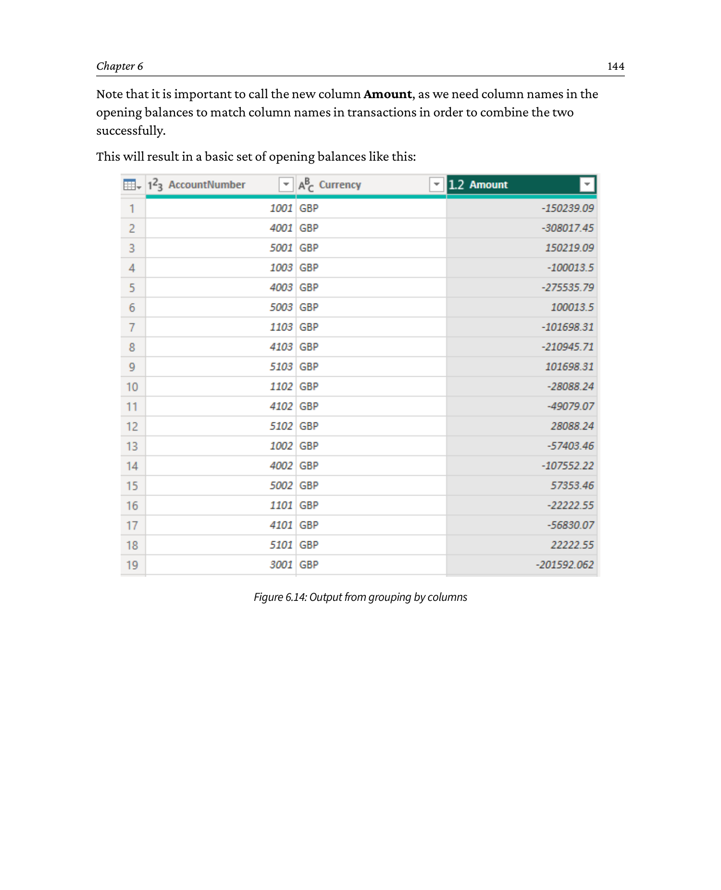

```
   Output from grouping by columns (opening balances)

   +-------------------+------------+
   | AccountNumber     | Amount     |
   +-------------------+------------+
   | 1001              |   12,500.00|
   | 1002              |    3,200.00|
   | 2001              |  -15,700.00|
   | 2002              |     -800.00|
   | 4001              |   22,100.00|
   | ...               | ...        |
   +-------------------+------------+

   This is the basic set of opening balances.  Each row is a single
   account with its closing balance from the prior period.  Note
   that the column is called Amount, the same name as the Amount
   column on GL Transactions, so the two tables can be appended.
```


The problem now is that this will not join our model correctly. For a start, it lacks a transaction date as opening balances are aggregated over many different dates. We therefore have to decide where we want to recognize the balance. In this example, we would either want to choose the first day of the financial year we wish to start picking up details in, or the last day of the previous year. Using the first day of the current year will skew any year-to-date calculations, so we will use the last day of the prior year and add a transaction date of March 31, 2023.

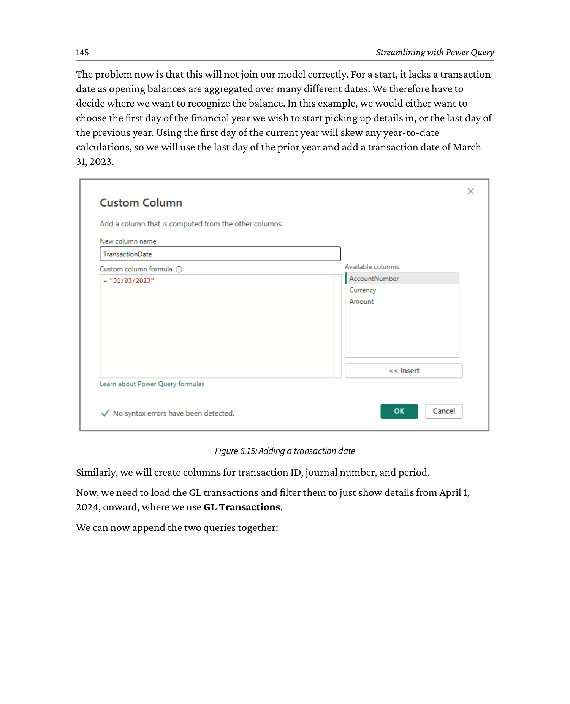

```
   Adding a transaction date

   +-------------------+------------+-----------+
   | AccountNumber     | Amount     | TransDate |
   +-------------------+------------+-----------+
   | 1001              |   12,500.00| 31/03/2023|
   | 1002              |    3,200.00| 31/03/2023|
   | 2001              |  -15,700.00| 31/03/2023|
   | 2002              |     -800.00| 31/03/2023|
   | 4001              |   22,100.00| 31/03/2023|
   | ...               | ...        | ...       |
   +-------------------+------------+-----------+

   We add a transaction date of 31/03/2023 - the last day of the
   previous financial year - so that the opening balances flow
   naturally into the new period's TI calculations.

   We will also add columns for TransactionID, JournalNumber and
   Period at this point.
```


Similarly, we will create columns for transaction ID, journal number, and period.

Now, we need to load the GL transactions and filter them to just show details from April 1, 2024, onward, where we use *GL Transactions*.

We can now append the two queries together:

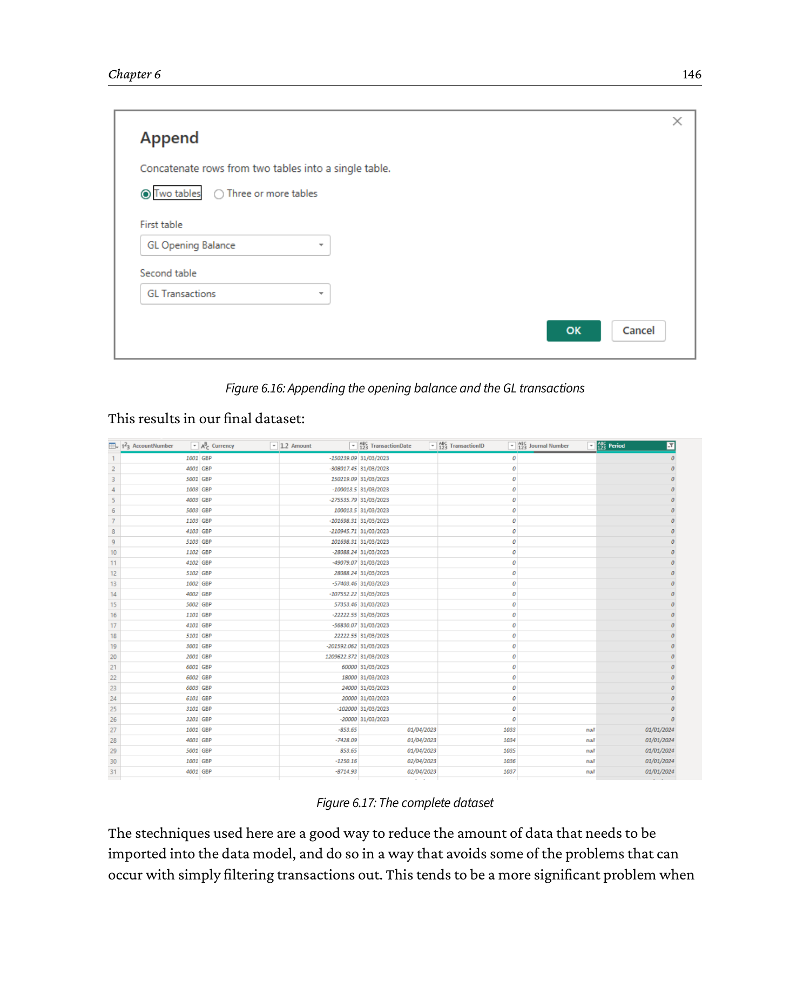

```
   Appending the opening balance and the GL transactions

   GL Transactions
   +------------+----------+----------+--------+
   |TransDate   | Account  | Journal  | Amount |
   +------------+----------+----------+--------+
   | 1/04/2024  | 1001     |  AP-201  |  -300  |
   | 1/04/2024  | 2001     |  AP-201  |   300  |
   | 3/04/2024  | 1001     |  INV-87  |  -150  |
   | ...        | ...      |  ...     |   ...  |
   +------------+----------+----------+--------+

                +  (append queries)

   Opening Balances (synthesized)
   +------------+----------+----------+--------+
   |TransDate   | Account  | Journal  | Amount |
   +------------+----------+----------+--------+
   | 31/03/2023 | 1001     |  OB-1    | 12,500 |
   | 31/03/2023 | 2001     |  OB-1    |-15,700 |
   | ...        | ...      |  ...     |  ...   |
   +------------+----------+----------+--------+

                              |
                              v
```


This results in our final dataset:


```
   The complete dataset

   +------------+----------+----------+--------+
   |TransDate   | Account  | Journal  | Amount |
   +------------+----------+----------+--------+
   | 31/03/2023 | 1001     |  OB-1    | 12,500 |
   | 31/03/2023 | 1002     |  OB-1    |  3,200 |
   | 31/03/2023 | 2001     |  OB-1    |-15,700 |
   | 31/03/2023 | 2002     |  OB-1    |  -800  |
   | 31/03/2023 | 4001     |  OB-1    | 22,100 |
   | 1/04/2024  | 1001     |  AP-201  |  -300  |
   | 1/04/2024  | 2001     |  AP-201  |   300  |
   | 3/04/2024  | 1001     |  INV-87  |  -150  |
   | 3/04/2024  | 2001     |  INV-87  |   150  |
   | ...        | ...      |  ...     |  ...   |
   +------------+----------+----------+--------+

   A single dataset for the model: opening balances sit on the
   day before the transactions start, and from there the model
   works as if the historical data was never there at all.
```


The techniques used here are a good way to reduce the amount of data that needs to be imported into the data model, and do so in a way that avoids some of the problems that can occur with simply filtering transactions out. This tends to be a more significant problem when dealing with ledger data or inventory transactions (which we will cover in *Chapter 8, Managing Inventory Data*), where overall totals may be tracked across all historical data.

## 6.5 Summary

In this chapter, we introduced basic ideas of data transformation and how they can be applied in Power BI. We looked in detail at some more common and useful transformations and why you would want to use them. Finally, we brought these techniques together into a more complex pattern to create opening balances: a critical component to reduce the size of datasets.

In the next chapter, we will use some of the methods learned here to bring in the next big piece of data that we need to drive effective financial reporting - the budget.

---

> **Note: Get this book's PDF version and more**
>
> Scan the QR code (or go to https://www.packtpub.com/unlock). Search for this book by name, confirm the edition, and then follow the steps on the page.

> **Note:** Keep your invoice handy. Purchases made directly from Packt don't require an invoice.

---

_Generated by `convert_chapter6.py` + `build_chapter6_md.py` on 2026-06-16._
