# Chapter 7: Incorporating Budgets and Targets

**Source: *Financial Modeling and Reporting with Microsoft Power BI* (Packt Publishing, 2026)**

DOI: 10.0000/PACKT_FMRWPB_2026  |  GitHub: https://github.com/PacktPublishing/Financial-Modeling-with-Power-BI_Packt/tree/main/Chapter7

_Page range: 178 - 199_

---

## 7.1 Technical requirements

To follow the examples in this chapter and beyond, you'll need a Windows PC with an internet connection, and you'll also need to download Power BI Desktop.

For more details, see Microsoft's download page for Power BI Desktop at <https://learn.microsoft.com/en-us/power-bi/fundamentals/desktop-get-the-desktop>.

The examples in this chapter can be tried out in the `Chapter 7.pbix` model. A fully worked example of multiple budget models is available in the `Chapter 7 - Multiple Models.pbix` file. Both files are in the GitHub repository at <https://github.com/PacktPublishing/Financial-Modeling-with-Power-BI_Packt/tree/main/Chapter7>.

---

## 7.2 Creating a budget table

We'll start with the assumption that you already have a process for budgetary management and budget data, stored in an Excel spreadsheet.

Most applications for financial management will have some sort of budgeting functionality built in, but they're often unused. The reasons are varied, although most tools within financial management systems don't have the flexibility to manage the specifics of the organizational budgetary processes, so it's easier to use a spreadsheet. While we have a lot to say about Excel as a data source, budgets and Excel work very well together.

If you maintain budgets in your financial management application, most of the guidance in this chapter should also be useful.

If you don't have an existing budget spreadsheet, an example is provided in the `Budget.xlsx` file in the GitHub repository. The example is typical of the budget tables we work with, in matrix format. It's effective for humans but not as effective for Power BI, as we learned in the previous chapter; therefore, we'll need to unpivot the data in Power Query. The benefit of this approach is that your users can maintain budgets in a friendly way for them, as a matrix, and Power Query will unpivot the data to be friendly to Power BI.

If you're creating a spreadsheet for budgetary management, our example for the exercises will fit most use cases. Any template needs to be capable of the following:

- It must be capable of linking to your date table.
- It must be capable of linking to the Chart of Accounts (CoA).
- It must contain values in the same currency as the accounting currency of the GL.

The first point to note is that we don't want to join our budgets directly to individual GL transactions, so we use the Date and the Chart of Account tables to bridge them and allow us to show budgets against transaction totals for the relevant GL account.

The simplest scenario is a budget value per account, per month.

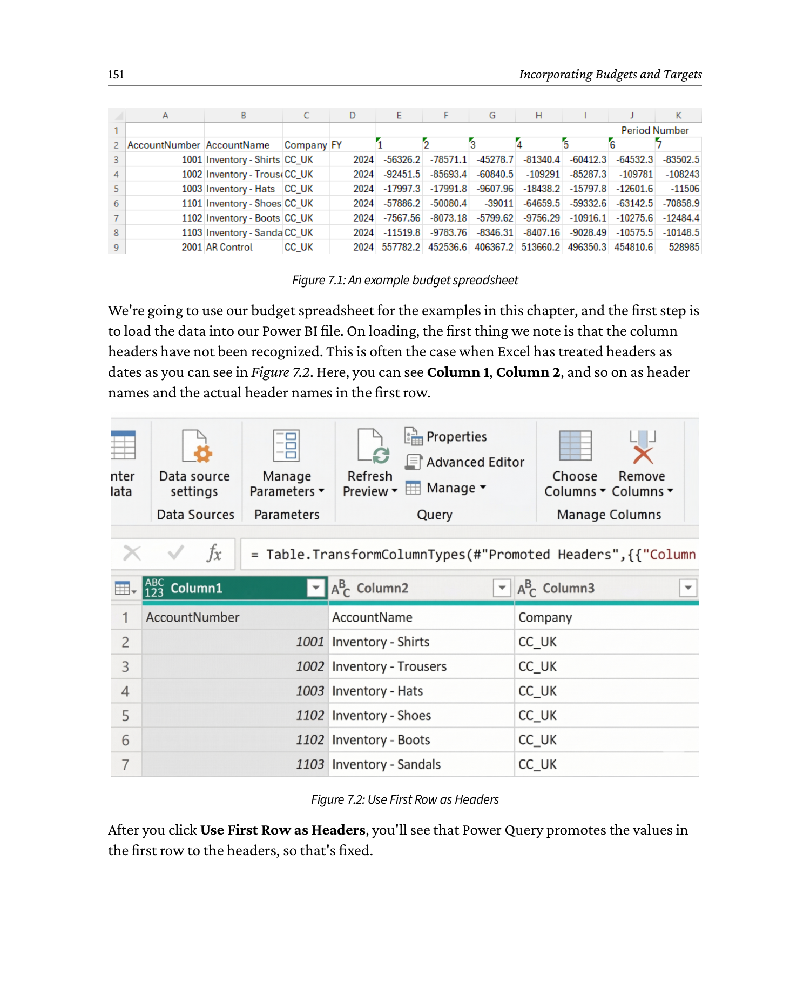

```
                  Budget Spreadsheet (Excel matrix view)
   +-----------------+-------+-------+-------+-------+-------+-------+
   | AccountNumber   | Jan   | Feb   | Mar   | Apr   | May   | Jun   |
   +-----------------+-------+-------+-------+-------+-------+-------+
   | 4000 - Sales    | 50000 | 52000 | 55000 | 58000 | 60000 | 62000 |
   | 5000 - COGS     | 20000 | 21000 | 22000 | 23000 | 24000 | 25000 |
   | 6000 - Salaries | 30000 | 30000 | 30000 | 30000 | 30000 | 30000 |
   | 7000 - Rent     |  5000 |  5000 |  5000 |  5000 |  5000 |  5000 |
   +-----------------+-------+-------+-------+-------+-------+-------+
   Key: rows = GL accounts,  columns = month periods
   Note: human-friendly but not Power-BI friendly (must be unpivoted)
```


We're going to use our budget spreadsheet for the examples in this chapter, and the first step is to load the data into our Power BI file. On loading, the first thing we note is that the column headers have not been recognized. This is often the case when Excel has treated headers as dates - you can see `Column 1`, `Column 2`, and so on as header names, with the actual header names in the first row (see Figure 7.2).


```
   Power Query Editor - before vs after "Use First Row as Headers"

   BEFORE                                  AFTER
   +--------+--------+--------+            +--------+--------+--------+
   |Column 1|Column 2|Column 3|            |Account |  Jan   |  Feb   |
   +--------+--------+--------+            +--------+--------+--------+
   |Account |  Jan   |  Feb   |            | 4000   | 50000  | 52000  |
   | 4000   | 50000  | 52000  |            | 5000   | 20000  | 21000  |
   | 5000   | 20000  | 21000  |            | 6000   | 30000  | 30000  |
   +--------+--------+--------+            +--------+--------+--------+

   Action: Home -> Transform -> Use First Row as Headers
```


After you click **Use First Row as Headers**, Power Query promotes the values in the first row to the headers, so that's fixed.

As discussed in *Chapter 6, Streamlining with Power Query*, we select the date columns with budget values and choose **Unpivot Only Selected Columns** from the right-click menu. We then rename the two columns that Power Query names, `Attribute` and `Value`, to `Month` and `Amount` so that the names reflect the values within the rows. We do this by double-clicking the column header and typing in the new names.

Now, we can create a `Date` column from the period number and the financial year (see Figure 7.3).

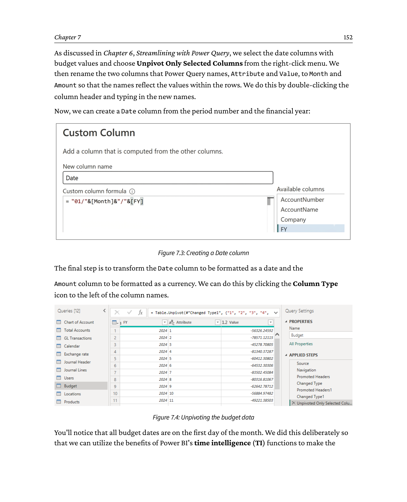

```
   Creating a Date column from Year and Month-Number

   Source columns           Transform              Resulting column
   +-----+-------+         +-----------------+    +------------+
   |Year |MonthNo|   -->   | = #date(        |    |    Date    |
   +-----+-------+         |     [Year],     | -> +------------+
   | 2025|   1   |         |     [MonthNo],  |    | 2025-01-01 |
   | 2025|   2   |         |     1)          |    | 2025-02-01 |
   | 2025|   3   |         |   )             |    | 2025-03-01 |
   +-----+-------+         +-----------------+    +------------+

   Power Query M formula:
       Date = #date( [Year], [MonthNo], 1 )
```


The final step is to transform the `Date` column to be formatted as a date and the `Amount` column to be formatted as a currency. We do this by clicking the column-type icon to the left of the column names (see Figure 7.4).


```
   Unpivot: wide matrix -> tall table (Power-BI friendly)

   WIDE (before)                       TALL (after unpivot)
   +--------+------+------+            +--------+-------+--------+
   |Account | Jan  | Feb  |            |Account | Month | Amount |
   +--------+------+------+            +--------+-------+--------+
   | 4000   |50000 |52000 |    -->     | 4000   | Jan   | 50000  |
   | 5000   |20000 |21000 |            | 4000   | Feb   | 52000  |
   +--------+------+------+            | 5000   | Jan   | 20000  |
                                       | 5000   | Feb   | 21000  |
                                       +--------+-------+--------+
   Right-click month columns -> Unpivot Other Columns
   Rename Attribute -> Month,  Value -> Amount
```


You'll notice that all budget dates are on the first day of the month. We did this deliberately so that we can utilize the benefits of Power BI's time-intelligence (TI) functions to make the exercise quicker, as we'll aggregate budgets and actuals by month and year. If Power BI recognizes a full date, it will make TI functions available. We'll explain this in more detail later.

Once we've done the transformation, it's time to include this in our data model, first by clicking **Close & Apply** in Power Query. We then join the Chart of Accounts and Calendar tables to the Budget table by linking the `Date` and `AccountNumber` fields. We made this easier for ourselves in the **Data Model** view by creating a new tab to only see the tables we're working with (see Figure 7.5).

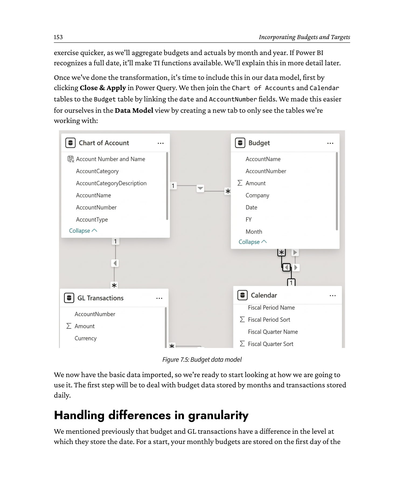

```
   Data Model - relationships around the Budget table

        +---------------+           +----------------+
        |   Calendar    | 1     N * |     Budget     |
        |---------------|-----------|----------------|
        | Full Date (PK)|           | Date        FK |
        | Calendar Year |           | AccountNumber FK|
        | Calendar Month|           | Amount         |
        | Month and Year|           | Month and Year |
        +---------------+           +----------------+
                                              |
                                              | N
                                              v
                                       +----------------+
                                       | Chart of       |
                                       | Accounts (CoA) |
                                       |----------------|
                                       | AccountNumber  |
                                       |   (PK)         |
                                       | AccountName    |
                                       | LinkID         |
                                       +----------------+
                                              |
                                              | N
                                              v
                                       +----------------+
                                       | GL Transactions|
                                       |----------------|
                                       | TransID        |
                                       | Date        FK |
                                       | LinkID      FK |
                                       | Amount         |
                                       +----------------+
```


We now have the basic data imported, so we're ready to start looking at how we are going to use it. The first step will be to deal with budget data stored by months and transactions stored daily.

---

## 7.3 Handling differences in granularity

We mentioned previously that budget and GL transactions have a difference in the level at which they store the date. For a start, your monthly budgets are stored on the first day of the month, to utilize TI functions, and your GL transactions are stored based on the transaction date. To deal with this, we'll use the Calendar table to aggregate both budget and GL transactions based on month and year values to compare the values correctly.

Comparing values on month and year is the dominant method for reporting, which is what we'll focus on for the rest of the chapter. Some organizations may need to budget daily, and we explain a method for doing that later in the chapter.

### 7.3.1 Budgeting monthly

Most of the hard work for comparing budget variance monthly has been completed in the previous steps. A good data model can be your best friend, but we still have some work to complete for a basic month-over-month comparison. To begin with, we'll need a few measures.

We'll start with a measure for our `GL Transactions` table. We will create the following measure in our `List of Measures` table:

```dax
GL Amount = SUM('GL Transactions'[Amount])
```

We then need a `SUM` measure for our budget figures, as follows:

```dax
Budget Amount = SUM(Budget[Amount])
```

Finally, for a basic budget comparison, we need a budget variance:

```dax
Budget Variance = [GL Amount] - [Budget Amount]
```

Figure 7.6 shows our example, and we have listed all the steps following this:

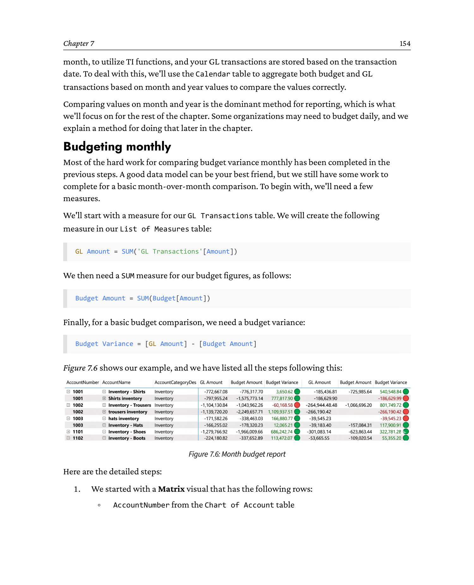

```
   Power BI Matrix visual: Month budget report

   Rows:  AccountNumber, AccountName, AccountCategoryDescription
   Cols:  Calendar Year, Calendar Month
   Values: GL Amount | Budget Amount | Budget Variance

   +-----------+----------------+----------+--------+--------+----------+
   | Account#  | Account Name   | 2024 Apr | 2024 May| 2025 Apr| 2025 May |
   +-----------+----------------+----------+--------+--------+----------+
   | 4000      | Sales          |  58000   |  60000 |  62000 |  65000   |
   | 5000      | COGS           |  23000   |  24000 |  25000 |  26000   |
   | 6000      | Salaries       |  30000   |  30000 |  32000 |  32000   |
   +-----------+----------------+----------+--------+--------+----------+
   Conditional formatting on Budget Variance: red below 0, green above 0
```


Here are the detailed steps:

1. We started with a **Matrix** visual that has the following rows:
   - `AccountNumber` from the Chart of Account table.
   - `AccountName` from the Chart of Account table.
   - `AccountCategoryDescription` from the Chart of Account table.
2. Our columns are as follows:
   - `Calendar Year Name`.
   - `Calendar Month Name`.
3. Our values are as follows:
   - `GL Amount`.
   - `Budget Amount`.
   - `Budget Variance`.
4. We filtered the calendar years 2024 and 2025.
5. From the **Format** options, we chose the **Tabular Layout** option from the Layout and Style presets.
6. We then right-clicked one of the `AccountNumber` rows in the visual and chose **Expand | All** to show all levels.
7. Next, we switched off row and column subtotals from the **Format** menu.
8. To build the conditional formatting on the `Budget Variance` columns, we clicked the down-chevron icon against the `Budget Variance` values block and chose the following options for font color (see Figure 7.7):

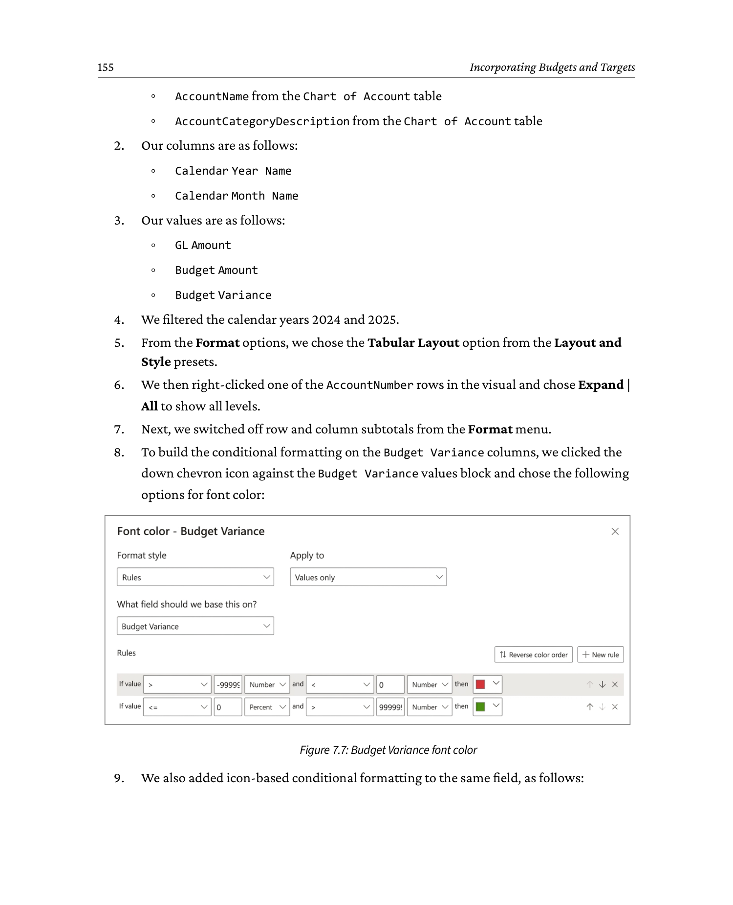

```
   Conditional formatting -> Font color dialog

   +---------------------------------------------------+
   |  Font color rules based on  Budget Variance       |
   |---------------------------------------------------|
   |  Minimum number :  Number                         |
   |  Maximum number :  Number                         |
   |                                                   |
   |  Color by rules:                                  |
   |   If value is:    [ Lowest value  ]  Color: RED   |
   |   If value is:    [ Number 0     ]  Color: WHITE  |
   |   If value is:    [ Highest value ]  Color: GREEN |
   |                                                   |
   |  [Apply]   [Cancel]                               |
   +---------------------------------------------------+
```


9. We also added icon-based conditional formatting to the same field, as shown in Figure 7.8.

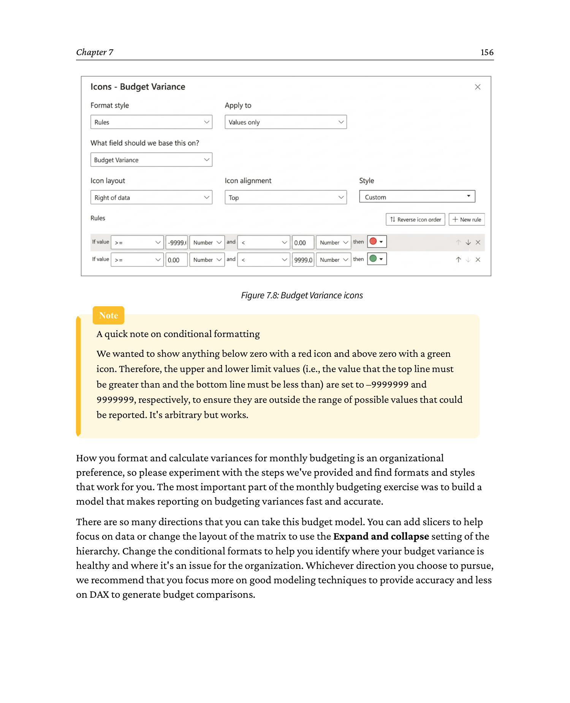

```
   Conditional formatting -> Icons dialog

   +---------------------------------------------------+
   |  Icon rules based on  Budget Variance             |
   |---------------------------------------------------|
   |  Style:    [ Icons  ]   (positive/negative rules) |
   |                                                   |
   |  Rules:                                           |
   |   If value >=  [ 9999999 ]   show  [ GREEN UP ]   |
   |   If value <=  [ -9999999]   show  [ RED DOWN]    |
   |   If value is between        show  [ no icon   ]  |
   |                                                   |
   |  [Apply]   [Cancel]                               |
   +---------------------------------------------------+
```


How you format and calculate variances for monthly budgeting is an organizational preference, so please experiment with the steps we've provided and find formats and styles that work for you. The most important part of the monthly budgeting exercise was to build a model that makes reporting on budgeting variances fast and accurate.

There are so many directions that you can take this budget model. You can add slicers to help focus on data, or change the layout of the matrix to use the **Expand** and **collapse** setting of the hierarchy. Change the conditional formats to help you identify where your budget variance is healthy and where it's an issue for the organization. Whichever direction you choose to pursue, we recommend that you focus more on good modeling techniques to provide accuracy and less on DAX to generate budget comparisons.

> **Note: A quick note on conditional formatting**
>
> We wanted to show anything below zero with a red icon and above zero with a green icon. Therefore, the upper and lower limit values (i.e., the value that the top line must be greater than and the bottom line must be less than) are set to **-9999999** and **9999999**, respectively, to ensure they are outside the range of possible values that could be reported. It's arbitrary but works.

### 7.3.2 Budgeting daily

First, we should consider why we would want to create daily budgets - after all, it would be rare to need to view budgets down to the day level. Broadly speaking, there are two places where this method is useful:

- Where you need to report against budgets at a lower level than monthly, such as weekly, especially since weeks do not neatly fit into months - this is a rare use case but does occasionally show up in some highly seasonal businesses, or where a business's performance can be impacted by events that vary by date between years.
- Where you need to pro-rate the budget to report against month or year-to-date figures, and you may be partway through a month.

Moreover, the techniques covered here can be adapted to other situations where you need to compare datasets stored in different levels of detail.

There are various methods for daily budgeting, and a certain amount will depend on the data you have available and organizational preferences. Based on the demonstration data we've generated, the method we'll use will be to spread the monthly budget sum over the days of the month. If your organization has created daily budgets, please use the monthly method instead of consolidating daily via the date table.

In our example, the budget for each day in April, for example, would be calculated as $\tfrac{1}{30}$ of the total budget for the month:

$$
\text{Daily Budget}_d = \frac{\text{Monthly Budget}}{30}
$$

To start, we need to create three calculated columns on our `Budget` table.

**1.** The first is a `Month and Year` column that will be used for the next column we create:

```dax
Month and Year = FORMAT(Budget[Date], "MMMM")&" "&YEAR(Budget[Date])
```

**2.** Similarly, we need to create a column in the Calendar table:

```dax
Month and Year = 'Calendar'[Calendar Month Name] & " " & 'Calendar'[Calendar Year Name]
```

You'll notice that the DAX returns `Month and Year` values that are identical to the values in the Calendar table.

**3.** The next column uses the preceding column to return a count of days for the given month based on `COUNTROWS` from the Calendar table:

```dax
Days in Month = CALCULATE(
    COUNTROWS('Calendar'),
    FILTER(
        'Calendar',
        Budget[Month and Year] = 'Calendar'[Month and Year]
    )
)
```

**4.** The third column is a simple `DIVIDE` operation of the month budget amount and the days in the month, as follows and shown in Figure 7.9:

```dax
Daily Amount = DIVIDE(Budget[Amount], Budget[Days in Month])
```

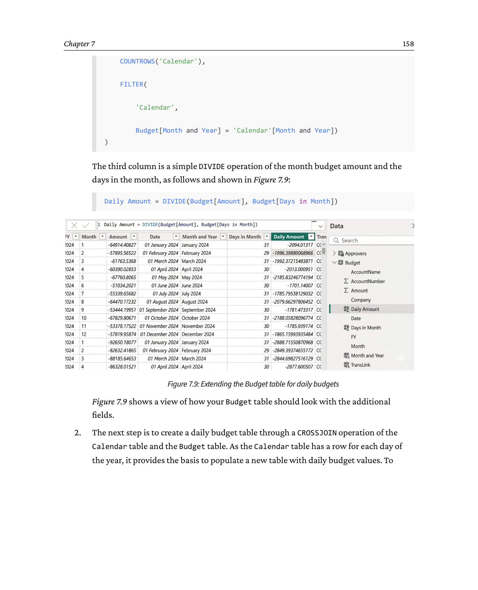

```
   Budget table - extended with three new calculated columns

   +------------+---------------+-------------+-----------+-----------+
   | Date       | AccountNumber | MonthYr     | DaysInMo  | DailyAmt  |
   +------------+---------------+-------------+-----------+-----------+
   | 2025-04-01 | 4000          | April 2025  | 30        | 1933.33   |
   | 2025-05-01 | 4000          | May 2025    | 31        | 1935.48   |
   | 2025-06-01 | 4000          | June 2025   | 30        | 2066.67   |
   +------------+---------------+-------------+-----------+-----------+
   Daily Amount  =  DIVIDE( Budget[Amount], Budget[DaysInMo] )
```


Figure 7.9 shows a view of how your `Budget` table should look with the additional fields.

**5.** The next step is to create a daily budget table through a `CROSSJOIN` operation of the Calendar table and the Budget table. As the Calendar table has a row for each day of the year, it provides the basis to populate a new table with daily budget values. To build this table, we go to **Modeling | New Table** when in the Report view, or **Home | New Table** from the Table view.

Then, we use the following DAX to create our table:

```dax
Daily Budget =
FILTER(
    CROSSJOIN(
        SELECTCOLUMNS('Calendar',
            'Calendar'[Full Date],
            'Calendar'[Month and Year]),
        SELECTCOLUMNS(Budget,
            Budget[Daily Amount],
            Budget[Month and Year],
            Budget[AccountNumber],
            Budget[TransLink])
    ),
    'Calendar'[Month and Year] = Budget[Month and Year]
)
```

The resulting table will look like Figure 7.10:

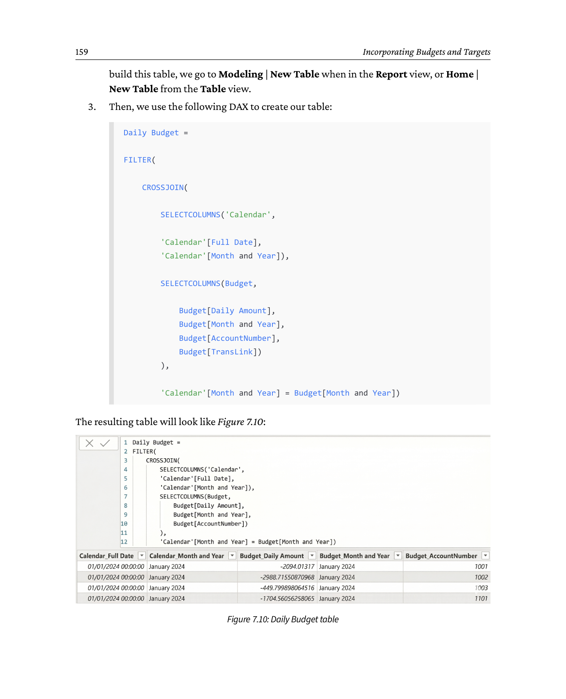

```
   Daily Budget table - one row per (day, account) combination

   +------------+---------------+-------------+-----------+-----------+
   | Full Date  | AccountNumber | MonthYr     | DailyAmt  | TransLink |
   +------------+---------------+-------------+-----------+-----------+
   | 2025-04-01 | 4000          | April 2025  | 1933.33   | L100      |
   | 2025-04-02 | 4000          | April 2025  | 1933.33   | L100      |
   | ...        | ...           | ...         | ...       | ...       |
   | 2025-04-30 | 4000          | April 2025  | 1933.33   | L100      |
   | 2025-05-01 | 4000          | May 2025    | 1935.48   | L100      |
   +------------+---------------+-------------+-----------+-----------+
   Built via FILTER( CROSSJOIN( Calendar, Budget ), ... )
```


This can be joined into our model, joining the Calendar `Full Date` values to the `Full Date` values of the Calendar table and the `TransLink` values to the `LinkID` values of the Chart of Account table.

In the next section, we'll continue our development of budget models by looking at drill-through.

---

## 7.4 Seeing the details with drill-through

So far, we've created a budget table, joined it to our model, and explained how you can use monthly and daily calculations to compare the budget to actuals from your GL transactions.

Our final step for budgeting is drill-through. Budgeting is an area where the ability to examine underlying transactions is important, so a quick method to go from a calculated summary of data to detail is valued by most users. Drill-through in Power BI is a relatively simple-to-set-up but powerful function that we can add to many reports, not just budgeting.

To add drill-through to your report, start by creating a tab on your canvas by clicking the plus sign next to the current tab. We have called ours `Drill through` so that its purpose is clear.

For our drill-through, we'll start with a Table visual, and we'll add the following fields:

- `Chart of Accounts`: `AccountNumber`
- `Chart of Accounts`: `AccountName`
- `Chart of Accounts`: `AccountCategoryDescription`
- `GL Transactions`: `TransactionDate`
- `GL Transactions`: `Company`
- `GL Transactions`: `TransactionID`
- `List of Measures`: `GL Amount`

The table will provide the data that's returned from the drill-through, but we need to link the Budget table to the drill-through. This is done via the **Drill-through** section of the **Visualizations** pane, shown in Figure 7.11. Here, we add the `GL Amount` field from the `List of Measures` table.

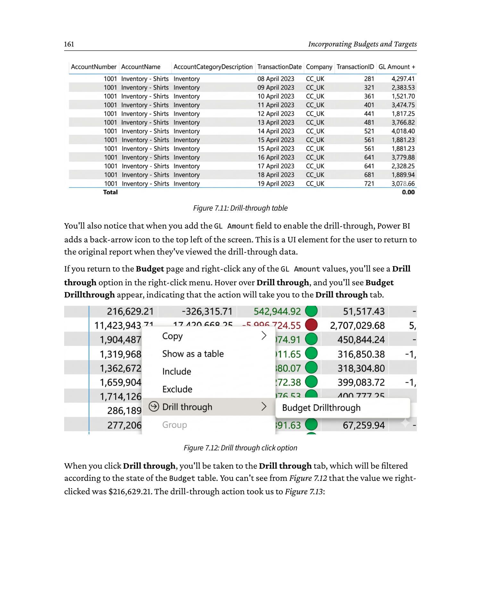

```
   Drill-through target page - Table visual fields

   +----------------+--------------------+-----------------------+
   | AccountNumber  | AccountName        | AccountCategoryDesc   |
   +----------------+--------------------+-----------------------+
   | 4000           | Sales              | Revenue               |
   | 5000           | COGS               | Cost of Sales         |
   | 6000           | Salaries           | Operating Expenses    |
   +----------------+--------------------+-----------------------+

   +------------+----------+-----------+-----------+-----------+
   | TransDate  | Company  | TransID   | GL Amount | (drill)   |
   +------------+----------+-----------+-----------+-----------+

   Drill-through filter (Visualizations pane):
     Drill-through on:  List of Measures[GL Amount]
```


You'll also notice that when you add the `GL Amount` field to enable the drill-through, Power BI adds a back-arrow icon to the top-left of the screen. This is a UI element for the user to return to the original report when they've viewed the drill-through data.

If you return to the Budget page and right-click any of the `GL Amount` values, you'll see a **Drill through** option in the right-click menu. Hover over **Drill through**, and you'll see **Budget Drillthrough** appear, indicating that the action will take you to the `Drill through` tab (see Figure 7.12).


```
   Right-click a Budget Variance value in the matrix:

   +--------------------------------------------+
   |  Copy                                     |
   |  Copy value                                |
   |--------------------------------------------|
   |  Drill through                        >  --|---> Budget Drillthrough
   |  See records                          >  --|---> Records of Budget
   |  Include / Exclude                    >   |
   |  ...                                       |
   +--------------------------------------------+
   Selecting "Budget Drillthrough" navigates to the drill-through page
```


When you click **Drill through**, you'll be taken to the `Drill through` tab, which will be filtered according to the state of the Budget table. You can't see from Figure 7.12 that the value we right-clicked was **$216,629.21**. The drill-through action took us to Figure 7.13:

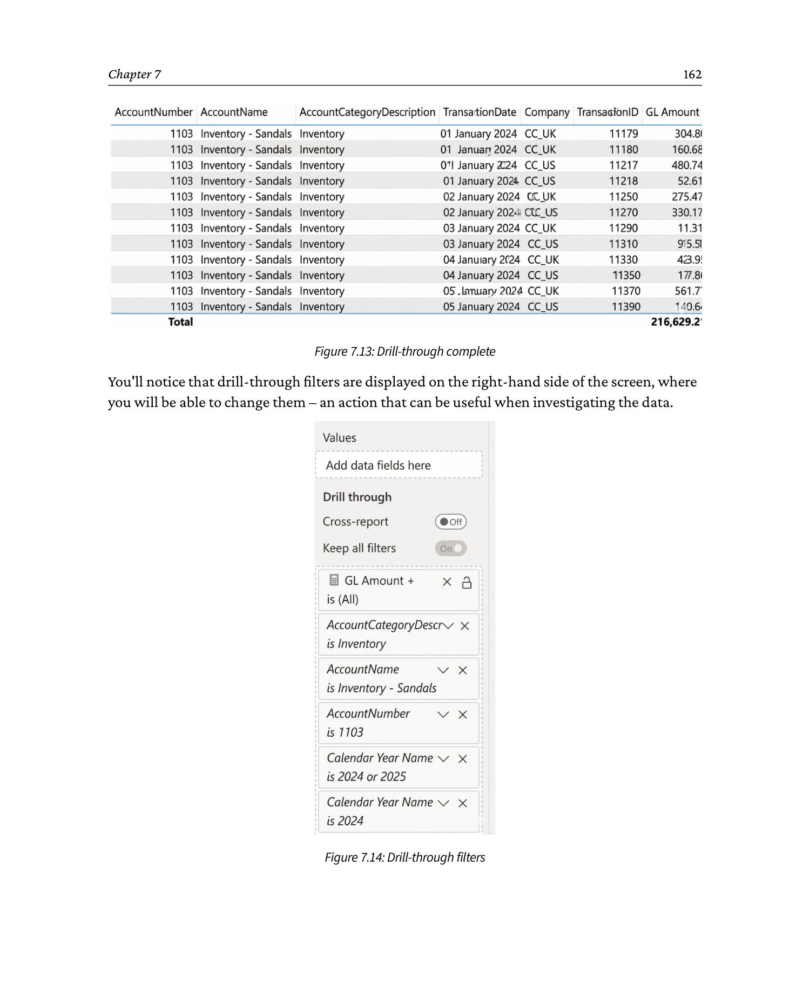

```
   Drill-through destination page (filtered view)

   Filters pane (right side):                    Page canvas:
   +---------------------------+                +--------------------------------+
   | Drill-through filters     |                | AccountNumber :  4000          |
   |   Company      : USA      |                | AccountName   :  Sales         |
   |   Year         : 2025     |                | TransDate     | TransID | Amount|
   |   Month        : April    |                | 2025-04-01    | T9001   | 1500  |
   +---------------------------+                | 2025-04-15    | T9210   | 2300  |
                                                | 2025-04-30    | T9300   | 1700  |
                                                +--------------------------------+
   Top-left "back arrow" returns to the Budget page
```


You'll notice that drill-through filters are displayed on the right-hand side of the screen (see Figure 7.14), where you will be able to change them - an action that can be useful when investigating the data.


```
   Filters panel of the drill-through target page

   +-------------------------------------------+
   | Filters                                   |
   |-------------------------------------------|
   |  Drill-through filters (from Budget page) |
   |    Company     is  USA                    |
   |    Year        is  2025                   |
   |    Month       is  April                  |
   |    Account#    is  4000                   |
   |-------------------------------------------|
   |  Visual-level filters                     |
   |    (none)                                 |
   +-------------------------------------------+
   Users can change the drill-through filter values to investigate other slices
```


To return to the Budget screen (or the source of the drill-through), click the back-arrow icon in the top-left of the screen. Please note that you can move the back-arrow icon anywhere on the screen.

Drill-through is very common for financial and transactional reporting. Most users, when seeing a variance or an issue, will want to view the underlying transactions; drill-through enables this. It has the benefit of being quick to set up, and you can incorporate many drill-throughs against a dataset for different scenarios.

---

## 7.5 Visuals to consider for analyzing budgets

We used a matrix and drill-through for our examples, which is often the default for highlighting the difference between the budget and actuals, as conditional formatting can be used effectively to highlight differences, and users can see numerical totals. However, depending on user preferences, here are some alternatives you may like to consider:

- **Clustered column or bar charts** with side-by-side measures that show budgets and actuals are very effective, as users can quickly spot differences between the height or length of columns/bars to identify issues. This is particularly effective in seeing the magnitude of differences through relative size (see Figure 7.15).

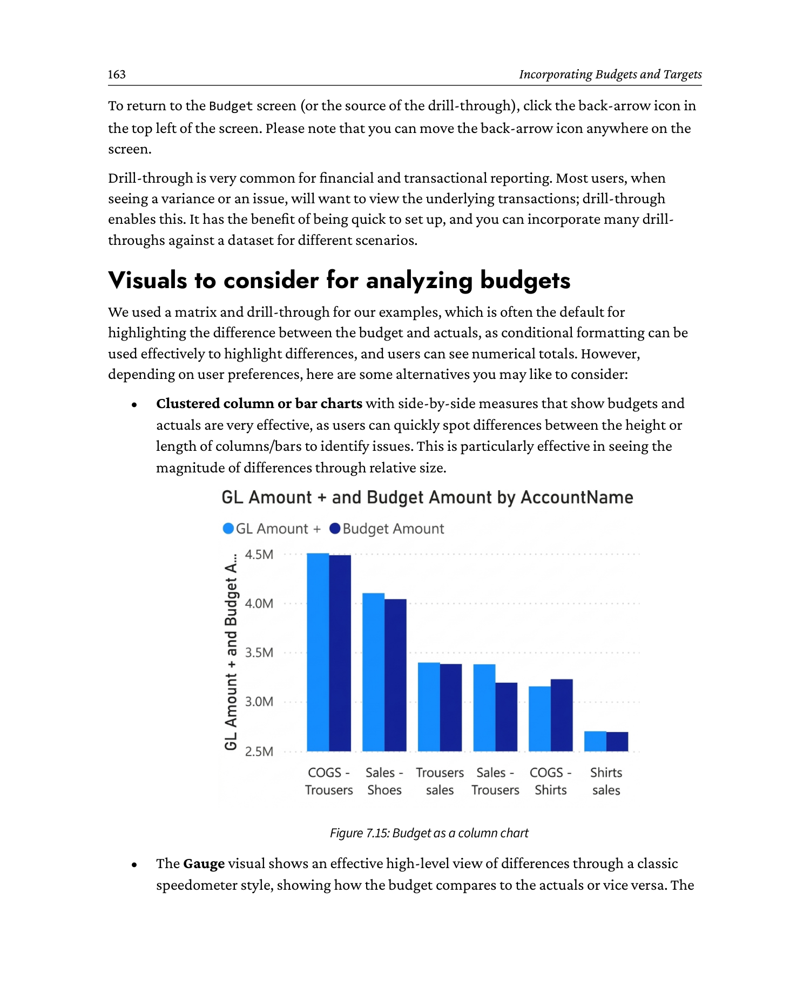

```
   Clustered column chart: GL vs Budget by month

   $K
    70 |  ##
    65 |  ##  ##
    60 |  ##  ##  ##
    55 |  ##  ##  ##  ##
    50 |  ##  ##  ##  ##  ##
    45 |  ##  ##  ##  ##  ##  ##
    40 |  ##  ##  ##  ##  ##  ##  ##
    35 |  ##  ##  ##  ##  ##  ##  ##  ##
    30 |  ##  ##  ##  ##  ##  ##  ##  ##
    25 |  ##  ##  ##  ##  ##  ##  ##  ##
    20 |  ##  ##  ##  ##  ##  ##  ##  ##
       +--------------------------------
         Jan  Feb  Mar  Apr  May  Jun  Jul  Aug

       Legend:  [##] GL Amount  [##] Budget Amount
```


- The **Gauge** visual shows an effective high-level view of differences through a classic speedometer style, showing how the budget compares to the actuals or vice versa. The Gauge visual is effectively used in dashboards where users want to see performance at a glance (see Figure 7.16).

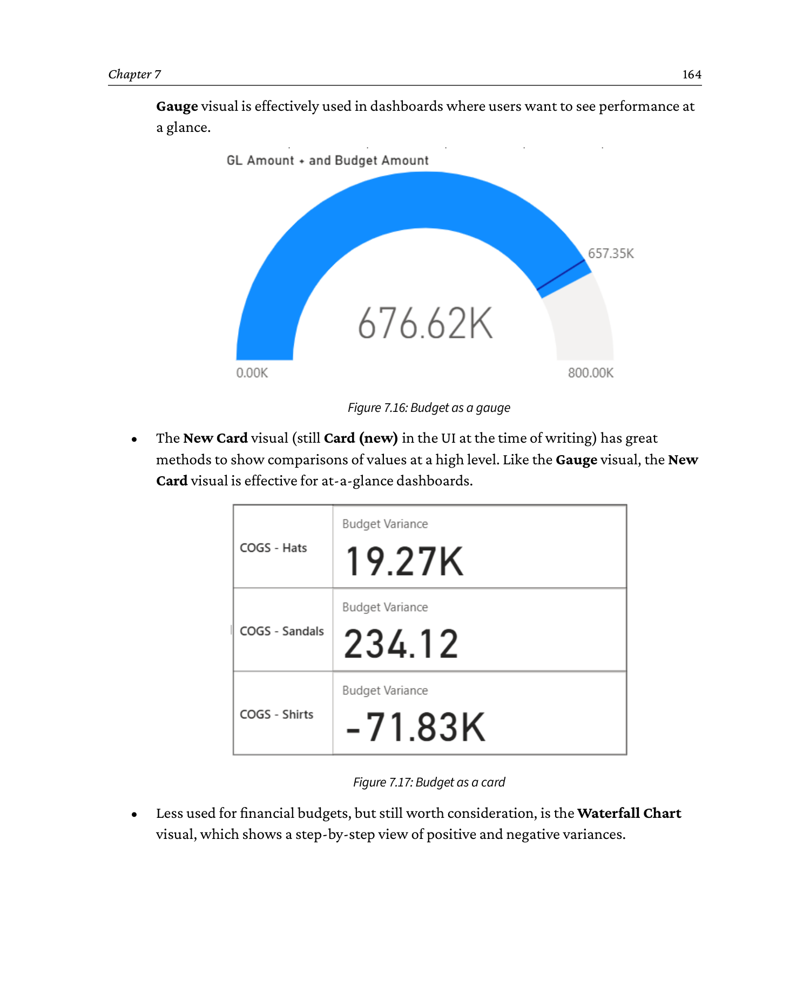

```
   Gauge visual: budget vs actuals

   +----------------- GAUGE -----------------+
   |             Target: 100%                |
   |                                        |
   |                  o                      |
   |              o     o                    |
   |          o             o                |
   |      o                   o             |
   |    o        85%           o            |
   |   o                       o            |
   |    o                     o             |
   |      o                 o               |
   |          o           o                 |
   |              o     o                   |
   |                  o                     |
   |                                        |
   |   0%      50%     100%    150%         |
   |                                        |
   |   Red        Yellow        Green       |
   +----------------------------------------+
   Use: at-a-glance view on dashboard KPIs
```


- The **New Card** visual (still `Card (new)` in the UI at the time of writing) has great methods to show comparisons of values at a high level. Like the Gauge visual, the New Card visual is effective for at-a-glance dashboards (see Figure 7.17).


```
   New Card visual - comparison cards

   +-------------------+   +-------------------+
   |   GL Amount       |   |   Budget Amount   |
   |                   |   |                   |
   |   $1,250,000      |   |   $1,200,000      |
   |                   |   |                   |
   +-------------------+   +-------------------+

   +-------------------+   +-------------------+
   |   Variance        |   |   % Used          |
   |                   |   |                   |
   |   +$50,000  UP    |   |   104.2%   UP     |
   |                   |   |                   |
   +-------------------+   +-------------------+
   "New Card" supports comparison-callout style formatting
```


- Less used for financial budgets, but still worth consideration, is the **Waterfall Chart** visual, which shows a step-by-step view of positive and negative variances (see Figure 7.18).

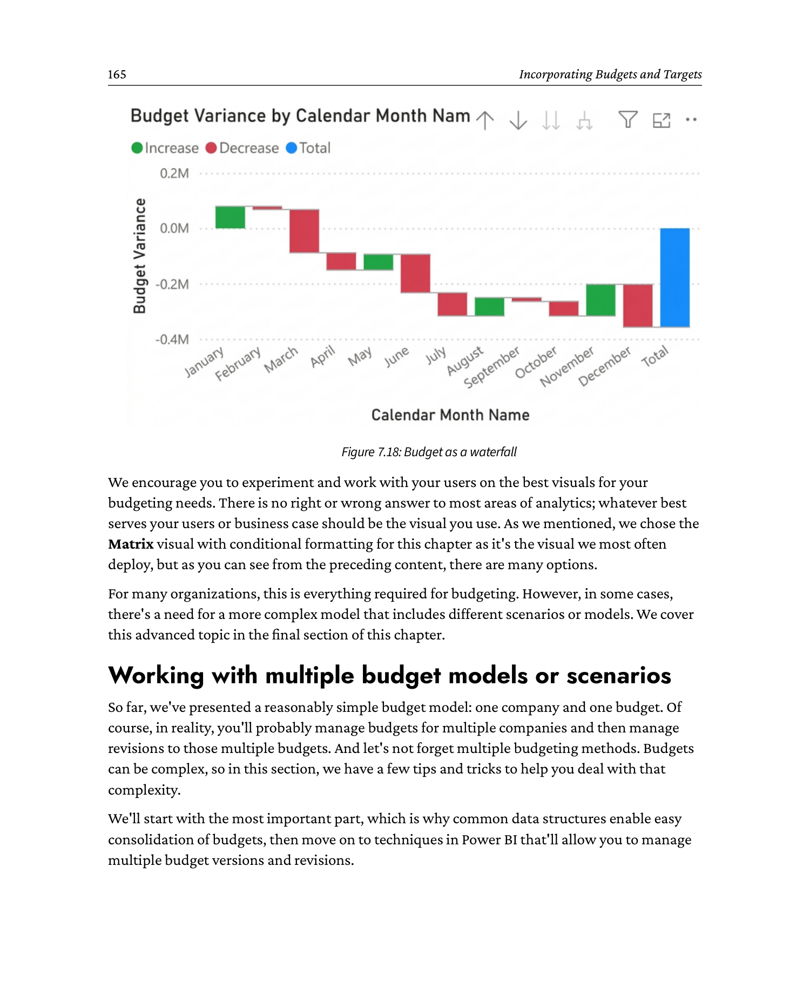

```
   Waterfall chart - budget vs actual variance steps

   Starting     + Adjustment    - Adjustment    Ending
   Budget  +    (favorable)  +   (unfav.)  +   Actual
   +---------+   +-------+    +--------+    +---------+
   |         |   |       |    |        |    |         |
   | 1,200K  |   |  +80K |    |  -30K  |    | 1,250K  |
   |         |   |       |    |        |    |         |
   +---------+   +-------+    +--------+    +---------+
   Green      Green          Red           Blue
   Step-by-step view: positive (green) / negative (red) variances
```


We encourage you to experiment and work with your users on the best visuals for your budgeting needs. There is no right or wrong answer to most areas of analytics; whatever best serves your users or business case should be the visual you use. As we mentioned, we chose the Matrix visual with conditional formatting for this chapter as it's the visual we most often deploy, but as you can see from the preceding content, there are many options.

For many organizations, this is everything required for budgeting. However, in some cases, there's a need for a more complex model that includes different scenarios or models. We cover this advanced topic in the final section of this chapter.

---

## 7.6 Working with multiple budget models or scenarios

So far, we've presented a reasonably simple budget model: one company and one budget. Of course, in reality, you'll probably manage budgets for multiple companies and then manage revisions to those multiple budgets. And let's not forget multiple budgeting methods. Budgets can be complex, so in this section, we have a few tips and tricks to help you deal with that complexity.

We'll start with the most important part, which is why common data structures enable easy consolidation of budgets, then move on to techniques in Power BI that'll allow you to manage multiple budget versions and revisions.

### 7.6.1 Maintaining a common structure

Unapologetically, we'll labor the point that the best advice we can provide is one of the fundamentals of data management: **maintain a common data structure**.

We often deal with the issues that result from not maintaining a common data structure, so we have a lot of experience here. As you've seen from the examples within this chapter, budget comparisons are not inherently complicated, with a common data structure.

Financial applications are good at enforcing data structures, as users are given little choice; you can't change field labels in QuickBooks or enter `TBD` into an SAP numeric field. However, we've deliberately used Excel as the foundation for budgeting, and experience tells us that some users will be adept at breaking the nicely structured workbook you carefully built - changing a few column headers, adding in some extra rows, or adding `"N/A"` to a cell where a number was required. Sure, Excel will continue to function with these changes, but it'll break Power BI when the data is loaded.

Keeping a common structure can be a challenge for the aforementioned reasons, but it's essential for consolidation if you want to work with multiple budgets and manage change over the long term. We don't have too many technical solutions for this one, other than using everything in Excel's arsenal for worksheet protection and data validations to stop users from having free rein over the worksheet. If you get defeated here, Canvas Power Apps can be built to give an Excel look and feel, where users can't make those tiny changes that break the model. It can be a battle, but it's a battle you need to win if you want to easily consolidate any Excel data.

### 7.6.2 Using Power Query to incorporate your budgets into one table

Let's start by assuming you've won the battle for a common template that users can't or just don't break. With multiple companies, organizations, or departments, you'll then have to manage multiple files, delivered at multiple times from multiple people. Power Query and some standard Microsoft tools can come to your assistance.

If your budget files are in a common SharePoint folder (which can include sub-folders), you can easily combine files by connecting to the folder from Power BI, then using Power Query to extract the data from the separate files into a common table. When selecting your data source from Power BI or Power Query, choose the option for a SharePoint folder. When you import the data, this option will allow you to append the files into a single table. A pro tip here is to add details to the Excel filename, as you can also include that as a column in the data, and it'll help you classify your data.

If your files are in many locations but you can access them from Power BI, you can use the **Append** feature in Power Query to incorporate the separate files into a single table. Similar to what was mentioned in the preceding paragraph, it's a good idea to add a reference to each file so that you can classify them later. This may include the year, organization, and revision, and will be useful for slicing the data when comparing budgets.

As budgets are live and being changed frequently, you'll be able to refresh the data with any changes. As time rolls by, it's advisable to think about long-term storage of those spreadsheets beyond Excel, such as a Dataflow, Dataverse, or a SQL database.

### 7.6.3 Managing multiple budgeting methods

If you use different budgeting methods within companies or departments, you'll have to consider how you report that information in a unified manner. For example, you may use both incremental and zero-based budgeting methods within the organization, so you'll need to normalize how budgets are presented for consolidated reporting. When we say *normalized*, we refer to a method of providing a common basis for the budgets so that they can be compared.

You may choose to use your incremental budget as it stands, then normalize your zero-based budget by calculating the minimum run rate to maintain the organizational plan for the year. Exactly how you do that is up to the organization, but for our purposes, it's essential that you follow the principles from the previous section, which is to use a common data structure.

With the budgets normalized, you can work with the data on the basis of a common model, using the same fields on both. For all reporting entities, it's important to identify the budgeting method for later reference. The methods described previously can be used to import data from SharePoint or to append within Power Query and compare it back to actual business performance.

### 7.6.4 Managing budget revisions

It's a common requirement for budgets to be revised within a financial year. The business requirement may have changed, you may have seen a new competitor, or a business strategy may be so successful that you need to find ways to capitalize on or deal with the environment. Whatever has happened, your initial budget has changed, and you need to accommodate that change.

We know we're repeating ourselves, but again, common data structures will be your best friend.

After data structures, the first consideration is not to overwrite the original budget; otherwise, you'll lose history and assumptions about how and why the budget was set. When looking back, the starting assumptions may seem crazy, but they were valid assumptions at the time; you had no idea what was going to change. Revised budgets should always be new versions, separate from the original and comparable. You can do this by copying the original version and adding the version so that you can use DAX and slicers for comparison. Although you may not immediately compare the original and revised budgets, it's often a good exercise to measure the variations between actuals-to-budget versions and budget-to-budget versions. It's a good test of your budgeting processes.

If you plan to revise budgets at some point in the year, make sure you have fields that track budget versions, dates, and free-text notes for concise descriptions to describe the reasons for the change. If you didn't plan to revise your budget and subsequently revise your budget, add a field with the revision version.

### 7.6.5 Managing multiple budgets in your model

When you have multiple budgets in your model, it's important to make sure your comparisons are clearly defined and the calculations are correct. The comparative calculations we've described in this chapter will work for comparisons of multiple budgets, but you'll need to make sure the calculations are specific to the requirement.

In the case of budget complexity, we generally prefer to use DAX to "hardcode" our comparisons with clear explanations of the comparisons; the alternative is using on-screen slicers and visual or page filters. The purpose of this is that when users work with the measures, they can't change the filter context and accidentally report something that is misleading or incorrect. The explanations should be in the form of clear measure labels and the use of inline descriptions within the DAX. For anyone unsure, a well-written DAX measure with an inline description follows:

```dax
Budget Variance USA $ = [GL Amount USA +] - [Budget Amount USA]
// Takes the absolute value of the GL and deducts from the budget amount
// for a direct comparison of budget to actual values.
```

In this case, we're referring to measures that calculate and filter budget values for the US, separate from other countries. We've clearly labeled the country and the currency in the measure and included a description of the purpose of the measure.

Please note that starting a new line with `//` in Power BI tells IntelliSense to ignore the text that follows as part of the calculation. We use this to document the calculation inline with the actual calculation statement.

We also like to use display folders within our `List of Measures` table to make the organization of the measures easier for us and our users.

The key to managing multiple budgets is clear organization. The calculations are rarely complicated, but you're dealing with many versions of similar data, so it's important to plan around the risks of duplication and users working with the wrong version, which is very real. In some instances, it may be the best option to use Power Query to filter out previous revisions so that the data is retained but not presented to the user. If you plan around what can go wrong with multiple versions of similar data, you should be in a good position.

In this section, we discussed the potential complexity of dealing with multiple budgets. We started by discussing the need for a consistent data structure as a foundation for success. Then, we moved on to incorporating and managing multiple methods and revisions, and how to stay on top of the process of budgeting. With some careful organization and planning, the process is manageable, and Power BI will deliver some excellent analysis for your users.

---

## 7.7 Summary

This chapter covered budgets and how you can incorporate and interrogate budgets into your data. Along the way, we also introduced some new functions in calculated tables and drill-through, both of which we're sure you'll find immensely useful across many of your Power BI reports. We ended the chapter by considering some of the options you may like to consider for visually displaying budget-to-actual variances.

In the next chapter, we turn our attention to another applied finance topic, which is inventory.

---

_Generated by `convert_chapter7.py` + `build_md.py` on 2026-06-16._
