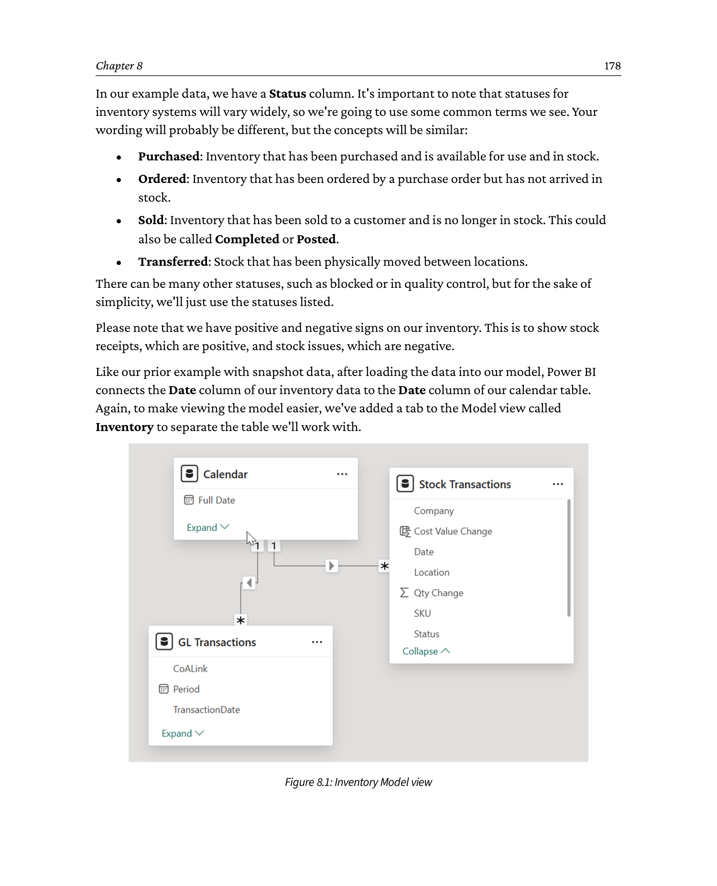
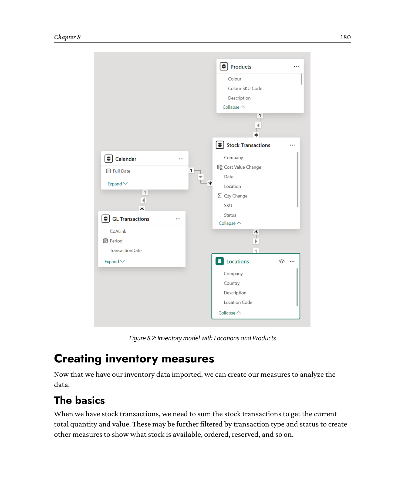
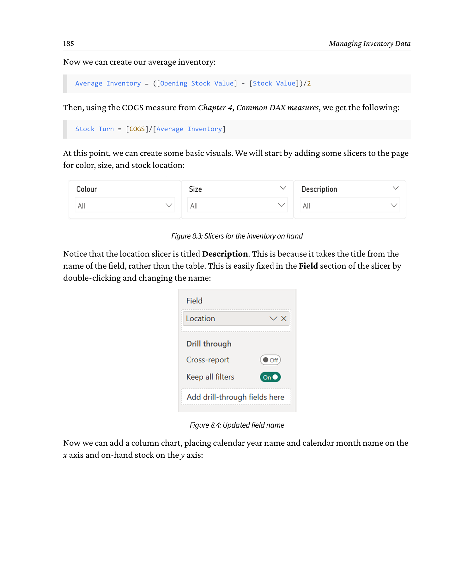
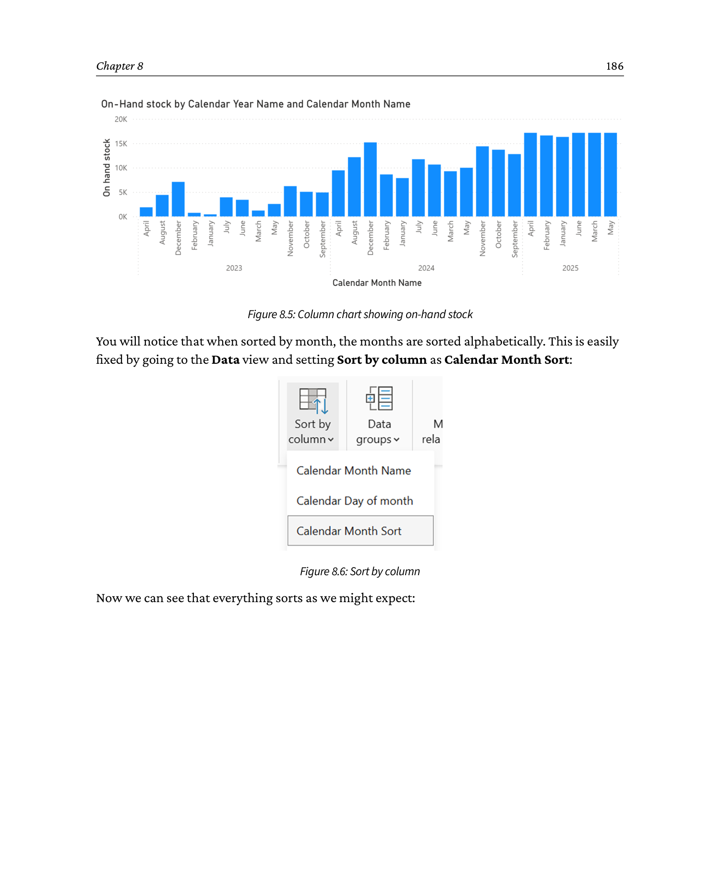
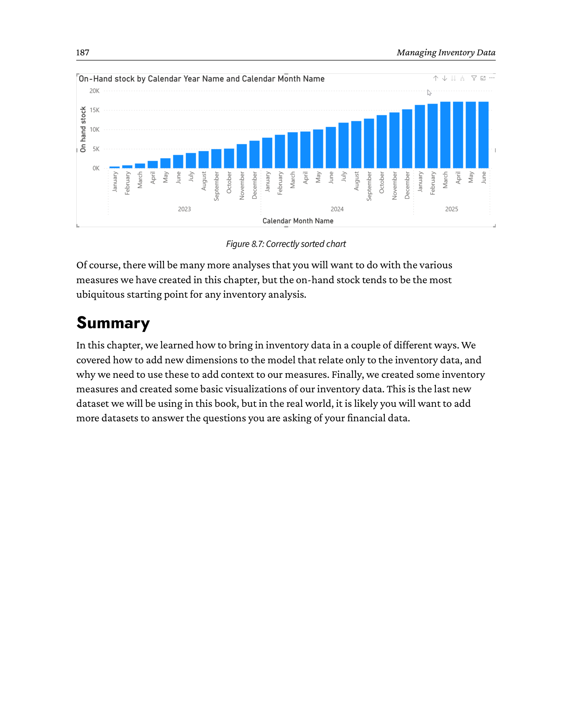

# Chapter 8: Managing Inventory Data

**Source: *Financial Modeling and Reporting with Microsoft Power BI* (Packt Publishing, 2026)**

DOI: 10.0000/PACKT_FMRWPB_2026  |  GitHub: https://github.com/PacktPublishing/Financial-Modeling-with-Power-BI_Packt/tree/main/Chapter8

_Page range: 200 - 217_

---

In the previous chapter, we looked at how to incorporate budgets into your financial model. We'll stay financially focused in this chapter and turn our attention to inventory, discussing how to manage inventory valuations within Power BI.

In many organizations, inventory contributes significantly to cost and value; therefore, accurate representation of inventory within reporting is important.

By the end of the chapter, you will be able to do the following:

- Grasp the differences between financial applications that provide daily snapshots and detailed inventory movement transactions
- Understand important inventory terminology
- Appreciate the measures you can use for inventory valuations

---

## 8.1 Technical requirements

To follow the worked examples in this chapter and beyond, you'll need a Windows PC with an internet connection, and you'll also need to download Power BI Desktop.

For more details, we suggest you access the following link, where Microsoft details the download process for Power BI Desktop and the PC hardware requirements:

<https://learn.microsoft.com/en-us/power-bi/fundamentals/desktop-get-the-desktop>

An example of how to handle inventory transactions in detail can be found in the `Chapter 8.pbix` file, along with the data that we used in the GitHub repository here: <https://github.com/PacktPublishing/Financial-Modeling-with-Power-BI_Packt/tree/main/Chapter8>.

---

## 8.2 Introducing inventory data

Within your financial application, inventory valuations will be handled by the General Ledger control accounts on the balance sheet. We find this generally doesn't provide enough detail, so we look to manage inventory through detailed transactional data, writing DAX calculations for items such as slow-moving stock or stock turns. As a result, we'll import transactional inventory movement data to supplement the GL data.

There are two main ways that inventory data will be recorded:

- A daily/weekly/monthly snapshot of quantities
- Detailed movements, inserting one row for every stock movement

Which option is chosen will depend on your inventory management system, although organizations that manage large volumes of inventory will generally have the latter, as the ERP system will support their inventory operations, and transactional records of each move are necessary.

In this chapter, we'll discuss how to approach both scenarios, but we'll include more detail on the latter scenario as it's more common.

Let's start with snapshot data.

---

## 8.3 Working with inventory snapshot data

The first possibility is the periodic snapshot, where inventory balances are taken at a point in time. Snapshot data may be required from applications where the underlying transactions may change, thus taking a snapshot will preserve the data history. This is easier for report generation as it requires the creation of fewer measures, as the snapshot is already in the form of a report. The basic premise is that your inventory management system will have a table that looks something like this:

| Date | SKU | Location | Physical Stock | Reserved | Ordered | Unit Cost |
|------|-----|----------|---------------:|---------:|--------:|----------:|
| 01-04-2023 | SH-W-L | NY1     | 10 | 0  | 0  | 10 |
| 01-04-2023 | BT-Bl-6 | LON1   | 5  | 0  | 0  | 15 |
| 01-04-2023 | SH-W-L | WH-UK   | 50 | 0  | 20 | 10 |
| 01-04-2023 | BT-Bl-6 | WH-US   | 30 | 0  | 20 | 15 |

**Table 8.1 - Example of inventory snapshot data**

The specific columns you'll see will depend on the inventory management system and the complexity of the process in use. That said, for this table to be of any practical use, you should ensure it has at least the following values:

- Date
- Product or Stock Keeping Unit (SKU)
- Location
- Quantity, broken down by status
- Cost (total or unit cost)

For every date, product, and location, you can calculate a quantity and cost, which is a simple SUMX of the quantity and cost columns that we've used in previous chapters.

When working with snapshot data, you'll need to consider how often you're using the snapshot reports and how much, if any, historical data you'll need to report.

How often refers to daily/weekly/monthly/and so on snapshots. In most cases, the frequency will likely be monthly, usually on the final day of the month. That said, the nature of your business may require snapshots to monitor inventory more frequently, so weekly could be preferred. If you need daily snapshots, you're probably using a transactional inventory system. We will cover this in detail in the *Working with transactional inventory data* section.

The next decision to consider is how many snapshot reports to store, if any. In most cases, we see clients store a certain amount of history data to do period-on-period analysis of inventory trends and to manage metrics such as inventory turns. The time period may be the current financial year or rolling 3/6/12 months; again, it depends on the need within the business.

Whenever you're working with historical snapshot data, you'll need to consider how to store and consolidate the data.

As each snapshot report from your financial application should have an identical column structure, one potential headache is avoided, as all of the snapshots can easily be appended in Power Query in some manner.

In terms of storage and management of the snapshots for easy reporting, here are some common options:

- Save the individual files as Excel spreadsheets to a SharePoint Online document folder, making sure each snapshot has the report date as a column. From here, you can use a SharePoint folder as a data source option within Power BI and consolidate the data using Power Query. The benefit of this approach is the ease of refreshing data when new files are added, as Power BI will use the new files that have been added upon each refresh. For performance, we recommend periodically clearing out old files that are no longer used for reporting.
- Upload the snapshot files to a SharePoint list for longer-term storage and sharing within the organization. Power Automate can help automate this process. Again, we suggest that you employ a method of limiting or purging older files for performance.
- The snapshot reports can be uploaded to a database table, such as SQL, Dataverse, or a lakehouse, which can be automated using a tool such as Power Automate or data pipelines. Using this method, you can store many years of data without concern about scale or speed of retrieval. You may want to limit the amount of data Power BI is retrieving for performance. Users often like to have the option for many years of data, but it will slow down report performance.

Here, we list three methods to store your snapshot data, and there are many more options, depending on your data architectures.

---

## 8.4 Measures for snapshot reporting

With some options for how and where to store your inventory snapshots, let's look at some common measures for inventory calculations.

### 8.4.1 SUM or SUMX

Depending on whether your source snapshot reports have totals or not, you'll certainly need a SUM of the total amount or a SUMX of amount * cost. This will be the basis of the other measures that follow. SUM aggregates values within the current filter context, while SUMX iterates row by row through a table to calculate and then sum expressions for each row.

### 8.4.2 CALCULATE

Reporting on inventory by status, you'll certainly need a number of CALCULATE statements, which will be similar to the following:

```dax
Total Qty Unrestricted =
CALCULATE(
    [Stock Qty],
    'Stock Snapshot'[Status]="Unrestricted")
```

In this case, we used stock quantity, but the measure could easily be switched to stock value.

For usability, we often use field parameters to allow users to easily switch between financial values or quantities. The idea is to have a number of measures that can be used for quantities by inventory status. In this example, we're using the Unrestricted status as the most common status, but a CALCULATE statement for each status will be useful, allowing you to add and subtract the status for various analyses. We discuss this in the next section.

### 8.4.3 Period-on-period calculations

Period-on-period calculations are very common to analyze how inventory quantities and valuations are changing over time.

To start, you'll need a current inventory calculation, as follows:

```dax
Current Inventory =
CALCULATE(
    [Stock Qty],
    FILTER(
        ALL('Calendar'),
        'Calendar'[Date] = MAX('Calendar'[Date])
    )
)
```

The next step is a calculation that provides a quantity for last month. This will also work for inventory value if you change the quantity measure:

```dax
Inventory Prior Month =
CALCULATE(
    [Stock Qty],
    DATEADD('Calendar'[Date], -1, MONTH)
)
```

Here, we use the DATEADD DAX function to subtract one month, using -1 and MONTH in the formula. Some of you may prefer tighter inventory control and use a week on week based comparison model. To do this, the preceding Inventory Prior Month statement can easily be changed to Inventory Prior Week, as follows:

```dax
Inventory Prior Week =
CALCULATE(
    [Stock Qty],
    DATEADD('Calendar'[Date], -7, DAY)
)
```

Within the DATEADD function, we do not have the option of WEEK, so we use DAY and set the increment to -7.

The next two measures are a simple subtraction and DIVIDE for the period-on-period value and percentage changes:

```dax
MoM Inventory Change =
[Current Inventory] - [Inventory Last Month]
```

```dax
MoM Inventory Change % =
DIVIDE(
    [MoM Inventory Change],
    [Inventory Last Month],
    0
)
```

By taking these DAX examples and extending based on quantities, values, and status, you'll be able to perform most essential inventory calculations we see in use with our customers.

Now that we've looked at how you can use snapshot data, let's move on to how you can use transactional data.

---

## 8.5 Working with transactional inventory data

The second model for inventory is to import stock movement transactions. This will involve more work than the snapshot example that we saw earlier, but it will yield more detail for your reporting. By its nature, transactional inventory data is generally composed of large tables, so please use the techniques from *Chapter 6, Streamlining with Power Query*, to optimize your tables by removing unnecessary columns and rows so your users will experience the fastest possible response times. In our example, we're going to start with a lean dataset, and as it is example data, it's not big enough to need optimization.

The dataset should, at a minimum, have these fields:

| Date | SKU | Location | Status | Qty Change | Unit Cost |
|------|-----|----------|--------|-----------:|----------:|
| 01/04/2023 | SH-W-L | NY1     | Purchased   | 10  | 10 |
| 01/04/2023 | BT-Bl-6 | LON1   | Purchased   | 5   | 15 |
| 01/04/2023 | SH-W-L | WH-UK   | Purchased   | 50  | 10 |
| 01/04/2023 | BT-Bl-6 | WH-US   | Purchased   | 30  | 15 |
| 01/04/2023 | SH-W-L | WH-UK   | Ordered     | 20  | 10 |
| 01/04/2023 | BT-Bl-6 | WH-US   | Ordered     | 20  | 15 |
| 02/04/2023 | SH-W-L | NY1     | Sold        | -2  | 10 |
| 02/04/2023 | BT-Bl-6 | LON1   | Sold        | -1  | 15 |
| 02/04/2023 | SH-W-L | NY1     | Ordered     | 20  | 10 |
| 02/04/2023 | BT-Bl-6 | LON1   | Ordered     | 20  | 15 |
| 02/04/2023 | SH-W-L | WH-UK   | Transferred | -20 | 10 |
| 02/04/2023 | BT-Bl-6 | WH-US   | Transferred | -20 | 15 |

**Table 8.2 - Example of transactional inventory data**

In our example data, we have a Status column. It's important to note that statuses for inventory systems will vary widely, so we're going to use some common terms we see. Your wording will probably be different, but the concepts will be similar:

- **Purchased:** Inventory that has been purchased and is available for use and in stock.
- **Ordered:** Inventory that has been ordered by a purchase order but has not arrived in stock.
- **Sold:** Inventory that has been sold to a customer and is no longer in stock. This could also be called Completed or Posted.
- **Transferred:** Stock that has been physically moved between locations.

There can be many other statuses, such as blocked or in quality control, but for the sake of simplicity, we'll just use the statuses listed.

Please note that we have positive and negative signs on our inventory. This is to show stock receipts, which are positive, and stock issues, which are negative.

Like our prior example with snapshot data, after loading the data into our model, Power BI connects the Date column of our inventory data to the Date column of our calendar table. Again, to make viewing the model easier, we've added a tab to the Model view called *Inventory* to separate the table we'll work with.



```
   Power BI Model view - tab "Inventory"

   +----------------------------------------------------+
   |  [Diagram]                                          |
   |                                                     |
   |    +-----------------+       +-------------------+  |
   |    |    Calendar     | 1   N | Stock Transactions|  |
   |    |-----------------|-------|-------------------|  |
   |    | Date        (PK)|       | Date         (FK) |  |
   |    | Calendar Year   |       | SKU            *  |  |
   |    | Calendar Month  |       | Location       *  |  |
   |    | Full Date       |       | Status         *  |  |
   |    | Month and Year  |       | Qty Change        |  |
   |    +-----------------+       | Unit Cost         |  |
   |                             +-------------------+  |
   |                                                     |
   |  Active tab in Model view: [Inventory]              |
   |  Other tables (GL, CoA, ...) are on a separate tab  |
   +----------------------------------------------------+
   Relationship:  Calendar[Date]  1  --  N  Stock Transactions[Date]
   * = non-key text columns shown for context
```


For similar reasons as before, the automatic connection of Date columns is expected behavior; the date is the only common field amongst our other data tables.

Now we've loaded our data, we need to add some additional dimension data to support our report requirements - in this case, Locations and Products.

---

## 8.6 Inventory-specific dimensions

When we add more context to our inventory data through dimensions such as location and products, we're able to provide a greater depth of analytics to our users, such as the following:

- Product sales performance
- Stock coverage
- How we're storing products near the sale location

These are important as they allow us to optimize our inventory for maximum efficiency; after all, stock represents a significant investment.

You'll see we already have Locations and Products columns with our Inventory transactions. But on closer examination, you'll notice the data only has Location and Product codes, which won't be enough for analysis, so we're also going to add the Location and Product tables to provide ourselves with more data to help with analysis.

When we add the Product table, we have much more detail about our inventory for detailed analysis.

After Product, we add the location data. The location data represents where the inventory is actually stored. In many instances, this can be at a detailed level, such as warehouse, aisle, bay, shelf, and bin. To simplify our model, we've only included the warehouse name in the Location table, but the principle remains the same.



```
   Inventory data model - with Products and Locations dimensions

        +----------------+        +----------------------+
        |    Calendar    | 1    N |  Stock Transactions  |
        |----------------|--------|----------------------|
        | Date        PK |        | Date        FK       |
        | Calendar Year  |        | SKU         FK  --*--|---> +-----------+
        | Calendar Month |        | Location    FK  --*--|---> |  Products |
        +----------------+        | Status              |     +-----------+
                                  | Qty Change          |     | ProductID |
                                  | Unit Cost           |     | Name      |
                                  +---------------------+     | Color     |
                                                              | Size      |
                                                              +-----------+
                                                                   | 1
                                                                   |
                                                                   | N
                                  +---------------------+          |
                                  |     Locations       |<---------+
                                  |---------------------|
                                  | LocationID   PK     |
                                  | Description         |
                                  +---------------------+
   Key:  * marks the FK columns on Stock Transactions that link to Products
         and Locations.  Star schema with Stock Transactions as the fact.
```


---

## 8.7 Creating inventory measures

Now that we have our inventory data imported, we can create our measures to analyze the data.

### 8.7.1 The basics

When we have stock transactions, we need to sum the stock transactions to get the current total quantity and value. These may be further filtered by transaction type and status to create other measures to show what stock is available, ordered, reserved, and so on.

Calculating stock quantities is based on summing all stock movements in the inventory transaction table back to the earliest date from our transactional table. Our starting measure is calculated as follows:

```dax
Stock Qty =
CALCULATE(
    SUM('Stock Transactions'[Qty Change]),
    FILTER(
        ALL(Calendar),
        Calendar[Full Date] <= MAX('Calendar'[Full Date])
    )
)
```

As this measure sums all stock movements, regardless of the type of move, we'll only use it as the basis of other measures that will be filtered to provide the calculations we need.

There are four initial calculations we can derive from this, since we have four statuses in our stock transactions:

```dax
Total Qty Unrestricted =
CALCULATE(
    [Stock Qty],
    'Stock Transactions'[Status]="Unrestricted")
```

```dax
Total Qty Sold =
CALCULATE(
    [Stock Qty],
    'Stock Transactions'[Status]="Sold")
```

```dax
Total Qty Purchased =
CALCULATE(
    [Stock Qty],
    'Stock Transactions'[Status]="Purchased")
```

```dax
Total Qty Reserved =
CALCULATE(
    [Stock Qty],
    'Stock Transactions'[Status]="Reserved")
```

From these measures, we can start to derive additional measures, such as on-hand stock - typically defined as the total amount of the product in stock at present, whether it has been allocated to an order or not:

```dax
On hand stock = [Total Qty Unrestricted] + [Total Qty Reserved]
```

We can then calculate how much stock is available by including stock ordered for delivery. Please note that your organization may have rules about how it treats the availability of ordered stock based on the forecast delivery date.

```dax
Available to Sales Order = [Total Qty Unrestricted] - [Total Qty Reserved] + [Total Qty Purchased]
```

### 8.7.2 Stock value calculations

Stock value calculations will, in general, follow the same pattern as the quantity calculations above, although if the total value for a specific product is not stored, we'll need to calculate it.

In our dataset, the quantity and unit value are shown, so we multiply the unit value by the quantity to get the total product value based on status. There are two approaches here. The first is to create a calculated column (not a measure) in the stock transactions table, like this:

```dax
Cost Value Change = 'Stock Transactions'[Qty Change] * 'Stock Transactions'[Unit Cost]
```

From this, we can now create a value column of the on-hand and quantity calculations we have already done:

```dax
Stock Value =
CALCULATE(
    SUM('Stock Transactions'[Cost Value Change]),
    FILTER(
        ALL(Calendar),
        Calendar[Full Date] <= MAX('Calendar'[Full Date])
    )
)
```

```dax
Total Value Purchased =
CALCULATE(
    'Stock Transactions'[Stock Value],
    'Stock Transactions'[Status] = "Purchased"
)
```

```dax
Total Value Sold =
CALCULATE(
    'Stock Transactions'[Stock Value],
    'Stock Transactions'[Status] = "Sold"
)
```

The second approach is to calculate the value dynamically, using the SUMX() function:

```dax
Stock Value =
CALCULATE(
    SUMX(
        'Stock Transactions',
        'Stock Transactions'[Qty Change] * 'Stock Transactions'[Unit Cost]
    ),
    FILTER(
        ALL(Calendar),
        Calendar[Full Date] <= MAX(Calendar[Full Date])
    )
)
```

Once again, the rest of the value measures are approached in the same way. The choice of which approach will be based on your specific business needs. On the one hand, the second approach has slightly more complicated code, but it also keeps everything calculated in measures. The first approach might be easier to read, but could produce a slightly larger model.

In most cases, the choice comes down to personal preference; only rarely will it really impact performance - and in that case, only testing will give a definite route to take.

### 8.7.3 Stock turn

The final key measure that we need to create for inventory is stock turn. This is the main measure used to assess the health of the inventory - the higher the number, the higher the overall throughput over the period. What good or bad looks like will depend entirely on the industry - a fast fashion brand may want to see inventory turned over every 2-3 months, where a luxury car retailer may be happy with once or twice a year. In any case, the calculation is the same:

$$
\text{Stock Turn} = \frac{\text{COGS}}{\text{Average Inventory}}
$$

Where:

$$
\text{Average Inventory} = \frac{\text{Opening Stock} - \text{Closing Stock}}{2}
$$

In our model, we already have the closing stock, but we still need to create the opening stock position:

```dax
Opening Stock Value =
CALCULATE(
    SUMX(
        'Stock Transactions',
        'Stock Transactions'[Qty Change] * 'Stock Transactions'[Unit Cost]
    ),
    FILTER(
        ALL(Calendar),
        Calendar[Full Date] <= MIN(Calendar[Full Date])
    )
)
```

Now we can create our average inventory:

```dax
Average Inventory = ([Opening Stock Value] - [Stock Value]) / 2
```

Then, using the COGS measure from *Chapter 4, Common DAX measures*, we get the following:

```dax
Stock Turn = [COGS] / [Average Inventory]
```

At this point, we can create some basic visuals. We will start by adding some slicers to the page for color, size, and stock location:



```
   Report page - three slicers above an empty canvas

   +----------------+  +----------------+  +----------------+
   |     Color      |  |     Size       |  | Stock Location |
   |----------------|  |----------------|  |----------------|
   |  ( ) Black     |  |  ( ) S         |  |  ( ) LON1      |
   |  ( ) Blue      |  |  ( ) M         |  |  ( ) NY1       |
   |  ( ) White     |  |  ( ) L         |  |  ( ) WH-UK     |
   |                |  |                |  |  ( ) WH-US     |
   | [Clear]        |  | [Clear]        |  | [Clear]        |
   +----------------+  +----------------+  +----------------+

   Slicers placed at the top of the page so users can filter
   the inventory visuals by color, size, and warehouse location.
```


Notice that the location slicer is titled *Description*. This is because it takes the title from the name of the field, rather than the table. This is easily fixed in the *Field* section of the slicer by double-clicking and changing the name:


```
   Slicer field name - before vs after

   BEFORE                            AFTER
   +----------------------+          +----------------------+
   | Title:  Description  |   -->    | Title:  Location     |
   |                      |  rename  |                      |
   | Field:               |          | Field:               |
   |   Description        |          |   Location           |
   |                      |          |                      |
   | [Apply]  [Cancel]    |          | [Apply]  [Cancel]    |
   +----------------------+          +----------------------+
   The slicer now displays "Location" instead of "Description".
   Location:  Visualizations pane -> Format visual -> General -> Title
```


Now we can add a column chart, placing calendar year name and calendar month name on the x-axis and on-hand stock on the y-axis:



```
   Column chart: On-hand stock by month

   On-hand
   stock
     150 |                                       ##
     130 |                                       ##  ##
     110 |                                       ##  ##  ##
      90 |  ##                                  ##  ##  ##  ##
      70 |  ##  ##                              ##  ##  ##  ##  ##
      50 |  ##  ##  ##  ##                      ##  ##  ##  ##  ##  ##
      30 |  ##  ##  ##  ##  ##  ##              ##  ##  ##  ##  ##  ##  ##
      10 |  ##  ##  ##  ##  ##  ##  ##  ##  ##  ##  ##  ##  ##  ##  ##  ##  ##
        +----------------------------------------------------
          Apr  Aug  Dec  Feb  Jan  Jul  Jun  Mar  May  Nov  Oct  Sep

       Legend:  [##] On-hand stock
   Note: months are sorted alphabetically (Apr, Aug, Dec, Feb, ...)
   which is NOT calendar order.  See Figure 8.7 for the fix.
```


You will notice that when sorted by month, the months are sorted alphabetically. This is easily fixed by going to the *Data* view and setting *Sort by column* as Calendar Month Sort:


```
   Power BI Data view - Sort by column dialog

   +--------------------------------------------------+
   | Sort by column                                   |
   |--------------------------------------------------|
   | Selected column:                                 |
   |   Calendar Month Name                           |
   |                                                  |
   | Sort by:                                         |
   |   (o) Calendar Month Sort                       |
   |   ( ) Calendar Month Name                       |
   |   ( ) Calendar Month Number                     |
   |                                                  |
   | [Apply]   [Cancel]                               |
   +--------------------------------------------------+
   Path:  Data view -> click Calendar Month Name column
          -> Column tools -> Sort -> Sort by column
   After applying, Calendar Month Name will display in the
   numeric order defined by Calendar Month Sort (1..12).
```


Now we can see that everything sorts as we might expect:



```
   Column chart: On-hand stock by month (calendar order)

   On-hand
   stock
     150 |                                                       ##
     130 |                                                       ##
     110 |                       ##                              ##
      90 |              ##       ##       ##             ##     ##
      70 |     ##       ##       ##       ##      ##     ##     ##
      50 |     ##  ##   ##  ##   ##  ##   ##  ##   ##  ##  ##  ##  ##
      30 |     ##  ##   ##  ##   ##  ##   ##  ##   ##  ##  ##  ##  ##
      10 |     ##  ##   ##  ##   ##  ##   ##  ##   ##  ##  ##  ##  ##
        +----------------------------------------------------------
          Jan  Feb  Mar  Apr  May  Jun  Jul  Aug  Sep  Oct  Nov  Dec

       Legend:  [##] On-hand stock
   Months now display in proper calendar order thanks to the
   "Sort by column" setting in Figure 8.6.
```


Of course, there will be many more analyses that you will want to do with the various measures we have created in this chapter, but the on-hand stock tends to be the most ubiquitous starting point for any inventory analysis.

---

## 8.8 Summary

In this chapter, we learned how to bring in inventory data in a couple of different ways. We covered how to add new dimensions to the model that relate only to the inventory data, and why we need to use these to add context to our measures. Finally, we created some inventory measures and created some basic visualizations of our inventory data. This is the last new dataset we will be using in this book, but in the real world, it is likely you will want to add more datasets to answer the questions you are asking of your financial data.

---

_Generated by `convert_chapter8.py` + `build_chapter8_md.py` on 2026-06-16._
