# Chapter 9: Creating a Suite of Financial Reports

**Source: *Financial Modeling and Reporting with Microsoft Power BI* (Packt Publishing, 2026)**

DOI: 10.0000/PACKT_FMRWPB_2026 | GitHub: https://github.com/PacktPublishing/Financial-Modeling-with-Power-BI_Packt/tree/main/Chapter9

_Page range: 218 - 261_

---

In the previous chapter, we explained how to add inventory data to your financial model. In that chapter and throughout, we've been adding visuals to our model to view our data, although we've done very little to format the visuals or consider how the visuals become an overall report for our users. In this chapter, we will focus on some best practices for building compelling visuals in Power BI.

By the end of this chapter, you will do the following:

- Understand the need for good report design
- Appreciate why responsiveness matters
- Be confident in designing reports to user specifications
- Understand how to use different visuals for different use cases

## Technical requirements

To follow the worked examples in this chapter and beyond, you'll need a Windows PC with an internet connection, and you'll also need to download Power BI Desktop.

For more details, we suggest you access the following link, where Microsoft details the download process for Power BI Desktop and the PC hardware requirements:

<https://learn.microsoft.com/en-us/power-bi/fundamentals/desktop-get-the-desktop>

The examples outlined in this chapter can be found in the `Chapter 9.pbix` file in the GitHub repository here: <https://github.com/PacktPublishing/Financial-Modeling-with-Power-BI_Packt/tree/main/Chapter9>.

---

## 9.1 Designing a suite of reports

In *Chapter 1, Understanding Your Needs and Data Sources*, we discussed the five essential considerations when building a Power BI report. To recap, those are the following:

1. Your numbers are accurate.
2. Data is secure and appropriate for the user.
3. The reports are responsive.
4. The report has a clear purpose or answers a defined question.
5. The report layout and design are consistent, clean, and well considered.

In the preceding chapters, we covered points 1 and 2 through data management and modeling best practices. If you work with these standards, your reports should be accurate and secure, but please always check. To some extent, we covered point 3, as a well-built model should provide responsive visuals. To be clear, when we say responsive, we mean fast. Reports that take time to load often lapse into disuse as users become frustrated. Time the load speed for your reports; if you're over 10 seconds, you'll need to reduce that time. While 10 seconds sounds like an incredibly short period of time, most people in a work environment are not known for their patience.

In this chapter, we'll cover the essential tips and tricks we use in every implementation to meet requirements 1 to 5 in the preceding list. Points 1 to 3 will be covered briefly, and we'll cover 4 and 5 in detail. The "rules" around the design of your reports aren't hard and fast; reporting is part art, part science.

We always endeavor to ensure users are happy with their reports, even if we're not. A good example is pie charts, which the data community tends to frown upon, an attitude we generally share. However, if a user insists on pie charts to visualize their data, the user will get pie charts to visualize their data. It's our job to advise, not to tell the user what to do. We will cover pie charts later in this chapter.

Starting with a blank canvas in Power BI can be daunting, so there are methods to avoid this from becoming a problem. Report authoring is a skill, so if you find this challenging, your skills will improve over time with practice. There are certainly some people who have a flair for report authoring, but with a few simple guidelines, anyone should be able to produce visually appealing, compelling reports. Now you know where we're heading, let's work through those five principles.

### 9.1.1 Your numbers are accurate

We're not going to dwell much on this one, as most of the previous chapters provide guidance on how to model your data, especially *Chapter 2, The Basic Model for Financial Reporting*, where we introduced data modeling techniques. The next chapter will discuss testing techniques to ensure that your numbers are accurate, along with some of the common causes of incorrect numbers. We mention it now as the first principle of successful report authoring because it's the first box to check. If your numbers aren't accurate, please don't move on to the next steps, as you'll run into the danger of producing visually appealing reports that are wrong. When this happens, users lose confidence very quickly. Getting your numbers correct can be an iterative and lengthy process, depending on the complexity of the calculations, the data sources, and the quality of the specification you're working with, but please take time to do this first. And as work progresses, check repeatedly. You've got the message, so let's move on to data security and appropriateness.

### 9.1.2 Data is secure and appropriate for the user

As with the previous section, we'll keep this one short as it's important for the context of the chapter but not an area we intend to cover in detail. We build reports around data to ensure that the visuals are correct for the data and the purpose of the report. We write reports for users or audiences when we group them. Therefore, it's important to consider your audience when building a report, ensure that the data contained within the report is appropriate for the audience, and that we're not creating an unintended security risk. Financial data can be particularly sensitive, so please consider any ramifications of users having access to data they shouldn't have access to, or don't need. In most cases, we recommend deploying Power BI reports in apps that have great tools for profiling a group of reports against an intended audience. If using workspaces for those users who need access to edit or create reports, then please review the data that can be accessed by the users. We're not going to labor this point as it's not the real subject matter for this chapter, but it's impossible to properly cover report writing without thinking about who's accessing the data and the security risks associated with it.

### 9.1.3 The reports are responsive

When talking about responsive reports, we mean the speed at which the data loads when the user clicks on the report from the app or the workspace. Your data structure, amount of data, and measures will be the primary drivers that govern this, but the choice of visuals will also have an effect. Some visuals are more demanding on Power BI than others. This doesn't mean don't use them, but you may choose to limit the use of certain visuals. We can't talk to custom visuals here, but from the standard visuals, maps and cards can be demanding, with the net effect of slowing down responsiveness. A report with 30-40 cards will certainly be slow compared to using a more efficient visual, such as a table. And yes, we've seen reports with 30-40 individual cards. Even visuals such as tables and matrices will be demanding when using large datasets, so you may need to limit the amount of data if this is an issue. Techniques such as pre-aggregation can help here, where you aggregate daily amounts using the Power Query GroupBy function we described in *Chapter 6, Streamlining with Power Query*. If your reports are slow, it will generally affect usage as users become impatient. If this is the case, please don't worry, as there's generally a fix for the issue, whether that's simplifying a complex calculation, such as filtering your data, or making smarter choices with your visuals. We've experienced reports that have taken minutes to load, that was reduced to seconds with some relatively simple changes. We will speak more about this in *Chapter 10, Testing and Fine-Tuning your Data*.

This section and the previous section have been largely structural; in the next section, we'll look at the purpose of your report.

### 9.1.4 The report has a clear purpose or answers a defined question

We've seen many reports where we've struggled to understand the purpose. Maybe there was one when the report was built, but it's been lost over time, and no one can figure out why it's needed now. When planning a report, we ask the users what question they need answered or what the specific purpose is. A simple sales report showing sales revenue with time on the X axis and revenue on the Y axis may answer the question of how we are performing. Overlay a year-on-year comparison and attainment against planned revenue, and you have more meaningful data points that help users understand the nuance behind current business performance. Asking users about the purpose of a report often helps refine their thought processes about what they want and why they want it. In many instances, you may find yourself replicating an old, well-used report, but in many cases, Power BI is capable of producing much more. So, you may need to raise the expectations of your users, allowing Power BI to truly shine. Here are some questions you may like to ask:

- What is the main objective of this report?
- Who will be using this report, and how often?
- What decisions will this report help you make?
- Are there any existing reports, and what's missing in them?
- What specific business questions should this report answer?
- What are the key performance indicators (KPIs) or metrics you need?
- Are there any benchmarks or targets to compare against?

Getting practice in having friendly, open-ended conversations with users about what and why they need something is an important skill for a report author. You should be comfortable with respectfully challenging a user about their needs. We often tell users to expect to be challenged; it's our day job, and we're good at this, so our questions come from experience. With practice, you'll also become good at this. We can generally provide some input that the user wouldn't have previously considered. And if they say no, then there's no harm. More harm comes from not challenging a poorly considered report request, where you could have made a significant difference to the capability of a user to make an informed decision. We have, at times, built speculative versions of a report that we feel improve on the requirement from a user if we genuinely believe we could make a significant difference. In many cases, the users will see one or more elements they hadn't considered. They just needed someone to show them the art of the possible.

As business requirements change over time, you may need to reevaluate the questions the report is expected to answer and alter and retire reports accordingly. Regular reviews of reports are important to ensure they continue to be relevant. Many people resist retiring old reports just in case they're required again, so an archive workspace may help in removing them from daily view without deleting them. Users like the safety net that it's still there if they need it. Clutter has the general effect of overwhelming users, and if you move the report to an archive, you can easily move it back.

In the next section, we'll look at some fundamental design principles you'll want to think about when building your reports.

### 9.1.5 Report layout and design are consistent, clean, and well considered

There are a lot of vague words in that title, so what do they really mean? Let's start with report layout and design and consistent. We're going to cover the basics of report design next, but the principle here is to be consistent with how your reports look. When approaching a new report, a user shouldn't be confused by the overall appearance. Fundamentally, it needs to look broadly the same as the other reports. That means reports are instantly familiar, and users know where to look for data and have expectations about UI elements such as slicers and buttons. Steve Krug wrote a famous book about the usability of websites called *Don't Make Me Think*. The point was to make a website's UI so intuitive that the user doesn't have to think; they navigate to where they need to go with minimal mental effort.

> To paraphrase Steve Krug, don't make your users think. Or at least, minimize how much they need to think.

We try to structure reports based on three sections, which are the following:

- Title, logo, and remove filters/slicers
- Slicers and cards
- Main report visuals

An example is shown in Figure 9.1:

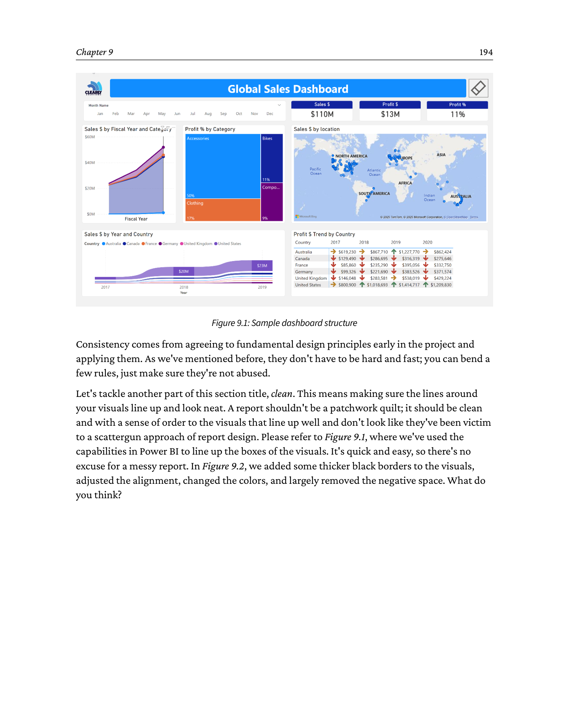

```
 Power BI report - well-designed layout

 +-----------------------------------------------------------+
 | Profit and Loss (title bar, slim corporate color) |
 +-----------------------------------------------------------+
 | Year [Q1 2024 v] | Gross Profit | Revenue | Expenses | |
 | Account [... v] | $1.2M | $4.8M | $3.6M | | <-- headline
 +-----------------------------------------------------------+ cards
 | |
 | +---------+ +--------------------+ +-----------+ |
 | | Column | | Matrix (P&L | | Line | | <-- main
 | | chart | | detail by acct) | | chart | | visuals
 | | | | | | (margin) | |
 | +---------+ +--------------------+ +-----------+ |
 | |
 +-----------------------------------------------------------+
 Layout: title at top, headline cards across, main visuals below.
 Boxes line up, generous negative space, subtle rounded borders.
```


Consistency comes from agreeing to fundamental design principles early in the project and applying them. As we've mentioned before, they don't have to be hard and fast; you can bend a few rules, just make sure they're not abused.

Let's tackle another part of this section title, clean. This means making sure the lines around your visuals line up and look neat. A report shouldn't be a patchwork quilt; it should be clean and with a sense of order to the visuals that line up well and don't look like they've been victim to a scattergun approach of report design. Please refer to *Figure 9.1*, where we've used the capabilities in Power BI to line up the boxes of the visuals. It's quick and easy, so there's no excuse for a messy report. In *Figure 9.2*, we added some thicker black borders to the visuals, adjusted the alignment, changed the colors, and largely removed the negative space. What do you think?

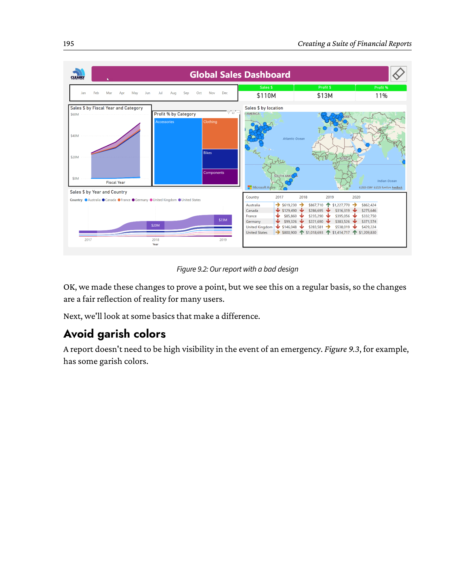

```
 Power BI report - same content, badly designed

 ###########################################################
 #!!!!!! PROFIT & LOSS !!!!!! RED BG YELLOW TEXT!!!!###### #
 ###########################################################
 # Year [Q1 2024 v] ## Gross Profit ## Revenue ## Expenses#
 # Account[. v] ## $1.2M ## $4.8M ## $3.6M #
 #====BORDER=======#==DOUBLE LINE===#==HEAVY====#==HEAVY==#
 #==NO ALIGNMENT==##==shifts 5px==##==CLASHING=#==COLORS==#
 ###########################################################
 # ## ## ## ## ## ## ## ## ## ## ## ## ## #
 # ## ## ## ## ## ## ## ## ## ## ## ## ## #
 #======no whitespace, black borders, clashing colors========#
 ###########################################################

 Bad design markers:
 - thick hard black borders
 - garish red / yellow / clashing colors
 - mis-aligned boxes, no negative space
 - look feels like a patchwork quilt
```


OK, we made these changes to prove a point, but we see this on a regular basis, so the changes are a fair reflection of reality for many users.

Next, we'll look at some basics that make a difference.

#### 9.1.5.1 Avoid garish colors

A report doesn't need to be high visibility in the event of an emergency. *Figure 9.3*, for example, has some garish colors.

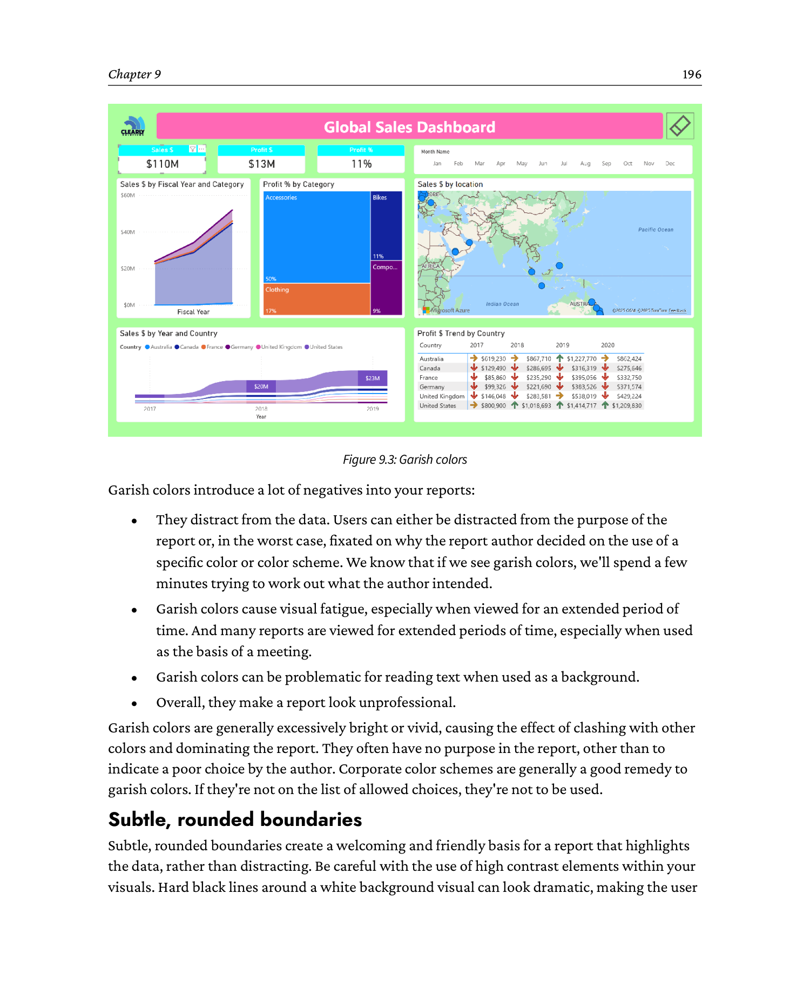

```
 Garish color palette (an example to avoid)

 +-------+-------+-------+-------+-------+-------+
 | LIME | RED | NEON | DEEP | HOT | TANG |
 | green | | yellow| purple| pink | orange|
 +-------+-------+-------+-------+-------+-------+
 |#######|#######|#######|#######|#######|#######|
 | BG | BG | BG | BG | BG | BG |
 +-------+-------+-------+-------+-------+-------+

 Each background is a different saturated, high-contrast color.
 Effect: visual fatigue, distraction from the data, hard to read
 text, looks unprofessional.
```


Garish colors introduce a lot of negatives into your reports:

- They distract from the data. Users can either be distracted from the purpose of the report or, in the worst case, fixated on why the report author decided on the use of a specific color or color scheme. We know that if we see garish colors, we'll spend a few minutes trying to work out what the author intended.
- Garish colors cause visual fatigue, especially when viewed for an extended period of time. And many reports are viewed for extended periods of time, especially when used as the basis of a meeting.
- Garish colors can be problematic for reading text when used as a background.
- Overall, they make a report look unprofessional.

Garish colors are generally excessively bright or vivid, causing the effect of clashing with other colors and dominating the report. They often have no purpose in the report, other than to indicate a poor choice by the author. Corporate color schemes are generally a good remedy to garish colors. If they're not on the list of allowed choices, they're not to be used.

#### 9.1.5.2 Subtle, rounded boundaries

Subtle, rounded boundaries create a welcoming and friendly basis for a report that highlights the data, rather than distracting. Be careful with the use of high contrast elements within your visuals. Hard black lines around a white background visual can look dramatic, making the user focus more on the harsh contrast than the data. *Figure 9.4* has two examples, one with a light border and the other with a black border. For us, the lighter border with rounded corners is subtle and allows the user to focus on the substance of the visual, whereas the solid black border competes for attention with the visual.

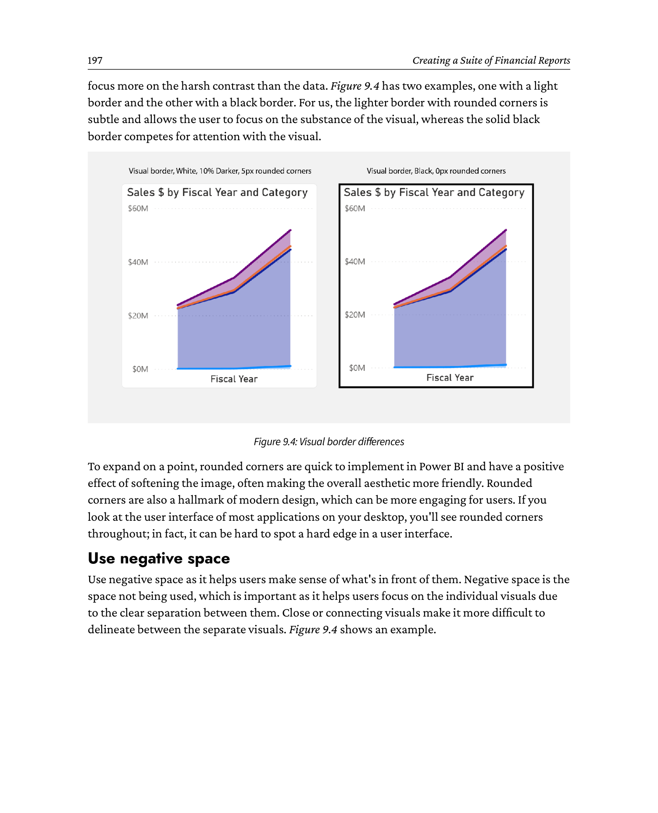

```
 Two visuals - side by side, contrasting borders

 +-------------------+ +-------------------+
 | | |===================|
 | Light gray, | || Hard black ||
 | rounded corners | || square corners ||
 | (subtle, modern) | || (heavy, harsh) ||
 | | || ||
 | [data visual] | || [data visual] ||
 | | || ||
 | | || ||
 +-------------------+ |===================|
 friendly demanding attention
 recommended competes for focus

 Subtle rounded borders let the data take centre stage.
 Hard black borders draw the eye away from the data.
```


To expand on a point, rounded corners are quick to implement in Power BI and have a positive effect of softening the image, often making the overall aesthetic more friendly. Rounded corners are also a hallmark of modern design, which can be more engaging for users. If you look at the user interface of most applications on your desktop, you'll see rounded corners throughout; in fact, it can be hard to spot a hard edge in a user interface.

#### 9.1.5.3 Use negative space

Use negative space as it helps users make sense of what's in front of them. Negative space is the space not being used, which is important as it helps users focus on the individual visuals due to the clear separation between them. Close or connecting visuals make it more difficult to delineate between the separate visuals. *Figure 9.4* shows an example.

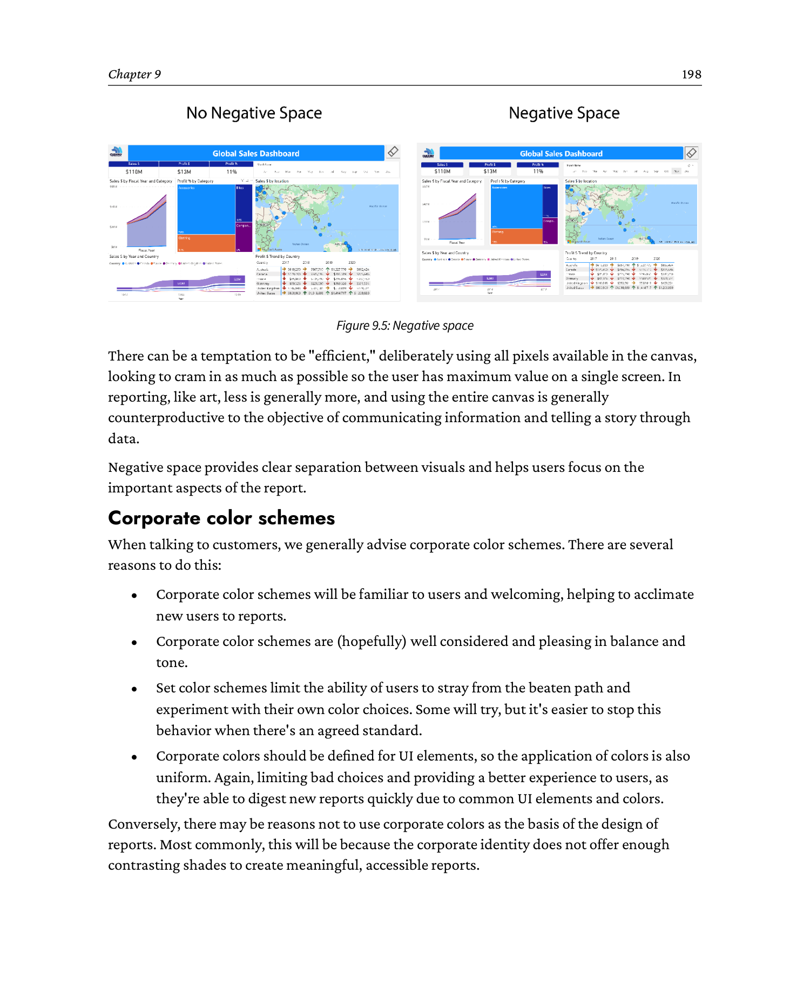

```
 Negative space around visuals

 +--------------------------------------------------------+
 | |
 | +---------+ +---------------------+ |
 | | Vis A | | Vis B | |
 | | | | | |
 | +---------+ +---------------------+ |
 | |
 | |
 | +-------------------+ |
 | | Vis C | |
 | +-------------------+ |
 | |
 +--------------------------------------------------------+

 The empty space around each visual helps the eye separate
 them. Tight / touching visuals look like one busy block.
```


There can be a temptation to be "efficient," deliberately using all pixels available in the canvas, looking to cram in as much as possible so the user has maximum value on a single screen. In reporting, like art, less is generally more, and using the entire canvas is generally counterproductive to the objective of communicating information and telling a story through data.

Negative space provides clear separation between visuals and helps users focus on the important aspects of the report.

#### 9.1.5.4 Corporate color schemes

When talking to customers, we generally advise corporate color schemes. There are several reasons to do this:

- Corporate color schemes will be familiar to users and welcoming, helping to acclimate new users to reports.
- Corporate color schemes are (hopefully) well considered and pleasing in balance and tone.
- Set color schemes limit the ability of users to stray from the beaten path and experiment with their own color choices. Some will try, but it's easier to stop this behavior when there's an agreed standard.
- Corporate colors should be defined for UI elements, so the application of colors is also uniform. Again, limiting bad choices and providing a better experience to users, as they're able to digest new reports quickly due to common UI elements and colors.

Conversely, there may be reasons not to use corporate colors as the basis of the design of reports. Most commonly, this will be because the corporate identity does not offer enough contrasting shades to create meaningful, accessible reports.

If corporate colors aren't agreed upon, a logo and website are a good starting point. If these provide too few color options, there are many websites that provide color swatches based on a single choice that are complementary with hex codes, so they can be easily replicated. Good color choices are surprisingly easy.

If you need help with choosing colors, there are some great websites where you can enter a starting color, which may be from a logo, and then the website will provide options for complementary colors. Check out <https://coolors.co> or <https://imagecolorpicker.com>, where you can start with a hex code, and the sites will provide many options for attractive complementary colors. Producing attractive and professional reports isn't that difficult; you only need to remember a few key principles to make the difference between a messy and inconsistent set of reports and a clean, neat, and compelling set of reports. If you remember that the priority is the needs of the users rather than the needs of the report author, then you'll start ahead of most implementations.

In the next section, we're going to apply everything we've discussed to some of the specific requirements of financial reporting.

---

## 9.2 Key visuals for financial reporting

Now that you have a good idea of the most important aspects of report design, we're going to focus on specific visuals for financial reporting.

Before starting to build your visualizations, it's a good idea to consider the types of visuals you want to use for particular use cases. For example, if you have a single figure that you need to display, a bar chart is unlikely to be the right choice. Equally, if you are trying to see how a measure is evolving over time, then a line chart will highlight the trend far better than a table of numbers. The main use cases we will have in financial reporting will be the following:

- Magnitude
- Change over time
- Rank
- Part-to-whole

### 9.2.1 Magnitude

Visuals that use magnitude use relative size to display differences. The most common are bar and column charts, which are commonly grouped into a common category of bar charts. *Figure 9.6* shows the difference between a column chart and a bar chart.

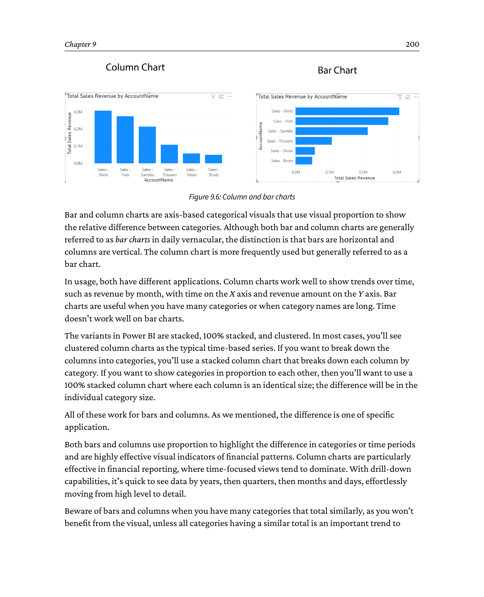

```
 Two chart types compared

 COLUMN CHART (vertical bars) BAR CHART (horizontal bars)
 ^ Category A ====#######====###
 | Category B ==##########===##
 | ## Category C =============####
 | ## ## Category D ==#######========#
 | ## ## ## ## Category E ##########====###
 | ## ## ## ## (long category names fit easily)
 | ## ## ## ##
 +---------------------------> (time usually on Y here is bad)
 Q1 Q2 Q3 Q4

 Column chart: time on X, measure on Y. Best for trend over time.
 Bar chart: category on Y, measure on X. Best for many
 categories or long category names.
```


Bar and column charts are axis-based categorical visuals that use visual proportion to show the relative difference between categories. Although both bar and column charts are generally referred to as bar charts in daily vernacular, the distinction is that bars are horizontal and columns are vertical. The column chart is more frequently used but generally referred to as a bar chart.

In usage, both have different applications. Column charts work well to show trends over time, such as revenue by month, with time on the X axis and revenue amount on the Y axis. Bar charts are useful when you have many categories or when category names are long. Time doesn't work well on bar charts.

The variants in Power BI are stacked, 100% stacked, and clustered. In most cases, you'll see clustered column charts as the typical time-based series. If you want to break down the columns into categories, you'll use a stacked column chart that breaks down each column by category. If you want to show categories in proportion to each other, then you'll want to use a 100% stacked column chart where each column is an identical size; the difference will be in the individual category size.

All of these work for bars and columns. As we mentioned, the difference is one of specific application.

Both bars and columns use proportion to highlight the difference in categories or time periods and are highly effective visual indicators of financial patterns. Column charts are particularly effective in financial reporting, where time-focused views tend to dominate. With drill-down capabilities, it's quick to see data by years, then quarters, then months and days, effortlessly moving from high level to detail.

Beware of bars and columns when you have many categories that total similarly, as you won't benefit from the visual, unless all categories having a similar total is an important trend to identify. Conversely, when you have one category far bigger than the others, bars will be less effective as the proportions between all of the other categories will look very similar, and the chart becomes something that states we have one huge category and many smaller categories and not much else. In this instance, a snakeplot visual is ideal, although that's sadly missing from Power BI.

### 9.2.2 Change over time

Bar and column charts can be used to show change over time. This is effective when you have a restricted number of points that you want to show due to the difficulty of fitting a significant number of bars or columns on a visual. If you wanted to see a daily trend or just more granularity, you'd need to use a line chart.

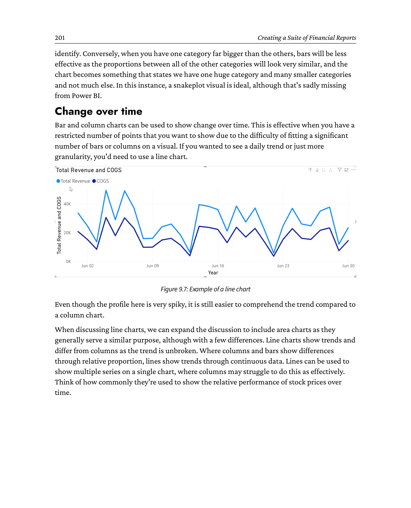

```
 Line chart - example of a spiky trend

 ##
 ## ##
 ## ## ## ##
 ## ## ## ## ## ##
 ## ## ## ## ## ## ##
 ## ## ## ## ## ## ## ## ## ## ##
 ## ## ## ## ## ## ## ## ## ## ## ##
 +---------------------------------------->
 Jan Feb Mar Apr May Jun Jul Aug Sep Oct Nov Dec

 The line is angular (data points connected straight). Power BI also
 offers a smoothed variant where the spikes are softened.

 Even with spikes, the line makes the trend easier to follow than a
 column chart with the same data.
```


Even though the profile here is very spiky, it is still easier to comprehend the trend compared to a column chart.

When discussing line charts, we can expand the discussion to include area charts as they generally serve a similar purpose, although with a few differences. Line charts show trends and differ from columns as the trend is unbroken. Where columns and bars show differences through relative proportion, lines show trends through continuous data. Lines can be used to show multiple series on a single chart, where columns may struggle to do this as effectively. Think of how commonly they're used to show the relative performance of stock prices over time.

Lines and areas can be angular, as in *Figure 9.7*, where data points have straight connecting lines. They can also be smoothed, where Power BI applies a smoothing algorithm so data spikes aren't a distraction. Many people prefer a continuous, smooth-flowing line as a more natural reflection of a trend instead of a jagged straight-line connection of data points. Power BI allows both, so please test with your users.

Lines may be more effective than bars for showing budget versus actuals, as the relative intersections of the lines may be more explicit to the user when looking to identify issues or trends. A line chart will work well for anything showing financial trends over time, especially where multiple measures are being tracked. Areas also work well for trends, but are particularly effective when there is a cumulative nature to the data being presented. Product cost and margins over time work well with area charts, as there's an obvious relationship between them.

### 9.2.3 Part to whole

Part-to-whole shows how individual components contribute to a total. The whole is 100%, and the parts contribute to equal 100% of the total. The classic part-to-whole visual is a pie chart. Although the pie chart is a common stalwart of reporting visuals, there's a growing recognition that the pie chart is one of the more ineffective visuals available. It's increasingly considered ineffective due to the difficulty of visually judging the proportion of the parts relative to each other. Consider this simple example:

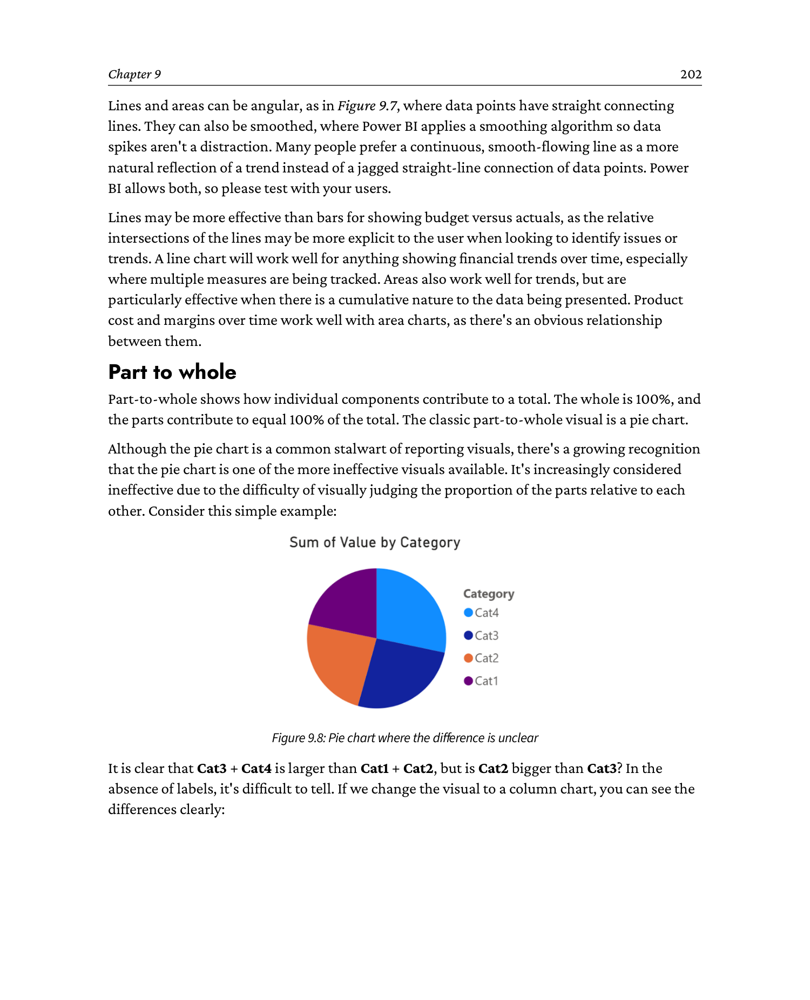

```
 Pie chart - 4 categories (differences hard to judge)

 .-----. Cat1 +---+
 .' `. Cat2 +----+
 / Cat1 \ Cat3 +----+
 | | Cat4 +-----+
 | Cat2 |
 | Cat3 |
 \ Cat4 / Is Cat2 > Cat3 ?
 `. /` Almost impossible to tell
 `-----'

 You can see Cat3+Cat4 > Cat1+Cat2 at a glance,
 but comparing two adjacent slices is very hard.
```


It is clear that Cat3 + Cat4 is larger than Cat1 + Cat2, but is Cat2 bigger than Cat3? In the absence of labels, it's difficult to tell. If we change the visual to a column chart, you can see the differences clearly:

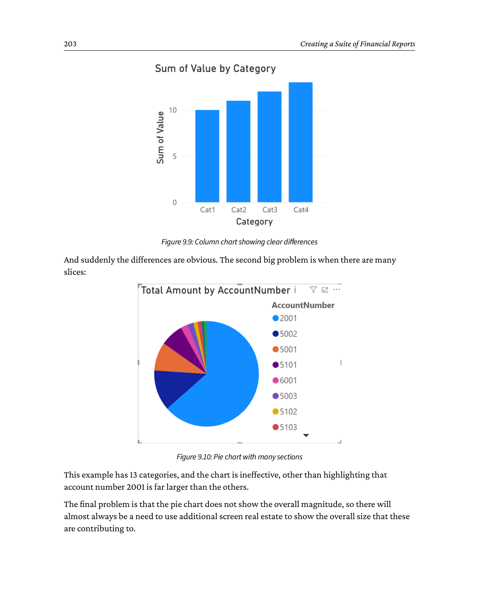

```
 Same data as 9.8, now a column chart

 Cat1 |====####====|
 Cat2 |=====#####==| Now the ordering is obvious
 Cat3 |======######| Cat3 > Cat2 > Cat1 > Cat4
 Cat4 |==####======| (in a real chart, exact values vary)
 +------------>
 0 25 50

 Column charts let users compare values precisely because
 the eye can read off a common baseline (the X axis).
```


And suddenly the differences are obvious. The second big problem is when there are many slices:


```
 Pie chart with 13 categories

 .---------.
 .' acct `.
 .' 2001 `.
 / (huge slice) \
 | 13 thin slices |
 \ around the rest /
 `. .'
 `. 13 small .'
 `-._____.-'

 With 13 categories, only the largest is identifiable.
 The remaining 12 are a confusing blur of similar slices.
```


This example has 13 categories, and the chart is ineffective, other than highlighting that account number 2001 is far larger than the others.

The final problem is that the pie chart does not show the overall magnitude, so there will almost always be a need to use additional screen real estate to show the overall size that these are contributing to.

So, is there ever a time to use a pie chart? The first thing to note is that there is always an alternative. If you have to use one (for example, pressure from user demands to make a report look a certain way, or because the organization is so used to using them), the change may be hard to push through. There are some guidelines to make them effective:

- Ensure there is a large difference between the sizes of the categories chosen
- Minimize the number of categories displayed
- Avoid subdividing slices
- Consider how to interact with other visuals to show the magnitude

The closest relative to the pie chart that is worth consideration is the donut. This has the advantage of having a space in the middle that can be used for showing the overall total:

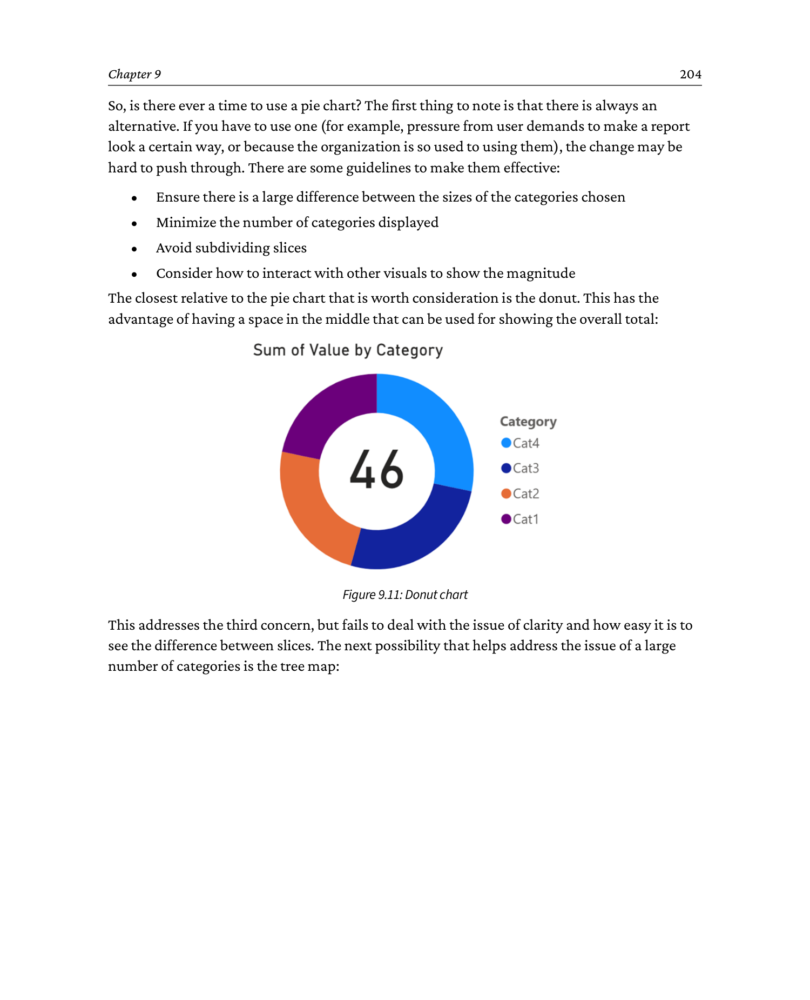

```
 Donut chart

 .-----------.
 .' '.
 .' Cat A '.
 / \
 | $4.8M | <-- centre: total
 | Total revenue |
 \ /
 '. Cat B .'
 '. Cat C .'
 '-.___________.-'

 Donut is similar to pie but has a hole in the middle
 that can show the overall total. Difference between
 adjacent slices is still hard to read.
```


This addresses the third concern, but fails to deal with the issue of clarity and how easy it is to see the difference between slices. The next possibility that helps address the issue of a large number of categories is the tree map:

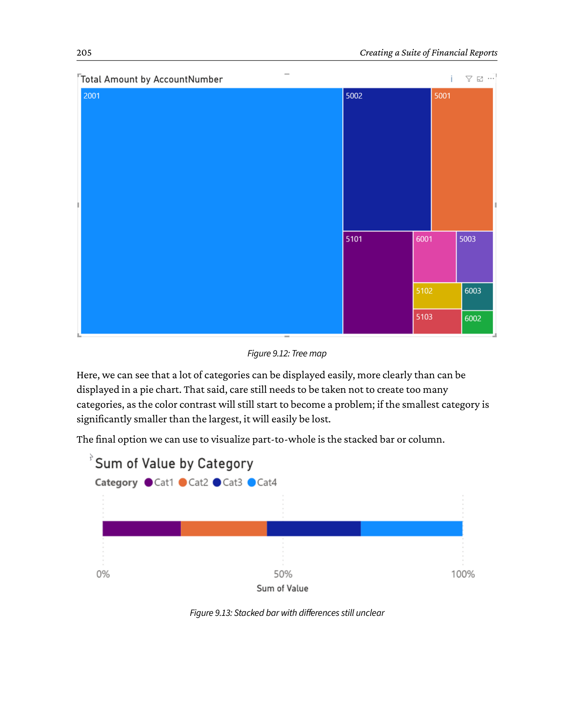

```
 Tree map - many categories, area = value

 +-----------------------------------------------+
 | Cat 1 (largest box) |
 | +---------+----------+----------+ |
 | | Cat 2 | Cat 3 | Cat 4 | |
 | | | | | |
 | +-----+---+--+-------+-----+----+ |
 | |C5 | C6 | C7 | C8 | C9 | C10 |
 | | | | | | | |
 | +----+-----+---------+-----+----+----------+
 | | C11 | C12 | C13 | ... many more ... |
 +-----------------------------------------------+

 Each rectangle's area is proportional to the value.
 Many categories are visible at once, no need to label every slice.
```


Here, we can see that a lot of categories can be displayed easily, more clearly than can be displayed in a pie chart. That said, care still needs to be taken not to create too many categories, as the color contrast will still start to become a problem; if the smallest category is significantly smaller than the largest, it will easily be lost.

The final option we can use to visualize part-to-whole is the stacked bar or column.


```
 Stacked bar / column - one bar per period

 Q1 |####A####|###B###|#C#|##D##|
 Q2 |####A####|###B###|#C#|##D##|
 Q3 |###A###|##B##|##C##|##D##| Hard to compare B vs C
 Q4 |####A####|#B#|##C##|##D##| without a common baseline

 | | | | |
 0 25 50 75 100

 Part-to-whole is shown, but only the first segment has a
 common baseline. Internal segments are very hard to compare.
```


In terms of seeing the difference between close values, this is marginally better than a pie chart since there is a horizontal scale. The additional advantage is that we can split the bars easily into further categories, such as period, and see how elements contribute to the whole value over time.

Those are the main types of graphical visuals that we use for financial reporting. While graphical visuals are an important part of financial reporting, we probably produce more tables, matrices, and cards than graphical visuals, as they show actual numbers that many users want to see. Let's explain where to use which visuals for your financial reporting, starting with tables.

### 9.2.4 Tables

Tables or tabular visuals display data in rows and columns, similar to a spreadsheet. Tables reflect database tables in that you add the columns, and the data in the rows is displayed. Tables differ from their spreadsheet counterparts as they enforce consistency from your data model. This means that if you have a column formatted to currency, all values within the column must be formatted to currency, whereas a spreadsheet is based on coordinates, so values in a column can have different formatting.

Tables are great for listing transactions, either in summary form or to show row-by-row transactions in drill-throughs. It may be the case that you use a matrix view (explained next) as the main visual, but you'll then drill through to a table to see transactional detail when looking to interrogate the data.

You can use measures and calculated columns in tables, so there's a lot of flexibility, especially when being used for budget versus actual comparisons.

When using tables for transactions, we recommend that you filter or summarize the transactions to enable the visual to be responsive and useful to users.

### 9.2.5 Matrices

Without detailed statistics (which we don't have), we'd estimate the matrix as our most used visual for financial reporting. When you want to present data with a view of rows and columns, a matrix is the answer. The operation is very similar to a PivotTable in Excel and is how most users want to see data. When we discussed Power Query's Unpivot function in *Chapter 6*, we said it was used because standard reports from finance systems are commonly presented in matrices, which we unpivot to be useful in Power BI for calculations on the data.

When using the matrix visual, you have immense flexibility in how you present data, as follows:

- Row and column groupings, allowing you to align important data
- Totals and subtotals within your report
- Use of hierarchies to form data structures using expand and collapse to navigate into deeper layers of data
- Conditional formatting using colors and symbols to show important data, exceptions, and trends
- Drill-through capability, allowing users to easily navigate to underlying transactional detail within a dataset

When building your matrix, you can easily add multiple measures to view different calculations at once. Matrices combine well with field parameters, a feature that allows you to quickly change the fields used in an analysis, and a favorite feature for many users.

Most financial reports work well; the following are particularly well suited:

1. **Income Statements (Profit and Loss):**
 - Power BI's capability to break data down into hierarchies means you can easily group revenues, expenses, and net income by categories (e.g., product lines and regions)
 - Drillthrough means users can expand expense categories to see detailed costs and quickly identify trends or issues
2. **Balance Sheets:**
 - Organize assets, liabilities, and equity into clear subcategories (such as current vs. non-current)
 - The matrix visual automatically calculates and displays totals and subtotals, allowing users to identify issues and spot trends
3. **Cash Flow Statements:**
 - Display operating, investing, and financing cash flows in distinct sections
 - Drill down into each section to explore the sources and uses of cash in more detail
4. **Budget vs. Actual Reports:**
 - Set up side-by-side comparisons to highlight variances between budgets and actuals
 - Use visual cues through conditional formatting to quickly spot significant deviations

Overall, matrices provide a great way to analyze multi-dimensional data and are generally the go-to visual for most financial reporting.

### 9.2.6 Cards

The final visual we're going to call out in this section is the card. Cards are great to show anything as a big, bold part of your report. Cards are generally used for numbers, in particular KPIs, and conditional formatting options mean you can use color and text to highlight the good and the bad. The new card visual introduced in November 2023 added many options for sub-measures, helping to add more context to the main measure.

Now that we've given you an overview of the main points to consider when building your financial reports, let's work through some specific examples.

---

## 9.3 Building reports

We looked at the basic principles and the types of visuals you want to consider. Let's move on to concrete examples of some of the reports we will need.

### 9.3.1 Profit and Loss report

Now, we will look at building a Profit and Loss (P&L) report within Power BI using our financial data model.

The first element to building a P&L report is to identify the account categories we'll use to analyze our data.

Within our model, we have an `AccountCategory` field with `AR`, `COGS`, `INV`, `PROPEXP`, `SALES`, `SALEXP`, and `TAX` categories. We also have an `AccountType` field that separates Profit and Loss and Balance Sheet. To provide more flexibility with our reporting, we'll start by using a feature in Power BI called groups.

#### 9.3.1.1 Step 1: Creating the category groups

To analyze our P&L by revenue and expenses, we can use the `AccountCategory` field, but we want to group the categories in a more logical manner. To do this, we'll use Groups in Power BI:

1. Right-click on the `AccountCategory` field in the data pane and select *New group*, as shown in *Figure 9.14*.

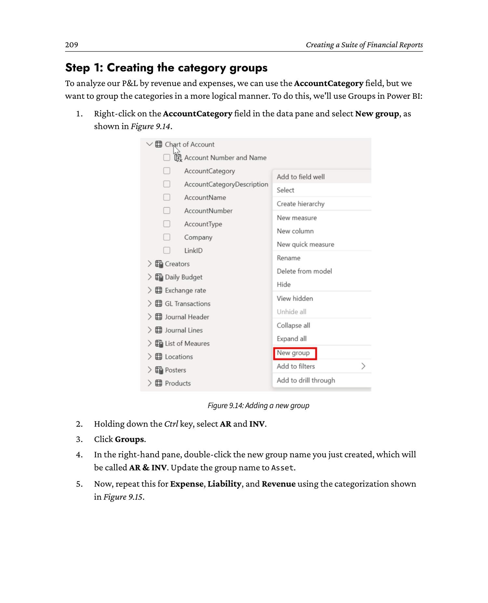

```
 Power BI - new group from AccountCategory

 Data pane (right side of Power BI Desktop):

 [Search]
 +- Chart of Accounts
 | +- AccountNumber
 | +- AccountName
 | +- AccountCategory <-- right-click HERE
 | +- AccountType
 +- Calendar
 +- ...

 Context menu that appears:

 +-----------------------------+
 | Rename |
 | New group <-------- choose this
 | New calculated column |
 | Hide |
 | Delete |
 +-----------------------------+
```


2. Holding down the **Ctrl** key, select **AR** and **INV**.
3. Click *Groups*.
4. In the right-hand pane, double-click the new group name you just created, which will be called **AR & INV**. Update the group name to **Asset**.
5. Now, repeat this for **Expense**, **Liability**, and **Revenue** using the categorization shown in *Figure 9.15*.

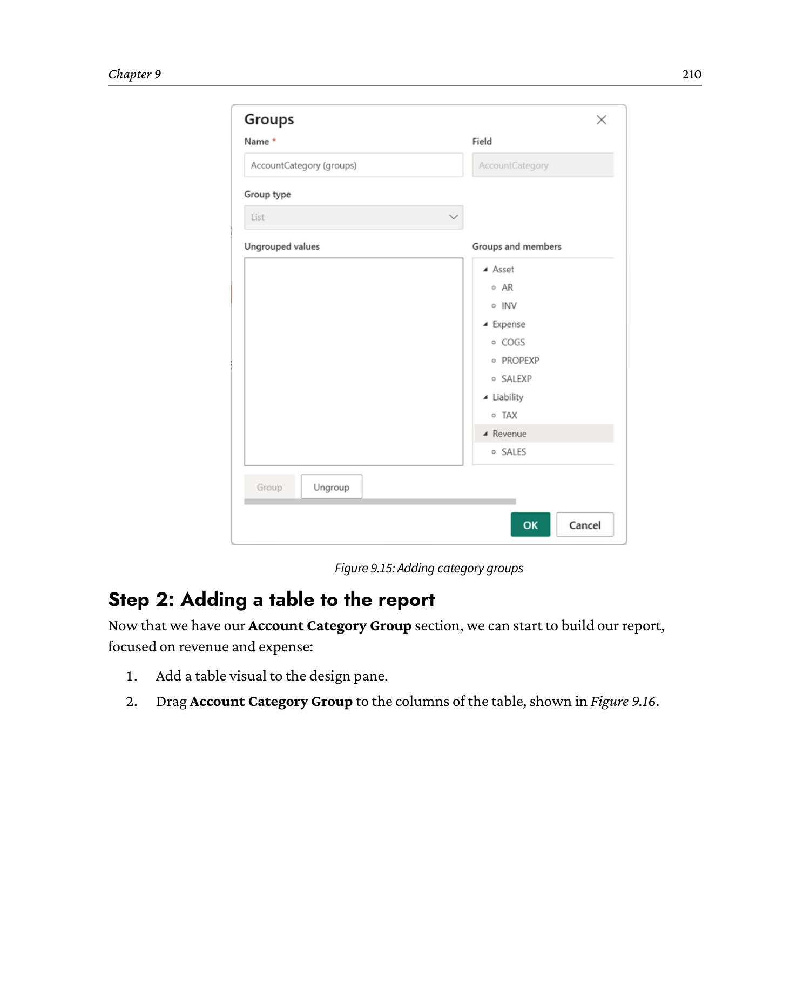

```
 Groups dialog - grouping AR, INV, etc. into named groups

 +----------------------------------------------+
 | Groups - AccountCategory |
 |----------------------------------------------|
 | Ungrouped: |
 | ( ) AR [>] |
 | ( ) COGS [>] |
 | ( ) INV [>] |
 | ( ) PROPEXP |
 | ( ) SALES |
 | ( ) SALEXP |
 | ( ) TAX |
 | |
 | Groups: |
 | ( ) Asset = AR, INV |
 | ( ) Expense = COGS, PROPEXP, SALEXP, TAX |
 | ( ) Liability |
 | ( ) Revenue = SALES |
 | |
 | [OK] [Cancel] |
 +----------------------------------------------+

 Result: a new field AccountCategoryGroup on the model.
```


#### 9.3.1.2 Step 2: Adding a table to the report

Now that we have our Account Category Group section, we can start to build our report, focused on revenue and expense:

1. Add a table visual to the design pane.
2. Drag *Account Category Group* to the columns of the table, shown in *Figure 9.16*.

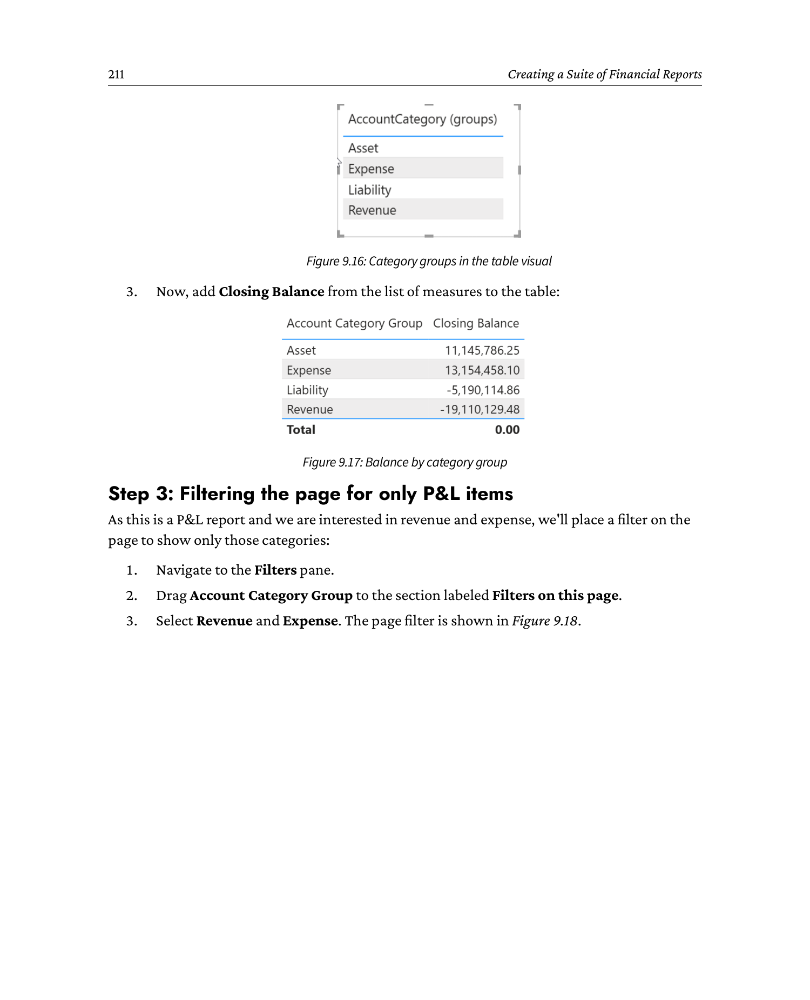

```
 Table visual - first column AccountCategoryGroup

 +---------------+----------------+
 | Account | Closing |
 | Category Group| Balance |
 +---------------+----------------+
 | Asset | 1,250,000 |
 | Expense | 870,500 |
 | Liability | 345,000 |
 | Revenue | 2,400,000 |
 | Total | 4,865,500 |
 +---------------+----------------+

 The new "Account Category Group" is the first column,
 "Closing Balance" the values.
```


3. Now, add *Closing Balance* from the list of measures to the table:


```
 Balance by category group (p.240)

 +---------------+----------------+
 | Account | Closing |
 | Category Group| Balance |
 +---------------+----------------+
 | Asset | 1,250,000 |
 | Expense | 870,500 |
 | Liability | 345,000 |
 | Revenue | 2,400,000 |
 +---------------+----------------+

 Same table as Figure 9.16 - just the four category groups.
```


#### 9.3.1.3 Step 3: Filtering the page for only P&L items

As this is a P&L report and we are interested in revenue and expense, we'll place a filter on the page to show only those categories:

1. Navigate to the *Filters* pane.
2. Drag *Account Category Group* to the section labeled *Filters on this page*.
3. Select **Revenue** and **Expense**. The page filter is shown in *Figure 9.18*.

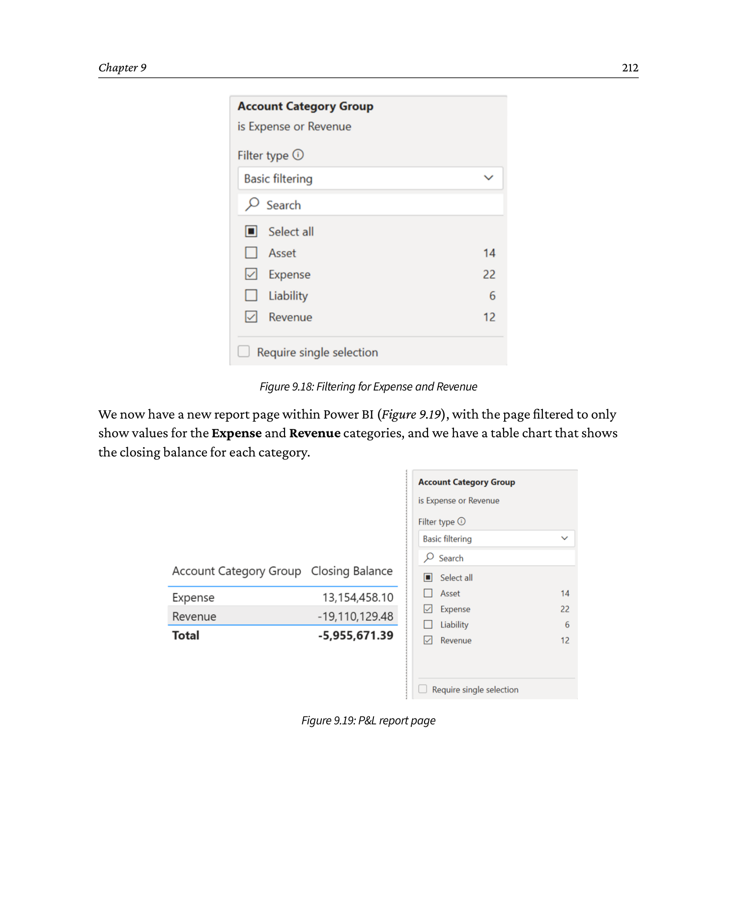

```
 Filters pane - AccountCategoryGroup filtered to Revenue + Expense

 Filters (right of canvas)
 +- Filters on this page
 | +- Account Category Group
 | +-----+
 | | X | Revenue <-- ticked
 | | X | Expense <-- ticked
 | | | Asset
 | | | Liability
 | +-----+
 +- Filters on all pages
 +- Visual-level filters

 Result: the page visuals now show only Revenue and Expense rows.
```


We now have a new report page within Power BI (*Figure 9.19*), with the page filtered to only show values for the Expense and Revenue categories, and we have a table chart that shows the closing balance for each category.


```
 P&L report page - early version (just the table)

 +--------------------------------------------------------+
 | Filters |
 | AccountCategoryGroup: [x] Revenue [x] Expense |
 | |
 | +----------------------------------------------+ |
 | | Account Category Group | Closing Balance | |
 | |-----------------------|---------------------| |
 | | Revenue | 2,400,000 | |
 | | Expense | 870,500 | |
 | +----------------------------------------------+ |
 +--------------------------------------------------------+
 Visuals on the page so far: just the filtered table.
```


#### 9.3.1.4 Step 4: Adding a column chart

We've started with a simple table on our report page; let's continue with further visuals and expansion of our P&L report:

1. Add a clustered column visual to the report page.
2. Add *Total Expenses* and *Total Revenue* to the Y axis on the chart.

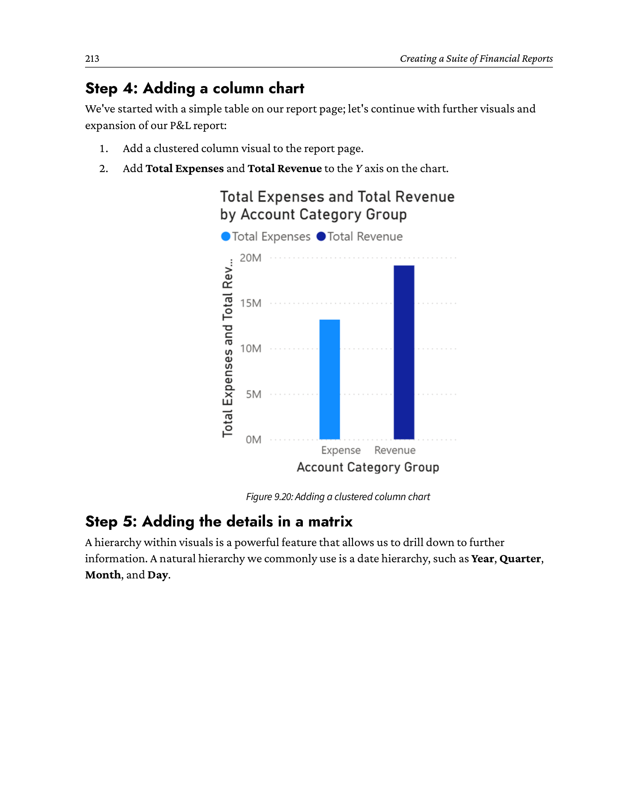

```
 P&L page with clustered column chart added

 +--------------------------------------------------------+
 | Filters: Revenue, Expense |
 | |
 | +---------------+ +---------------------------+ |
 | | Account | | (clustered column) | |
 | | Category Group| | ## | |
 | | Revenue 2.4M | | ## ## | |
 | | Expense .87M | | ## ## ## | |
 | +---------------+ | ## ## ## | |
 | | ## ## ## | |
 | +---------------------------+ |
 | [blue] Total Revenue |
 | [orange] Total Expenses |
 +--------------------------------------------------------+
```


#### 9.3.1.5 Step 5: Adding the details in a matrix

A hierarchy within visuals is a powerful feature that allows us to drill down to further information. A natural hierarchy we commonly use is a date hierarchy, such as Year, Quarter, Month, and Day.

Follow these steps for our first hierarchy:

1. Start with a matrix visual.
2. Add *AccountCategory* (groups) to the rows of the matrix, then add *AccountNumber* and *AccountName* below it. This'll allow us to view groups with corresponding account numbers beneath and automatically create a hierarchy, as shown in *Figure 9.21*.

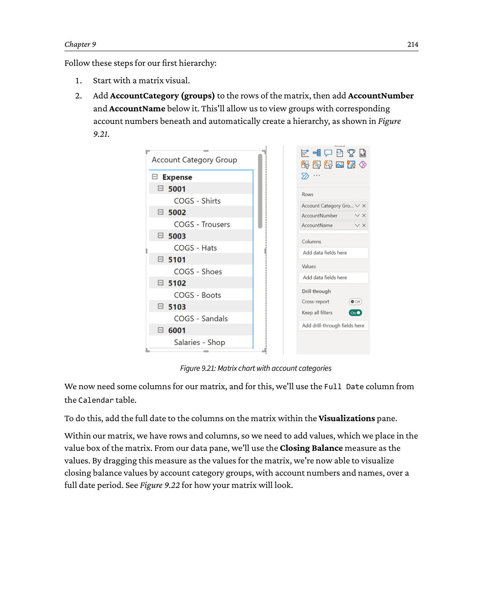

```
 Matrix visual - rows: account hierarchy, columns: full date

 +-------------------+-------------+---------+---------+-----+-----+
 | | Full Date | Full | Full | ... | ... |
 | | | Date 1 | Date 2 | | |
 +-------------------+-------------+---------+---------+-----+-----+
 | Asset | 1,250,000 | 110,000 | 105,000 | | |
 | +- AR | 600,000 | 50,000 | 55,000 | | |
 | +- INV | 650,000 | 60,000 | 50,000 | | |
 | Expense | 870,500 | 75,000 | 80,000 | | |
 | +- COGS | 500,000 | 40,000 | 45,000 | | |
 | +- ... | 370,500 | 35,000 | 35,000 | | |
 +-------------------+-------------+---------+---------+-----+-----+

 Row hierarchy: AccountCategoryGroup -> AccountNumber -> AccountName
 Column hierarchy: Full Date (drillable to month / quarter / year)
```


We now need some columns for our matrix, and for this, we'll use the *Full Date* column from the Calendar table.

To do this, add the full date to the columns on the matrix within the Visualizations pane.

Within our matrix, we have rows and columns, so we need to add values, which we place in the value box of the matrix. From our data pane, we'll use the *Closing Balance* measure as the values. By dragging this measure as the values for the matrix, we're now able to visualize closing balance values by account category groups, with account numbers and names, over a full date period. See *Figure 9.22* for how your matrix will look.

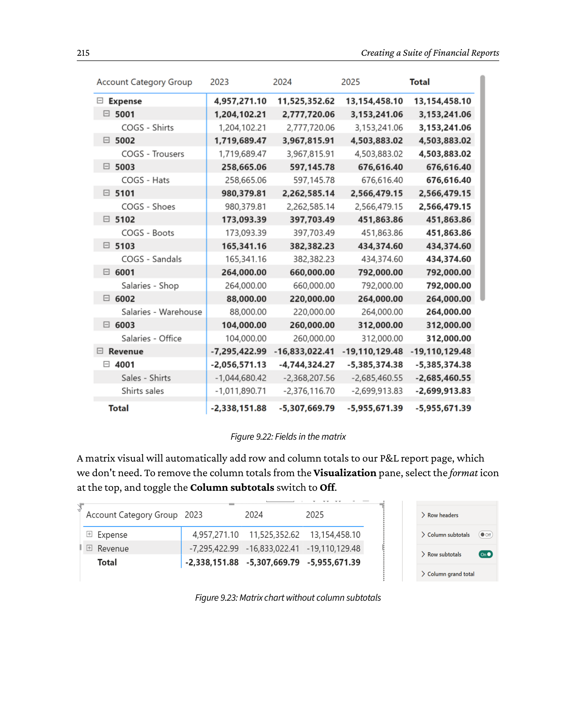

```
 Visualizations pane for the matrix visual

 +-----------------------------+
 | [search] [format] |
 | |
 | Rows: |
 | +- AccountCategoryGroup |
 | +- AccountNumber |
 | +- AccountName |
 | |
 | Columns: |
 | +- Full Date |
 | |
 | Values: |
 | +- Closing Balance |
 | |
 | [Format visual] |
 +-----------------------------+

 The four buckets Rows / Columns / Values drive the matrix shape.
```


A matrix visual will automatically add row and column totals to our P&L report page, which we don't need. To remove the column totals from the Visualization pane, select the format icon at the top, and toggle the *Column subtotals* switch to **Off**.


```
 Matrix - Column subtotals turned OFF

 +-------------------+---------+---------+---------+--------+
 | | Jan | Feb | Mar | Apr |
 +-------------------+---------+---------+---------+--------+
 | Asset | 110,000 | 105,000 | 120,000 | 100,000|
 | +- AR | 50,000 | 55,000 | 60,000 | 50,000|
 | +- INV | 60,000 | 50,000 | 60,000 | 50,000|
 | Expense | 75,000 | 80,000 | 85,000 | 90,000|
 | +- COGS | 40,000 | 45,000 | 50,000 | 55,000|
 +-------------------+---------+---------+---------+--------+
 (no Row Total / Column Total row at the end)
```


To interact and drill down by columns or rows, these can be selected from the top of the matrix visual shown in *Figure 9.24*.

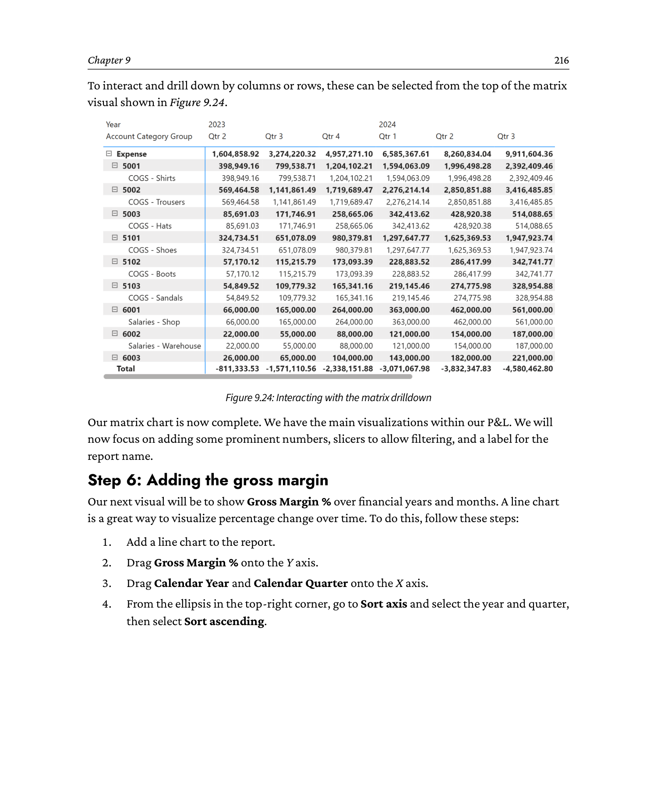

```
 Top of the matrix - drill icons

 +--------------------------------------------------------------+
 | [> Asset] [> Expense] | [^] Drill up |
 | | [v] Drill down |
 | X Expand all down one | [<<] Expand all |
 | ^ Collapse all | |
 +--------------------------------------------------------------+

 Click the small icons at the top of the matrix to drill down
 to a deeper level of the hierarchy (Year -> Quarter -> Month)
 or to expand / collapse all rows.
```


Our matrix chart is now complete. We have the main visualizations within our P&L. We will now focus on adding some prominent numbers, slicers to allow filtering, and a label for the report name.

#### 9.3.1.6 Step 6: Adding the gross margin

Our next visual will be to show Gross Margin % over financial years and months. A line chart is a great way to visualize percentage change over time. To do this, follow these steps:

1. Add a line chart to the report.
2. Drag *Gross Margin %* onto the Y axis.
3. Drag *Calendar Year* and *Calendar Quarter* onto the X axis.
4. From the ellipsis in the top-right corner, go to *Sort axis* and select the year and quarter, then select *Sort ascending*.

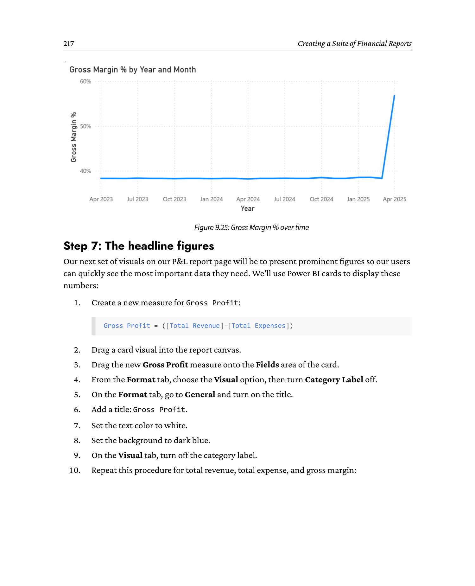

```
 Line chart - Gross Margin % over time

 %
 50| ## ##
 45| ## ## ## ## ##
 40| ## ## ## ## ## ## ##
 35| ## ## ## ## ## ## ##
 30| ## ## ## ## ## ## ##
 +---------------------------------------------->
 Q1'22 Q3 Q1'23 Q3 Q1'24 Q3 Q1'25

 X axis: Calendar Year, Calendar Quarter (sorted ascending)
 Y axis: Gross Margin %

 The line reveals the trend - margins improving then dipping.
```


#### 9.3.1.7 Step 7: The headline figures

Our next set of visuals on our P&L report page will be to present prominent figures so our users can quickly see the most important data they need. We'll use Power BI cards to display these numbers:

1. Create a new measure for Gross Profit:

```dax
Gross Profit = ([Total Revenue]-[Total Expenses])
```

2. Drag a card visual into the report canvas.
3. Drag the new `Gross Profit` measure onto the *Fields* area of the card.
4. From the *Format* tab, choose the *Visual* option, then turn *Category Label* off.
5. On the *Format* tab, go to *General* and turn on the title.
6. Add a title: **Gross Profit**.
7. Set the text color to **white**.
8. Set the background to **dark blue**.
9. On the *Visual* tab, turn off the category label.
10. Repeat this procedure for total revenue, total expense, and gross margin.

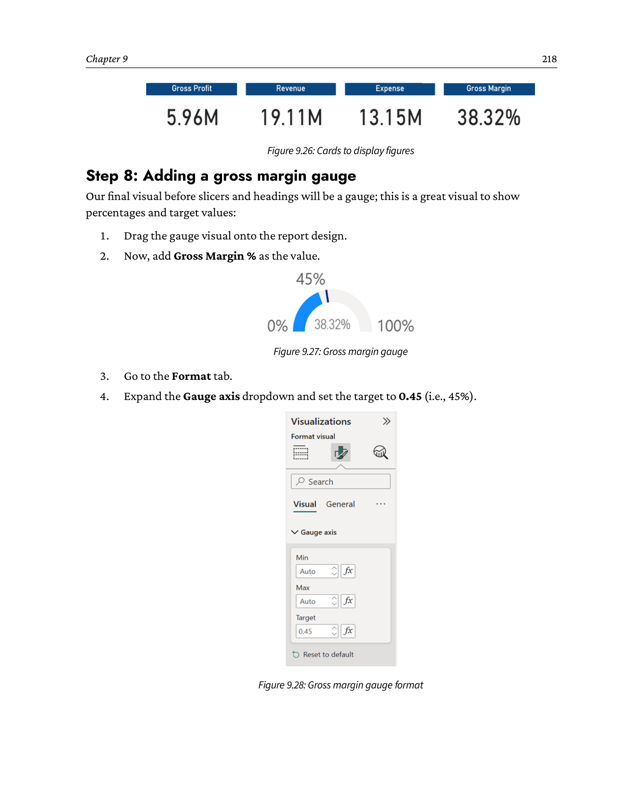

```
 Headline cards - row of KPIs

 +---------------+ +---------------+ +---------------+ +---------------+
 | | | | | | | |
 | Gross Profit | | Total Revenue | | Total Expense | | Gross Margin |
 | | | | | | | |
 | $1,529,500 | | $4,800,000 | | $3,270,500 | | 31.9% |
 | | | | | | | |
 +---------------+ +---------------+ +---------------+ +---------------+

 Each card: dark blue background, white text, big bold number,
 no category label (turned off in the Format pane).
```


#### 9.3.1.8 Step 8: Adding a gross margin gauge

Our final visual before slicers and headings will be a gauge; this is a great visual to show percentages and target values:

1. Drag the gauge visual onto the report design.
2. Now, add *Gross Margin %* as the value.


```
 Gauge visual - just dragged onto the canvas

 +---------------------------+
 | |
 | ,________. |
 | .' 31% '. |
 | / - - - - - \ |
 | | | |
 | | [====] | |
 | | | |
 | \ - - - - - / |
 | '._________.' |
 | |
 +---------------------------+

 Default state - we will format it next.
```


3. Go to the *Format* tab.
4. Expand the *Gauge axis* dropdown and set the **target** to **0.45** (i.e., 45%).


```
 Format pane - Gauge axis settings

 Visualizations pane (Format icon) Canvas
 +---------------------------+ +---------------------------+
 | Gauge axis | | |
 | Min: 0 | | ,________. |
 | Max: 1 | | .' 31% '. |
 | Target: 0.45 <-- here | | / - - - - - \ |
 | | | | | |
 | Data labels | | | [====] | |
 | Value decimal places: 2 | | | | |
 | | | \ - - - - - / |
 | Title | | '._________.' |
 | Title text: Gross M.. | | |
 +---------------------------+ +---------------------------+
```


5. Under the *General* tab, make sure the title is switched on and set the title to **Gross Margin %**.
6. Under *Data labels*, select *Value decimal places* and enter **0** to not show decimal places.
7. Format the background as **dark blue** and the text as **white**.

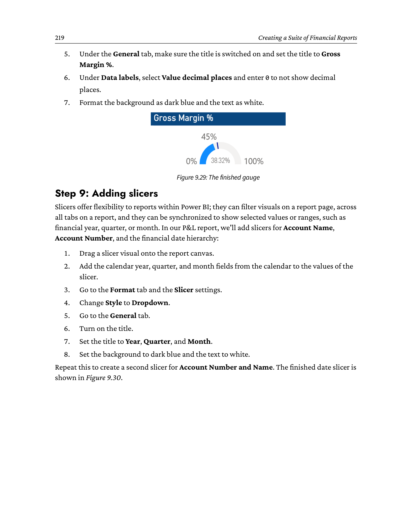

```
 Finished gauge (after formatting)

 +---------------------------+
 | Gross Margin % |
 | |
 | ,________. |
 | .' 31% '. |
 | / - - - - - \ | <-- dark blue background
 | | | | <-- white text
 | | [====] | | <-- target marker at 0.45
 | | | |
 | \ - - - - - / |
 | '._________.' |
 | |
 +---------------------------+

 0% ............ 45% ... 100%
```


#### 9.3.1.9 Step 9: Adding slicers

Slicers offer flexibility to reports within Power BI; they can filter visuals on a report page, across all tabs on a report, and they can be synchronized to show selected values or ranges, such as financial year, quarter, or month. In our P&L report, we'll add slicers for *Account Name*, *Account Number*, and the financial date hierarchy:

1. Drag a slicer visual onto the report canvas.
2. Add the *calendar year*, *quarter*, and *month* fields from the calendar to the values of the slicer.
3. Go to the *Format* tab and the *Slicer settings*.
4. Change *Style* to **Dropdown**.
5. Go to the *General* tab.
6. Turn on the title.
7. Set the title to **Year, Quarter, and Month**.
8. Set the background to **dark blue** and the text to **white**.
9. Repeat this to create a second slicer for *Account Number* and *Name*. The finished date slicer is shown in *Figure 9.30*.

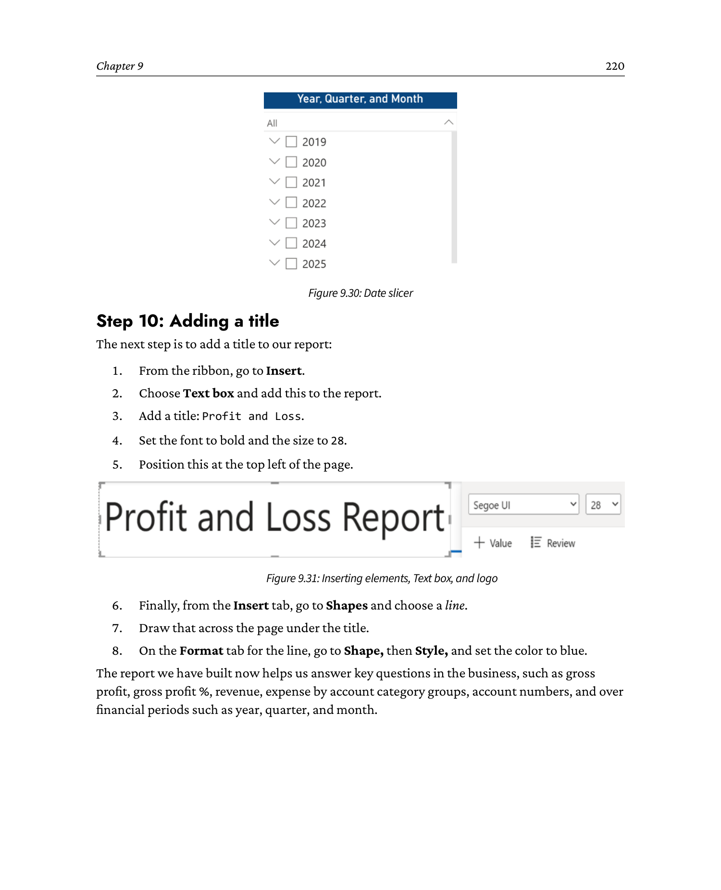

```
 Date slicer (dropdown style)

 +-------------------------+
 | Year, Quarter, Month | <-- title on, dark blue
 +-------------------------+
 | Year v | [2024] | <-- dropdown
 | Quarter v | [Q2] |
 | Month v | [Apr] |
 | |
 | [Clear] |
 +-------------------------+

 Three levels of date hierarchy in a single dropdown slicer.
```


#### 9.3.1.10 Step 10: Adding a title

The next step is to add a title to our report:

1. From the ribbon, go to *Insert*.
2. Choose *Text box* and add this to the report.
3. Add a title: **Profit and Loss**.
4. Set the font to **bold** and the size to **28**.
5. Position this at the top left of the page.


```
 Insert ribbon + Inserted text box on the report

 Power BI ribbon:
 +- Home - Insert - Modelling - View - Optimize - Help
 |
 v
 +----------------------------------------+
 | [Text box] [Image] [Shapes] [Buttons]|
 +----------------------------------------+

 Text box added to the report:

 +--------------------------------------------+
 | |
 | Profit and Loss | <-- bold, 28pt
 | |
 +--------------------------------------------+
```


6. Finally, from the *Insert* tab, go to *Shapes* and choose a line.
7. Draw that across the page under the title.
8. On the *Format* tab for the line, go to *Shape*, then *Style*, and set the color to **blue**.

The report we have built now helps us answer key questions in the business, such as gross profit, gross profit %, revenue, expense by account category groups, account numbers, and over financial periods such as year, quarter, and month.

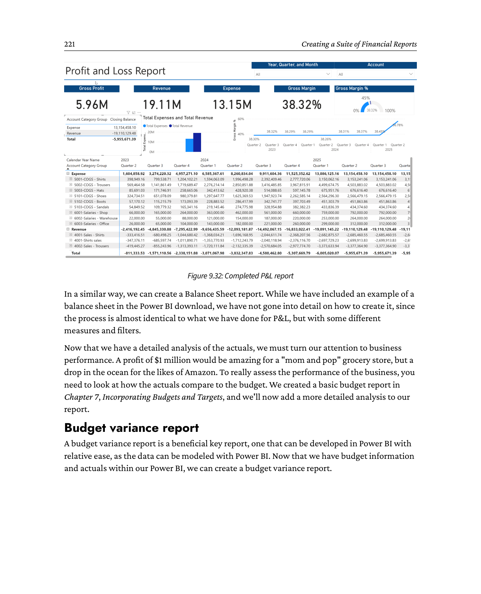

```
 Completed P&L report (final layout)

 +-----------------------------------------------------------+
 | Profit and Loss | <-- title
 |-----------------------------------------------------------|
 | Year, Quarter, Month v | Account Number, Name v | <-- slicers
 |-----------------------------------------------------------|
 | Gross Profit | Total Revenue | Total Expense | Gross M% | <-- cards
 | $1,529,500 | $4,800,000 | $3,270,500 | 31.9% |
 |-----------------------------------------------------------|
 | +-----------+ +-------------------+ +-------------+ |
 | | Column | | Matrix | | Line chart | |
 | | chart | | (acct hierarchy) | | Gross M% | |
 | | Rev/Exp | | | | over time | |
 | +-----------+ +-------------------+ +-------------+ |
 +-----------------------------------------------------------+
```


In a similar way, we can create a Balance Sheet report. While we have included an example of a balance sheet in the Power BI download, we have not gone into detail on how to create it, since the process is almost identical to what we have done for P&L, but with some different measures and filters.

Now that we have a detailed analysis of the actuals, we must turn our attention to business performance. A profit of $1 million would be amazing for a "mom and pop" grocery store, but a drop in the ocean for the likes of Amazon. To really assess the performance of the business, you need to look at how the actuals compare to the budget. We created a basic budget report in *Chapter 7, Incorporating Budgets and Targets*, and we'll now add a more detailed analysis to our report.

### 9.3.2 Budget variance report

A budget variance report is a beneficial key report, one that can be developed in Power BI with relative ease, as the data can be modeled with Power BI. Now that we have budget information and actuals within our Power BI, we can create a budget variance report.

Our budget table within the model has the budget amount by account number, by period, and for each company. We will start by developing a report that shows the budget amount by account number.

To simplify the task, we'll start with three new measures (in a similar way to how we created a `GL Amount +` measure in *Chapter 7, Incorporating Budgets and Targets*):

```dax
Budget Amount + = ABS([Budget Amount])
Budget Variance + = [GL Amount +]-[Budget Amount +]
Budget Variance % = [Budget Variance +]/[Budget Amount +]
```

The second is the variance based on the positive versions of the GL amount and budget, rather than the absolute value of the variance, which would be meaningless. Let's begin.

#### 9.3.2.1 Step 1: Adding a table to show budget, total revenue, and variance by account

1. Add a new page to the Power BI file.
2. Drag a table visual onto the page.
3. From *Chart of Accounts*, drag *Account Number* and *Name* to the table fields.
4. Now, from *Measures*, add *Budget Amount +* as shown in *Figure 9.33*.

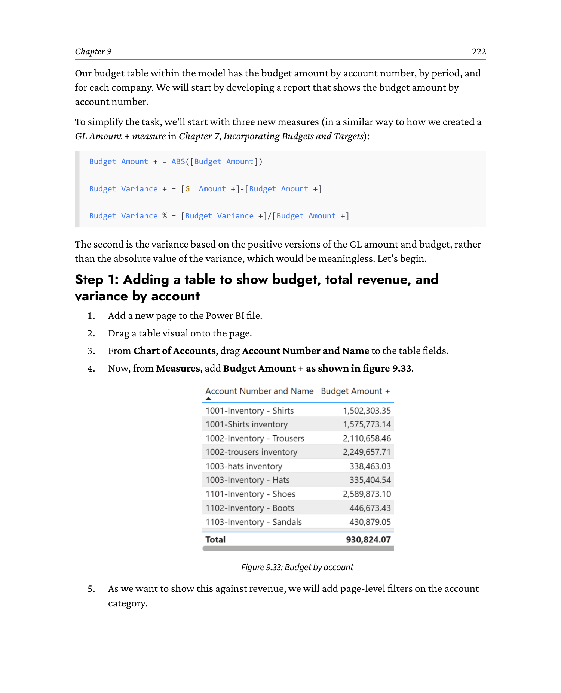

```
 Budget by account - table visual

 +--------------+----------------------+----------------+
 | Account | Account | Budget Amount+ |
 | Number | Name | |
 +--------------+----------------------+----------------+
 | 1000 | Sales | 2,400,000 |
 | 1010 | Service revenue | 300,000 |
 | 2001 | COGS - direct | 1,200,000 |
 | 3010 | Salaries | 800,000 |
 | 3020 | Rent | 200,000 |
 | 4000 | Marketing | 150,000 |
 +--------------+----------------------+----------------+
```


As we want to show this against revenue, we will add page-level filters on the account category.

5. Drag *AccountCategoryGroup* from *Chart of Accounts* to the page filters.
6. Select **Revenue**.

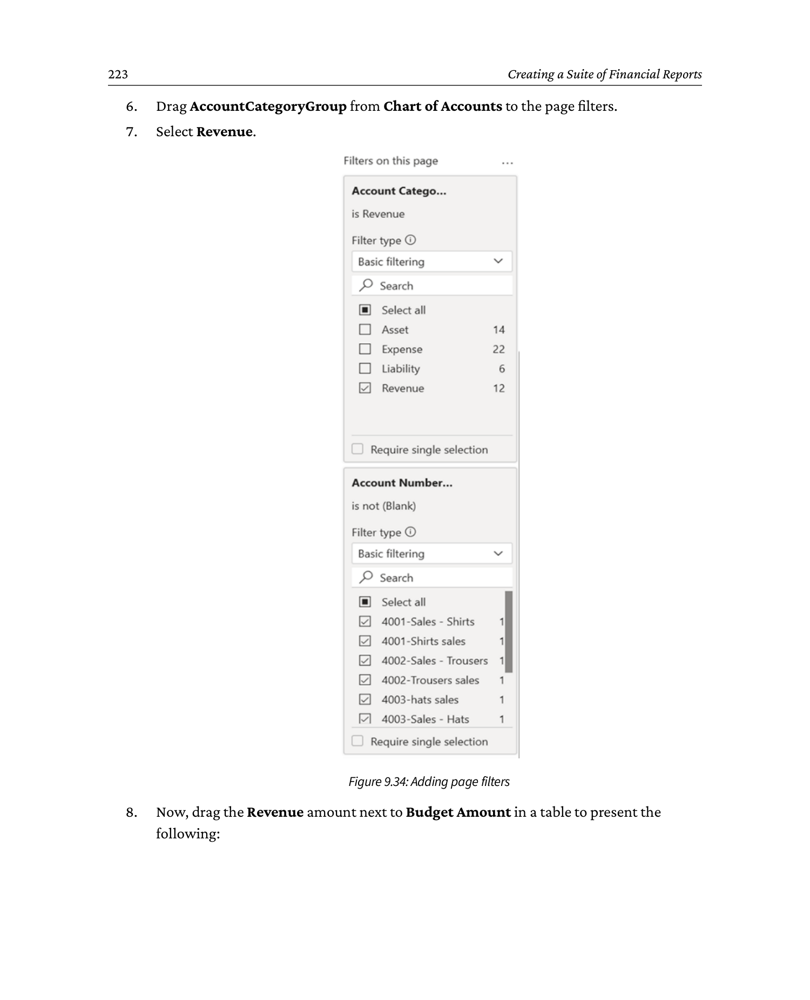

```
 Filters pane - budget page filter

 Filters
 +- Filters on this page
 | +- AccountCategoryGroup
 | [x] Revenue <-- only Revenue ticked
 | [ ] Expense
 | [ ] Asset
 | [ ] Liability
 +- Filters on all pages
 +- Visual-level filters

 Result: the table now only shows Revenue accounts.
```


7. Now, drag the *Revenue* amount next to *Budget Amount* in a table to present the following:

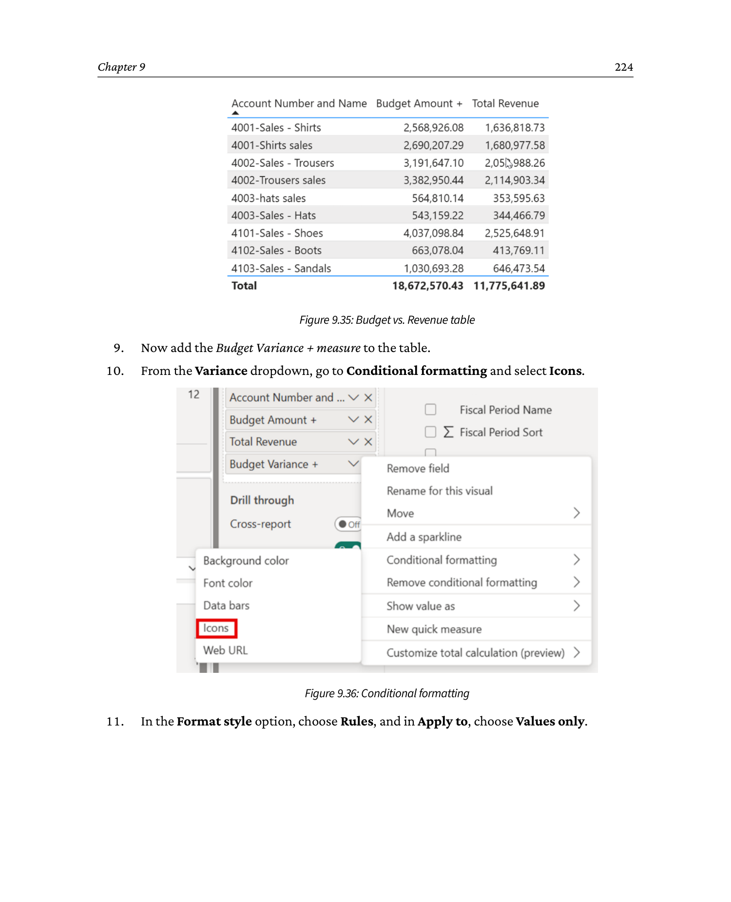

```
 Budget vs. Revenue table (page filtered to Revenue)

 +--------+--------------------+--------+-----------+--------+
 | Acct | Account | Budget | Revenue |Variance|
 | Number | Name | Amount+| Amount | + |
 +--------+--------------------+--------+-----------+--------+
 | 1000 | Sales | 2.4M | 2.6M | +0.2M |
 | 1010 | Service revenue | 0.3M | 0.28M | -0.02M |
 | ... | ... | ... | ... | ... |
 +--------+--------------------+--------+-----------+--------+

 Conditional icons will be added to the Variance column next.
```


8. Now add the *Budget Variance +* measure to the table.
9. From the *Variance* dropdown, go to *Conditional formatting* and select *Icons*.


```
 Column dropdown - conditional formatting menu

 On the Variance + column header:
 +--------------------------------+
 | Sort ascending |
 | Sort descending |
 | Conditional formatting > <----- choose this
 | Rename |
 +--------------------------------+

 Sub-menu:
 +--------------------------------+
 | Background color |
 | Font color |
 | Icons <---- choose this
 | Web URL |
 +--------------------------------+
```


10. In the *Format style* option, choose **Rules**, and in *Apply to*, choose **Values only**.
11. Now, select the new measure, **Budget Variance %**, as the field to base this on.
12. Finally, set up the rules. Since the value we are working with is a percentage, we can reasonably assume that -1 to +1 is a sensible range, and we will set **0** as the boundary between red and yellow, and **0.03** as the boundary between yellow and green.

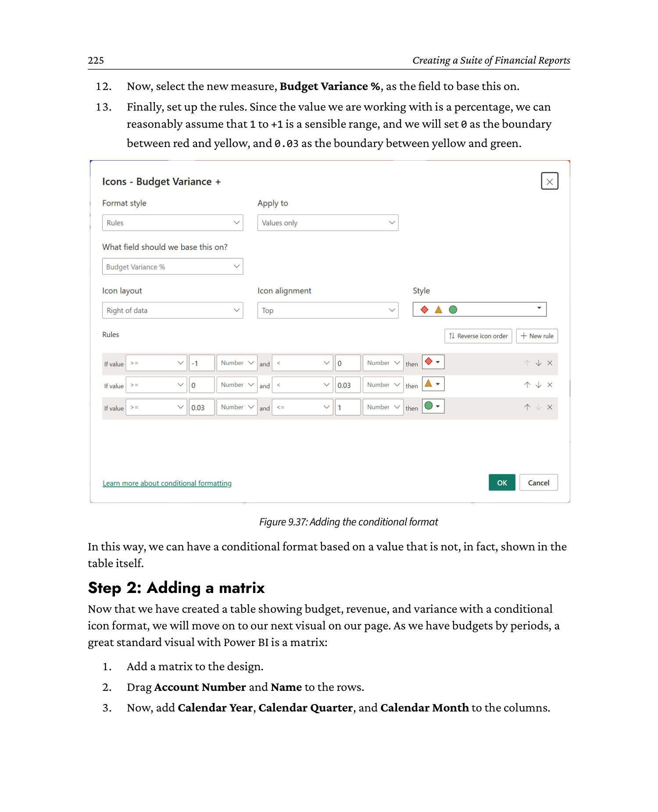

```
 Conditional formatting - Icons - Rules

 +-----------------------------------------------+
 | Format style: (o) Rules ( ) Color scale |
 | Apply to: ( ) Totals (o) Values only |
 | |
 | What field should we base this on? |
 | [ Budget Variance % v ] |
 | |
 | Rules: |
 | if Number is less than 0 --> red |
 | if Number is between 0 and 0.03 -> yellow|
 | if Number is greater or equal 0.03 |
 | -> green|
 | |
 | [OK] [Cancel] |
 +-----------------------------------------------+

 Icons follow the variance %, not the variance amount itself.
```


In this way, we can have a conditional format based on a value that is not, in fact, shown in the table itself.

#### 9.3.2.2 Step 2: Adding a matrix

Now that we have created a table showing budget, revenue, and variance with a conditional icon format, we will move on to our next visual on our page. As we have budgets by periods, a great standard visual with Power BI is a matrix:

1. Add a matrix to the design.
2. Drag *Account Number* and *Name* to the rows.
3. Now, add *Calendar Year*, *Calendar Quarter*, and *Calendar Month* to the columns.
4. Next, add *Total Revenue*, *Budget Amount +*, and *Budget Variance +* to the values.
5. Once again, go to the dropdown on *Budget Variance +* and select *Conditional formatting*, and then *Icons*.
6. In the *Format style*, choose **Rules**, and in *Apply to*, choose **Values**.
7. Now, select the new measure, **Budget Variance %**, as the field to base this on.
8. Finally, set up the rules. Since the value we are working with is a percentage, we can reasonably assume that -1 to +1 is a sensible range, and we will set **0** as the boundary between red and yellow, and **0.03** as the boundary between yellow and green.

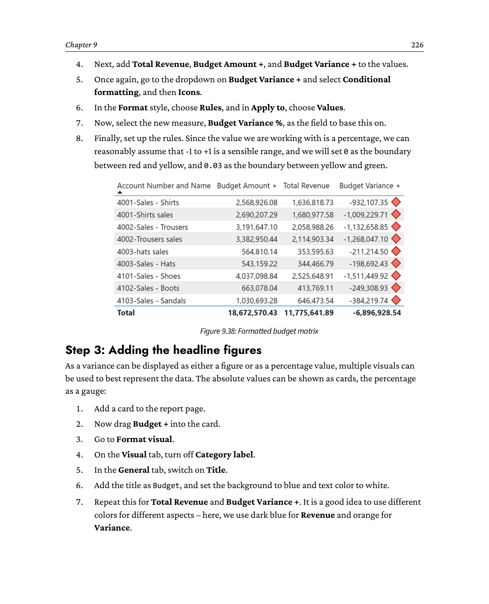

```
 Budget matrix with conditional icons on Variance +

 +------+----------+----------+----------+----------+----------+
 | | Total | Budget | Budget | Budget | Budget |
 | | Revenue | Amount+ | Variance+| Variance+| Variance+|
 | | | | Q1 2024 | Q2 2024 | Q3 2024 |
 +------+----------+----------+----------+----------+----------+
 |1000 | 0.65M | 0.60M | +0.05M | +0.04M | -0.01M |
 | | | | [UP] | [UP] | [DN] |
 |1010 | 0.08M | 0.07M | +0.01M | +0.00M | +0.01M |
 | | | | [UP] | [=] | [UP] |
 | ... | ... | ... | ... | ... | ... |
 +------+----------+----------+----------+----------+----------+

 Conditional icon set: red down arrow, yellow equals, green up arrow.
```


#### 9.3.2.3 Step 3: Adding the headline figures

As a variance can be displayed as either a figure or as a percentage value, multiple visuals can be used to best represent the data. The absolute values can be shown as cards, the percentage as a gauge:

1. Add a card to the report page.
2. Now drag *Budget +* into the card.
3. Go to *Format visual*.
4. On the *Visual* tab, turn off *Category label*.
5. In the *General* tab, switch on *Title*.
6. Add the title as **Budget**, and set the background to **blue** and text color to **white**.
7. Repeat this for *Total Revenue* and *Budget Variance +*. It is a good idea to use different colors for different aspects - here, we use dark blue for Revenue and orange for Variance.
8. Now, add a gauge.
9. Add *Budget Variance %*.
10. Go to *Format visual* and in the *Visual* tab, go to *Gauge axis*.
11. Set the **min** to **-0.5**, and **max** to **0.5** (i.e., +/- 50%)
12. Set the **target** to **0** (i.e., on budget).
13. On the *General* tab, turn on the title, add the title, set the background to **orange**, and the text to **white**.

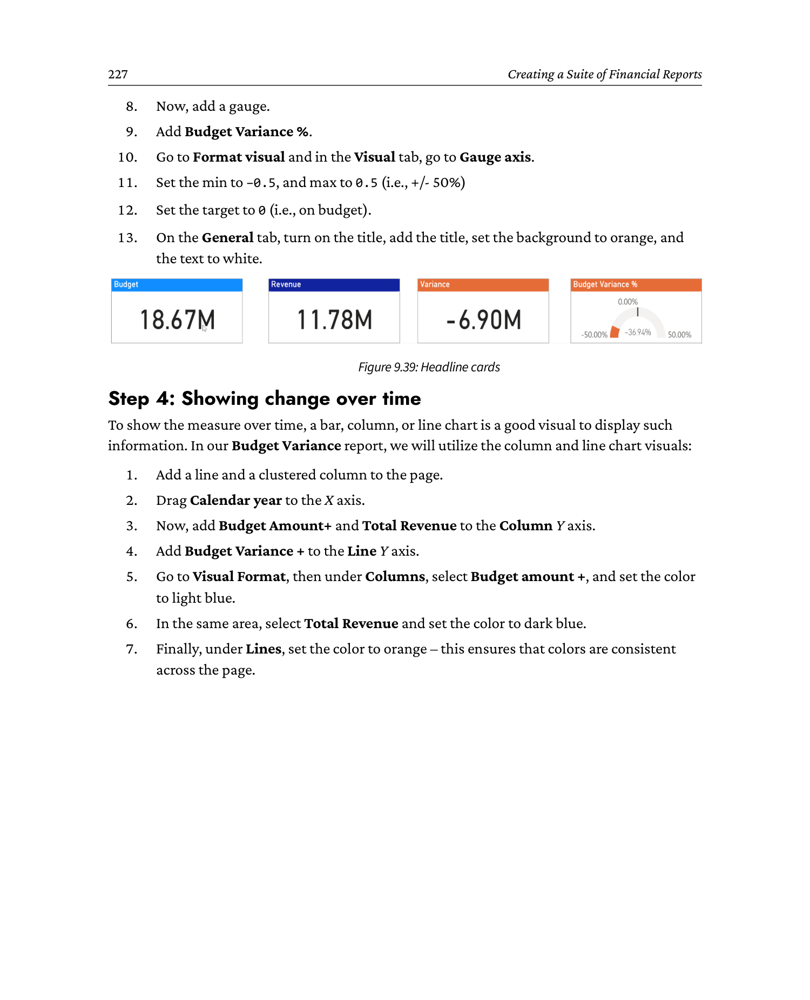

```
 Headline cards - Budget Variance page

 +-----------+ +-----------+ +-------------+ +---------------+
 | | | | | | | |
 | Budget | | Revenue | | Variance + | | Variance % |
 | | | | | | | |
 | $2,400,000| | $2,500,000| | +$100,000 | | +4.2% |
 | | | | | | | |
 +-----------+ +-----------+ +-------------+ +---------------+
 dark blue dark blue orange orange

 Different colours for different aspects of the page (revenue vs variance).
```


#### 9.3.2.4 Step 4: Showing change over time

To show the measure over time, a bar, column, or line chart is a good visual to display such information. In our Budget Variance report, we will utilize the column and line chart visuals:

1. Add a line and a clustered column to the page.
2. Drag *Calendar year* to the X axis.
3. Now, add *Budget Amount+* and *Total Revenue* to the *Column Y* axis.
4. Add *Budget Variance +* to the *Line Y* axis.
5. Go to *Visual Format*, then under *Columns*, select *Budget amount +*, and set the color to **light blue**.
6. In the same area, select *Total Revenue* and set the color to **dark blue**.
7. Finally, under *Lines*, set the color to **orange** - this ensures that colors are consistent across the page.

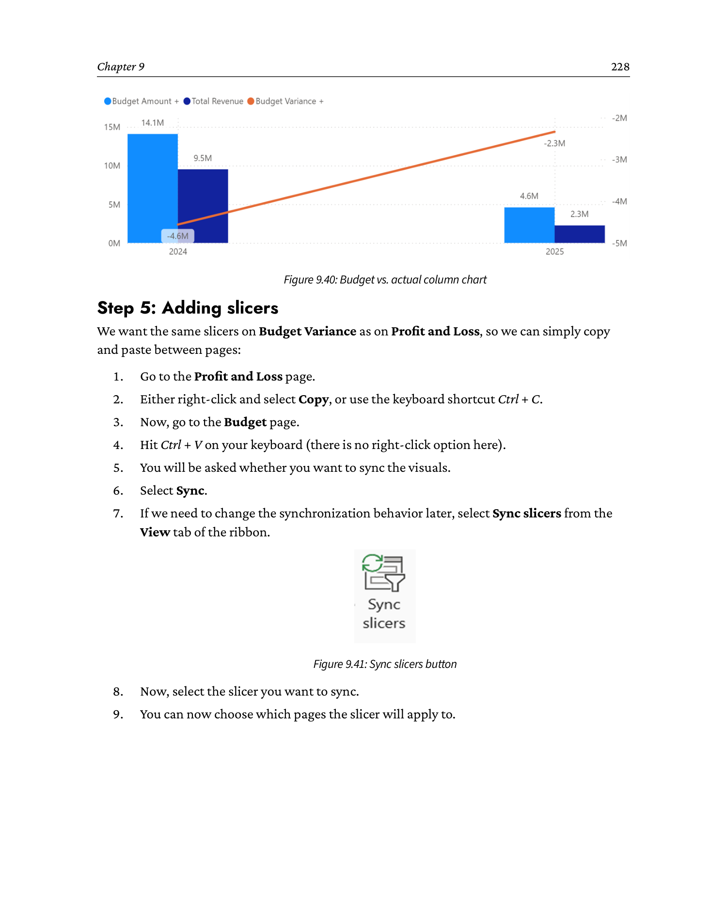

```
 Column + line chart - Budget vs actual over time

 $
 3.0M| ##
 2.5M| ## ##
 2.0M| ## ## ## line (orange): Budget Variance +
 1.5M| ## ## ## ## ##
 1.0M| ## ## ## ## ## ##
 0.5M| ## ## ## ## ## ## ##
 0 +----------------------------------------------->
 Q1'24 Q2 Q3 Q4 Q1'25 Q2

 light blue = Budget Amount+ (columns)
 dark blue = Total Revenue (columns)
 orange = Budget Variance + (line)
```


#### 9.3.2.5 Step 5: Adding slicers

We want the same slicers on Budget Variance as on Profit and Loss, so we can simply copy and paste between pages:

1. Go to the *Profit and Loss* page.
2. Either right-click and select *Copy*, or use the keyboard shortcut **Ctrl + C**.
3. Now, go to the *Budget* page.
4. Hit **Ctrl + V** on your keyboard (there is no right-click option here).
5. You will be asked whether you want to sync the visuals.
6. Select **Sync**.
7. If we need to change the synchronization behavior later, select *Sync slicers* from the *View* tab of the ribbon.


```
 View ribbon - Sync slicers button

 Power BI ribbon: Home - Insert - Modelling - View - ...
 |
 v
 +-------------------------------------------+
 | Sync slicers <-- click this to open |
 | Theme |
 | Buttons |
 +-------------------------------------------+

 A new pane "Sync slicers" appears on the right, listing each
 slicer and the pages it appears on.
```


8. Now, select the slicer you want to sync.
9. You can now choose which pages the slicer will apply to.

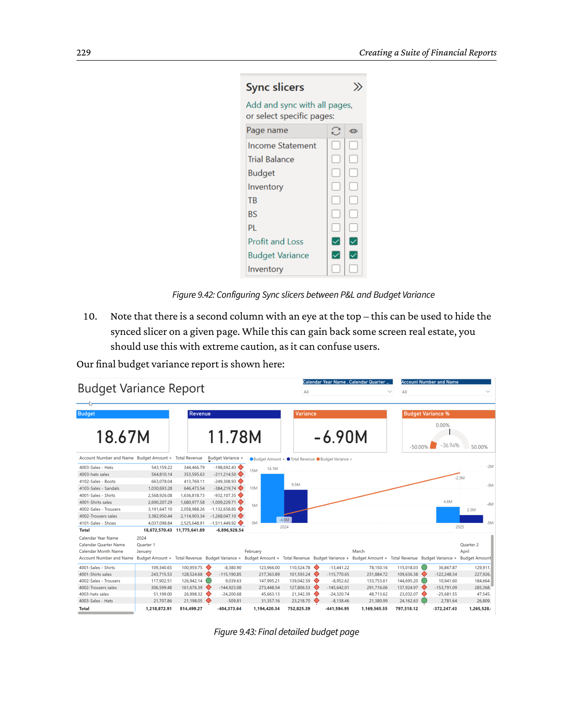

```
 Sync slicers pane

 Sync slicers
 +----------------------------------------+
 | Slicer: Year, Quarter, Month |
 | |
 | | Sync | Visible |
 | P&L | X | X |
 | Bud | X | X |
 | ... | | |
 +----------------------------------------+

 The eye icon hides the slicer on a page (use with caution).
 The sync column ties slicer selection across pages.
```


Note that there is a second column with an eye at the top - this can be used to hide the synced slicer on a given page. While this can gain back some screen real estate, you should use this with extreme caution, as it can confuse users.

10. Our final budget variance report is shown here:


```
 Final Budget Variance page

 +--------------------------------------------------------+
 | Budget Variance |
 |--------------------------------------------------------|
 | Year, Quarter, Month v | Account No, Name v | <-- slicers
 |--------------------------------------------------------|
 | Budget | Revenue | Variance + | Variance % | <-- cards
 | 2.4M | 2.5M | +0.1M | +4.2% |
 |--------------------------------------------------------|
 | +-----------------+ +-----------------+ |
 | | Budget matrix | | Budget vs. | |
 | | (by acct & | | actual column + | |
 | | period, with | | line chart | |
 | | conditional | | | |
 | | icons) | | | |
 | +-----------------+ +-----------------+ |
 | |
 | +-----------------+ +-----------------+ |
 | | Variance gauge | | (empty / future)| |
 | +-----------------+ +-----------------+ |
 +--------------------------------------------------------+
```


We can now answer fundamental questions such as the following:

- How are we performing across our accounts?
- What is the variance across different financial periods?
- Which accounts are not performing as well as we need to take action on?
- How far are we from our budget?
- Have we exceeded our budget?
- Can we see any exceptions?
- What is our budget variance over financial years?

The techniques described in creating these two reports can now be applied to any dataset that you need to report on.

---

## 9.4 Summary

In this chapter, we discussed effective report design. We started by revisiting our five principles of effective reports, which are accuracy, security, speed, purpose, and design.

To start, focus on accuracy and security. If your numbers are wrong or for the wrong audience, fix this first.

Then, if your reports are slow to respond, examine your semantic model schema and measures. There will be some issues you need to fix, but please don't release reports that are slow to respond; users will cease using them.

Then we moved on to the main points of the chapter, which were purpose, design, and consistency:

- Every report should answer a clear business need. That may change over time, and your reports will need to change accordingly.
- Deploy well-designed reports that follow some basic principles of art and user interface design. Power BI has all the tools and, in many cases, makes it easy for you to quickly produce professional reports.
- Keep your report design consistent across reports. Users will become familiar with that design and layout, making it easy for them to navigate from report to report and to quickly train new users.

We ended with a review of which visuals to use with your financial reporting.

In the next chapter, we go deep into an aspect of reporting that we briefly covered here, which is testing and fine-tuning your data.

---

_Generated by `convert_chapter9.py` + `build_chapter9_md.py` on 2026-06-17._
